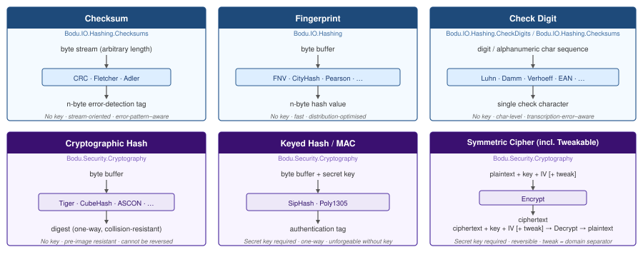

# Algorithm families

*Start here if you are new to Bodu, or if you need to choose between types that sound similar.*

The Bodu hashing and cryptography libraries provide six distinct algorithm families. This page maps those families, explains the subtypes inside each, and points to the guide that goes deeper.

## The families at a glance

| Library | Family | Subtypes |
|---|---|---|
| `Bodu.IO.Hashing` | Fingerprint | FNV · CityHash · MurmurHash3 · Pearson · Bernstein / classic string hashes |
| `Bodu.IO.Hashing` | Checksum | CRC (polynomial-remainder) · Fletcher / Adler (twin-accumulator) |
| `Bodu.IO.Hashing` | Check digit | Mod 10 (Luhn, EAN, GTIN, UPC) · Quasigroup (Damm) · Dihedral (Verhoeff) · Mod 11 (ISBN-10, SEDOL, CUSIP) · Mod 97-10 (IBAN, LEI) |
| `Bodu.Security.Cryptography` | Cryptographic hash | Plain digest (Tiger, CubeHash, Snefru, Whirlpool, Blake2/3, Skein, ASCON) · Extendable output / XOF (Shake, AsconXof, AsconCxof) · Tree (Merkle) |
| `Bodu.Security.Cryptography` | Keyed hash / MAC | PRF (SipHash) · One-time authenticator (Poly1305) |
| `Bodu.Security.Cryptography` | Symmetric cipher | Standard block cipher · Tweakable block cipher · AEAD (AES + mode transform, ASCON-AEAD) |

---

## Non-cryptographic families — `Bodu.IO.Hashing`

These algorithms carry **no adversary model**. They are fast, portable error-detection and distribution tools, not security primitives. An attacker who can modify the input can always forge the result.

### Fingerprints — non-cryptographic hashes

**Namespace:** `Bodu.IO.Hashing`  
**Base class:** `System.IO.Hashing.NonCryptographicHashAlgorithm`

Fingerprint algorithms map an arbitrary byte sequence to a fixed-size integer value in a way that distributes evenly across the output range. The mathematical structure is chosen for **distribution quality and speed**, not for error-detection coverage.

**Designed for:** hash-table bucketing, in-memory cache keys, fast deduplication, distributed routing, content-addressable lookups within a trust boundary.  
**Not designed for:** error-pattern detection (a bit flip in a specific position may not change the output), authentication, or any adversary-facing use.

**What distinguishes a "good" fingerprint?** Three properties matter:

- **Avalanche** — a single-bit change in the input flips approximately half of the output bits.
- **Distribution** — output values are uniformly distributed across the integer range, so hash-table buckets fill evenly.
- **Streaming behaviour** — whether the algorithm processes arbitrary chunks without buffering the entire input. FNV and Pearson are streaming and constant-memory; CityHash and MurmurHash3 buffer internally for SIMD efficiency.

| Type | Output | Notes |
|---|---|---|
| `Fnv1a32` / `Fnv1a64` | 32 / 64 bits | Simple, constant-memory, portable. Preferred over FNV-1 for better avalanche. |
| `Fnv132` / `Fnv164` | 32 / 64 bits | Original FNV-1 — use only for legacy interoperability. |
| `CityHash32` / `CityHash64` / `CityHash128` | 32 / 64 / 128 bits | SIMD-friendly; fastest option for large inputs, at the cost of in-memory buffering. |
| `MurmurHash3_32` / `MurmurHash3_128` | 32 / 128 bits | Seeded; excellent avalanche and collision resistance for a non-cryptographic hash. |
| `Pearson` | 8–2048 bits | Table-driven; configurable output width in 8-bit steps; five built-in permutation tables. |
| `Bernstein` | 32 bits | Classic djb2; configurable add-vs-XOR variant and initial value. |
| `BKDR` / `SDBM` / `JSHash` / `Elf64` / `ApHash` / `Pjw32` / `SuperFastHash` | 32–64 bits | Classic string hashes from compilers, databases, and early web tooling. |

→ Guides: [Using FNV](../guides/io-hashing/fnv.md) · [Using CityHash](../guides/io-hashing/cityhash.md) · [Using MurmurHash3](../guides/io-hashing/murmurhash3.md) · [Using Pearson](../guides/io-hashing/pearson.md) · [Classic string hashes](../guides/io-hashing/string-hashes.md)

> **BCL note.** `System.IO.Hashing` ships `XxHash32`, `XxHash64`, `XxHash3`, and `XxHash128` from .NET 6 onwards. Bodu does not duplicate these — prefer the BCL types directly. The Bodu types listed above are the ones that are *not* in `System.IO.Hashing`.

---

### Checksums

**Namespace:** `Bodu.IO.Hashing.Checksums`  
**Base class:** `System.IO.Hashing.NonCryptographicHashAlgorithm`

Checksum algorithms produce a short tag specifically designed to detect common **error patterns** in transmitted or stored data — single-bit flips, burst errors, adjacent transpositions. Their structure is chosen for error-detection coverage over specific error models, not for distribution quality.

**Designed for:** protocol integrity (Ethernet, USB, CAN bus, Modbus, PKZIP, zlib, PNG), storage integrity (NVMe, Btrfs), transmission error detection in embedded systems.  
**Not designed for:** hash tables (poor distribution), security, or authentication.

There are two structural subfamilies:

- **Polynomial-remainder checksums (CRC).** Treat the input as a polynomial over GF(2) and compute the remainder when dividing by a fixed generator polynomial. Catches all single-bit errors, all double-bit errors within the burst length, and almost all burst errors up to the polynomial width. The Bodu `Crc` engine is parameterised by `CrcStandard` and covers 113 named standards from the [RevEng catalogue](../guides/io-hashing/crc-catalogue.md).
- **Twin-accumulator checksums (Fletcher, Adler).** Two running sums, one of bytes and one of partial sums, combined into the final tag. The cross-position accumulator catches **transpositions** that a single additive sum cannot. Adler uses a prime modulus (the canonical zlib check); Adler-32C uses a power-of-two modulus for SIMD throughput; Fletcher uses a width-based modulus.

| Type | Output | Subfamily |
|---|---|---|
| `Crc` + `CrcStandard` | 1–64 bits | Polynomial remainder; 113 named standards plus custom parameter sets (polynomial, init, reflect, XOR-out). |
| `Fletcher16` / `Fletcher32` / `Fletcher64` | 16 / 32 / 64 bits | Twin-accumulator; catches transpositions a simple sum or XOR misses. |
| `Adler32` / `Adler32C` / `Adler64` | 32 / 32 / 64 bits | Prime / power-of-two modulus twin accumulator; Adler-32 is the canonical zlib checksum. |

→ Guides: [Using CRC](../guides/io-hashing/crc.md) · [CRC catalogue](../guides/io-hashing/crc-catalogue.md) · [Using Fletcher](../guides/io-hashing/fletcher.md) · [Using Adler](../guides/io-hashing/adler.md)

> **Checksum vs fingerprint.** Choose a checksum when the error model matters — "catch every single-bit flip in a 4 KiB packet". Use a fingerprint when you need fast, even distribution across a hash table. The best fingerprints are not the best checksums, and vice versa: CRC and Fletcher distribute poorly as hash functions; FNV and CityHash have weaker burst-error guarantees than CRC.

---

### Check digits

**Namespace:** `Bodu.IO.Hashing.CheckDigits` · `Bodu.IO.Hashing.Checksums`  
**Base class:** `CheckDigitAlgorithm` · `AlphanumericCheckDigitAlgorithm` · `MultiCharCheckDigitAlgorithm`

Check-digit algorithms operate on **character sequences** (not binary byte buffers) and append one or two characters to a human-readable identifier. That trailing character lets any future reader confirm the identifier was not mis-typed or mis-transcribed. The target error patterns are those a human introduces when copying a number by hand: single-digit substitution, adjacent transpositions, twin errors, and phonetic confusions.

**Designed for:** validating credit card numbers, bank account numbers, barcodes, international securities codes, ISBNs, and similar human-facing identifiers.  
**Not designed for:** binary data, long payloads, or any security application — these are never cryptographic.

There are five mathematical subfamilies, each with different error-detection guarantees:

| Subfamily | Algorithm | Detects | Bodu types |
|---|---|---|---|
| **Mod 10 (weighted sum)** | Sum digits with alternating multipliers, take mod 10. Catches all single-digit substitutions; misses some adjacent transpositions (e.g. 0↔9). | Single-digit errors, most transpositions | `Luhn`, `Ean8`, `Ean13`, `Gtin14`, `UpcA`, `AbaRoutingNumber` |
| **Quasigroup** | Damm's table-based group operation. Catches **all** single-digit substitutions and **all** adjacent transpositions. | All single-digit and adjacent-transposition errors | `Damm` |
| **Dihedral group D₅** | Verhoeff's permutation tables over the dihedral group. Catches all single-digit substitutions, all adjacent transpositions, and most twin / jump-twin errors. | The widest error coverage of any decimal scheme | `Verhoeff` |
| **Mod 11** | Weighted sum mod 11, with `X` representing the value 10. Used in book and securities identifiers. | All single-digit errors, most transpositions | `Isbn10`, `Sedol`, `Cusip`, `Iso7064Mod11_2` |
| **Mod 97-10 (ISO 7064)** | Treats the identifier as a large integer mod 97. Two digits of overhead; very strong error detection on long alphanumeric strings. | Almost all transcription errors at scale | `Iban`, `Lei`, `Iso7064Mod97_10` |

Types in `Bodu.IO.Hashing.CheckDigits` (single-character output, decimal alphabet):

| Type | Used by |
|---|---|
| `Luhn` | Credit cards (Visa, Mastercard, Amex), IMEI numbers, SIN |
| `Damm` | General use; detects **all** single-digit errors and adjacent transpositions |
| `Verhoeff` | German ID, medical device codes; widest error coverage |
| `Ean8` / `Ean13` | Retail barcodes |
| `Gtin14` | Shipping cartons |
| `UpcA` | US/Canada retail barcodes |
| `Isin` | International securities identifiers (ISO 6166) — Luhn over alphanumeric |
| `AbaRoutingNumber` | US bank routing numbers |

Types in `Bodu.IO.Hashing.Checksums` (alphanumeric or multi-character output):

| Type | Used by |
|---|---|
| `Iban` | International bank account numbers (ISO 13616) |
| `Isbn10` / `Isbn13` | Book identifiers |
| `Sedol` | London Stock Exchange securities |
| `Cusip` | North American securities (ANSI X9.6) |
| `Lei` | Legal Entity Identifiers (ISO 17442) |
| `Iso7064Mod11_2` / `Iso7064Mod97_10` | Generic ISO 7064 building blocks for custom schemes |

→ Guide: [Check digits](../guides/io-hashing/check-digits.md)

> **Check digit vs checksum.** A check digit operates on a *printed identifier* — a short, human-readable string. A checksum operates on a *binary payload* that only software sees. A check digit is one or two characters appended to an identifier of known short length. A checksum is typically 2–8 bytes appended to a data frame of arbitrary length.

---

## Cryptographic families — `Bodu.Security.Cryptography`

These algorithms are designed with a formal **adversary model**: it must be computationally infeasible for an attacker — even one who knows the algorithm, can observe many inputs and outputs, and can choose inputs adaptively — to forge, invert, or find collisions.

---

### Cryptographic hash

**Namespace:** `Bodu.Security.Cryptography`  
**Base class:** `System.Security.Cryptography.HashAlgorithm`

One-way functions that compress an arbitrary-length input to a fixed-size digest. The security properties distinguish them from fingerprints:

- **Pre-image resistance** — given a digest, finding *any* input that produces it is computationally infeasible.
- **Second pre-image resistance** — given an input, finding a *different* input with the same digest is computationally infeasible.
- **Collision resistance** — finding *any* two distinct inputs with the same digest is computationally infeasible.

**Designed for:** content addressing, file integrity verification, digital signature inputs, commitment schemes.  
**Not designed for:** authentication without a separate signature or MAC — a hash alone does not prove who produced it.

There are three structural shapes within the family:

- **Plain digest** — fixed-size output. Tiger, CubeHash, Snefru, Whirlpool, BLAKE2/3, Skein, ASCON-Hash.
- **Extendable output (XOF)** — squeezes any number of output bytes after `Append`. Use for KDF-like constructions or when the consumer chooses the output width. Shake, AsconXof, AsconCxof (the *C* variant accepts a domain customisation string).
- **Tree** — input is split into leaves, hashed in parallel, and combined into a root digest. Supports incremental updates and verifiable inclusion proofs. `MerkleTreeHash` and `ParallelMerkleTreeHash`.

| Type | Output | Notes |
|---|---|---|
| `Tiger` | 128 / 160 / 192 bits | Optimised for 64-bit platforms (1995); two padding variants (Tiger / Tiger2). |
| `CubeHash` | Configurable | SHA-3 finalist; tunable rounds and block size trade security margin for throughput. |
| `Snefru128` / `Snefru256` | 128 / 256 bits | **Cryptanalytically broken.** Use for interoperability only. |
| `Whirlpool` | 512 bits | ISO/IEC 10118-3; AES-derived round function. |
| `Blake2b` / `Blake2s` / `Blake3` | Configurable | High-throughput modern designs; Blake3 is parallel and tree-structured. |
| `Skein256` / `Skein512` / `Skein1024` | Configurable | Built on the Threefish cipher in UBI mode. |
| `Shake` | Variable | Keccak-based XOF (FIPS 202). |
| `AsconHash256` / `AsconHashA256` | 256 bits | NIST SP 800-232; 12- and 8-round sponge variants. |
| `AsconXof128` / `AsconCxof128` | Variable | NIST SP 800-232 XOF / customisable XOF. |
| `MerkleTreeHash` / `ParallelMerkleTreeHash` | Configurable | Tree-structured hashing built over any inner `HashAlgorithm`. |

→ Guides: [Using Tiger](../guides/cryptography/tiger.md) · [Using CubeHash](../guides/cryptography/cubehash.md) · [Using Snefru](../guides/cryptography/snefru.md) · [ASCON hashing](../guides/cryptography/ascon-hashing.md) · [ASCON XOF](../guides/cryptography/ascon-xof.md) · [Using Merkle trees](../guides/cryptography/merkle-trees.md)

---

### Keyed hash / MAC

**Namespace:** `Bodu.Security.Cryptography`  
**Base class:** `System.Security.Cryptography.HashAlgorithm`

Keyed hash algorithms require a **secret key** and produce an authentication tag. Without the key, an adversary cannot compute a valid tag for any message. This is the fundamental distinction from an ordinary (unkeyed) hash.

There are two subtypes:

- **PRF (pseudorandom function).** A reusable keyed hash — the same key authenticates many messages. SipHash is the canonical example, designed specifically for hash-flooding-resistant hash tables.
- **One-time authenticator.** The key authenticates exactly one message; reusing the key across messages catastrophically breaks security. Poly1305 is the canonical example, intended as the MAC component of an AEAD construction (typically pairing with ChaCha20 or AES-CTR for the cipher half).

| Type | Output | Subtype |
|---|---|---|
| `SipHash64` | 64 bits | PRF — keyed hash for hash-table flooding defence. Default rounds: SipHash-2-4. |
| `SipHash128` | 128 bits | PRF — wider output; lower collision probability for routing / sharding. |
| `Poly1305` | 128 bits | One-time authenticator (RFC 8439); the key **must not** be reused across messages. |

→ Guides: [Using SipHash](../guides/cryptography/siphash.md) · [Using Poly1305](../guides/cryptography/poly1305.md)

> **Keyed hash vs cipher.** A MAC and a cipher both require a key, but they serve opposite purposes. A cipher transforms plaintext to ciphertext and back — it does not produce a summary. A MAC summarises a message into a fixed-size tag — it does not encrypt. Use both together (encrypt-then-MAC, or an AEAD mode) when you need both confidentiality and integrity.

---

### Symmetric ciphers

**Namespace:** `Bodu.Security.Cryptography`  
**Base classes:** `System.Security.Cryptography.SymmetricAlgorithm` · `Bodu.Security.Cryptography.TweakableSymmetricAlgorithm` · `Bodu.Security.Cryptography.IBlockCipher` (for AES + AEAD transforms)

Symmetric ciphers split into three subtypes — standard block ciphers, tweakable block ciphers, and AEAD constructions — that share the same `Key` / `IV` mental model but differ in what extra inputs they accept and what guarantees they provide.

#### Subtype 1 — Standard block cipher

Block ciphers encrypt a fixed-size block of data under a secret key, producing a ciphertext block of the same size. A *cipher mode* (CBC, CTR, OFB, …) chains block operations to handle messages of arbitrary length. The operation is **reversible**: given the same key and IV, decryption recovers the original plaintext exactly.

**Designed for:** confidentiality — keeping data secret from anyone who does not hold the key.  
**Not designed for:** integrity or authentication alone — pair with a MAC, or use an AEAD mode below.

| Type | Block | Key | Notes |
|---|---|---|---|
| `Skipjack` | 64 bits | 80 bits | NSA design, declassified 1998. **Legacy and interoperability use only.** |
| `Blowfish` | 64 bits | 32–448 bits, 8-bit steps | Bruce Schneier, 1993. Expensive key schedule; 64-bit block ⇒ ≈4 GB birthday bound. |
| `Camellia` | 128 bits | 128 / 192 / 256 bits | NTT and Mitsubishi (RFC 3713). ISO/IEC 18033-3. |
| `Twofish` | 128 bits | 128 / 192 / 256 bits | Schneier et al., AES finalist (1998). |
| `Serpent128` | 128 bits | 128 / 192 / 256 bits | Anderson, Biham, and Knudsen, AES finalist (1998). Highest security margin among the AES finalists. |

→ Guides: [Using Skipjack](../guides/cryptography/skipjack.md) · [Using Blowfish](../guides/cryptography/blowfish.md) · [Cipher block modes](../guides/cryptography/cipher-modes.md) · [Padding](../guides/cryptography/padding.md)

#### Subtype 2 — Tweakable block cipher

A *tweakable block cipher* accepts a third public input — the **tweak** — in addition to the key and the plaintext. Encrypting the same plaintext under the same key with a *different* tweak yields an entirely independent ciphertext. The tweak is analogous to an IV but carries additional domain-separation semantics: it lets a single key serve many independent "cipher instances" without re-keying.

Typical uses: disk encryption (block / sector number as tweak), per-record encryption (record ID as tweak), protocol domain separation.

**Designed for:** all the same use cases as a standard cipher, plus fine-grained domain separation without re-keying.  
**Not designed for:** replacing IVs — the tweak is public domain separation, not a randomisation source. A fresh, unique IV is still required per message.

| Type | Block | Key | Tweak | Notes |
|---|---|---|---|---|
| `Threefish256` | 256 bits | 256 bits | 128 bits | Core of Skein-256. Smallest Threefish variant. |
| `Threefish512` | 512 bits | 512 bits | 128 bits | Core of Skein-512. Recommended general-purpose variant. |
| `Threefish1024` | 1024 bits | 1024 bits | 128 bits | Highest security margin; most padding waste for short messages. |
| `Serpent256` | 256 bits | 256 bits | 128 bits | Wide-block tweakable Serpent — non-standard construction. |
| `Serpent512` | 512 bits | 512 bits | 128 bits | Wide-block tweakable Serpent — non-standard construction. |
| `Serpent1024` | 1024 bits | 1024 bits | 128 bits | Wide-block tweakable Serpent — non-standard construction. |

→ Guides: [Using Threefish-256](../guides/cryptography/threefish-256.md) · [Using Threefish-512](../guides/cryptography/threefish-512.md) · [Using Threefish-1024](../guides/cryptography/threefish-1024.md) · [Encryption basics](../guides/cryptography/encryption-basics.md)

#### Subtype 3 — Authenticated encryption (AEAD)

An AEAD construction encrypts **and** authenticates in a single operation. Output includes both the ciphertext and a fixed-size authentication tag; decryption fails closed if the ciphertext or the optional *associated data* has been tampered with. AEAD is the modern default for "I want to encrypt this safely" — it removes the encrypt-then-MAC composition footgun.

There are two construction styles in the library:

- **AES + AEAD mode transform.** Pair `AesBlockCipher` (the BCL `Aes` engine wrapped as `IBlockCipher`) with one of the mode transforms: `GcmModeTransform`, `CcmModeTransform`, `OcbModeTransform`, `EaxModeTransform`, `SivModeTransform`, `GcmSivModeTransform`. Drive through the one-shot extension methods on `AeadBlockCipherModeTransformExtensions`.
- **ASCON-AEAD128.** Sponge-based AEAD (NIST SP 800-232) that requires no separate block cipher. Compact software footprint; designed for hardware without AES-NI.

| Construction | Key | Nonce | Tag | Notes |
|---|---|---|---|---|
| AES + `GcmModeTransform` | 128 / 192 / 256 bits | 96 bits (recommended) | 128 bits | Standard authenticated encryption (NIST SP 800-38D). |
| AES + `CcmModeTransform` | 128 / 192 / 256 bits | 7–13 bytes | 32–128 bits | NIST SP 800-38C; constant-rate variant. |
| AES + `OcbModeTransform` | 128 / 192 / 256 bits | 1–15 bytes | 64–128 bits | RFC 7253; single-pass and parallelisable. |
| AES + `EaxModeTransform` | 128 / 192 / 256 bits | Arbitrary | 128 bits | Two-pass EAX; permits arbitrary nonce lengths. |
| AES + `SivModeTransform` | 256 / 384 / 512 bits | Optional | 128 bits | RFC 5297; deterministic / nonce-misuse-resistant. |
| AES + `GcmSivModeTransform` | 128 / 256 bits | 96 bits | 128 bits | RFC 8452; nonce-misuse-resistant. |
| `AsconAead128` | 128 bits | 128 bits | 128 bits | Sponge-based; no block cipher dependency. |

→ Guides: [AEAD modes](../guides/cryptography/aead-modes.md) · [ASCON AEAD](../guides/cryptography/ascon-aead.md)

---

## ASCON — a multi-role family

**ASCON** (NIST SP 800-232) is a compact, sponge-based family that spans three of the cryptographic families above under a single permutation primitive. It is particularly suited to constrained environments and is the first lightweight cryptography standard published by NIST.

| Type | Family | Role |
|---|---|---|
| `AsconHash256` | Crypto Hash | 256-bit one-way digest; 12-round permutation; maximum margin. |
| `AsconHashA256` | Crypto Hash | 256-bit one-way digest; 8-round permutation; higher throughput. |
| `AsconXof128` | Crypto Hash (XOF) | Variable-length output. |
| `AsconCxof128` | Crypto Hash (XOF) | Customisable XOF; accepts a domain customisation string. |
| `AsconAead128` | Cipher (AEAD) | 128-bit key, 128-bit nonce, 128-bit tag. |

See the [ASCON family guide](../guides/cryptography/ascon.md) for selection guidance.

---

## Master selection guide

| You need… | Reach for | Family |
|---|---|---|
| Fast hash-table key or in-memory bucket index | `Fnv1a64`, `CityHash64` | Fingerprint |
| Best throughput on large buffers | `CityHash64`, `MurmurHash3_128` (or BCL `System.IO.Hashing.XxHash64`) | Fingerprint |
| A specific on-wire checksum (zlib, PNG, Ethernet, Modbus, iSCSI, NVMe) | `Crc` + `CrcStandard.*` | Checksum |
| A cheap checksum that also catches adjacent transpositions | `Fletcher32` or `Adler32` | Checksum |
| Validate a credit card or barcode a user typed | `Luhn`, `Ean13`, `Gtin14` | Check digit |
| Validate an IBAN, ISIN, or ISBN | `Iban`, `Isin`, `Isbn13` | Check digit |
| Cryptographic digest for content addressing or signature input | `AsconHash256`, `Tiger`, `Blake2b`, or BCL `SHA256` | Crypto hash |
| Variable-length output (arbitrary number of bytes) | `AsconXof128` or `AsconCxof128` | XOF |
| Hash-table safety against deliberate hash-flooding | `SipHash64` / `SipHash128` | Keyed hash |
| Authenticate a message without encrypting it | `Poly1305` (with ChaCha20) | MAC |
| Encrypt data for a key-holder only | `Threefish512`, `Camellia`, `Twofish`, `Serpent128` | Standard cipher |
| Encrypt with per-record domain separation (no re-keying) | `Threefish256` / `Threefish512` / `Threefish1024` with `Tweak` | Tweakable cipher |
| Encrypt **and** authenticate in one operation | `AesBlockCipher` + `GcmModeTransform`, `AsconAead128` | AEAD |
| A single compact primitive for hash · XOF · AEAD | ASCON family | Multi-role |

---

## Where to go next

**Library introductions**
- [Bodu.Core](core/index.md) — bounded collections, evicting caches, WeekPattern, date extensions.
- [Bodu.IO.Hashing](io-hashing/index.md) — fingerprints, checksums, check digits.
- [Bodu.Security.Cryptography](cryptography/index.md) — ciphers, hashes, AEAD, ASCON.
- [Bodu.Globalization.Calendar](calendar/index.md) — notable date resolution and calculators.

**Guides**
- [Bodu.Core guides](../guides/core/index.md) · [Bodu.IO.Hashing guides](../guides/io-hashing/index.md) · [Bodu.Security.Cryptography guides](../guides/cryptography/index.md) · [Bodu.Globalization.Calendar guides](../guides/calendar/index.md)

**API references**
- [Bodu.Collections.Generic](../apidoc/Bodu.Collections.Generic.md) · [Bodu.IO.Hashing](../apidoc/Bodu.IO.Hashing.md) · [Bodu.Security.Cryptography](../apidoc/Bodu.Security.Cryptography.md) · [Bodu.Globalization.Calendar](../apidoc/Bodu.Globalization.Calendar.md)
