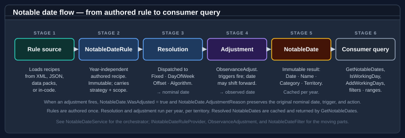
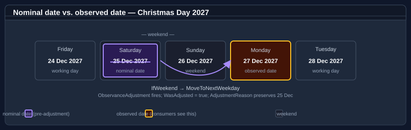
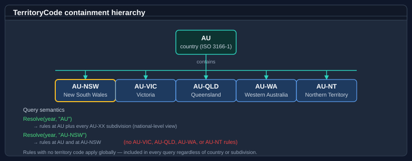

# Bodu.Globalization.Calendar — Core concepts

This page is the vocabulary the rest of the documentation assumes. Read it once before the [getting-started samples](getting-started.md) or the [guides](../../guides/calendar/index.md), and refer back to it whenever a term feels imprecise.

For the high-level shape of the library and the resolution pipeline diagram, start with the [introduction](index.md).

## The pipeline in one line



The pipeline reads left to right. A **rule document** is authored on the notable-date schema and **loaded** into an immutable **`NotableDateResource`**; each notable-date concept carries one or more **`NotableDateRule`** recipes; a rule's **strategy** computes a *nominal date* for the requested year; an **adjustment policy** may shift it to an *observed date*; same-day **collisions** are settled by the resource's **resolution policy**; and consumers query the result via **`Resolve`**, working-day arithmetic, and filters.

Every term below corresponds to a stage or an input of that pipeline.

> **Conceptual vs. implementation view.** The load step expands into parse → import resolution → override application → assembly → semantic validation; the query step expands into strategy resolution → adjustment evaluation → collision/duplicate settlement → emission. The [resolution pipeline guide](../../guides/calendar/resolution-pipeline.md) walks through each stage with worked examples.

## Document, resource, definition, rule

A **rule document** is authored text (XML or JSON) on the notable-date schema (`urn:bodu:globalization:calendar`). <xref:Bodu.Globalization.Calendar.NotableDateResourceLoader> parses it, resolves its imports, applies any overrides, validates it, and returns a **resource**.

A **resource** (<xref:Bodu.Globalization.Calendar.NotableDateResource>) is the immutable, fully validated result of loading a document — a resolution policy, a set of adjustment policies, and a list of notable-date definitions. It is the unit a <xref:Bodu.Globalization.Calendar.NotableDateService> is built over.

A **definition** (<xref:Bodu.Globalization.Calendar.NotableDateDefinition>) is a single notable-date *concept* — an id, a display name, a default category, and one or more rules.

A **rule** (<xref:Bodu.Globalization.Calendar.NotableDateRule>) is one calculation recipe for its definition: an applicability window, exactly one resolution strategy, optional adjustment-policy references, and tags. A concept can hold several rules — for example a different recipe before and after a reform year.

## Resolved date

A **resolved date** (<xref:Bodu.Globalization.Calendar.NotableDate>) is the year-specific concrete output — one occurrence with an emitted `Date`, the calculated `ActualDate`, `IsObserved`, a rule `Identity`, `DisplayName`, `TerritoryCode`, `Category`, and adjustment metadata. Resolved dates are produced by `NotableDateService.Resolve(...)`.

A rule produces zero, one, or many resolved dates per query, depending on its strategy, applicability, and the requested window.

## Nominal date vs. observed date



The **nominal date** (`NotableDate.ActualDate`) is what the resolution strategy computes from the rule before any adjustment runs — e.g. *25 December* for Christmas Day.

The **observed date** (`NotableDate.Date`) is what the adjustment pipeline emits — e.g. *Monday 27 December* when Christmas falls on a Saturday and a weekend-rollover policy relocates it.

Most occurrences have `Date == ActualDate` and `IsObserved == false`. When an adjustment fires, `IsObserved` is `true` and `AdjustmentPolicyId` / `AdjustmentReason` record which policy moved it. Whether the service emits the observed day alone, the nominal day alone, or *both* is governed by the policy's <xref:Bodu.Globalization.Calendar.RangeResolution.EmissionMode> (`ObservedOnly`, `ActualOnly`, `ActualAndObserved`, `ObservedAsAdditional`, `Suppress`); which occurrence controls range-query inclusion is governed by the resource's <xref:Bodu.Globalization.Calendar.RangeResolution.ObservedDateRangePolicy>. See [Identity, priority, and observed dates](../../guides/calendar/identity-and-resolution.md) and [Observance adjustment rules](../../guides/calendar/adjustment-rules.md).

## Resolution strategy

Each rule carries exactly one <xref:Bodu.Globalization.Calendar.Algorithms.IDateCalculationStrategy>, authored as one `<Strategy>` child element:

| Strategy element | What it does |
|---|---|
| `<Fixed>` | A specific month + day every year (e.g. 1 January), optionally in a non-Gregorian calendar. |
| `<DayOfWeekInMonth>` | The *n*th or last weekday in a month (e.g. fourth Thursday in November). |
| `<RelativeWeekdayInMonth>` | A weekday positioned relative to a weekday-in-month anchor (e.g. the Tuesday after the first Monday in November). |
| `<WeekdayNearDate>` | A weekday on / before / after / nearest a fixed reference date (e.g. the Monday nearest 24 May). |
| `<OffsetFromRule>` | A signed day-offset from another rule's occurrence (e.g. Easter Sunday − 2 = Good Friday). |
| `<Algorithm>` | Delegated to a named algorithm key for astronomical or ecclesiastical computations (Easter, equinoxes, Vesak, Diwali, …). |

See the [NotableDateRule and adjustment-policy reference](../../guides/calendar/rule-reference.md) for the per-element contracts and [Date calculation algorithms](../../guides/calendar/algorithms.md) for the algorithm keys.

## Rule references (offset-from-rule)

An `<OffsetFromRule>` strategy names another concept's rule via `notableDateRef` (and optional `ruleRef`) plus a signed `offsetDays`. The referenced rule is resolved first and the offset applied — this is how Good Friday and Easter Monday hang off Easter Sunday. References are resolved cycle-safely within the same resource; see [Date calculation algorithms](../../guides/calendar/algorithms.md).

## Adjustment policy

An **adjustment policy** (<xref:Bodu.Globalization.Calendar.AdjustmentPolicy>) is a reusable, named post-resolution shift declared once at the top of a document and referenced by rules via `policyRef`. It pairs a <xref:Bodu.Globalization.Calendar.AdjustmentTrigger> (when it fires — `IfWeekend`, `IfNonWorkingDay`, `IfDayOfWeek`, …) with an <xref:Bodu.Globalization.Calendar.AdjustmentAction> (what it does — `MoveToNextWorkingDay`, `AddDays`, `ReplaceWithRule`, `Suppress`, …), an <xref:Bodu.Globalization.Calendar.RangeResolution.EmissionMode>, and an optional <xref:Bodu.Globalization.Calendar.AdjustmentScope> (territory, calendar, category, year range).

A rule can reference several policies; they are evaluated in priority order. Custom triggers and actions are supplied through <xref:Bodu.Globalization.Calendar.IAdjustmentTriggerHandler> / <xref:Bodu.Globalization.Calendar.IAdjustmentHandler> registries. See [Observance adjustment rules](../../guides/calendar/adjustment-rules.md).

## Collision and duplicate resolution

A **collision** occurs when two distinct rules resolve to the same date for the same territory — for example, an adjusted holiday landing on another holiday. The resource's <xref:Bodu.Globalization.Calendar.RangeResolution.ResolutionPolicy> decides the outcome: <xref:Bodu.Globalization.Calendar.RangeResolution.CollisionPolicy> (`KeepAll`, `HighestPriorityOnly`, `CategoryPriority`, `Custom`) combined with <xref:Bodu.Globalization.Calendar.RangeResolution.PriorityDirection>, while <xref:Bodu.Globalization.Calendar.RangeResolution.DuplicatePolicy> reconciles identical occurrences. Under `CollisionPolicy.Custom`, a supplied <xref:Bodu.Globalization.Calendar.RangeResolution.INotableDateCollisionResolver> settles the day. See [Identity, priority, and observed-date resolution](../../guides/calendar/identity-and-resolution.md).

## Territory



A <xref:Bodu.Globalization.Calendar.TerritoryCode> is an ISO 3166 country code with an optional subdivision — `AU`, `AU-NSW`, `GB-ENG`, `US-CA`. Territory codes are **hierarchical**: a country contains all of its subdivisions. Queries take a plain `string` territory (the struct converts implicitly).

- A rule authored for `AU` applies to every Australian subdivision.
- A query for `AU-NSW` returns rules authored at `AU` *and* at `AU-NSW`.
- A rule with no `<Territory>` constraint applies to every territory — useful for genuinely global dates like the Gregorian New Year.

See [Territories and regional composition](../../guides/calendar/territories.md).

## Category vs. tag

<xref:Bodu.Globalization.Calendar.NotableDateCategory> is the well-known enum — `PublicHoliday`, `BankHoliday`, `Observance`, `Remembrance`, `Cultural`, `Religious`, `Seasonal`, `Civic`, `School`, `Regional`, `Other`, `None`. Every resolved date has exactly one category. Use it for coarse filtering (e.g. "show me public holidays").

**Tags** are free-form strings on the rule (`<Tags>`). They survive into the resolved `NotableDate.Tags` and are intended for fine-grained, app-specific filtering. Combine `NotableDateFilter.WithTag(...)` with `NotableDateFilter.ForCategory(...)` for compound queries.

## Imports and common catalogues

A document rarely starts from scratch. `<Imports>` pull notable-date concepts from the bundled **common catalogues** — `global-core`, `christian-western`, `global-islamic`, `global-hindu`, and friends — resolved by name through <xref:Bodu.Globalization.Calendar.CommonNotableDateResources>. An `<Import>` can take every concept or cherry-pick with `<Use>` directives that rename, re-scope to a territory, override the category, or attach adjustment policies. Local concepts win over imported concepts of the same id. The `Bodu.Globalization.Calendar.Data.*` packs are built exactly this way. See [Authoring notable date rules](../../guides/calendar/rule-authoring.md).

## Overrides and runtime change

**Overrides** are ID-targeted edits applied at load time, authored in a document's `<Overrides>` element: `<AddRule>` adds a rule to a concept, `<PatchRule>` replaces parts of an existing rule, `<RemoveRule>` deletes one. They let a regional document tweak imported concepts without forking them.

Because a resource is immutable, *runtime* change is modelled by loading a **new** resource and swapping it in: a <xref:Bodu.Globalization.Calendar.MutableNotableDateResourceProvider> holds the current resource and `Reload(...)` replaces it, while a <xref:Bodu.Globalization.Calendar.ReloadableNotableDateService> reads the provider per query and rebuilds atomically. Code-first contribution of *finished* occurrences (bypassing the rule pipeline) is the role of <xref:Bodu.Globalization.Calendar.INotableDateProvider>.

## Algorithm vs. fixed rule

When a date cannot be expressed as a calendar formula (Easter Sunday, Vesak, Diwali, Qingming), it is computed by a named **algorithm** referenced from the rule:

```xml
<Rule id="default">
  <Strategy><Algorithm key="western-easter" /></Strategy>
</Rule>
```

Built-in keys (`western-easter`, `orthodox-easter`, `qingming`, `vesak`, `losar`, `matariki`, the Hindu-festival keys, …) are backed by bundled calculators; unknown keys resolve against a custom <xref:Bodu.Globalization.Calendar.Algorithms.NotableDateAlgorithmRegistry>. See [Date calculation algorithms](../../guides/calendar/algorithms.md).

## Resolved notable date

A <xref:Bodu.Globalization.Calendar.NotableDate> is the immutable output of one rule for one occurrence. Its key fields:

| Field | Meaning |
|---|---|
| `Date` | The emitted occurrence date (observed, after any adjustment). |
| `ActualDate` | The originally calculated (nominal) date. |
| `IsObserved` | Whether `Date` differs from `ActualDate` because an adjustment applied. |
| `DisplayName` | The display name (subject to optional localisation). |
| `Category` | `NotableDateCategory` value. |
| `TerritoryCode` | The territory the occurrence applies to. |
| `Tags` | Free-form classification strings from the rule. |
| `DurationDays`, `EndDate` | Multi-day spans (e.g. Hanukkah, Easter weekend). |
| `IsNonWorkingDay` | Whether working-day arithmetic should skip this date. |
| `AdjustmentPolicyId`, `AdjustmentReason` | Which adjustment policy moved the date, and why. |
| `Identity` (`NotableDateId`, `RuleId`) | The originating concept and rule. |

## Working day vs. non-working day

A **working day** is any day that is neither outside the configured working week (a `Bodu.Core` `WeekPattern`, default Monday–Friday) nor a resolved notable date with `IsNonWorkingDay = true` for the queried territory.

Not every notable date is non-working: Mother's Day and most cultural observances are notable but not closures. Working-day arithmetic relies on the occurrence's `IsNonWorkingDay` flag — authors decide which dates count as closures, and each extension method accepts an optional `WeekPattern` to override the default working week.

See [Working-day arithmetic](../../guides/calendar/working-days.md) for the operations (`IsWorkingDay`, `AddWorkingDays`, `NextWorkingDay`, `WorkingDaysBetween`, `SnapToWorkingDay`, …).

## Where to go next

- **[Introduction](index.md)** — the high-level shape of the library.
- **[Getting started](getting-started.md)** — install + runnable minimal samples.
- **[Bodu.Globalization.Calendar guides](../../guides/calendar/index.md)** — deep-dive walk-throughs for every concept above.
