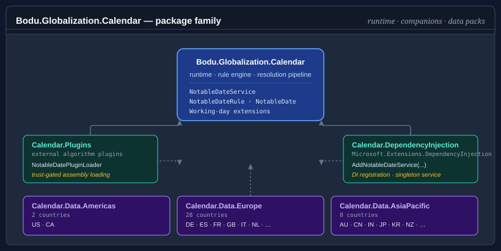

# Bodu.Globalization.Calendar

**Bodu.Globalization.Calendar** resolves authored calendar rules into concrete notable dates such as public holidays, observances, religious festivals, and regional events. Consumers query dates by year, date, or range and territory, optionally filter by category, tag, or duration, and use the resolved dates for working-day-aware arithmetic.

Rules are authored on the notable-date schema as XML or JSON, import from a set of bundled common catalogues, and load eagerly into an immutable, validated resource. More advanced scenarios extend the library with custom algorithms, adjustment handlers, collision resolvers, localizers, and trust-gated plugins.

## Calendar package family

The calendar runtime is intentionally small. Region-specific holiday data and dependency-injection registration ship as separate companion packages so they can release on their own cadence without forcing a main-library rebuild.

| Package | Role |
|---|---|
| **`Bodu.Globalization.Calendar`** | The runtime — rule engine, resolution pipeline, working-day extensions. Required by every other calendar package. |
| `Bodu.Globalization.Calendar.Builder` | Fluent, chainable C# API for authoring notable-date documents in code, with XML / JSON serialization and load/save. See the [builder guide](../../guides/calendar/notable-date-builder.md). |
| `Bodu.Globalization.Calendar.DependencyInjection` | `IServiceCollection` extensions for registering `INotableDateService` over a loaded `NotableDateResource`. See the [DI guide](../../guides/calendar/dependency-injection.md). |
| `Bodu.Globalization.Calendar.Plugins` | Trust-gated loading of external assemblies that contribute custom date-calculation algorithms. See [Building and extending the service](../../guides/calendar/building-the-service.md). |
| `Bodu.Globalization.Calendar.Americas` | Curated public-holiday rules for `US`, `CA`. |
| `Bodu.Globalization.Calendar.Europe` | Curated rules for 28 European territories including `DE`, `ES`, `FR`, `GB`, `IT`, `NL`. |
| `Bodu.Globalization.Calendar.AsiaPacific` | Curated rules for `AU` (with subdivisions), `CN`, `IN`, `JP`, `KR`, `MY`, `NZ`, `SG`. |
| `Bodu.Globalization.Calendar.Africa` | Curated rules for `ZA`, `NG`, `KE`, `GH`, `ET`, `EG`, `MA`. |
| `Bodu.Globalization.Calendar.MiddleEast` | Curated rules for `AE`, `SA`, `IL`, `TR`, `QA`, `JO`. |

The data packs are independent NuGet packages, so consumers pull in only the regions they need. See the [Calendar data packs guide](../../guides/calendar/data-packs.md) for per-pack install commands, territory coverage, and registration patterns.

## Core mental model

A single notable date flows through the library in this order:

A **rule document** is authored text on the notable-date schema. **`NotableDateResourceLoader`** parses it, resolves its imports against the bundled common catalogues, applies any overrides, validates it, and produces an immutable **`NotableDateResource`**. A **`NotableDateService`** is built over that resource; for each requested year, date, or range it resolves every applicable rule using the rule's strategy (fixed date, *n*th weekday, weekday-near-date, offset from another rule, or a named algorithm), runs the referenced adjustment policies against the *nominal* date, settles same-day collisions, and emits the resolved **`NotableDate`** set. Consumers then query that set by territory, category, tag, or date range, or feed it into the working-day extensions.

## Key concepts

| Concept | Plain-language meaning |
|---|---|
| **Document / resource** | The authored XML/JSON, and the immutable validated value it loads into. |
| **Definition / rule** | A notable-date concept, and one of its calculation recipes. |
| **Resolution strategy** | How a rule finds its nominal date: fixed, *n*th weekday-in-month, relative weekday, weekday-near-date, offset-from-rule, or algorithm. |
| **Adjustment policy** | A reusable post-resolution shift that moves or substitutes the date — e.g. weekend rollover, substitute Monday — referenced by rules. |
| **Territory** | Geographic scope where the rule applies — `AU` for Australia, `AU-NSW` for New South Wales. |
| **Category / tag** | Classification used for filtering and display. `NotableDateCategory` is the well-known enum; tags are free-form strings. |
| **Import** | A pull from a bundled common catalogue, optionally re-scoped via `<Use>` directives. |
| **Override** | An ID-targeted add / patch / remove applied at load time; runtime change is a resource reload. |
| **Resolved notable date** | The concrete `NotableDate` returned to consumers — observed date, calculated date, name, category, territory, optional multi-day span. |

For the full glossary, see [Core concepts](concepts.md).

### Notable date vs. non-working day

Not every notable date is a non-working day. A rule can describe a public holiday, observance, remembrance day, religious festival, or regional event. Working-day operations use the occurrence's `IsNonWorkingDay` flag together with the configured working week (a `Bodu.Core` `WeekPattern`) to decide whether a date should be skipped.

### Territory containment

Territory codes are hierarchical. A query for `AU-NSW` includes rules authored for `AU` as well as rules specific to `AU-NSW`, so national and regional rules compose naturally. The same applies to `GB-ENG` inheriting `GB`, `US-CA` inheriting `US`, and so on.

## Worked example — New Year's Day in the US

A single rule traces the pipeline end-to-end:

1. `global-core` defines `new-years-day` as a `<Fixed month="January" day="1" />` rule, `PublicHoliday`, non-working.
2. `region-us` imports it with `<Use notableDateRef="new-years-day" territory="US">` and attaches the `saturday-to-friday` and `sunday-to-monday` adjustment policies.
3. The service resolves the fixed date for the requested year — the *nominal* `ActualDate`. For 2028 that is `2028-01-01`, a Saturday.
4. The `saturday-to-friday` policy fires, so the emitted `Date` is the observed `2027-12-31` (Friday), with `IsObserved == true` and `AdjustmentPolicyId == "saturday-to-friday"`.
5. A query for territory `US-NY` returns the occurrence because `US-NY` is contained by `US`.
6. Working-day arithmetic — `someDate.AddWorkingDays(1, service, "US-NY")` — skips the observed date because the rule is non-working.

The same flow applies to every other rule — only the strategy in step 3 and the adjustment outcome in step 4 differ.

## Common scenarios

| Scenario | Reach for |
|---|---|
| Resolve all notable dates in a country for a year | `service.Resolve(year, territory: "AU")` |
| Resolve notable dates for a specific day or range | `service.Resolve(new DateOnly(2026, 1, 26), "AU")` / `service.Resolve(new DateRange(from, to), "AU")` |
| "Is today a public holiday in NSW?" | `dateOnly.IsNotableDate(service, "AU-NSW", NotableDateFilter.ForCategory(NotableDateCategory.PublicHoliday))` |
| "Add 5 working days to today (skipping weekends and holidays)" | `dateOnly.AddWorkingDays(5, service, "AU-NSW")` |
| Author rules in XML / JSON and load them | <xref:Bodu.Globalization.Calendar.NotableDateResourceLoader>`.Load(xml)` / `.LoadJson(json)` |
| Author rules fluently in C# (and save to XML / JSON) | <xref:Bodu.Globalization.Calendar.Builder.NotableDateDocumentBuilder> — see the [builder guide](../../guides/calendar/notable-date-builder.md) |
| Compute Easter / Diwali / Vesak for a year | author an `<Algorithm key="western-easter">` (etc.) rule — see [algorithms](../../guides/calendar/algorithms.md) |
| Layer ID-targeted edits over imported concepts | a document `<Overrides>` block (`<AddRule>` / `<PatchRule>` / `<RemoveRule>`) |
| Swap the rule set on a live service | <xref:Bodu.Globalization.Calendar.MutableNotableDateResourceProvider> + <xref:Bodu.Globalization.Calendar.ReloadableNotableDateService> |
| Register the service in an `IServiceCollection`-based host | `services.AddNotableDateService(resource)` from `Bodu.Globalization.Calendar.DependencyInjection` |
| Enumerate the territories / calendar systems covered | `service.GetSupportedTerritories()` / `service.GetSupportedCalendars()` |
| Load algorithms from external assemblies safely | <xref:Bodu.Globalization.Calendar.Plugins.NotableDatePluginLoader> + a trust policy |
| Apply observance adjustments (weekend → next working day) | an <xref:Bodu.Globalization.Calendar.AdjustmentPolicy> referenced by `policyRef` |
| Filter resolved notable dates by category, tag, or range | <xref:Bodu.Globalization.Calendar.NotableDateFilter>`.ForCategory(...)`, `.WithTag(...)`, `.InDateRange(...)` (combine with `.And` / `.Or`) |

## Main types

The same surface, grouped by what role you're playing rather than by namespace.

### Types most consumers use

| Type | Purpose |
|---|---|
| <xref:Bodu.Globalization.Calendar.NotableDateService> / <xref:Bodu.Globalization.Calendar.INotableDateService> | Main entry point — resolves and queries notable dates for a date, range, or year. |
| <xref:Bodu.Globalization.Calendar.NotableDate> | Resolved output — observed date, calculated date, name, category, territory, optional multi-day span. |
| <xref:Bodu.Globalization.Calendar.NotableDateFilter> | Composable predicate, built via static factory methods (`ForCategory`, `WithTag`, `WithId`, `InDateRange`, `IsNonWorkingDay`, …) and combined with `And` / `Or` / `Not`. |
| <xref:Bodu.Globalization.Calendar.TerritoryCode> | Strongly-typed ISO 3166 country / subdivision code with containment semantics. |
| <xref:Bodu.Globalization.Calendar.NotableDateCategory> | `PublicHoliday` / `BankHoliday` / `Observance` / `Remembrance` / `Cultural` / `Religious` / `Seasonal` / `Civic` / `School` / `Regional` / `Other` / `None`. |
| <xref:Bodu.Extensions.NotableDateOnlyExtensions>, <xref:Bodu.Extensions.NotableDateTimeExtensions> | Working-day arithmetic over `DateOnly` / `DateTime` — `IsWorkingDay`, `NextWorkingDay`, `AddWorkingDays`, `WorkingDaysBetween`, `SnapToWorkingDay`, … See [Working-day arithmetic](../../guides/calendar/working-days.md). |

### Types used when authoring and loading rules

| Type | Purpose |
|---|---|
| <xref:Bodu.Globalization.Calendar.NotableDateResourceLoader> | Loads XML / JSON (string or `Stream`) into a validated `NotableDateResource`. |
| <xref:Bodu.Globalization.Calendar.Builder.NotableDateDocumentBuilder> | Fluent C# authoring of a document — builds, serializes (XML / JSON), and saves; from the `Bodu.Globalization.Calendar.Builder` companion. |
| <xref:Bodu.Globalization.Calendar.NotableDateResource>, <xref:Bodu.Globalization.Calendar.NotableDateDefinition>, <xref:Bodu.Globalization.Calendar.NotableDateRule> | The immutable loaded document: a resource of definitions, each with one or more rules. |
| <xref:Bodu.Globalization.Calendar.CommonNotableDateResources> | Resolver over the bundled common catalogues that documents import by name. |
| <xref:Bodu.Globalization.Calendar.RangeResolution.ResolutionPolicy> | Resource-level duplicate / collision / observed-date policy and working week. |
| <xref:Bodu.Globalization.Calendar.AdjustmentPolicy> | A reusable, named adjustment referenced by rules. |

### Built-in algorithms

The `Bodu.Globalization.Calendar.Algorithms` namespace resolves an `<Algorithm key="…">` strategy to a bundled calculator. Common keys:

| Key | Computes |
|---|---|
| `western-easter`, `orthodox-easter` | Easter Sunday (Gregorian / Orthodox computus). |
| `vernal-equinox`, `autumnal-equinox`, `qingming` | Sun-longitude based dates. |
| `vesak`, `asalha-puja`, `losar` | Buddhist Vesak / Asalha Puja and Tibetan New Year. |
| `matariki` | New Zealand Matariki (gazetted table). |
| `diwali`, `holi`, `maha-shivaratri`, … | Hindu lunisolar festivals. |

Region-specific holiday rules ship separately in the `Bodu.Globalization.Calendar.<Region>` data packs (`Americas`, `AsiaPacific`, `Europe`, `Africa`, `MiddleEast`) — see [Calendar data packs](../../guides/calendar/data-packs.md).

### Types used when extending the library

| Type | Purpose |
|---|---|
| <xref:Bodu.Globalization.Calendar.Algorithms.INotableDateAlgorithm>, <xref:Bodu.Globalization.Calendar.Algorithms.NotableDateAlgorithmRegistry> | Pluggable algorithm contract and registry, backing `<Algorithm key="…">` rules. |
| <xref:Bodu.Globalization.Calendar.INotableDateProvider> | Code-first contribution of finished occurrences. |
| <xref:Bodu.Globalization.Calendar.MutableNotableDateResourceProvider>, <xref:Bodu.Globalization.Calendar.ReloadableNotableDateService> | Runtime resource swap on a live service. |
| <xref:Bodu.Globalization.Calendar.IAdjustmentHandler>, <xref:Bodu.Globalization.Calendar.IAdjustmentTriggerHandler> | Custom adjustment action / trigger handlers. |
| <xref:Bodu.Globalization.Calendar.RangeResolution.INotableDateCollisionResolver> | Custom same-day collision behaviour. |
| <xref:Bodu.Globalization.Calendar.INotableDateNameLocalizer> | Pluggable display-name localization. |

## Dependency injection

The optional `Bodu.Globalization.Calendar.DependencyInjection` companion package wires `INotableDateService` into a `Microsoft.Extensions.DependencyInjection` container as a singleton via `services.AddNotableDateService(resource)` (or a resource factory), and `services.AddReloadableNotableDateService(resource)` for the runtime-swap workflow. There is no options object — the resource carries the behaviour. See the [dependency-injection guide](../../guides/calendar/dependency-injection.md).

## Advanced extensibility

Plugin loading is intentionally isolated in the separate **`Bodu.Globalization.Calendar.Plugins`** package. Use it only when custom notable-date algorithms must be discovered from *external* assemblies; applications that consume only the built-in algorithms or the curated data packs never need it. Loading is trust-gated and default-deny — an assembly is admitted only when it satisfies an explicit trust policy (strong-name, file-hash, composite, or delegating), so untrusted or user-writable locations are rejected rather than executed, and an unavailable algorithm surfaces as a clear failure rather than silently resolving. The host, the trust policies, and their failure behaviour are documented in [Building and extending the service](../../guides/calendar/building-the-service.md); a first read of this introduction does not need them.

## Where to go next

- **[Core concepts](concepts.md)** — full vocabulary: document vs. resource, rule vs. date, nominal vs. observed, import vs. override, adjustment policy, category vs. tag, working day vs. non-working day.
- **[Getting started](getting-started.md)** — install + minimal samples for loading a resource, resolving dates, and working-day arithmetic.
- **[Bodu.Globalization.Calendar guides](../../guides/calendar/index.md)** — using `NotableDateService`, algorithms, rule authoring, working-day arithmetic, territories, data packs.
- **[Bodu.Globalization.Calendar API reference](xref:Bodu.Globalization.Calendar)** — full type-by-type docs.
- **[Calendar data packs](../../guides/calendar/data-packs.md)** — region-specific resources (`AmericasCalendarData`, `AsiaPacificCalendarData`, `EuropeCalendarData`, `AfricaCalendarData`, `MiddleEastCalendarData`).
