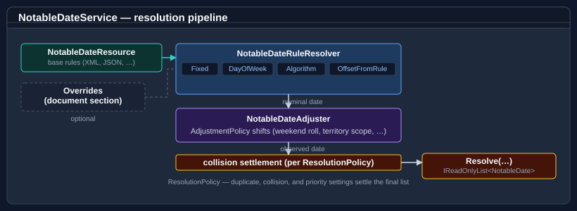

# Bodu.Globalization.Calendar

**Bodu.Globalization.Calendar** is the rule-driven notable-date library of the Bodu suite. It resolves public holidays, observances, and religious festivals for any year, territory, or calendar system, with a pluggable algorithm registry, observance-adjustment pipeline, and a trust-policy-driven plugin host for loading rules from external assemblies.

## How the library works

A **`NotableDateRule`** is an authored recipe — a strategy (fixed, *n*th weekday, offset, algorithm), a category (holiday, observance, …), a territory (`AU`, `AU-NSW`), and an optional adjustment chain. **`NotableDateService`** loads rules from one or more providers, layers optional override providers, resolves each rule for a requested year via the calculator, runs the adjustment pipeline, and caches the resolved set per year in a thread-safe dictionary.

## Namespaces and headline types

### `Bodu.Globalization.Calendar` — Core types

| Type | Purpose |
|---|---|
| `NotableDateService` / `INotableDateService` | Main entry point — resolves, caches, and queries notable dates. |
| `NotableDateRule` | Authored recipe (strategy, category, territory, adjustments, duration). |
| `NotableDate` | Resolved output — concrete date, name, category, territory, optional multi-day span. |
| `NotableDateCategory` | `Holiday` / `Observance` / `Remembrance` / `Cultural` / `Seasonal` / `Other`. |
| `NotableDateFilter` | Composable two-stage predicate for territory- and category-scoped queries. |
| `TerritoryCode` | Strongly-typed ISO 3166-1 alpha-2 country / subdivision code with containment semantics. |
| `DateResolutionStrategy` | Enum: `Fixed`, `DayOfWeekInMonth`, `OffsetFromAnchor`, `Algorithm`. |
| `ObservanceAdjustment` | Conditional date-shift specification (trigger + action + scope). |
| `AdjustmentTrigger` / `AdjustmentAction` / `AdjustmentReason` / `AdjustmentApplyResult` | Adjustment-pipeline primitives. |
| `IAdjustmentHandler` / `AdjustmentHandlerRegistry` / `IAdjustmentHandlerRegistry` / `AdjustmentHandlerContext` / `AdjustmentHandlerResult` | Handler model for adjustments. |
| `INotableDateAlgorithm` / `INotableDateAlgorithmRegistry` / `NotableDateAlgorithmRegistry` | Pluggable algorithm contract and registry. |
| `INotableDateProvider` / `INotableDateRuleProvider` / `INotableDateRuleOverrideProvider` | Rule-source contracts. |
| `XmlResourceNotableDateRuleProvider` / `JsonResourceNotableDateRuleProvider` | Built-in providers loading rules from embedded XML / JSON resources. |
| `NotableDateRuleResourceProviderBase` | Base class for resource-backed rule providers. |
| `NotableDateRuleResolver` / `NotableDateAdjuster` / `NotableDateRuleMerger` / `RuleRemoval` | Resolution pipeline internals. |
| `INotableDateNameLocalizer` | Pluggable display-name localisation. |
| `INotableDateCollisionResolver` / `DefaultNotableDateCollisionResolver` | Behaviour when multiple rules resolve to the same date. |
| `IResourcePathResolver` / `ResourcePathResolver` / `ResourcePathResolverOptions` | Resource-path resolution for embedded providers. |
| `NotableDateRuleParser` / `NotableDateRuleJsonParser` / `ParsedNotableDateDocument` / `NotableDateRuleUseGroup` / `NotableDateRuleUseDirective` / `NotableDateRuleOverrideBody` | XML / JSON rule-document model. |

### `Bodu.Globalization.Calendar.Algorithms` — Built-in algorithms

| Type | Computes |
|---|---|
| `EasterSundayNotableDateAlgorithm` / `GregorianEasterSundayNotableDateProvider` / `OrthodoxEasterSundayNotableDateProvider` / `EasterSundayNotableDateProviderBase` | Western and Orthodox Easter Sunday. |
| `HinduLunarNotableDateAlgorithm` + `HinduLunarMonth` + `HinduPaksha` | Hindu lunisolar dates (Diwali, Holi, …). |
| `LunarPhaseAlgorithm` | Astronomical new / full moon phases. |
| `LosarNotableDateAlgorithm` | Tibetan New Year. |
| `VesakNotableDateAlgorithm` | Buddhist Vesak / Buddha Day. |
| `AsalhaPujaNotableDateAlgorithm` | Asalha Puja. |
| `QingmingNotableDateAlgorithm` | Qingming festival (sun-longitude based). |

### `Bodu.Globalization.Calendar.Plugins` — Plugin host with trust policies

| Type | Purpose |
|---|---|
| `INotableDatePlugin` / `INotableDateRulePlugin` / `INotableDateAlgorithmPlugin` | Plugin contracts for external rule / algorithm packages. |
| `NotableDatePluginAttribute` | Marker attribute identifying a plugin entry point. |
| `ExternalPluginLoader` | Loads plugins from a directory or assembly with trust-policy gating. |
| `IPluginTrustPolicy` / `CompositePluginTrustPolicy` / `DelegatingPluginTrustPolicy` / `AllowAllPluginTrustPolicy` / `StrongNamePluginTrustPolicy` / `FileHashPluginTrustPolicy` | Trust policies (deny by default; opt in by strong name, file hash, composition, or custom delegate). |
| `PluginTrustContext` / `PluginTrustResult` | Trust-evaluation inputs and outputs. |
| `NotableDatePluginException` / `PluginActivationException` / `PluginMissingAttributeException` / `PluginNotTrustedException` | Plugin-host exceptions. |

### `Bodu.Globalization.Calendar.Extensions` — Working-day arithmetic

Two parallel extension surfaces — `NotableDateOnlyExtensions` (over `DateOnly`) and `NotableDateTimeExtensions` (over `DateTime`) — hang off an `INotableDateService` to give working-day-aware date arithmetic.

| Operation | Methods |
|---|---|
| Lookup | `IsNotableDate`, `IsWorkingDay`, `IsNonWorkingDay` |
| Enumerate | `EnumerateNotableDates`, `EnumerateWorkingDays`, `EnumerateNonWorkingDays`, `GetNotableDates`, `GetNotableDatesInMonth`, `GetNotableDatesInYear` |
| Navigate | `NextWorkingDay`, `PreviousWorkingDay`, `NextNonWorkingDay`, `PreviousNonWorkingDay`, `NextNotableDate`, `PreviousNotableDate` |
| Snap / arithmetic | `SnapToWorkingDay`, `SnapToWorkingDayBackward`, `SnapToNearestWorkingDay`, `AddWorkingDays`, `WorkingDaysBetween` |
| Context | `NotableDateContext` for batch operations. |

### `Bodu.Globalization.Calendar.Providers`
Companion-pack rule providers (Americas / Europe / AsiaPacific). The data ships in `Bodu.Globalization.Calendar.Data.*` companion packages on independent release schedules.

## Scenarios this library covers

| Scenario | Reach for |
|---|---|
| Resolve all notable dates in a country for a year | `NotableDateService.GetNotableDates(year, territory)` |
| "Is today a public holiday in NSW?" | `dateOnly.IsNotableDate(service, "AU-NSW")` |
| "Add 5 working days to today (skipping weekends and holidays)" | `dateOnly.AddWorkingDays(service, 5, "AU-NSW")` |
| Compute Easter Sunday for any year | `EasterSundayNotableDateAlgorithm.Calculate(year)` |
| Compute Lunar New Year | `LosarNotableDateAlgorithm.Calculate(year)` |
| Author rules in XML / JSON and load them | `XmlResourceNotableDateRuleProvider` / `JsonResourceNotableDateRuleProvider` |
| Layer runtime overrides on top of a base rule set | `INotableDateRuleOverrideProvider` |
| Load rules / algorithms from external assemblies safely | `ExternalPluginLoader` + a trust policy |
| Apply observance adjustments (e.g. holiday-falls-on-weekend → next Monday) | `ObservanceAdjustment` + `AdjustmentHandlerRegistry` |

## Where to go next

- **[Getting started](getting-started.md)** — install + minimal samples for the algorithm, the service, and working-day arithmetic.
- **[Bodu.Globalization.Calendar guides](../../guides/calendar/)** — using `NotableDateService`, calculators, rule authoring, data packs.
- **[Bodu.Globalization.Calendar API reference](../../apidoc/Bodu.Globalization.Calendar.md)** — full type-by-type docs.
