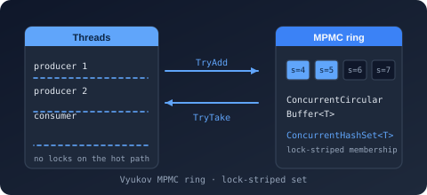
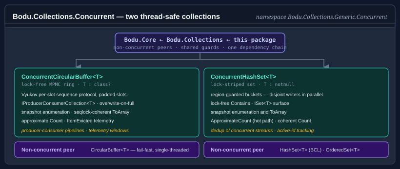

# Bodu.Collections.Concurrent

**Bodu.Collections.Concurrent** ships the thread-safe members of the Bodu collection catalogue — the lock-free `ConcurrentCircularBuffer<T>` and the lock-striped `ConcurrentHashSet<T>` — as a focused companion package in the **[Core Foundations](../topics/core-foundations.md)** topic. The dependency chain is `Bodu.Core` ← [`Bodu.Collections`](../collections/index.md) ← `Bodu.Collections.Concurrent`: this package references `Bodu.Collections` (and through it `Bodu.Core`), so installing it brings the whole family. The namespace is unchanged from the original split — both types live in `Bodu.Collections.Generic.Concurrent`.

Reach for this package when the same collection is accessed by multiple producers and consumers and you need predictable concurrent semantics rather than an external lock. External locking around `CircularBuffer<T>` or `HashSet<T>` works, but it serialises every operation behind a single monitor; the concurrent variants split contention across slots (Vyukov MPMC for the buffer) or bucket regions (lock striping for the set), so disjoint operations proceed in parallel.

## Namespaces and headline types

### `Bodu.Collections.Generic.Concurrent`

| Type | Purpose |
|---|---|
| <xref:Bodu.Collections.Generic.Concurrent.ConcurrentCircularBuffer`1> | Thread-safe variant of <xref:Bodu.Collections.Generic.CircularBuffer`1>: a lock-free multi-producer / multi-consumer ring over the Vyukov per-slot sequence protocol, implementing <xref:System.Collections.Concurrent.IProducerConsumerCollection`1> with the same overwrite-on-full semantics as its single-threaded peer. Reference types only (`T : class?`). |
| <xref:Bodu.Collections.Generic.Concurrent.ConcurrentHashSet`1> | Thread-safe unordered set of unique elements backed by lock striping: the bucket array is partitioned into regions each guarded by its own monitor, so disjoint writers proceed in parallel and `Contains` is lock-free. Implements `ISet<T>`; elements must be non-null (`T : notnull`). |

## Scenarios this library covers

| Scenario | Reach for |
|---|---|
| Fixed-capacity FIFO ring buffer shared by multiple threads | <xref:Bodu.Collections.Generic.Concurrent.ConcurrentCircularBuffer`1> |
| Producer-consumer queue (optionally behind `BlockingCollection<T>`) | <xref:Bodu.Collections.Generic.Concurrent.ConcurrentCircularBuffer`1> via <xref:System.Collections.Concurrent.IProducerConsumerCollection`1> |
| Bounded telemetry / recent-items window under concurrent writers | <xref:Bodu.Collections.Generic.Concurrent.ConcurrentCircularBuffer`1> with `AllowOverwrite = true` |
| Thread-safe set of active correlation ids, dedup of a concurrent stream | <xref:Bodu.Collections.Generic.Concurrent.ConcurrentHashSet`1> |
| Read-heavy membership tests that must never block writers | <xref:Bodu.Collections.Generic.Concurrent.ConcurrentHashSet`1> (`Contains` is lock-free) |

## Design notes

- **Lock-free ring, lock-striped set.** The buffer coordinates producers and consumers with per-slot sequence numbers (CAS updates, 64-byte cache-line padding against false sharing) — no `lock` on the hot path. The set stripes its buckets across independently locked regions; only same-region writers contend.
- **Snapshot enumeration, never fail-fast.** Both types enumerate a coherent snapshot and never throw on concurrent modification — the deliberate inverse of the fail-fast contract on the single-threaded catalogue, because a fail-fast version token cannot be maintained without a lock.
- **Approximate reads are named as such.** `Count` on the buffer and `ApproximateCount` / `IsEmptyApproximate` on the set are point-in-time estimates that never block; the set's `Count` acquires every region lock for a coherent answer. Choose by need, not by habit.
- **Eviction under contention.** With `AllowOverwrite = true`, a producer that finds the buffer full silently overwrites the oldest entry and raises `ItemEvicted` afterwards; handler exceptions are swallowed and there is no pre-eviction veto — the lock-free path cannot safely unwind. See [concepts](concepts.md) for the contrast with `CircularBuffer<T>`'s event contract.
- **`SyncRoot` throws.** Matching the BCL `ConcurrentQueue<T>`, the explicit `ICollection.SyncRoot` on the buffer throws <xref:System.NotSupportedException> — there is nothing meaningful to lock on.

## Where to go next

- **[Core concepts](concepts.md)** — the concurrency vocabulary: MPMC rings, lock striping, snapshot enumeration, approximate counts.
- **[Getting started](getting-started.md)** — install the package and run a minimal sample for each type.
- **[Concurrent collections guide](../../guides/core/concurrent-collections.md)** — the full walk-through: construction, consistency table, bulk operations, when *not* to use these types.
- **[Bodu.Collections.Generic.Concurrent API reference](xref:Bodu.Collections.Generic.Concurrent)** — full namespace overview.
- **[Bodu.Collections introduction](../collections/index.md)** — the single-threaded catalogue this package extends.
- **[Core Foundations topic](../topics/core-foundations.md)** — how the three packages fit together.
