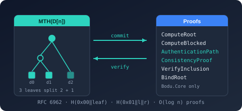

# Bodu.Collections.Merkle

**Bodu.Collections.Merkle** is the [RFC 6962](https://www.rfc-editor.org/rfc/rfc6962#section-2.1) Merkle tree — the Merkle Tree Hash, inclusion (audit) proofs, consistency proofs, and length-bound roots — over any <xref:System.Security.Cryptography.HashAlgorithm?displayProperty=nameWithType> the caller supplies. It sits in the **[Hashing & Cryptography](../topics/hashing-and-cryptography.md)** topic because what it produces is a hash-based commitment, even though its package name places it in the `Bodu.Collections` family and its single dependency is `Bodu.Core`.

That single dependency is the reason the package exists on its own. Merkle commitments are wanted by callers who have nothing else to do with cryptography — a build system pinning artifact contents, a sync protocol comparing two stores, a log that must prove it only ever appended. Folding the tree into [`Bodu.Security.Cryptography`](../cryptography/index.md) would make every one of them take a catalogue of block ciphers, AEAD modes, and post-quantum key encapsulation to get it. Instead the tree takes the hash as a `Func<HashAlgorithm>`, so `SHA256.Create`, <xref:Bodu.Security.Cryptography.Tiger>, <xref:Bodu.Security.Cryptography.Blake2b>, or anything else deriving from `HashAlgorithm` all work while this package references none of them.

> [!IMPORTANT]
> `Bodu.Security.Cryptography` ships two *other* Merkle types, <xref:Bodu.Security.Cryptography.MerkleTreeHash> and <xref:Bodu.Security.Cryptography.ParallelMerkleTreeHash>. They borrow RFC 6962's **domain separation** but not its **tree shape**: they reduce level by level with a configurable `fanOut` and re-hash a lone leftover child as a one-child node, so their roots agree with RFC 6962's only when the leaf count is a power of two. They are sound commitments — simply different ones, and their roots are stable and will not change. Use them for streaming integrity inside a system you control; use this package when the root has to interoperate, or when you need proofs. The [three-implementations table](../../guides/cryptography/merkle-trees.md) spells out the choice.

## Namespaces and headline types

### `Bodu.Collections.Merkle`

| Type | Purpose |
|---|---|
| <xref:Bodu.Collections.Merkle.Rfc6962MerkleTree> | The whole surface, as one immutable, stateless facade over a `Func<HashAlgorithm>`: root computation in entry, block, and parallel modes; authentication paths and consistency proofs; five verifiers; and the three domain-separated primitives (`HashLeaf`, `HashNode`, `BindRoot`). Holds no digest state between calls, so one instance is safe to share across threads. |
| <xref:Bodu.Collections.Merkle.MerkleComputation> | The result of a block-mode pass — `Root`, `InputLength`, `BlockSize`, and the ordered `LeafHashes`. Returning the leaf hashes from the same pass is the point: an authentication path needs them, and without them a large object would have to be streamed a second time. |
| <xref:Bodu.Collections.Merkle.MerkleBlocks> | The block arithmetic as standalone 64-bit helpers — `BlockCount`, `BlockOffset`, `BlockLength`. A zero-length input has no blocks rather than one empty block, and a final short block is hashed at its actual length rather than padded. |

## Scenarios this library covers

| Scenario | Reach for |
|---|---|
| A root that a transparency log, attestation, or other RFC 6962 implementation must agree with | `ComputeRoot` / `ComputeRootOfBlocks` |
| Prove one entry belongs under a published root, without revealing the rest | `AuthenticationPath` + `VerifyInclusion` |
| Prove one *chunk* of a large object matches, without rehashing the object | `ComputeBlocked` + `AuthenticationPath` + `VerifyBlockInclusion` |
| Prove an append-only log never rewrote history | `ConsistencyProof` + `VerifyConsistency` |
| Publish a commitment that also pins the input's length | `BindRoot`, verified with `VerifyInclusionBound` / `VerifyBlockInclusion` |
| A root over an object too large to hold in memory | `ComputeRootOfBlocks` — logarithmic memory, single pass |
| Saturate several cores hashing leaves of an in-memory buffer | `ComputeBlockedParallel(ReadOnlyMemory<byte>, …)` |
| Compose the primitives by hand (a custom tree shape, a cached subtree) | `HashLeaf` / `HashNode` / `HashLength` |

## Design notes

- **The standard's tree, not a convenient approximation of it.** A tree of *n* leaves splits at `k`, the largest power of two **strictly below** *n* — three leaves split 2 + 1, never 1 + 2 — and a lone subtree root is promoted **unchanged** rather than re-hashed. Both details are where naive implementations diverge, and both are pinned against the published vectors.
- **Domain separation is what makes the tree sound.** Leaves are `H(0x00 ‖ entry)`, internal nodes `H(0x01 ‖ left ‖ right)`, and bound roots `H(0x02 ‖ uint64_be(value) ‖ root)`. Without the prefixes an internal node hash could be offered as a leaf — the second-preimage attack. The prefix values live in a source-shared file so they cannot drift from the `Bodu.Security.Cryptography` types that use the same scheme.
- **Verification is total.** Every verifier returns `false` for malformed input — a leaf index at or past the tree size, a path too long or too short, a step of the wrong width, a zero tree size — and only a `null` path or proof throws. A verifier sits directly behind untrusted bytes, so an exception where a `false` belongs is a denial of service.
- **`VerifyInclusion` trusts its `treeSize`; the bound verifiers do not.** That is RFC 6962 as specified. A four-entry tree's path for entry 0 has exactly the length a three-entry tree's first path wants and walks to the same head, so both verify — which lets an examined party understate its size and exempt its last entries from challenge. `BindRoot` folds the length into the root, and `VerifyInclusionBound` / `VerifyBlockInclusion` derive the size from it instead of accepting one. See [concepts](concepts.md).
- **Logarithmic memory when you only want the root.** `ComputeRootOfBlocks` pushes each leaf as a one-leaf subtree and merges equal-sized tops immediately, so the stack never exceeds `popcount(n)` hashes and peak memory is `O(blockSize + log n · HashLength)`. `ComputeBlocked` retains every leaf hash instead — that is what makes a later path possible — at `leafCount × HashLength` bytes.
- **Parallel leaf hashing never changes the root.** The parallel entry points hash leaves concurrently and fold the results through the same reduction, so the root is bit-identical to the sequential one for every input. Switching between them is a performance decision, never a compatibility one.
- **Not `IDisposable`, deliberately.** The tree owns no digest state; it creates, uses, and disposes a `HashAlgorithm` within each call. There is nothing to dispose on the tree itself, and a `using` on it would suggest a lifetime it does not have.
- **Shared in source with the cipher package, not duplicated.** The prefixes (`MerkleTreeFormat`) and the stateless RFC 6962 primitives (`MerkleTreeCore`) live in this package's `shared/` folder and are compiled into `Bodu.Security.Cryptography` under a symbol that switches their namespace. A separate source-only test assembly compiles them with **no** reference to this package, so introducing a resource lookup or any non-`Bodu.Core` dependency into the shared source breaks that build while leaving this package green.

## Where to go next

- **[Core concepts](concepts.md)** — Merkle Tree Hash, split point, domain separation, audit and consistency proofs, bound roots, the size ambiguity.
- **[Getting started](getting-started.md)** — install the package and run a minimal sample for each mode.
- **[RFC 6962 Merkle trees and proofs](../../guides/merkle/rfc6962-merkle-trees.md)** — the full walk-through, including the parallel-speedup measurements and the failure modes proofs are meant to stop.
- **[Bodu.Collections.Merkle API reference](xref:Bodu.Collections.Merkle)** — full namespace overview.
- **[Using Merkle trees](../../guides/cryptography/merkle-trees.md)** — the level-by-level streaming digests in `Bodu.Security.Cryptography`, and why their roots differ.
- **[Hashing & Cryptography topic](../topics/hashing-and-cryptography.md)** — how the hashing and cryptography packages fit together.
