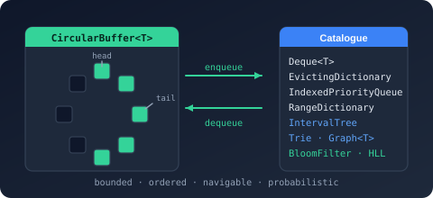
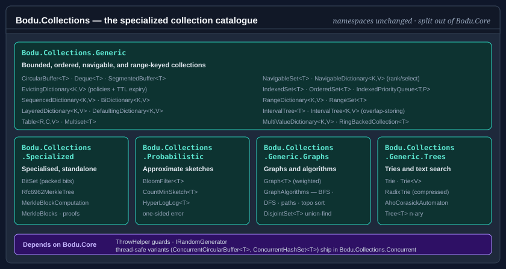

# Bodu.Collections

**Bodu.Collections** is the specialized generic-collection catalogue of the Bodu suite and a member of the **[Core Foundations](../topics/core-foundations.md)** topic. It ships the bounded, ordered, navigable, range-keyed, graph, tree, and probabilistic collections that were split out of `Bodu.Core` — the namespaces are unchanged (`Bodu.Collections.Generic` and its siblings), only the package boundary moved. The package depends on [`Bodu.Core`](../core/index.md) for shared primitives such as `ThrowHelper` and the `IRandomGenerator` abstraction; see the [package matrix](../package-matrix.md) for the full dependency map.

The thread-safe variants — `ConcurrentCircularBuffer<T>` and `ConcurrentHashSet<T>` in the `Bodu.Collections.Generic.Concurrent` namespace — ship in the companion **[Bodu.Collections.Concurrent](../collections-concurrent/index.md)** package, which depends on this one.

## Namespaces and headline types

### `Bodu.Collections.Generic`
Bounded, ordered, navigable, and range-keyed collections, many built around a shared ring-backed primitive.

| Type | Purpose |
|---|---|
| <xref:Bodu.Collections.Generic.CircularBuffer`1> | Fixed-capacity FIFO ring. Configurable to either silently overwrite or throw when full. |
| <xref:Bodu.Collections.Generic.Deque`1> | Double-ended queue with O(1) `AddFirst` / `AddLast` / `RemoveFirst` / `RemoveLast`. The `AllowGrow` flag toggles between auto-resize and fixed-capacity modes; when fixed, <xref:Bodu.Collections.Generic.DequeOverflowPolicy> selects reject-or-evict overflow behavior. |
| <xref:Bodu.Collections.Generic.SegmentedBuffer`1> | Segmented buffer for streaming scenarios where total length is not known up front. |
| <xref:Bodu.Collections.Generic.RingBackedCollection`1> | Abstract base shared by `CircularBuffer<T>` and `Deque<T>`. Extension point for new ring-backed collections. |
| <xref:Bodu.Collections.Generic.EvictingDictionary`2> | Capacity-bounded dictionary with FIFO, LRU, LFU, MRU, Random, or Second-Chance eviction, plus optional time-based (TTL) expiry. Drop-in cache primitive with standard dictionary semantics. |
| <xref:Bodu.Collections.Generic.EvictingDictionaryPolicy> | Enum selecting the eviction policy: `FirstInFirstOut`, `LeastRecentlyUsed`, `LeastFrequentlyUsed`, `MostRecentlyUsed`, `RandomReplacement`, `SecondChance`. |
| <xref:Bodu.Collections.Generic.SequencedDictionary`2> | Unbounded insertion- or access-ordered dictionary (Java `LinkedHashMap` shape) with O(1) access to and removal of the first and last entries. Optional access-order mode underpins hand-built LRU caches. |
| <xref:Bodu.Collections.Generic.BiDictionary`2> | Bidirectional one-to-one map (Guava `BiMap` shape) with O(1) lookup in both directions and a live `Inverse` view sharing the same storage. Duplicate-value conflicts resolve by a construction-time `Throw` / `Replace` policy. |
| <xref:Bodu.Collections.Generic.LayeredDictionary`2> | Live read-through view over an ordered list of dictionaries (Python `ChainMap` shape): the first layer containing a key wins on read, all writes go to the first layer only, and removing a shadowing entry unshadows the deeper value. |
| <xref:Bodu.Collections.Generic.DefaultingDictionary`2> | Dictionary with a construction-time value factory (Python `defaultdict` shape): the indexer getter materializes, stores, and returns a default for a missing key; every other member sees only actually-stored entries. |
| <xref:Bodu.Collections.Generic.Table`3> | Two-key row/column map (Guava `Table` shape) whose point is the projections: live `Row` / `Column` read-only dictionary views, `RowKeys` / `ColumnKeys`, and per-row `RowMap()` iteration over a row-major store. Column-axis operations scan every row (O(rows)); empty rows are pruned automatically. |
| <xref:Bodu.Collections.Generic.IndexedSet`1>, <xref:Bodu.Collections.Generic.OrderedSet`1>, <xref:Bodu.Collections.Generic.IndexedPriorityQueue`2> | Index-aware set and priority-queue variants for lookup-by-position and key-based priority updates. |
| <xref:Bodu.Collections.Generic.MultiValueDictionary`2>, <xref:Bodu.Collections.Generic.Multiset`1> | Multi-map and multi-set semantics over `IEqualityComparer<TKey>`. |
| <xref:Bodu.Collections.Generic.BitSet> | Growable packed bit set with Java `BitSet` semantics: auto-grow on `Set`/`Flip`, reads beyond capacity return `false`, `NextSetBit` / `NextClearBit` / `Cardinality` queries, in-place `And` / `Or` / `Xor` / `AndNot`, and a non-boxing enumerator over set-bit indices. |
| <xref:Bodu.Collections.Generic.NavigableSet`1> | Comparer-ordered set over an order-statistic red-black tree: O(log n) nearest-neighbour queries (`TryGetFloor` / `TryGetCeiling` / `TryGetHigher` / `TryGetLower`), rank/select (`IndexOf` / `GetAt`), `CountInRange`, `Min`/`Max`, and live fail-fast `Ascending` / `Descending` / `Range` views. |
| <xref:Bodu.Collections.Generic.NavigableDictionary`2> | Key-sorted dictionary over the same order-statistic red-black tree: O(log n) nearest-neighbour entry queries (`TryGetFloorEntry` / `TryGetCeilingEntry` / `TryGetHigherEntry` / `TryGetLowerEntry`, plus key-only variants), rank/select (`IndexOfKey` / `GetAt`), `CountInRange`, `MinEntry`/`MaxEntry`, and live fail-fast `Ascending` / `Descending` / `Range` entry views. Null keys rejected; null values allowed. |
| <xref:Bodu.Collections.Generic.Range`1>, <xref:Bodu.Collections.Generic.RangeDictionary`2>, <xref:Bodu.Collections.Generic.RangeSet`1> | Range-keyed lookups for ordered or interval-valued keys. |
| <xref:Bodu.Collections.Generic.IntervalTree`1>, <xref:Bodu.Collections.Generic.IntervalTree`2> | Overlap-storing interval trees over a max-endpoint augmented red-black tree: closed `[low, high]` intervals that may freely overlap, O(log n + k) stabbing (`QueryPoint`) and window (`QueryOverlaps`) queries, O(log n) `Intersects` / `IntersectsPoint`, duplicate intervals permitted (per-node count / per-node value list). The only member of the range family that stores overlaps. |

### `Bodu.Collections.Probabilistic`
Approximate "sketch" structures that trade exactness for a fixed memory footprint — each is sized once from its constructor arguments and carries a quantified, one-sided error bound. See the [Probabilistic collections](../../guides/core/probabilistic-collections.md) guide and the <xref:Bodu.Collections.Probabilistic> overview.

| Type | Purpose |
|---|---|
| <xref:Bodu.Collections.Probabilistic.BloomFilter`1> | Approximate set membership sized from an expected item count and target false-positive rate. No false negatives — added elements are always reported present; never-added elements are misreported at roughly the design rate. Supports `UnionWith` merging and version-checked export/import. |
| <xref:Bodu.Collections.Probabilistic.CountMinSketch`1> | Approximate per-element frequency counting sized from `epsilon` / `delta`. Never underestimates; with probability at least `1 − δ` an estimate is at most the true count plus `ε · TotalCount`. Supports `MergeWith` (cell-wise sum) and export/import. |
| <xref:Bodu.Collections.Probabilistic.HyperLogLog`1> | Approximate distinct-element (cardinality) counting in `2^precision` one-byte registers with ~`1.04/√m` relative standard error. `MergeWith` (register-wise max) is lossless and never double-counts shared elements. |

### `Bodu.Collections.Generic.Graphs`
Graphs and graph algorithms. See the [Graphs and graph algorithms](../../guides/core/graphs.md) guide and the <xref:Bodu.Collections.Generic.Graphs> overview.

| Type | Purpose |
|---|---|
| <xref:Bodu.Collections.Generic.Graphs.Graph`1> | Directed or undirected graph with optional non-negative edge weights. |
| <xref:Bodu.Collections.Generic.Graphs.GraphAlgorithms> | BFS / DFS traversal, shortest path, topological sort, and connected components over the read-only graph views. |
| <xref:Bodu.Collections.Generic.Graphs.DisjointSet`1> | Union-find (disjoint-set) with path compression for connectivity and components. |

### `Bodu.Collections.Generic.Trees`
The trie family and an n-ary tree. See the [Tries and text search](../../guides/core/trie.md) guide and the <xref:Bodu.Collections.Generic.Trees> overview.

| Type | Purpose |
|---|---|
| <xref:Bodu.Collections.Generic.Trees.Trie>, <xref:Bodu.Collections.Generic.Trees.Trie`1> | A string set and a string-keyed map with prefix queries (`StartsWith`, `KeysWithPrefix`). |
| <xref:Bodu.Collections.Generic.Trees.RadixTrie>, <xref:Bodu.Collections.Generic.Trees.RadixTrie`1> | Path-compressed (PATRICIA-style) siblings of the tries with the identical member-for-member surface: string edge labels split on insert and re-fuse on remove, so node count tracks key count — the better fit for long keys with sparse branching (URLs, paths, identifiers). |
| <xref:Bodu.Collections.Generic.Trees.AhoCorasickAutomaton>, <xref:Bodu.Collections.Generic.Trees.AhoCorasickAutomaton`1> | Immutable multi-pattern text matchers built once from a pattern set: `EnumerateMatches` reports every (overlapping, nested) occurrence of every pattern in one O(text + matches) pass, in a pinned (end index, pattern length) order, with span-based `CountMatches` / `HasMatch` conveniences; the keyed variant carries a value per pattern onto each match. |
| <xref:Bodu.Collections.Generic.Trees.Tree`1> | A mutable n-ary tree node with stack-safe pre-/post-/level-order traversals. |

### `Bodu.Collections.Generic.Concurrent` (companion package)
The thread-safe variants — the lock-free <xref:Bodu.Collections.Generic.Concurrent.ConcurrentCircularBuffer`1> and the lock-striped <xref:Bodu.Collections.Generic.Concurrent.ConcurrentHashSet`1> — ship in the companion **[Bodu.Collections.Concurrent](../collections-concurrent/index.md)** package, which depends on `Bodu.Collections`.

## Scenarios this library covers

| Scenario | Reach for |
|---|---|
| Fixed-capacity FIFO ring buffer (single-threaded) | <xref:Bodu.Collections.Generic.CircularBuffer`1> |
| Double-ended queue with O(1) ends | <xref:Bodu.Collections.Generic.Deque`1> |
| LRU / LFU / FIFO / MRU / Random / Second-Chance cache | <xref:Bodu.Collections.Generic.EvictingDictionary`2> + <xref:Bodu.Collections.Generic.EvictingDictionaryPolicy> |
| Cache entries that expire after a time-to-live | <xref:Bodu.Collections.Generic.EvictingDictionary`2> + <xref:Bodu.Collections.Generic.EvictingDictionaryExpiration> |
| Index-aware set with O(1) lookup-by-position | <xref:Bodu.Collections.Generic.IndexedSet`1> |
| Nearest-neighbour, rank, and range queries over sorted data | <xref:Bodu.Collections.Generic.NavigableSet`1>, <xref:Bodu.Collections.Generic.NavigableDictionary`2> |
| Range-keyed lookup table | <xref:Bodu.Collections.Generic.RangeDictionary`2>, <xref:Bodu.Collections.Generic.RangeSet`1> |
| Intervals that overlap — stabbing and window queries | <xref:Bodu.Collections.Generic.IntervalTree`1>, <xref:Bodu.Collections.Generic.IntervalTree`2> |
| Multi-map / multi-set semantics | <xref:Bodu.Collections.Generic.MultiValueDictionary`2>, <xref:Bodu.Collections.Generic.Multiset`1> |
| Two-way lookup between unique keys and unique values | <xref:Bodu.Collections.Generic.BiDictionary`2> |
| Priority queue with in-place priority updates (Dijkstra, A*) | <xref:Bodu.Collections.Generic.IndexedPriorityQueue`2> |
| Prefix queries and autocomplete over string keys | <xref:Bodu.Collections.Generic.Trees.Trie>, <xref:Bodu.Collections.Generic.Trees.RadixTrie> |
| Find every occurrence of many patterns in one pass | <xref:Bodu.Collections.Generic.Trees.AhoCorasickAutomaton> |
| Approximate membership / frequency / distinct counts in fixed memory | <xref:Bodu.Collections.Probabilistic.BloomFilter`1>, <xref:Bodu.Collections.Probabilistic.CountMinSketch`1>, <xref:Bodu.Collections.Probabilistic.HyperLogLog`1> |
| Graph traversal, shortest path, topological sort | <xref:Bodu.Collections.Generic.Graphs.Graph`1> + <xref:Bodu.Collections.Generic.Graphs.GraphAlgorithms> |
| Thread-safe FIFO ring or unique set | <xref:Bodu.Collections.Generic.Concurrent.ConcurrentCircularBuffer`1>, <xref:Bodu.Collections.Generic.Concurrent.ConcurrentHashSet`1> (in [Bodu.Collections.Concurrent](../collections-concurrent/index.md)) |

## Design principles

A handful of conventions run through the whole package; knowing them up front explains why the types look the way they do.

- **One toggle, not two classes.** Where a collection has to choose between *reject* and *make room* on overflow, that choice is a single settable property — `AllowOverwrite` on <xref:Bodu.Collections.Generic.CircularBuffer`1>, `AllowGrow` (with <xref:Bodu.Collections.Generic.DequeOverflowPolicy>) on <xref:Bodu.Collections.Generic.Deque`1> — rather than two parallel types. The toggle can be flipped at runtime (grow during warm-up, lock down for steady state), and every throwing operation has a `Try…` peer that substitutes a `false` return.
- **Fail-fast where it is cheap, snapshot where it is not.** The single-threaded collections detect concurrent structural mutation with a version counter and throw <xref:System.InvalidOperationException> from the enumerator — the BCL contract. The lock-free <xref:Bodu.Collections.Generic.Concurrent.ConcurrentCircularBuffer`1> (in the companion [Bodu.Collections.Concurrent](../collections-concurrent/index.md) package) instead enumerates a coherent snapshot and never throws, because a fail-fast token cannot be maintained without a lock.
- **Struct enumerators.** Every collection's `GetEnumerator()` returns a `struct`, so a `foreach` over a concrete-typed variable allocates nothing; enumerating through an `IEnumerable<T>` reference boxes as usual.
- **Reads can mutate.** Recency-based caches (<xref:Bodu.Collections.Generic.EvictingDictionary`2> under LRU/MRU/LFU/SecondChance, <xref:Bodu.Collections.Generic.SequencedDictionary`2> in access-order mode) update ordering metadata on a successful lookup. That is why even concurrent read-read on these types needs external synchronisation.
- **Validation flows through one helper.** Every public entry point validates its arguments through `Bodu.Core`'s <xref:Bodu.ThrowHelper>, so exception type, message, and parameter-name capture stay uniform across the suite.
- **Pluggable randomness, never a global.** Helpers that need randomness (`RandomReplacement` eviction, shuffles) accept an <xref:Bodu.IRandomGenerator> rather than reaching for a static <xref:System.Random>, so tests can inject a deterministic source.

## Where to go next

- **[Core concepts](concepts.md)** — the collection vocabulary the rest of the documentation assumes.
- **[Getting started](getting-started.md)** — install the package and run a minimal sample for the headline types.
- **[Choosing a collection](../../guides/core/choosing-a-collection.md)** — the decision guide across the whole catalogue.
- **[Collections guides](../../guides/core/index.md)** — recipe-style walk-throughs for every headline type.
- **[Bodu.Collections.Generic API reference](xref:Bodu.Collections.Generic)** — full namespace overview.
- **[Bodu.Collections.Concurrent introduction](../collections-concurrent/index.md)** — the thread-safe companion package.
- **[Bodu.Core introduction](../core/index.md)** — the foundation package this one builds on.
- **[Core Foundations topic](../topics/core-foundations.md)** — how the three packages and the `Bodu.Text` namespace utilities fit together.
