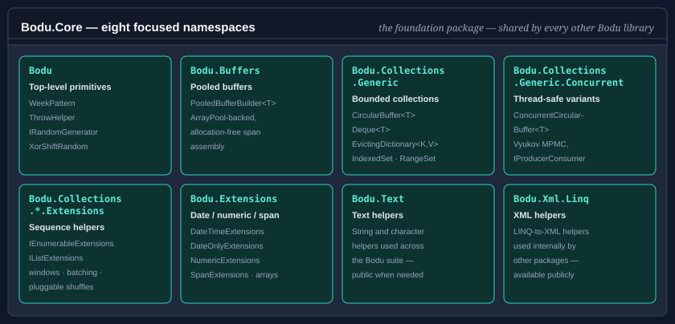

# Bodu.Core

**Bodu.Core** is the foundation package of the Bodu suite and of the **[Core Foundations](../topics/core-foundations.md)** topic — a collection of high-performance, framework-style building blocks for .NET applications. Every other Bodu package shares its primitives: `Bodu.Collections`, `Bodu.IO.Hashing`, `Bodu.Security.Cryptography`, `Bodu.Globalization.Calendar`, `Bodu.Numerics`, and `Bodu.Financial` all reference `Bodu.Core` for shared types like `ThrowHelper`, `WeekPattern`, the calendar-shape enums, and pooled buffers. See the [package matrix](../package-matrix.md) for the full dependency map.

> [!NOTE]
> The specialized generic-collection catalogue — `CircularBuffer<T>`, `Deque<T>`, `EvictingDictionary<TKey,TValue>`, the navigable and range-keyed types, graphs, tries, and the probabilistic sketches — ships in the companion **[Bodu.Collections](../collections/index.md)** package (namespaces unchanged; it depends on `Bodu.Core`), and the thread-safe variants ship in **[Bodu.Collections.Concurrent](../collections-concurrent/index.md)** (which depends on `Bodu.Collections`). This page covers what remains in `Bodu.Core` itself.

The library is organized around a family of focused namespaces, each with a clear responsibility.

## Namespaces and headline types

### `Bodu`
Top-level primitives that don't fit into a sub-namespace.

| Type | Purpose |
|---|---|
| <xref:Bodu.WeekPattern> | Immutable bitmask value type for sets of days of the week. Supports composition (`MTuW`), bitwise operators, parsing, and enumeration. |
| <xref:Bodu.IRandomGenerator> | Abstraction over random number generators — used by helpers (and the `Bodu.Collections` catalogue) that need pluggable randomness. |
| <xref:Bodu.XorShiftRandom> | Fast non-cryptographic xor-shift PRNG implementing `IRandomGenerator`. |
| <xref:Bodu.ThrowHelper> | Centralized parameter validation: `ThrowIfNull`, `ThrowIfOutOfRange`, `ThrowIfArrayLengthIsInsufficient`, `ThrowIfEnumValueIsUndefined`, and many more. Uses `[CallerArgumentExpression]` so call sites stay compact. |

### `Bodu.Buffers`
Pooled buffer infrastructure.

| Type | Purpose |
|---|---|
| <xref:Bodu.Buffers.PooledBufferBuilder`1> | `ArrayPool<T>`-backed builder for assembling byte or character spans without allocation. |

### `Bodu.Threading`
Async coordination primitives — the async-friendly peers of the BCL synchronization types. See the [Async coordination primitives](../../guides/core/async-primitives.md) guide and the <xref:Bodu.Threading> overview.

| Type | Purpose |
|---|---|
| <xref:Bodu.Threading.AsyncLock>, <xref:Bodu.Threading.AsyncSemaphore>, <xref:Bodu.Threading.AsyncReaderWriterLock> | Awaitable mutual-exclusion and bounded-concurrency gates. |
| <xref:Bodu.Threading.AsyncManualResetEvent>, <xref:Bodu.Threading.AsyncAutoResetEvent>, <xref:Bodu.Threading.AsyncCountdownEvent> | Awaitable signalling events. |
| <xref:Bodu.Threading.AsyncLazy`1>, <xref:Bodu.Threading.AsyncDebouncer>, <xref:Bodu.Threading.RateGate> | One-time async initialization, trailing-edge debouncing, and rate limiting. |

### `Bodu.Functional`
Functional helpers and railway primitives. See the [Memoization](../../guides/core/memoization.md) and [Options, results, and eithers](../../guides/core/functional-results.md) guides and the <xref:Bodu.Functional> overview.

| Type | Purpose |
|---|---|
| <xref:Bodu.Functional.Memoizer> | Wraps a pure function in a thread-safe caching delegate (single- and multi-argument). |
| <xref:Bodu.Functional.Option`1> | An optional value — `Some(value)` or `None` — with `Map` / `Bind` / `Filter` / `Match` combinators; `default` equals `None`. |
| <xref:Bodu.Functional.Result>, <xref:Bodu.Functional.Result`1> | Success-or-failure outcomes carrying a value or a <xref:Bodu.Functional.ResultError>; `default` is a failure with an empty error. |
| <xref:Bodu.Functional.ResultError> | The failure descriptor — optional code, never-null message, optional captured exception. |
| <xref:Bodu.Functional.Either`2> | A symmetric disjoint union with `MapLeft` / `MapRight` / `Match` / `Swap`; `default` is an explicit uninitialized state. |
| <xref:Bodu.Functional.OptionAsyncExtensions>, <xref:Bodu.Functional.ResultAsyncExtensions> | Task-based `MapAsync` / `BindAsync` / `MatchAsync` (and `TapAsync`) companions for async pipelines. |

### `Bodu.Collections.Extensions` and `Bodu.Collections.Generic.Extensions`
Sequence-shaping helpers that compose on top of `IEnumerable<T>` and `IList<T>`. These extension namespaces ship in `Bodu.Core`; the concrete collection types in the sibling `Bodu.Collections.*` namespaces ship in the [Bodu.Collections](../collections/index.md) package.

| Type | Purpose |
|---|---|
| <xref:Bodu.Collections.Extensions.IEnumerableExtensions>, <xref:Bodu.Collections.Generic.Extensions.IEnumerableExtensions> | Recursive selection, sliding windows, batched enumeration, and other sequence helpers. |
| <xref:Bodu.Collections.Generic.Extensions.IListExtensions>, <xref:Bodu.Collections.Generic.Extensions.SystemRandomAdapter>, <xref:Bodu.Collections.Generic.Extensions.RandomizationMode> | Pluggable randomness-driven shuffles backed by `IRandomGenerator`. |

### `Bodu.Extensions`
Date, numeric, span, and array extension methods. Larger surface than the others; the highlights:

| Type | Purpose |
|---|---|
| <xref:Bodu.Extensions.DateTimeExtensions> | First / last / next / previous day-of-week within month / quarter / year, ISO week-of-year, day name, weekday tests, midday, end-of-day, truncation. |
| <xref:Bodu.Extensions.DateOnlyExtensions> | `DateOnly`-specific equivalents plus `Age` calculation. |
| <xref:Bodu.Extensions.NumericExtensions> | `ReverseBits`, `RotateBitsLeft` / `Right`, `ReverseBytes`, `GetBytes` for unsigned integer types. |
| <xref:Bodu.Extensions.ArrayExtensions> | `Reverse`, `Clear`, and other in-place array helpers. |
| <xref:Bodu.Extensions.BufferConverter> | Byte / structure conversion helpers. |
| <xref:Bodu.Extensions.SpanExtensions> | Span-friendly helpers. |
| <xref:Bodu.Extensions.ComparableExtensions>, <xref:Bodu.Extensions.ComparableHelper> | `Min`, `Max`, `Clamp`, `IsGreaterThan` / `IsGreaterThanOrEqual`. |
| <xref:Bodu.Extensions.NaturalStringComparer> | Numeric-aware ("natural") string comparer — `file2` sorts before `file10` — with ordinal, case-insensitive, and culture-aware modes. See the [Natural string comparer](../../guides/core/natural-string-comparer.md) guide. |
| <xref:Bodu.Extensions.CalendarQuarterDefinition>, <xref:Bodu.WorkingDaysOfWeek>, <xref:Bodu.Extensions.IWeekendDefinitionProvider>, <xref:Bodu.Extensions.FiscalWeekPattern>, <xref:Bodu.Extensions.WeekOrdinal> | Calendar-shape enums and injection seams for quarter, weekend, fiscal-week, and week-ordinal computations. |

### `Bodu.Globalization.Extensions`
Culture-aware date / calendar helpers built on top of <xref:System.Globalization.DateTimeFormatInfo>.

| Type | Purpose |
|---|---|
| <xref:Bodu.Globalization.Extensions.DateTimeFormatInfoExtensions> | `FirstDayOfWeek`, `LastDayOfWeek`, weekend-aware helpers over `DateTimeFormatInfo`. |

### `Bodu.Text` and `Bodu.Xml.Linq`
Text and XML helpers used internally by the other Bodu packages; available publicly when you need them.

| Type | Purpose |
|---|---|
| <xref:Bodu.Text.Encoding.Base16>, <xref:Bodu.Text.Encoding.Base32>, <xref:Bodu.Text.Encoding.Base58>, <xref:Bodu.Text.Encoding.Base64>, <xref:Bodu.Text.Encoding.Base85> | Per-radix codec entry points over text or binary input. Ship in the companion `Bodu.Text.Encoding` package. |
| <xref:Bodu.Text.Encoding.BaseFormatStyles>, <xref:Bodu.Text.Encoding.BaseFormattingOptions> | Formatting-style and option flags consumed by every per-radix codec. |
| <xref:Bodu.Xml.Linq.XmlNamespaceResolver> | `IXmlNamespaceResolver` helper used by the calendar rule parsers. |

## Scenarios this library covers

| Scenario | Reach for |
|---|---|
| Day-of-week set you can union / intersect / parse | <xref:Bodu.WeekPattern> |
| Pooled byte / char buffer for zero-allocation building | <xref:Bodu.Buffers.PooledBufferBuilder`1> |
| Async mutual exclusion, signalling, debouncing, rate limiting | <xref:Bodu.Threading.AsyncLock>, <xref:Bodu.Threading.AsyncSemaphore>, <xref:Bodu.Threading.AsyncDebouncer>, <xref:Bodu.Threading.RateGate> |
| Optional values and success-or-failure outcomes without exceptions | <xref:Bodu.Functional.Option`1>, <xref:Bodu.Functional.Result`1>, <xref:Bodu.Functional.Either`2> |
| Caching a pure function's results | <xref:Bodu.Functional.Memoizer> |
| Date arithmetic — first Monday, ISO week-of-year, age | <xref:Bodu.Extensions.DateTimeExtensions>, <xref:Bodu.Extensions.DateOnlyExtensions> |
| Bit / byte rotation and reversal | <xref:Bodu.Extensions.NumericExtensions> |
| Sorting `file2` before `file10` | <xref:Bodu.Extensions.NaturalStringComparer> |
| Sliding windows, batching, recursive selection over sequences | <xref:Bodu.Collections.Extensions.IEnumerableExtensions>, <xref:Bodu.Collections.Generic.Extensions.IEnumerableExtensions> |
| Base16 / Base32 / Base58 / Base64 / Base85 encoding | <xref:Bodu.Text.Encoding.Base16>, <xref:Bodu.Text.Encoding.Base32>, <xref:Bodu.Text.Encoding.Base58>, <xref:Bodu.Text.Encoding.Base64>, <xref:Bodu.Text.Encoding.Base85> (in `Bodu.Text.Encoding`) |
| Centralized argument validation in your own code | <xref:Bodu.ThrowHelper> |
| Fixed-capacity, evicting, navigable, graph, trie, and sketch collections | The [Bodu.Collections](../collections/index.md) package |
| Thread-safe FIFO ring and unique set | The [Bodu.Collections.Concurrent](../collections-concurrent/index.md) package |

## Design principles

A handful of conventions run through the whole package; knowing them up front explains why the types look the way they do.

- **Validation flows through one helper.** Every public entry point validates its arguments through <xref:Bodu.ThrowHelper>, so exception type, message, and parameter-name capture stay uniform across the suite. `ThrowHelper` is also the primary dependency the other Bodu packages take on `Bodu.Core`.
- **Honest default values.** The railway primitives define what `default` means rather than leaving it undefined: `default(Option<T>)` is `None`, `default(Result<T>)` is a failure carrying an empty error, and `default(Either<L,R>)` is an explicit uninitialized state — a struct field that was never assigned is well-formed, never a landmine.
- **Async primitives are awaitable peers, not wrappers.** The `Bodu.Threading` types re-express the BCL synchronization vocabulary (`lock`, `SemaphoreSlim`, `ManualResetEvent`) as first-class awaitables, so coordination composes with `async`/`await` without thread blocking.
- **Pluggable randomness, never a global.** Helpers that need randomness accept an <xref:Bodu.IRandomGenerator> rather than reaching for a static <xref:System.Random>, so tests can inject a deterministic source. Neither shipped implementation is cryptographically secure.
- **Span-first surfaces.** The buffer builder, the `Bodu.Text` encoding helpers, and the extension surfaces prefer `Span<T>` / `ReadOnlySpan<T>` overloads with UTF-8 fast paths, so the common cases avoid intermediate allocations.

## Where to go next

- **[Core concepts](concepts.md)** — glossary the rest of the documentation assumes.
- **[Getting started](getting-started.md)** — install the package and run a minimal sample for each scenario above.
- **[Core Foundations guides](../../guides/core/index.md)** — recipe-style walk-throughs for the headline types.
- **[Bodu.Collections introduction](../collections/index.md)** — the specialized collection catalogue that builds on this package.
- **[Bodu.Collections.Concurrent introduction](../collections-concurrent/index.md)** — the thread-safe collection companion.
- **[Project introduction](../introduction.md)** — how Bodu.Core relates to the hashing, cryptography, calendar, and text libraries (its `ThrowHelper` underpins them all).
- **[Core Foundations topic](../topics/core-foundations.md)** — Bodu.Core alongside its sibling members, the collection packages and the `Bodu.Text` namespace utilities.
