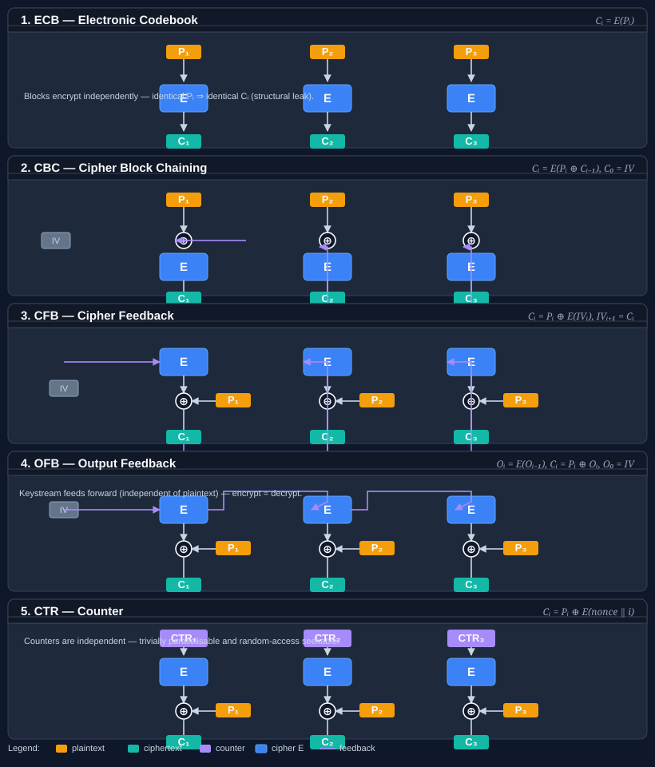
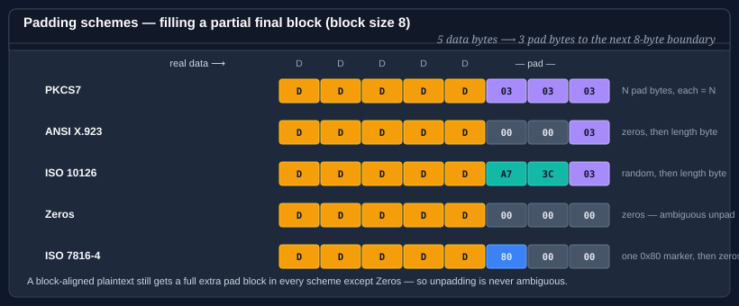
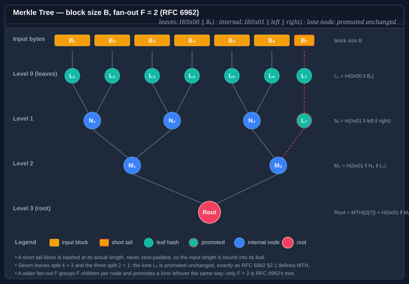

# Bodu.Security.Cryptography — Core concepts

This page is the vocabulary the rest of the documentation assumes. Read it once before the [getting-started samples](getting-started.md) or the [guides](../../guides/cryptography/index.md), and refer back whenever a term feels imprecise.

Part of the **[Hashing & Cryptography](../topics/hashing-and-cryptography.md)** topic.

For the high-level shape of the library, the algorithm taxonomy, and the I/O model, start with the [introduction](index.md).

## Adversary model

Every algorithm in this library meets a formal **adversary model**: it must be computationally infeasible for an attacker — even one who knows the algorithm, observes many inputs and outputs, and chooses inputs adaptively — to forge a tag, invert a digest, or find a colliding pair. This is the load-bearing contract that separates `Bodu.Security.Cryptography` from [Bodu.IO.Hashing](../io-hashing/index.md). The latter ships fingerprints and checksums (CRC, Fletcher, Adler, FNV, CityHash) that carry *no* adversary model and must never be used where an attacker can choose the input.

## Confidentiality, integrity, authenticity

Three independent security properties; each primitive provides a different subset:

| Property | What it guarantees | Provided by |
|---|---|---|
| **Confidentiality** | An attacker cannot recover plaintext from ciphertext without the key. | Block cipher in a confidentiality mode, stream cipher, AEAD. |
| **Integrity** | Any modification of the protected message is detected. | Cryptographic hash (over a known input), MAC, AEAD. |
| **Authenticity** | The message came from a holder of the key. | MAC, AEAD. |

A raw cipher protects confidentiality only — a flipped ciphertext byte still decrypts, just to corrupted plaintext. Combine encrypt-then-MAC, or use an AEAD construction, to get all three in one pass.

## Cryptographic hash vs. keyed hash vs. cipher

Three structural roles, easy to confuse:

- **Cryptographic hash** — keyless, one-way. Compresses arbitrary input to a fixed (or extendable) digest with pre-image, second-pre-image, and collision resistance. Use for content addressing, integrity over a known input, and signature inputs. Provides integrity **only when the digest itself is transmitted via an authenticated channel**.
- **Keyed hash / MAC** — secret key plus message yields an authentication tag no one can forge without the key. Provides integrity *and* authenticity, not confidentiality.
- **Cipher** — reversible transformation under a key. Provides confidentiality. By itself a cipher does **not** provide integrity or authenticity; pair it with a MAC or use AEAD.

> Both keyed hashes and ciphers take a key, but they serve opposite purposes — a cipher transforms plaintext to ciphertext and back without summarising; a MAC summarises a message into a fixed-size tag without encrypting.

## Block cipher

A **block cipher** is a keyed permutation over a fixed-size block — Camellia, Twofish, and Serpent operate on 128-bit blocks; Threefish on 256, 512, or 1024 bits; Blowfish and Skipjack on 64 bits. The cipher itself is a pure primitive: it encrypts exactly one block to exactly one block. To encrypt a message longer than one block, or shorter, or of an unaligned length, the cipher must be combined with a **mode of operation** (which sequences the calls) and usually a **padding scheme** (which aligns the final block).

Bodu exposes the raw primitive via <xref:Bodu.Security.Cryptography.IBlockCipher>; the `SymmetricAlgorithm`-derived facades (<xref:Bodu.Security.Cryptography.Camellia>, <xref:Bodu.Security.Cryptography.Twofish>, <xref:Bodu.Security.Cryptography.Threefish512>, …) compose a block cipher with a mode and padding.

## Stream cipher

A **stream cipher** generates a deterministic **keystream** from a key and a nonce, then XORs the keystream over the data. The output has the same length as the input — no padding, no block alignment. ChaCha20, XChaCha20, Salsa20, XSalsa20, Rabbit, and Hc128 are stream ciphers in this library.

Two consequences follow from the XOR construction: stream ciphers are **self-inverse** (encrypt and decrypt are the same operation), and they provide **raw confidentiality only** — there is no integrity check, and reusing a `(key, nonce)` pair leaks the XOR of two plaintexts. Always pair a stream cipher with a MAC (e.g. <xref:Bodu.Security.Cryptography.Poly1305>), or prefer an AEAD construction when integrity matters.

The base class for these algorithms is <xref:Bodu.Security.Cryptography.SymmetricStreamAlgorithm> — a `SymmetricAlgorithm` with no block mode or padding.

## Mode of operation

A **mode of operation** turns a one-block-at-a-time block cipher into something that can encrypt arbitrary-length messages. The mode sequences the cipher calls, threads state between them, and decides how plaintext blocks combine with the cipher output.

| Mode | Distinguishing property |
|---|---|
| **ECB** | Each block encrypted independently. Identical plaintext blocks produce identical ciphertext — leaks structure; rarely the right choice. |
| **CBC** | Each plaintext block XORed with the previous ciphertext block before encryption. Requires an unpredictable IV; serial encrypt, parallel decrypt. |
| **CFB** | Cipher output XORed into the plaintext, then fed back. Self-synchronising; serial. |
| **OFB** | Cipher iterates on itself to produce a keystream; XORed over plaintext. Parallel after keystream generated; bit-flip propagates one-to-one. |
| **CTR** | Cipher applied to an incrementing counter to produce a keystream. Fully parallel; nonce-uniqueness critical. |

<xref:Bodu.Security.Cryptography.CipherModeKind> enumerates the available modes (`ECB`, `CBC`, `CFB`, `OFB`, `CTR`, `CTS`, `XTS`); the standard `SymmetricAlgorithm` facades expose mode selection via the `BlockMode` property. See the [cipher modes guide](../../guides/cryptography/cipher-modes.md) for a per-mode walk-through with diagrams.

## Padding

Block-cipher modes that consume whole blocks (`ECB`, `CBC`) need a **padding scheme** to align a partial final block to the block boundary. Each scheme defines a byte pattern the decryptor can reliably strip on the way out.

| Scheme | Type | Final-block bytes |
|---|---|---|
| <xref:Bodu.Security.Cryptography.Pkcs7Padding> | `PKCS7` | `n` bytes, each equal to `n` (the pad length). |
| <xref:Bodu.Security.Cryptography.Ansix923Padding> | `ANSIX923` | `n-1` zero bytes followed by `n`. |
| <xref:Bodu.Security.Cryptography.Iso10126Padding> | `ISO10126` | `n-1` random bytes followed by `n`. |
| <xref:Bodu.Security.Cryptography.ZeroPadding> | `Zeros` | All zero bytes — length not encoded; only safe for fixed-length records. |
| <xref:Bodu.Security.Cryptography.Iso7816_4Padding> | `ISO7816_4` | A single `0x80` followed by zero bytes. |
| <xref:Bodu.Security.Cryptography.NoPadding> | `None` | Input must already be a block-aligned multiple. |

<xref:Bodu.Security.Cryptography.PaddingModeKind> mirrors `System.Security.Cryptography.PaddingMode` and adds `ISO7816_4`. Selection is via the `BlockPadding` property on the `SymmetricAlgorithm` facade or via <xref:Bodu.Security.Cryptography.PaddingFactory>. See the [padding guide](../../guides/cryptography/padding.md).

## Initialization vector (IV) and nonce

Both are public, single-use inputs to a cipher; the distinction is what *uniqueness* and *unpredictability* they demand.

- An **initialization vector (IV)** is the per-message starting state of a feedback mode (CBC, CFB, OFB). It must be **unpredictable** — choose it uniformly at random per message — because predictable IVs in CBC enable chosen-plaintext attacks.
- A **nonce** ("number used once") is the per-message public input to a counter mode (CTR), an AEAD construction (GCM, CCM, OCB, EAX), or a stream cipher (ChaCha20, Salsa20). It must be **unique** within the lifetime of the key. It does *not* need to be unpredictable; a counter is acceptable.

In the BCL surface both appear on the `IV` property; the contract of the algorithm dictates which requirement applies. The extended-nonce stream ciphers (<xref:Bodu.Security.Cryptography.XChaCha20>, <xref:Bodu.Security.Cryptography.XSalsa20>) widen the nonce to 192 bits so a random nonce per message is safe; the originals (96-bit ChaCha20, 64-bit Salsa20) need either a counter or a much tighter key-rotation policy.

## AEAD (Authenticated Encryption with Associated Data)

**AEAD** is a single primitive that provides confidentiality, integrity, and authenticity in one pass — encrypt-then-authenticate, with the authentication tag produced as part of the same operation that produces the ciphertext.

The inputs are a key, a nonce, the plaintext, and optional **associated data (AAD)** — headers or framing that must be authenticated but not encrypted. The output is the ciphertext (same length as the plaintext) and an authentication **tag**.

The decrypt operation takes the same key, nonce, ciphertext, AAD, and tag, and returns either the plaintext or a tag-mismatch failure — there is no "decrypt and check tag separately" path that can be mis-sequenced.

Bodu exposes AEAD two ways:

- **<xref:Bodu.Security.Cryptography.AsconAead128>** — a complete AEAD primitive (NIST SP 800-232) that does not use a separate block cipher.
- **AEAD mode transforms** over an <xref:Bodu.Security.Cryptography.IBlockCipher> — pair AES (via <xref:Bodu.Security.Cryptography.AesBlockCipher>) with <xref:Bodu.Security.Cryptography.GcmModeTransform>, <xref:Bodu.Security.Cryptography.CcmModeTransform>, <xref:Bodu.Security.Cryptography.OcbModeTransform>, <xref:Bodu.Security.Cryptography.EaxModeTransform>, <xref:Bodu.Security.Cryptography.SivModeTransform>, or <xref:Bodu.Security.Cryptography.GcmSivModeTransform>. The contract these implement is <xref:Bodu.Security.Cryptography.IAeadBlockCipherModeTransform>.

See the [AEAD modes guide](../../guides/cryptography/aead-modes.md) for the per-mode contract and per-message lifecycle.

## Tag

An **authentication tag** is the fixed-length output a MAC or AEAD construction emits alongside (or instead of) the ciphertext. The decrypt / verify operation recomputes the tag and compares in constant time; any modification of the ciphertext, AAD, key, or nonce produces a mismatch and a verification failure.

Tag length is a security parameter: GCM tags are typically 128 bits; truncating to 64 or 96 bits weakens the forgery bound proportionally. Bodu's AEAD transforms expose tag length on a per-transform basis — prefer the maximum the algorithm offers unless interoperating with a fixed wire format.

## Tweakable cipher

A **tweakable block cipher** takes an extra public input — the **tweak** — alongside the key, and produces a different permutation for each tweak value. The tweak is *not* a secret; its purpose is **domain separation without re-keying**.

The canonical example is XTS-mode disk encryption, where each disk sector encrypts under the same key but a different tweak (the sector number), so identical plaintext written to two different sectors produces different ciphertext, and a sector cannot be moved without detection.

Bodu's tweakable surface is <xref:Bodu.Security.Cryptography.TweakableSymmetricAlgorithm>, which extends `SymmetricAlgorithm` with `Tweak` and `GenerateTweak()`. The Threefish family (<xref:Bodu.Security.Cryptography.Threefish256>, <xref:Bodu.Security.Cryptography.Threefish512>, <xref:Bodu.Security.Cryptography.Threefish1024>) is the headline tweakable cipher.

## Cryptographic-hash output shapes

Cryptographic digests in this library come in three structural shapes:

- **Plain digest** — fixed-length output. <xref:Bodu.Security.Cryptography.Tiger>, <xref:Bodu.Security.Cryptography.Whirlpool>, <xref:Bodu.Security.Cryptography.Skein256> / <xref:Bodu.Security.Cryptography.Skein512> / <xref:Bodu.Security.Cryptography.Skein1024>, <xref:Bodu.Security.Cryptography.Blake2b> / <xref:Bodu.Security.Cryptography.Blake2s>, <xref:Bodu.Security.Cryptography.CubeHash>, <xref:Bodu.Security.Cryptography.Snefru128> / <xref:Bodu.Security.Cryptography.Snefru256>, <xref:Bodu.Security.Cryptography.AsconHash256> / <xref:Bodu.Security.Cryptography.AsconHashA256>.
- **Extendable-output function (XOF)** — caller chooses the output length at finalize time. <xref:Bodu.Security.Cryptography.Shake>, <xref:Bodu.Security.Cryptography.AsconXof128>, <xref:Bodu.Security.Cryptography.AsconCxof128>, and <xref:Bodu.Security.Cryptography.Blake3> when used in XOF mode.
- **Tree** — input split into leaves, leaves hashed in parallel, levels reduced to a root. <xref:Bodu.Security.Cryptography.Blake3> uses an internal tree; <xref:Bodu.Security.Cryptography.MerkleTreeHash> / <xref:Bodu.Security.Cryptography.ParallelMerkleTreeHash> expose an explicit tree over any inner `HashAlgorithm`.

## MAC vs. one-time authenticator

Both are keyed hashes that emit an authentication tag — the difference is **how many messages a single key can safely authenticate**.

- A **MAC** (message authentication code) is a pseudorandom function: one key can authenticate many messages. <xref:Bodu.Security.Cryptography.SipHash64> and <xref:Bodu.Security.Cryptography.SipHash128> are MACs in this sense — bind the key once, call `ComputeHash` over each message.
- A **one-time authenticator** must use a fresh key for every message. <xref:Bodu.Security.Cryptography.Poly1305> is a one-time authenticator: it is provably secure when the key is used exactly once, and trivially broken if the same key authenticates two different messages.

The distinction matters because Poly1305 is normally paired with ChaCha20 (or an equivalent stream cipher) precisely so the cipher can derive a per-message one-time Poly1305 key from `(K, nonce)`. Never reach for Poly1305 with a long-lived key — use SipHash or an AEAD construction.

## Sponge construction

A **sponge** is an alternative to the Merkle–Damgård design used by classical digests. It maintains a fixed-size internal state and alternates two phases: **absorb** (XOR input blocks into the rate portion of the state, permute) and **squeeze** (read output blocks from the rate, permute). The same construction can be tuned to produce a fixed digest, an XOF, or an AEAD by adjusting the rate, capacity, and absorb / squeeze schedule.

The ASCON family (NIST SP 800-232) is sponge-based, which is why <xref:Bodu.Security.Cryptography.AsconHash256>, <xref:Bodu.Security.Cryptography.AsconXof128>, and <xref:Bodu.Security.Cryptography.AsconAead128> all share a single permutation and a single set of correctness arguments.

## Merkle tree

A **Merkle tree** is a hash construction that produces a single root digest covering many leaves, and also provides **verifiable inclusion proofs**: given the root and a logarithmically sized sibling path, anyone can verify that a specific leaf participated in the tree.

Input is split into fixed-size **leaves**; each leaf is hashed; pairs of digests are concatenated and re-hashed at each level until a single root remains. **Fan-out** is the number of children per internal node (typically 2). Bodu's <xref:Bodu.Security.Cryptography.MerkleTreeHash> wraps any inner `HashAlgorithm` (SHA-256, Blake2b, …) as the leaf / node compressor; <xref:Bodu.Security.Cryptography.ParallelMerkleTreeHash> processes leaves concurrently for high-throughput hashing of large inputs.

See the [Merkle trees guide](../../guides/cryptography/merkle-trees.md) for the inclusion-proof protocol and the parallel construction.

## Public-key (asymmetric) cryptography

Everything above uses a **single secret key** shared by both parties. **Public-key** (asymmetric) primitives instead use a **key pair**: a *public key* that can be published freely and a *private key* that never leaves its owner. This splits cleanly into three roles:

- **Signature** — the holder of the private key signs a message; anyone with the public key verifies it. Provides integrity and authenticity *without* a shared secret. <xref:Bodu.Security.Cryptography.Ed25519> is the classical scheme (RFC 8032); <xref:Bodu.Security.Cryptography.MLDsa65> is its post-quantum counterpart (FIPS 204).
- **Key agreement** — two parties exchange public keys and each derives the *same* shared secret, which is never transmitted. <xref:Bodu.Security.Cryptography.X25519> is the elliptic-curve Diffie-Hellman function (RFC 7748).
- **Key encapsulation (KEM)** — the sender generates a fresh secret and encapsulates it to the recipient's public key, transmitting a ciphertext the recipient decapsulates back to the same secret. <xref:Bodu.Security.Cryptography.MLKem768> is the post-quantum module-lattice KEM (FIPS 203).

The post-quantum schemes (ML-DSA, ML-KEM) defend against the **"harvest now, decrypt later"** threat: an adversary who records today's traffic could decrypt it once a large-scale quantum computer exists. Data with a long confidentiality horizon should be protected with a post-quantum (or hybrid) scheme now, even though no such computer exists yet.

These primitives produce and consume **raw key encodings only** — the fixed-length byte arrays defined by their standards. PKCS#8 / SPKI (DER / PEM) container formats are deliberately not implemented.

## Hybrid public-key encryption (HPKE)

A KEM establishes a *secret*, not an encrypted *message*. **HPKE** (Hybrid Public Key Encryption, RFC 9180) composes the three building blocks — a KEM, a KDF, and an AEAD — into a single "seal this payload so only the holder of a given public key can read it" operation. The sender needs only the recipient's public key; the output is an **encapsulated key** plus an AEAD ciphertext and tag. <xref:Bodu.Security.Cryptography.Hpke> implements the base mode; <xref:Bodu.Security.Cryptography.HpkeSuite> selects the KEM / KDF / AEAD combination. It is the encryption layer beneath TLS Encrypted Client Hello, MLS, and Oblivious HTTP.

## Key derivation and password hashing

A **key-derivation function (KDF)** turns one secret into usable key material. The right KDF depends entirely on the *entropy* of the input:

- **High-entropy input** — a Diffie-Hellman shared secret, a KEM output, a master key. Use an **extract-and-expand KDF**: <xref:Bodu.Security.Cryptography.Hkdf> (RFC 5869) stretches it into one or more context-bound keys, each labelled with application-specific `info`. HKDF is fast *by design* and must never be fed a password.
- **Low-entropy input** — a human-chosen password. Use a **memory-hard password hash**: <xref:Bodu.Security.Cryptography.Argon2id> (RFC 9106, the current recommendation) or <xref:Bodu.Security.Cryptography.Scrypt> (RFC 7914). These are deliberately *slow and memory-hungry* so that offline guessing on custom hardware (GPUs, FPGAs, ASICs) is expensive. Always combine with a per-password salt.

Reaching for the wrong one is a security bug: an HKDF over a raw password offers almost no protection against guessing, and a memory-hard hash over a high-entropy secret only wastes resources.

## BCL surface

Every primitive plugs into the standard BCL contracts so existing crypto code adopts these types without changes:

- <xref:System.Security.Cryptography.SymmetricAlgorithm?displayProperty=nameWithType> — base class for block ciphers, tweakable ciphers, and stream ciphers. Lifecycle: configure `Key`, `IV`, mode and padding; call `CreateEncryptor()` / `CreateDecryptor()` or the Bodu `Encrypt` / `Decrypt` extension methods.
- <xref:System.Security.Cryptography.HashAlgorithm?displayProperty=nameWithType> — base class for cryptographic digests and XOFs. Lifecycle: `Append` / `TransformBlock`, then `GetHashAndReset()` (or BCL `ComputeHash`).
- <xref:System.Security.Cryptography.KeyedHashAlgorithm?displayProperty=nameWithType> — base class for MACs (SipHash, Poly1305); a `HashAlgorithm` with a required `Key` property.
- <xref:System.Security.Cryptography.AsymmetricAlgorithm?displayProperty=nameWithType> — base class for the public-key schemes (Ed25519, X25519, ML-KEM, ML-DSA). Lifecycle: `Create()`, `GenerateKey()`, export the public half, then sign / verify, agree, or encapsulate. These types work in **raw key encodings only** — PKCS#8 / SPKI (DER / PEM) are deliberately not implemented.

Bodu extends the BCL surface in two places:

- <xref:Bodu.Security.Cryptography.IBlockCipher> — a one-block-at-a-time primitive contract, implemented by every block cipher in the library *and* by <xref:Bodu.Security.Cryptography.AesBlockCipher> (the bridge that lets AES feed the AEAD mode transforms).
- <xref:Bodu.Security.Cryptography.TweakableSymmetricAlgorithm> — extends `SymmetricAlgorithm` with `Tweak` and `GenerateTweak()` for the Threefish family.

## Key size and block size

- **Key size** is reported via `SymmetricAlgorithm.LegalKeySizes` and selected via `KeySize` (bits). The Bodu facades expose only the legal sizes their algorithm supports — e.g. Camellia accepts 128 / 192 / 256, ChaCha20 accepts 256, Threefish-512 accepts only 512.
- **Block size** is reported via `BlockSize` (bits). Block-cipher facades expose the algorithm's native size; stream ciphers report a nominal value but do not gate input length.

Generate keys, IVs, nonces, and tweaks via the BCL-style `GenerateKey()` / `GenerateIV()` methods on the facade (and `GenerateTweak()` on tweakable algorithms), or via `System.Security.Cryptography.RandomNumberGenerator.GetBytes`.

## Disposable and single-use

Every algorithm facade implements `IDisposable` and zeroes its sensitive state — keys, IVs, nonces, tweaks, sponge state — on disposal. Always `using` an algorithm instance.

The `ICryptoTransform` objects returned from `CreateEncryptor()` / `CreateDecryptor()` (and the AEAD mode transforms) are **single-use per message**. They carry internal state that finalises in `TransformFinalBlock` (or in the encrypt / decrypt call on an AEAD transform); calling them again after finalisation is undefined. The samples in [getting started](getting-started.md) construct a fresh transform on the encrypt side and another on the decrypt side — this is the contract, not over-cautious code.

## Where to go next

- **[Introduction](index.md)** — namespaces, algorithm taxonomy, the I/O model, scenarios.
- **[Getting started](getting-started.md)** — install + minimal sample for each subfamily.
- **[Bodu.Security.Cryptography guides](../../guides/cryptography/index.md)** — deep-dive walk-throughs for cipher modes, padding, AEAD, hashing, Merkle trees.
- **For non-cryptographic checksums and fingerprints** (CRC, Fletcher, Adler, FNV, CityHash), see [Bodu.IO.Hashing](../io-hashing/index.md).
- **[Hashing & Cryptography topic](../topics/hashing-and-cryptography.md)** — this package and its sibling Bodu.IO.Hashing; the [topic concepts](../topics/hashing-and-cryptography-concepts.md) page collects the shared vocabulary.
