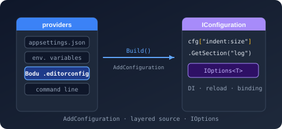
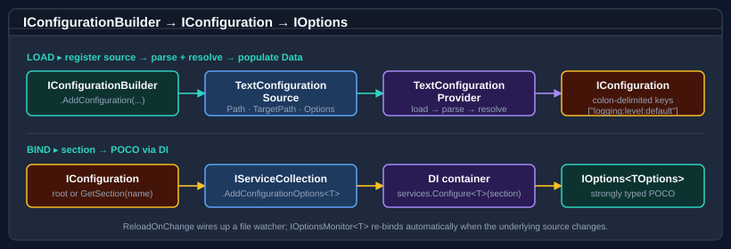

# Bodu.Extensions.Configuration.Text



**Bodu.Extensions.Configuration.Text** is the bridge between
[`Bodu.Text.Configuration`](../text-configuration/index.md) and `Microsoft.Extensions.Configuration`, and one half of
the **[Configuration](../topics/configuration.md)** topic. It exposes a
single conventional entry point — `IConfigurationBuilder.AddTextConfigurationFile(...)` — that adds a Bodu Text
Configuration file (or stream, or pre-parsed document) as a configuration source alongside JSON, INI, XML, and
environment variables.

The overload set deliberately mirrors `Microsoft.Extensions.Configuration.Json`'s `AddJsonFile` / `AddJsonStream`
shape, so consumers familiar with the JSON provider can swap in this provider without learning a new API. A second,
read-only TOML bridge (`AddTomlFile` / `AddTomlStream`) layers [`Bodu.Text.Toml`](../serialization/toml/index.md)
through the same pipeline, and a third, read-only Bencode bridge (`AddBencodeFile` / `AddBencodeStream`) does the
same for [`Bodu.Text.Bencode`](../serialization/bencode/index.md). Once added, keys are exposed in the canonical
colon-delimited form that `IConfiguration` consumes:

```csharp
configuration["logging:level:default"]   // "Warning"
configuration.GetSection("service")      // a child section that binds to your POCO
```

## Core mental model



The provider is a thin host around `Bodu.Text.Configuration`. The builder creates a
<xref:Bodu.Extensions.Configuration.Text.TextConfigurationSource> (or its stream-only sibling
<xref:Bodu.Extensions.Configuration.Text.TextStreamConfigurationSource>); the source's `Build` method instantiates
a <xref:Bodu.Extensions.Configuration.Text.TextConfigurationProvider>; the provider loads the file, parses it with
the supplied
<xref:Bodu.Text.Configuration.ConfigurationParseOptions>, resolves it for the source's `TargetPath` using the
supplied <xref:Bodu.Text.Configuration.ConfigurationResolveOptions>, and copies the resolved view into
`IConfiguration.Data` as colon-delimited keys. The DI extensions (`AddConfigurationOptions<T>`) bind a named
section to an `IOptions<T>` instance.

```
IConfigurationBuilder
  ▶ AddTextConfiguration{File|Stream|Document}(path | stream | document, …)
  ▶ TextConfigurationSource ▶ Build()
  ▶ TextConfigurationProvider.Load()
  ▶ Parse + Resolve via Bodu.Text.Configuration
  ▶ IConfiguration["key:subkey"]
  ▶ services.AddConfigurationOptions<TOptions>(config, "section")
  ▶ IOptions<TOptions>
```

## The shape of the library

Everything lives in the `Bodu.Extensions.Configuration.Text` namespace.

### Builder extensions

*The primary entry point. Mirrors `AddJsonFile` / `AddJsonStream` exactly so call sites stay familiar.*

| Type | Purpose |
|---|---|
| <xref:Bodu.Extensions.Configuration.Text.TextConfigurationExtensions> | Static class. The `AddTextConfiguration*` overload family: file path, file path + file provider, configure callback, conventional probe (`.boduconfig` → `bodu.config`), stream, and pre-parsed <xref:Bodu.Text.Configuration.IniDocumentBase>. |
| <xref:Bodu.Extensions.Configuration.Text.TomlConfigurationExtensions> | Static class. The read-only TOML bridge: `AddTomlFile(path, optional)` and `AddTomlStream(stream)`. Read-once, read-only, no reload-on-change. |
| <xref:Bodu.Extensions.Configuration.Text.BencodeConfigurationExtensions> | Static class. The read-only Bencode bridge: `AddBencodeFile(path, optional)` and `AddBencodeStream(stream)`. Read-once, read-only, dictionary-rooted documents only. |

### Sources and providers

*The plumbing — typically not constructed directly. Use the builder extensions instead.*

| Type | Purpose |
|---|---|
| <xref:Bodu.Extensions.Configuration.Text.TextConfigurationSource> | `FileConfigurationSource` subclass. Inherits `Path`, `Optional`, `ReloadOnChange`, `FileProvider`; adds `TargetPath`, `ParseOptions`, `ResolveOptions`. |
| <xref:Bodu.Extensions.Configuration.Text.TextConfigurationProvider> | `FileConfigurationProvider` subclass. Reads the file via the standard MEC pipeline and projects the resolved view into `Data`. |
| <xref:Bodu.Extensions.Configuration.Text.TextStreamConfigurationSource> | `StreamConfigurationSource` subclass. One-shot: no reload-on-change. |
| <xref:Bodu.Extensions.Configuration.Text.TextStreamConfigurationProvider> | The matching stream provider. |
| <xref:Bodu.Extensions.Configuration.Text.TextConfigurationLoader> | Internal helper that parses + resolves a stream into a flat key/value dictionary; reused by both `Text*` providers. |
| <xref:Bodu.Extensions.Configuration.Text.TomlConfigurationSource> | `FileConfigurationSource`-shaped source for TOML. Carries `Path`, `Optional`, `Stream`. Read-only — no `ReloadOnChange`. |
| <xref:Bodu.Extensions.Configuration.Text.TomlConfigurationProvider> | The matching TOML provider. Flattens the TOML table hierarchy into colon-delimited keys. |

### Options binding

*Thin shims over `services.Configure<TOptions>(...)` — there for discoverability.*

| Type | Purpose |
|---|---|
| <xref:Bodu.Extensions.Configuration.Text.ConfigurationOptionsExtensions> | Static class. `AddConfigurationOptions<TOptions>(services, configuration, sectionName)` and the section overload `AddConfigurationOptions<TOptions>(services, IConfigurationSection)`. |

## Common scenarios

| Scenario | Reach for |
|---|---|
| Add a `.boduconfig` file to the builder | `builder.AddTextConfigurationFile(".boduconfig")` |
| Conventional probe — try `.boduconfig` then `bodu.config` | `builder.AddTextConfiguration()` (no-arg) |
| Anchor glob resolution to a specific source path | `builder.AddTextConfigurationFile("appsettings.bodu", targetPath: "src/Foo.cs")` |
| Optional file — do not throw if missing | `builder.AddTextConfigurationFile("appsettings.bodu", optional: true)` |
| Reload-on-change | `builder.AddTextConfigurationFile("appsettings.bodu", reloadOnChange: true)` |
| Use a specific `IFileProvider` | `builder.AddTextConfigurationFile(physicalFileProvider, "appsettings.bodu")` |
| Read from a stream (test fixtures, embedded resources) | `builder.AddTextConfigurationStream(stream)` |
| Wire up everything via a configure callback | `builder.AddTextConfigurationFile(src => { src.Path = …; src.TargetPath = …; src.ReloadOnChange = true; })` |
| Bind a section to an options class | `services.AddConfigurationOptions<MyOptions>(configuration, "service")` |
| Pre-parsed document (already loaded elsewhere) | `builder.AddTextConfigurationDocument(document, targetPath: …)` |
| Add a read-only TOML file | `builder.AddTomlFile("appsettings.toml", optional: true)` |
| Add a read-only TOML stream | `builder.AddTomlStream(stream)` |
| Add a read-only Bencode file | `builder.AddBencodeFile("appsettings.bencode", optional: true)` |
| Add a read-only Bencode stream | `builder.AddBencodeStream(stream)` |

## Conventional file probe

The no-argument overload probes the builder's base path for two conventional names:

| Order | File name |
|---|---|
| 1 | `.boduconfig` |
| 2 | `bodu.config` |

The first file found is added as a configuration source. When neither is present and `optional` is `true`, the call is
a no-op; when `optional` is `false`, the source surfaces as missing per the standard `FileConfigurationProvider`
contract.

## Reload-on-change

`TextConfigurationSource` inherits the `ReloadOnChange` property from `FileConfigurationSource`. When `true`, the
provider attaches a file watcher through the configured `IFileProvider`; any change to the underlying file triggers
a reparse + reload, and any reload tokens issued through `IConfiguration` fire.

`TextStreamConfigurationSource` does **not** support reload-on-change — it parses the stream once when `Build` is
called, and the stream lifetime ends with that parse. For dynamic stream-backed inputs, rebuild the configuration.

The TOML and Bencode bridges (`AddTomlFile` / `AddTomlStream`, `AddBencodeFile` / `AddBencodeStream`) are read-once
and read-only by design — they attach no file watcher even for the file overloads, so there is no `reloadOnChange`
parameter on any of the four methods.

## How keys are projected

The provider hands its parsed document to the resolver and copies the resulting
<xref:Bodu.Text.Configuration.ConfigurationView> into the inherited `Data` dictionary. Under the default
<xref:Bodu.Text.Configuration.ConfigurationKeyOptions.Default> key options, the
<xref:Bodu.Text.Configuration.ConfigurationKeyMapping.DotToColon> mapping rewrites dotted file keys to the colon
delimiter `IConfiguration` expects — `logging.level.default` becomes `logging:level:default`. Keys are stored under
`StringComparer.OrdinalIgnoreCase`, matching the JSON and INI providers, so `configuration["Logging:Level"]` and
`configuration["logging:level"]` resolve to the same value.

The projection is intentionally lossy relative to the richer document model. Comments, source locations
(line/column/path), and duplicate-section provenance are preserved on the parsed
<xref:Bodu.Text.Configuration.ConfigurationDocument> but discarded during the flatten. A literal colon inside a key
segment cannot survive — once flattened, the colon is the hierarchy delimiter. Consumers who need any of that metadata
should depend on <xref:Bodu.Text.Configuration.ConfigurationDocument> directly rather than going through the bridge.

## Where to go next

- **[Core concepts](concepts.md)** — vocabulary: source vs provider, target path, parse / resolve option propagation, reload-on-change, options binding.
- **[Getting started](getting-started.md)** — install + minimal samples for the file overload, the stream overload, conventional probe, options binding.
- **[Bodu.Extensions.Configuration.Text guides](../../guides/extensions-configuration-text/index.md)** — worked patterns, including [configuration sources](../../guides/extensions-configuration-text/configuration-sources.md).
- **[Bodu.Text.Configuration](../text-configuration/index.md)** — the underlying parser, resolver, and view model.
- **[Bodu.Extensions.Configuration.Text API reference](xref:Bodu.Extensions.Configuration.Text)** — full type-by-type docs.
- **[Configuration topic](../topics/configuration.md)** — this package and its sibling Bodu.Text.Configuration side by side.
