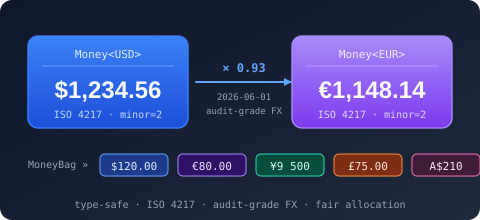
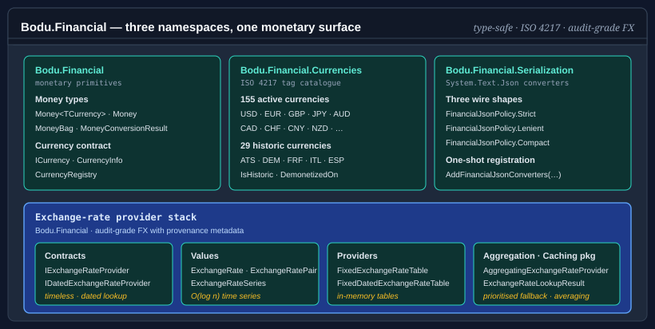

# Bodu.Financial



**Bodu.Financial** is the monetary-primitives package of the Bodu suite. It ships type-parameter-tagged and runtime-tagged money types, a shipped catalogue of 184 ISO 4217 currencies (155 active and 29 historic), an exchange-rate provider stack with both timeless and dated lookup, and JSON converters with three policy shapes for ledger-style, lenient-import, and compact-wire integrations. Part of the **[Numerics & Financial](../topics/numerics-and-financial.md)** topic.

The package depends on `Bodu.Numerics` so `Money<TCurrency>` can round-trip through `Fraction<BigInteger>` for sub-minor-unit-precise intermediate calculations — interest accumulation, percentage-of-percentage, and other chains where deferred rounding matters.



## Namespaces and headline types

### `Bodu.Financial`

| Type | Purpose |
|---|---|
| <xref:Bodu.Financial.Money`1> | Immutable, value-equatable monetary amount whose currency is encoded as the type parameter. Cross-currency arithmetic fails the build, not at runtime. |
| <xref:Bodu.Financial.Money> | Runtime-tagged sister type — currency carried as a <xref:Bodu.Financial.Currencies.CurrencyCode>. The fallback when the currency is data rather than type, e.g. deserialisation or generic invoicing. |
| <xref:Bodu.Financial.MoneyBag> | Immutable mixed-currency portfolio. Aggregates per-ISO balances, prunes zero balances, enumerates in lexicographic ISO order. |
| <xref:Bodu.Financial.CurrencyDisplay> | Currency symbol / display-name formatting for presenting an amount's currency. |
| <xref:Bodu.Financial.MoneyConversionResult`2> | Audit record returned by extension methods that convert through a dated provider — pairs source and target amount with the full lookup result. |

### `Bodu.Financial.Currencies`

All currency metadata lives in this namespace — the runtime lookup surface alongside the tag catalogue:

| Type | Purpose |
|---|---|
| <xref:Bodu.Financial.Currencies.ICurrency> | Static-abstract interface carrying ISO code, minor-unit count, cash rounding increment, and demonetisation metadata. Implemented by every shipped currency tag. |
| <xref:Bodu.Financial.Currencies.CurrencyInfo>, <xref:Bodu.Financial.Currencies.CurrencyRegistry> | Runtime currency metadata record and a read-only catalogue over the shipped ISO 4217 currencies (active and historic). |
| <xref:Bodu.Financial.Currencies.ICurrencyLookup>, <xref:Bodu.Financial.Currencies.CurrencyLookupService>, <xref:Bodu.Financial.Currencies.CurrencyResolution> | The runtime lookup contract, its default implementation over the registry, and the ambient resolution seam for substituting or restricting the metadata source. |

Alongside these sit the sealed tag types — one class per ISO 4217 code — each implementing `ICurrency`. The catalogue ships 184 codes:

- **155 active currencies** — USD, EUR, GBP, JPY, AUD, CAD, CHF, CNY, …
- **29 historic currencies** — the Euro-zone predecessors (ATS, BEF, CYP, DEM, EEK, ESP, FIM, FRF, GRD, HRK, IEP, ITL, LTL, LUF, LVL, MTL, NLG, PTE, SIT, SKK) plus other notable replacements (AZM, GHC, MZM, ROL, SRG, TMM, VEB, VEF, ZWL). Each declares `IsHistoric => true`, `DemonetizedOn`, and `SuccessorIsoCode`.

Each tag is source-generated from `currencies.json` and exposes get-only `static` members — `IsoCode`, `NumericCode`, `MinorUnits`, and (where they differ from the interface defaults) `CashRoundingIncrement`, `EnglishName`, `IsHistoric`, `DemonetizedOn`, `SuccessorIsoCode`. The tag types only ever exist statically — every one has a `private` constructor — so `Money<USD>` is the only way to materialise a value. The runtime <xref:Bodu.Financial.Currencies.CurrencyCode> enum carries the same 184 codes plus a `None = 0` sentinel (185 members), keyed by ISO 4217 numeric code and tagged with each currency's `CurrencyStatus` (`Active` / `Historic`).

### `Bodu.Financial.ExchangeRates`

The exchange-rate values, stores, and provider contracts, shipped in the core `Bodu.Financial` assembly:

| Type | Purpose |
|---|---|
| <xref:Bodu.Financial.ExchangeRates.ExchangeRate>, <xref:Bodu.Financial.ExchangeRates.CurrencyPair>, <xref:Bodu.Financial.ExchangeRates.RateObservation>, <xref:Bodu.Financial.ExchangeRates.RateSeries> | Immutable FX observation value object, strongly-typed (from, to) key, single dated observation, and an O(log n) time series over observations. |
| <xref:Bodu.Financial.ExchangeRates.RateSeriesBuilder>, <xref:Bodu.Financial.ExchangeRates.RateSeriesKey>, <xref:Bodu.Financial.ExchangeRates.RateTableBuilder> | Mutable companion to `RateSeries` for building or editing observations, the `(pair, provider)` key, and a higher-level multi-series editor for import workflows. |
| <xref:Bodu.Financial.ExchangeRates.IRateProvider>, <xref:Bodu.Financial.ExchangeRates.IDatedRateProvider> | Timeless and dated provider contracts. The dated form returns an <xref:Bodu.Financial.ExchangeRates.RateLookupResult> with provenance metadata (offset days, resolution policy, provider name). |
| <xref:Bodu.Financial.ExchangeRates.FixedRateTable>, <xref:Bodu.Financial.ExchangeRates.FixedDatedRateProvider> | In-memory provider implementations. Grouping several FX sources behind one entry point (prioritised fallback, averaging, per-FX-pair routing) lives in the `Bodu.Financial.ExchangeRates.Caching` package as [`AggregatingRateProvider`](xref:Bodu.Financial.ExchangeRates.Caching.AggregatingRateProvider). |

The same namespace is also where the separate **`Bodu.Financial.ExchangeRates`** package adds the web-provider machinery (<xref:Bodu.Financial.ExchangeRates.WebRateProvider>, <xref:Bodu.Financial.ExchangeRates.PairWebRateProvider`1>, and their supporting types) that the per-source feed packages build on — see [Exchange-rate providers and caching](#exchange-rate-providers-and-caching) below. The core `Bodu.Financial` package itself carries no HTTP machinery.

### `Bodu.Financial.Serialization.Json` (companion package)

`System.Text.Json` converters and the <xref:Bodu.Financial.Serialization.Json.FinancialJsonPolicy> enum (`Strict = 0`, `Lenient = 1`, `Compact = 2`), shipped in the companion `Bodu.Financial.Serialization.Json` package — the core library is serialization-agnostic and its types carry no `[JsonConverter]` attribute. `FinancialJsonSerializerOptionsExtensions.AddFinancialJsonConverters(options, policy)` registers all five converters at once — for `Money<TCurrency>` (via a `JsonConverterFactory`), `Money`, `MoneyBag`, <xref:Bodu.Financial.ExchangeRates.ExchangeRate>, and <xref:Bodu.Financial.ExchangeRates.CurrencyPair> — under the chosen policy, and returns the same `JsonSerializerOptions` for chaining. Each converter also has a parameterless constructor that defaults to `Strict`.

## Exchange-rate providers and caching

The exchange-rate core (`IRateProvider` / `IDatedRateProvider`, `ExchangeRate`, the in-memory tables) lives in the `Bodu.Financial.ExchangeRates` namespace, shipped in the core `Bodu.Financial` package. The web/HTTP machinery — the abstract `WebRateProvider` and `PairWebRateProvider<TSeries>` bases, `WebRateProviderOptions`, and the single-flight and response-cache plumbing — is factored into the separate **`Bodu.Financial.ExchangeRates`** package, so the core package carries no HTTP machinery (and no logging dependency). Live feeds ship as per-source packages over that base, each isolating one feed's HTTP and parsing dependencies (a named `HttpClient` plus Polly resilience, registered through the generic `AddWebRateProvider` machinery). Every provider type and its DI registration extension share the single flattened `Bodu.Financial.ExchangeRates` namespace.

| Source (package) | Provider type | Coverage | DI registration |
|---|---|---|---|
| Reserve Bank of Australia (`…ExchangeRates.Rba`) | <xref:Bodu.Financial.ExchangeRates.RbaRateProvider> | base AUD, historical | `AddRbaExchangeRates()` |
| European Central Bank (`…ExchangeRates.Ecb`) | <xref:Bodu.Financial.ExchangeRates.EcbRateProvider> | base EUR, reference | `AddEcbExchangeRates()` |
| Bank of England (`…ExchangeRates.Boe`) | <xref:Bodu.Financial.ExchangeRates.BoeRateProvider> | base GBP, reference | `AddBoeExchangeRates()` |
| Yahoo (`…ExchangeRates.Yahoo`) | <xref:Bodu.Financial.ExchangeRates.YahooRateProvider> | any pair | `AddYahooExchangeRates()` |
| OFX (`…ExchangeRates.Ofx`) | <xref:Bodu.Financial.ExchangeRates.OfxRateProvider> | any pair | `AddOfxExchangeRates()` |
| XE (`…ExchangeRates.Xe`) | <xref:Bodu.Financial.ExchangeRates.XeRateProvider> | any pair | `AddXeExchangeRates()` |
| OANDA (`…ExchangeRates.Oanda`) | <xref:Bodu.Financial.ExchangeRates.OandaRateProvider> | any pair, rolling ~180 days | `AddOandaExchangeRates()` |
| Fixer (`…ExchangeRates.Fixer`) | <xref:Bodu.Financial.ExchangeRates.FixerRateProvider> | any pair, `access_key` | `AddFixerExchangeRates()` |
| exchangerate.host (`…ExchangeRates.ExchangeRateHost`) | <xref:Bodu.Financial.ExchangeRates.ExchangeRateHostRateProvider> | any pair, `access_key` | `AddExchangeRateHostExchangeRates()` |
| FRED (`…ExchangeRates.Fred`) | <xref:Bodu.Financial.ExchangeRates.FredRateProvider> | mapped pairs, `api_key` | `AddFredExchangeRates()` |
| IMF (`…ExchangeRates.Imf`) | <xref:Bodu.Financial.ExchangeRates.ImfRateProvider> | mapped pairs, keyless, monthly | `AddImfExchangeRates()` |

RBA, ECB, and BoE quote one base currency against many others and extend <xref:Bodu.Financial.ExchangeRates.WebRateProvider> directly; Yahoo, OFX, XE, OANDA, Fixer, exchangerate.host, FRED, and IMF fetch a distinct series per pair and extend <xref:Bodu.Financial.ExchangeRates.PairWebRateProvider`1> (FRED and IMF map each pair to a source series identifier through their options; Fixer, exchangerate.host, and FRED require an API key, IMF is keyless). Each provider exposes two public constructors — an options-only form that builds and owns its `HttpClient`, and a form that takes a caller-supplied `HttpClient` (the shape the DI registration uses, backed by `IHttpClientFactory`). The shared `Bodu.Financial.ExchangeRates.DependencyInjection` package supplies the generic `AddWebRateProvider<TProvider, TOptions>` machinery every provider's `Add<Source>...` method delegates to: it binds the options from a configuration section, registers a named `HttpClient` with the standard Polly resilience handler (`AddStandardResilienceHandler`), and exposes the provider as both <xref:Bodu.Financial.ExchangeRates.IDatedRateProvider> and <xref:Bodu.Financial.ExchangeRates.IRateProvider>. Each `Add<Source>...` method binds a default section (`Financial:Rba`, `Financial:Ecb`, `Financial:Boe`, `Financial:Yahoo`, `Financial:Ofx`, `Financial:Xe`, `Financial:Oanda`, `Financial:Fixer`, `Financial:ExchangeRateHost`, `Financial:Fred`, `Financial:Imf`) and returns the <xref:Bodu.Financial.IFinancialServiceBuilder> for chaining. Every provider advertises how far back it serves rates through <xref:Bodu.Financial.ExchangeRates.WebRateProvider.HistoryAvailability> — an <xref:Bodu.Financial.ExchangeRates.RateHistoryAvailability> that is unbounded, a fixed earliest date, or a rolling window (for example OANDA's anonymous endpoint exposes roughly the last 180 days) — so a caller can resolve the earliest date worth requesting before issuing a lookup.

A provider-agnostic caching layer in `Bodu.Financial.ExchangeRates.Caching` wraps any of these. <xref:Bodu.Financial.ExchangeRates.Caching.CachingRateProvider> is a read-through decorator over an `IRateCache`, and <xref:Bodu.Financial.ExchangeRates.Caching.AggregatingRateProvider> fronts several sources at once (priority / average strategies, per-pair routing). The core caching package ships in-memory and TOML-file caches; durable backends add on as <xref:Bodu.Financial.ExchangeRates.Caching.SqliteRateCache> (`…Caching.Sqlite`) and <xref:Bodu.Financial.ExchangeRates.Caching.DistributedRateCache> (`…Caching.Distributed`, e.g. Redis through `IDistributedCache`). Each package ships its own registration extensions — `AddCachedRateProvider`, `AddAggregatedRateProvider`, `AddSqliteRateCache`, and `AddDistributedRateCache` / `AddRedisRateCache` — all declared in the root `Bodu.Financial.ExchangeRates` namespace.

See the [exchange-rate providers](../../guides/financial/exchange-rate-providers.md), [caching](../../guides/financial/exchange-rate-caching.md), and [lookups](../../guides/financial/exchange-rate-lookups.md) guides for the full provider, cache, and dated-lookup workflows.

## Allocation

Splitting `$1.00` into three shares cannot return `[0.33, 0.33, 0.33]` — that loses a cent. `Money<T>.Allocate(int parts)` splits an amount into shares whose sum equals the original exactly: the residual minor units are distributed one per share from the start of the array, and the rule is sign-stable, so a negative amount distributes the residual in the same direction. `Allocate(ReadOnlySpan<decimal> ratios)` weights the shares proportionally:

```csharp
Money<USD>[] shares = new Money<USD>(0.10m).Allocate(3);
// [0.04, 0.03, 0.03]  — sums to exactly 0.10

decimal[] ratios = { 1m, 1m, 2m };
Money<USD>[] split = new Money<USD>(100m).Allocate(ratios);
// [25.00, 25.00, 50.00]
```

The residual-distribution rule is the <xref:Bodu.Financial.AllocationPolicy> `LargestRemainder` (Hamilton) strategy — each leftover minor unit goes to the share with the largest fractional remainder, with ties broken by stable input order — so the parts always sum back to the original amount with no penny lost or invented, deterministically across runs. See [Working with `Money<TCurrency>`](../../guides/financial/money.md) for the validation rules and worked examples.

## Cash rounding

A handful of currencies round physical cash totals to a coarser increment than their electronic minor unit — Switzerland's 5-rappen coin, Australia's and Canada's 5-cent cash totals, New Zealand's 10-cent rounding, Sweden and Norway's whole-krona rounding. The shipped catalogue surfaces the convention through <xref:Bodu.Financial.Currencies.ICurrency.CashRoundingIncrement> (the smallest cash denomination in the major unit, or `0m` when no special rounding applies), and `Money<T>.RoundToCash()` snaps an amount to the nearest multiple of that increment using banker's rounding by default:

```csharp
new Money<CHF>(12.34m).RoundToCash();    // CHF 12.35
new Money<NZD>(5.07m).RoundToCash();     // NZD 5.10
new Money<USD>(19.99m).RoundToCash();    // USD 19.99 — no-op, no cash increment
```

Cash rounding is a presentation choice for physical payments, not a storage rule: electronic transactions retain full minor-unit precision, so call `RoundToCash()` only at the point a total becomes a cash payment. An explicit `MidpointRounding` argument opts out of the banker's-rounding default.

## JSON serialization

JSON support ships in the companion `Bodu.Financial.Serialization.Json` package; registration via `AddFinancialJsonConverters` is required — the monetary types carry no `[JsonConverter]` attribute. The <xref:Bodu.Financial.Serialization.Json.FinancialJsonPolicy> enum selects the wire shape and parsing strictness:

| Policy | Wire shape | Use case |
|---|---|---|
| `Strict` (default) | `{ "amount": 19.99, "currency": "USD" }` for money; `{ "balances": { … } }` for bags. | Canonical ledger, persistence, audit. |
| `Lenient` | Same shape as `Strict`, but normalizes lowercase ISO codes to uppercase and trims whitespace before validation. | Spreadsheet and external-feed import — not a canonical storage shape. |
| `Compact` | Single string `"19.99 USD"` for money; flat object `{ "USD": 19.99, "EUR": 12.34 }` for bags. | Wire-size-sensitive APIs and human-readable logs. |

```csharp
using Bodu.Financial.Serialization.Json;

var options = new JsonSerializerOptions();
options.AddFinancialJsonConverters(FinancialJsonPolicy.Compact);

string json = JsonSerializer.Serialize(new Money<USD>(19.99m), options);   // "19.99 USD"
```

Deserialization on `Money<TCurrency>` rejects payloads whose `currency` field does not match `TCurrency.IsoCode` — currency drift surfaces as `JsonException`, not as a silently re-interpreted amount.

## Scenarios this library covers

| Scenario | Reach for |
|---|---|
| Type-safe monetary arithmetic that catches USD-vs-JPY mistakes at compile time | <xref:Bodu.Financial.Money`1> |
| Runtime-tagged amount for deserialisation or generic invoicing | <xref:Bodu.Financial.Money> |
| Multi-currency portfolio with aggregate-then-convert workflows | <xref:Bodu.Financial.MoneyBag> |
| Sub-minor-unit-precise interest / percentage chains | `Money<T>.ToFraction()` / `FromFraction()` / `MultiplyExact()` |
| Splitting an amount fairly across N shares without remainder loss | `Money<T>.Allocate(parts)` / `Allocate(ratios)` |
| Cash rounding for currencies with coarse coin denominations (CHF, AUD, NZD, …) | `Money<T>.RoundToCash()` and `ICurrency.CashRoundingIncrement` |
| ISO 4217 currency lookup at runtime | <xref:Bodu.Financial.Currencies.CurrencyRegistry> |
| A generic amount in a unit outside the shipped catalogue | your own `ICurrency` tag + `Money<TCurrency>` (generic only; cannot bridge to runtime `Money`) |
| Dated FX lookup with audit-grade provenance metadata | <xref:Bodu.Financial.ExchangeRates.IDatedRateProvider> + <xref:Bodu.Financial.ExchangeRates.RateLookupResult> |
| Prioritised fallback (or averaging) across multiple FX sources | [`AggregatingRateProvider`](xref:Bodu.Financial.ExchangeRates.Caching.AggregatingRateProvider) (in `Bodu.Financial.ExchangeRates.Caching`) |
| Build a rate series imperatively, or edit an existing one and snapshot the result | <xref:Bodu.Financial.ExchangeRates.RateSeriesBuilder>, `RateSeries.ToBuilder()` / `WithRate(...)` / `WithoutRate(...)` |
| Import rates for many `(pair, provider)` combinations before producing immutable snapshots | <xref:Bodu.Financial.ExchangeRates.RateTableBuilder> |
| Three JSON wire shapes (strict-canonical, lenient-import, compact-string) for the same monetary type | <xref:Bodu.Financial.Serialization.Json.FinancialJsonPolicy> |

## Design choices

- **Currency in the type system, not as a field.** `Money<USD>` and `Money<JPY>` are different types. Adding them fails the build rather than running with the wrong unit. The escape hatch is `Money` when the currency is genuinely unknown until runtime.
- **Banker's rounding default.** Construction rounds to the currency's minor-unit precision using `MidpointRounding.ToEven`, matching .NET's `decimal` convention and IEEE 754. Pass an explicit `MidpointRounding` argument to opt out.
- **Audit-friendly FX.** Dated provider lookups return `RateLookupResult`, which carries the provider name, the actual date used, the offset-day distance from the requested date, the resolution policy that fired, and an inversion flag — enough to reconstruct any conversion after the fact.
- **Zero-balance pruning.** `MoneyBag` removes zero balances on every operation, so equality and enumeration are stable across insertion order and across serialisation round trips.

## Bodu.Financial.DependencyInjection

The companion **`Bodu.Financial.DependencyInjection`** package — a separate, Stable package — wires the stack into a `Microsoft.Extensions.DependencyInjection` container:

```bash
dotnet add package Bodu.Financial.DependencyInjection
```

The entry point is `AddFinancialService(...)`, an `IServiceCollection` extension method in the `Bodu.Financial` namespace. Both overloads register the default <xref:Bodu.Financial.Currencies.ICurrency> lookup and return a fluent <xref:Bodu.Financial.IFinancialServiceBuilder> on which you compose the rest of the stack: a replacement currency lookup, named monetary contexts, and timeless and dated exchange-rate providers. Passing an `IConfiguration` additionally binds <xref:Bodu.Financial.FinancialOptions> from a configuration section (default `"Financial"`). Financial JSON registration (`services.AddFinancialJson(policy)`) ships in the companion `Bodu.Financial.Serialization.Json` package.

```csharp
using Bodu.Financial;
using Microsoft.Extensions.DependencyInjection;

builder.Services.AddFinancialService(configure: financial =>
{
    financial
        .AddExchangeRateProvider<MyRateProvider>()
        .AddDatedExchangeRateProvider<HistoricalRateProvider>();
});
```

The package depends only on `Bodu.Financial` and `Microsoft.Extensions.DependencyInjection.Abstractions`; applications that construct the financial types by hand (consoles, libraries, tests) do not need to reference it. See [Financial dependency injection](../../guides/financial/dependency-injection.md) for the full builder surface, options binding, and the post-build `UseCurrencyResolution` activation step.

## Where to go next

- **[Core concepts](concepts.md)** — glossary the rest of the documentation assumes.
- **[Getting started](getting-started.md)** — install the package and run minimal samples for `Money<TCurrency>`, `Money`, `MoneyBag`, the FX provider stack, and the JSON policies.
- **[Working with `Money<TCurrency>`](../../guides/financial/money.md)** — type-parameter currency, allocation, conversion, exact-arithmetic chains, formatting and parsing, cash rounding, historic currencies, `Money` interop, `MoneyBag` portfolios.
- **[Financial dependency injection](../../guides/financial/dependency-injection.md)** — `AddFinancialService`, the fluent builder, options binding, and activation.
- **[Numerics & Financial topic overview](../topics/numerics-and-financial.md)** — how this package, `Bodu.Numerics`, and the DI companion fit together.
- **[Numerics & Financial guides](../../guides/topics/numerics-and-financial.md)** — the guides landing page for both libraries.
- **[Bodu.Numerics introduction](../numerics/index.md)** — the rational-arithmetic library that backs `Money<T>.ToFraction()`.
- **[Bodu.Financial API reference](xref:Bodu.Financial)** — full type-by-type docs.
- **[Bodu.Financial.Currencies API reference](xref:Bodu.Financial.Currencies)** — the currency metadata surface and the shipped ISO 4217 catalogue.
- **[Bodu.Financial.ExchangeRates API reference](xref:Bodu.Financial.ExchangeRates)** — the exchange-rate stack: core FX types, the web-provider machinery, and the per-source providers.
- **[Bodu.Financial.Serialization.Json API reference](xref:Bodu.Financial.Serialization.Json)** — JSON converters and policies (companion package).
