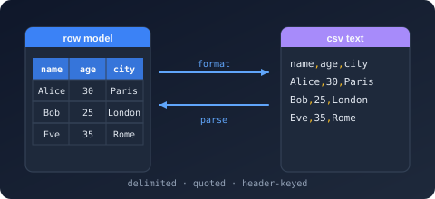

# Bodu.Text.Delimited

**Bodu.Text.Delimited** reads and writes delimited tabular text — RFC 4180 CSV, TSV, and the dialects in between — as a standalone `System.Text.Json`-shaped library: a forward-only `ref struct` reader/writer pair over UTF-8 bytes, a typed record serializer with a truly incremental streaming surface, a mutable node DOM, and a read-only document DOM. It is one of the three [Bodu line formats](../index.md) and shares the [Bodu.Text.Serialization](../../serialization/core/index.md) attribute, naming-policy, and callback vocabulary with every other Bodu serializer.

The wire is **string-only**: the serializer converts scalars with `InvariantCulture` at the binding layer, and real-world input is handled through explicit dialect policies — field-count mismatches, malformed records, and duplicate headers each have an opt-in leniency knob rather than a silent default. For trimming and ahead-of-time compilation, the serializer also accepts a compile-time [record factory](../generators.md) in place of reflection.

Part of the **[Text & Serialization](../../topics/text-and-serialization.md)** topic.

## Install

```shell
dotnet add package Bodu.Text.Delimited
```

Targets `net8.0`. Depends on `Bodu.Text.Serialization` and `Bodu.Core`. Also available through the `Bodu.Text.Formats` umbrella package.

## Headline types

| Type | Purpose |
|---|---|
| <xref:Bodu.Text.Delimited.Reader.Utf8DelimitedReader> / <xref:Bodu.Text.Delimited.Writer.Utf8DelimitedWriter> | Forward-only, allocation-free token machines, configured by <xref:Bodu.Text.Delimited.Reader.DelimitedReaderOptions> / <xref:Bodu.Text.Delimited.Writer.DelimitedWriterOptions>. |
| <xref:Bodu.Text.Delimited.DelimitedSerializer> | Records ↔ text: `Serialize` / `Deserialize<TRecord>` over strings, UTF-8 spans, buffer writers, and streams; the incremental `DeserializeAsyncEnumerableAsync<TRecord>` / `SerializeAsync(Stream, IAsyncEnumerable<TRecord>)` pair; and the reflection-free overloads over <xref:Bodu.Text.Delimited.IDelimitedRecordFactory`1>. |
| <xref:Bodu.Text.Delimited.DelimitedSerializerOptions> / <xref:Bodu.Text.Delimited.DelimitedSerializerDefaults> | Naming policy, case sensitivity, `IncludeFields`, `Delimiter`, `Quote`, `NoHeader`; `General` / `Web` presets. |
| <xref:Bodu.Text.Delimited.DelimitedFieldCountBehavior> / <xref:Bodu.Text.Delimited.DelimitedMalformedRecordBehavior> / <xref:Bodu.Text.Delimited.DelimitedDuplicateHeaderBehavior> | The dialect policies. |
| <xref:Bodu.Text.Delimited.Nodes.DelimitedNode> / <xref:Bodu.Text.Delimited.Nodes.DelimitedArray> / <xref:Bodu.Text.Delimited.Nodes.DelimitedObject> / <xref:Bodu.Text.Delimited.Nodes.DelimitedValue> | Mutable DOM — parse, edit, write back. |
| <xref:Bodu.Text.Delimited.Document.DelimitedDocument> / <xref:Bodu.Text.Delimited.Document.DelimitedElement> / <xref:Bodu.Text.Delimited.Document.DelimitedProperty> | Read-only, disposable document model. |
| <xref:Bodu.Text.Delimited.DelimitedRecordAttribute> | Marks a partial POCO for the source generator. |
| <xref:Bodu.Text.Delimited.DelimitedFormatException> / <xref:Bodu.Text.Delimited.DelimitedSerializationException> | Malformed input (with position) vs a record that cannot bind. |

## A first round trip

```csharp
using Bodu.Text.Delimited;

public sealed class Trade
{
    public string Symbol { get; set; } = "";
    public int Quantity { get; set; }
    public decimal Price { get; set; }
}

const string csv = "Symbol,Quantity,Price\nMSFT,100,412.5\n";

List<Trade> trades = DelimitedSerializer.Deserialize<Trade>(csv);   // trades[0].Price → 412.5m
string back = DelimitedSerializer.Serialize(trades);                 // header row + one record
```

## Where to go next

- **[Line formats introduction](../index.md)**, **[Core concepts](../concepts.md)**, and **[Getting started](../getting-started.md)** — the umbrella trio shared by all three formats.
- **[Using delimited (CSV / TSV)](../../../guides/formats/delimited.md)** — documents, typed records, streaming, dialects, dirty input.
- **[Reflection-free binding](../generators.md)** — the `[DelimitedRecord]` source generator and the factory overloads.
- **[Runnable samples](../../../samples/formats.md)** — the `DelimitedData` sample project.
- **API reference** — <xref:Bodu.Text.Delimited>.
