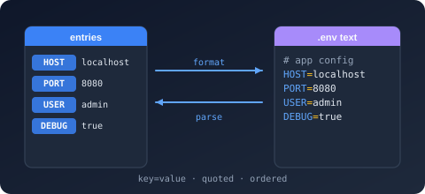

# Bodu.Text.DotEnv

**Bodu.Text.DotEnv** reads and writes `.env` files — a flat object of `KEY=value` entries with optional `export` prefixes, single- and double-quoted values, and `#` comments — as a standalone `System.Text.Json`-shaped library: a forward-only `ref struct` reader/writer pair over UTF-8 bytes, a typed settings serializer, an `export`-flag-preserving mutable DOM, and a read-only document DOM. It is one of the three [Bodu line formats](../index.md) and shares the [Bodu.Text.Serialization](../../serialization/core/index.md) attribute, naming-policy, and callback vocabulary with every other Bodu serializer.

Values are deliberately **literal** — no `${VAR}` interpolation happens at parse time — and the wire is string-only, so the serializer converts scalars with `InvariantCulture` at the binding layer. The `Web` preset applies the SCREAMING_SNAKE_CASE naming policy with case-insensitive matching, so conventional `APP_PORT`-style keys bind onto PascalCase members without a single `[PropertyName]`.

Part of the **[Text & Serialization](../../topics/text-and-serialization.md)** topic.

## Install

```shell
dotnet add package Bodu.Text.DotEnv
```

Targets `net8.0`. Depends on `Bodu.Text.Serialization` and `Bodu.Core`. Also available through the `Bodu.Text.Formats` umbrella package.

## Headline types

| Type | Purpose |
|---|---|
| <xref:Bodu.Text.DotEnv.Reader.Utf8DotEnvReader> / <xref:Bodu.Text.DotEnv.Writer.Utf8DotEnvWriter> | Forward-only, allocation-free token machines, configured by <xref:Bodu.Text.DotEnv.Reader.DotEnvReaderOptions> / <xref:Bodu.Text.DotEnv.Writer.DotEnvWriterOptions>. |
| <xref:Bodu.Text.DotEnv.DotEnvSerializer> | Settings POCO or `Dictionary<string, string>` ↔ text: `Serialize` / `Deserialize<T>` over strings, UTF-8 spans, buffer writers, and streams (with buffered async variants). |
| <xref:Bodu.Text.DotEnv.DotEnvSerializerOptions> / <xref:Bodu.Text.DotEnv.DotEnvSerializerDefaults> | Naming policy, case sensitivity, `IncludeFields`, `DefaultIgnoreCondition`, `WriteExportPrefix`; `General` / `Web` presets. |
| <xref:Bodu.Text.DotEnv.Nodes.DotEnvNode> / <xref:Bodu.Text.DotEnv.Nodes.DotEnvObject> / <xref:Bodu.Text.DotEnv.Nodes.DotEnvValue> | Mutable DOM that preserves each entry's `export` flag through a round trip. |
| <xref:Bodu.Text.DotEnv.Document.DotEnvDocument> / <xref:Bodu.Text.DotEnv.Document.DotEnvElement> / <xref:Bodu.Text.DotEnv.Document.DotEnvProperty> | Read-only, disposable document model. |
| <xref:Bodu.Text.DotEnv.DotEnvFormatException> / <xref:Bodu.Text.DotEnv.DotEnvSerializationException> | Malformed input (unterminated quote, missing `=`, with position) vs a value that cannot bind. |

## A first parse and bind

```csharp
using System.Text;
using Bodu.Text.DotEnv;
using Bodu.Text.DotEnv.Document;

public sealed class Settings
{
    public string? AppEnv { get; set; }       // APP_ENV
    public int AppPort { get; set; }          // APP_PORT
    public string? DatabaseUrl { get; set; }  // DATABASE_URL
}

const string env = "# service settings\nexport APP_ENV=production\nAPP_PORT=8080\nDATABASE_URL=\"postgres://db.example.com/app\"\n";

using (DotEnvDocument doc = DotEnvDocument.Parse(Encoding.UTF8.GetBytes(env)))
{
    string url = doc.RootElement.GetProperty("DATABASE_URL").GetString();   // postgres://db.example.com/app
}

Settings settings = DotEnvSerializer.Deserialize<Settings>(env, new DotEnvSerializerOptions(DotEnvSerializerDefaults.Web));
// settings.AppEnv → "production", settings.AppPort → 8080
```

## Where to go next

- **[Line formats introduction](../index.md)**, **[Core concepts](../concepts.md)**, and **[Getting started](../getting-started.md)** — the umbrella trio shared by all three formats.
- **[Using DotEnv](../../../guides/formats/dotenv.md)** — literal values, quoting rules, export prefixes, typed settings, the mutable DOM.
- **[Parser policies](../parser-policies.md)** — the `DisallowExportPrefix` / `DisallowInlineComments` knobs.
- **[Runnable samples](../../../samples/formats.md)** — the `ConfigFiles` sample project.
- **API reference** — <xref:Bodu.Text.DotEnv>.
