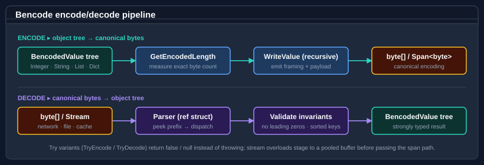

# Bodu.Text.Formats

**Bodu.Text.Formats** decodes and encodes self-framing document formats — formats whose structure is described inline by the bytes themselves, rather than by an external schema. The library ships four format families, each with a strongly-typed value model and a span- and stream-friendly codec:

| Format | Namespace | Source | Use when |
|---|---|---|---|
| **Bencode** | <xref:Bodu.Text.Bencode> | BitTorrent [BEP 3](https://www.bittorrent.org/beps/bep_0003.html) | Torrent files, content-addressed identifiers, canonical structured binary. |
| **Delimited** | <xref:Bodu.Text.Delimited> | [RFC 4180](https://www.rfc-editor.org/rfc/rfc4180) CSV and TSV variants | Row-oriented data interchange, spreadsheet import/export, log lines. |
| **DotEnv** | <xref:Bodu.Text.DotEnv> | `.env` key/value convention | Process environment configuration, deployment-time secrets, twelve-factor app config. |
| **INI** | <xref:Bodu.Text.Ini> | Classic INI / EditorConfig | Section/comment-preserving round-trippable configuration documents. Underpins [`Bodu.Text.Configuration`](../text-configuration/index.md). |

Each format exposes the same modern shape: a strongly-typed value tree, a static `Encode` / `Decode` entry point, `Try*` variants that swap exceptions for `bool` results, an explicit `GetEncodedLength` for pre-sizing destinations, and synchronous + asynchronous `Stream` overloads. No reflection, no `dynamic`, no allocations beyond the immutable result graph.

## Core mental model

The shape generalises across every format the package ships: a value model on one side (typed tree for Bencode, row sequence for Delimited, ordered key/value entries for DotEnv, section/entry model for INI), a codec on the other (`Encode` / `Decode` / `Try*` / `GetEncodedLength` over spans, byte arrays, and `Stream`), and an explicit *canonicality* contract in between (Bencode rejects non-canonical input outright; the text formats define round-trip rules per format).

The diagram traces Bencode end-to-end; the same pipeline language applies to Delimited, DotEnv, and INI, each with its own validation rules and value tree.

## Key concepts

| Concept | Plain-language meaning |
|---|---|
| **Self-framing format** | The bytes describe their own structure inline. Bencode carries explicit framing tokens (`i…e`, `l…e`, `d…e`, length prefix); Delimited / DotEnv / INI use line breaks, separators, and section headers. |
| **Value tree** | The decoded document is a typed graph — `BencodedValue`, an `IReadOnlyList<DelimitedRow>`, an ordered `DotEnvDocument`, an `IniDocument`. Each is immutable after construction. |
| **Codec** | The static façade per format (`Bencode`, `Delimited`, `DotEnv`, `Ini`) exposing `Encode` / `Decode` / `Try…` / `GetEncodedLength` / stream overloads. |
| **Canonical encoding** | Bencode enforces a single canonical byte sequence per value. INI and DotEnv preserve comments and ordering on round-trip. Delimited is canonical per quoting policy. |
| **Format exception** | Each format raises a typed `*FormatException` (a `FormatException`) with a precise message keyed to the failure mode. |

For the full glossary, see [Core concepts](concepts.md).

### Self-framing vs. binary text encoding

These formats are *not* binary-to-text encodings like Base64. They are **serialization grammars**: structure and framing live in the bytes themselves. Use [`Bodu.Text.Encoding`](../text-encoding/index.md) when you need to convert raw bytes into a printable alphabet; use **Bodu.Text.Formats** when you need to (de)serialise a structured document.

### INI primitives vs. configuration layering

The INI namespace ships <xref:Bodu.Text.Ini.IniDocument>, <xref:Bodu.Text.Ini.IniSection>, <xref:Bodu.Text.Ini.IniEntry>, and the static <xref:Bodu.Text.Ini.Ini> codec. [`Bodu.Text.Configuration`](../text-configuration/index.md) layers EditorConfig-style profile presets, glob-anchored sections, and a flat colon-delimited resolved view on top of this same model. When you need INI parsing without configuration layering, work with <xref:Bodu.Text.Ini.Ini> directly; when you need target-path resolution, reach for the Configuration package.

### Canonicality

A bencoded value has exactly one canonical encoding: `i42e`, not `i+42e` or `i042e`; dictionary keys are sorted by raw byte order, not insertion order. The codec produces the canonical form and the parser rejects every non-canonical input. This is a load-bearing property for content-addressed identifiers — the SHA-1 of a torrent's `info` dictionary (the *infohash*) only works because every parser agrees on the canonical bytes.

## Worked example — a one-key torrent dictionary

A single document traces the pipeline end-to-end:

1. Author a value: `new BencodedDictionary([new("length"_utf8, new BencodedInteger(1024))])`.
2. `Bencode.GetEncodedLength(root)` walks the tree once and returns the exact destination size — `d6:lengthi1024ee` is 16 bytes.
3. `Bencode.Encode(root)` rents a buffer of that exact size, recursively emits framing tokens and payload bytes, and returns the byte array.
4. The same bytes round-trip back through `Bencode.Decode(bytes)`. The parser reads `d`, expects key/value pairs, parses `6:length` as the key, parses `i1024e` as the value, reads the trailing `e`, then checks that no input remains.
5. If the source bytes were `d6:lengthi1024e` — missing the trailing `e` — the parser throws `BencodeFormatException` with the message *Unterminated bencoded dictionary*.

Encoding is allocation-conscious: stream variants stage to a pooled buffer of the exact size, the span path writes straight into the caller's destination, and `TryEncode` reports overflow with `false` instead of an exception.

## Common scenarios

| Scenario | Reach for |
|---|---|
| Decode a torrent file from disk | `Bencode.Decode(File.ReadAllBytes(path))` |
| Decode a bencoded payload from a network stream | `await Bencode.DecodeAsync(stream, cancellationToken)` |
| Walk the value tree by kind | `value.Kind` + a switch over `BencodedValueKind` |
| Look up a UTF-8 key in a dictionary | `dict.TryGetValue("announce", out var v)` |
| Re-encode a tree canonically | `Bencode.Encode(tree)` |
| Pre-size a destination span | `int size = Bencode.GetEncodedLength(tree);` |
| Parse without throwing on malformed input | `Bencode.TryDecode(source, out var value, out var consumed)` |
| Write canonically to a `Stream` | `Bencode.Encode(tree, stream)` / `EncodeAsync(tree, stream)` |
| Compare byte-string keys ordinally | <xref:Bodu.Text.Bencode.BencodedStringComparer.Ordinal> |
| Treat a key payload as text | <xref:Bodu.Text.Bencode.BencodedString.GetUtf8String> |

## Main types per format

Every format follows the same shape — a static codec, a typed value tree, a format-specific exception type. The table below is the at-a-glance index; deeper coverage lives in the per-format guides.

### Bencode — <xref:Bodu.Text.Bencode>

| Type | Purpose |
|---|---|
| <xref:Bodu.Text.Bencode.Bencode> | Static codec — `Encode`, `Decode`, `TryEncode`, `TryDecode`, `GetEncodedLength` over spans, byte arrays, and `Stream`. |
| <xref:Bodu.Text.Bencode.BencodedValue> | Abstract base for every decoded value; exposes `Kind` for switch-style dispatch. |
| <xref:Bodu.Text.Bencode.BencodedInteger>, <xref:Bodu.Text.Bencode.BencodedString>, <xref:Bodu.Text.Bencode.BencodedList>, <xref:Bodu.Text.Bencode.BencodedDictionary> | Concrete value subtypes. Dictionary keys are stored sorted by raw byte order. |
| <xref:Bodu.Text.Bencode.BencodeFormatException> | Thrown for any BEP 3 violation. |

### Delimited (CSV / TSV) — <xref:Bodu.Text.Delimited>

| Type | Purpose |
|---|---|
| <xref:Bodu.Text.Delimited.Delimited> | Static codec — read and write delimited records over span / byte / `Stream` / `TextReader` / `TextWriter`. |
| <xref:Bodu.Text.Delimited.DelimitedDocument>, <xref:Bodu.Text.Delimited.DelimitedRow>, <xref:Bodu.Text.Delimited.DelimitedField> | Immutable document model. |
| <xref:Bodu.Text.Delimited.DelimitedParseOptions>, <xref:Bodu.Text.Delimited.DelimitedWriteOptions> | Quoting policy, delimiter selection (comma / tab / custom), header handling. |
| <xref:Bodu.Text.Delimited.DelimitedFormatException> | Thrown for unterminated quotes, ragged rows under strict mode, and other structural violations. |

### DotEnv — <xref:Bodu.Text.DotEnv>

| Type | Purpose |
|---|---|
| <xref:Bodu.Text.DotEnv.DotEnv> | Static codec — read and write `.env` documents. |
| <xref:Bodu.Text.DotEnv.DotEnvDocument>, <xref:Bodu.Text.DotEnv.DotEnvEntry> | Ordered key/value model that preserves entry order. |
| <xref:Bodu.Text.DotEnv.DotEnvParseOptions>, <xref:Bodu.Text.DotEnv.DotEnvWriteOptions> | Quote handling, comment preservation, escape policy. |
| <xref:Bodu.Text.DotEnv.DotEnvFormatException> | Thrown for malformed key/value lines. |

### INI — <xref:Bodu.Text.Ini>

| Type | Purpose |
|---|---|
| <xref:Bodu.Text.Ini.Ini> | Static codec — read and write INI documents. |
| <xref:Bodu.Text.Ini.IniDocument>, <xref:Bodu.Text.Ini.IniSection>, <xref:Bodu.Text.Ini.IniEntry> | Section/entry model that preserves comments, whitespace, and order. |
| <xref:Bodu.Text.Ini.IniParseOptions>, <xref:Bodu.Text.Ini.IniWriteOptions> | Profile presets, escape rules, duplicate-section policy. |
| <xref:Bodu.Text.Ini.IniFormatException> | Thrown for malformed headers, entries, or escape sequences. |

## Where to go next

- **[Core concepts](concepts.md)** — full vocabulary: value vs. document, canonical encoding, framing tokens, byte string vs. text, format exception.
- **[Getting started](getting-started.md)** — install + minimal samples for `Decode`, `Encode`, `Try*`, and the stream overloads.
- **[Bodu.Text.Formats guides](../../guides/formats/index.md)** — using each codec, the value models, and stream support.
- **Per-format guides** — [Bencode](../../guides/formats/bencode.md), [Delimited](../../guides/formats/delimited.md), [DotEnv](../../guides/formats/dotenv.md), [INI](../../guides/formats/ini.md), [Streaming](../../guides/formats/streaming.md), [Value model](../../guides/formats/value-model.md).
- **API reference** — per-namespace pages: [Bencode](xref:Bodu.Text.Bencode), [Delimited](xref:Bodu.Text.Delimited), [DotEnv](xref:Bodu.Text.DotEnv), [Ini](xref:Bodu.Text.Ini).
- **For EditorConfig-style configuration layering on `IniDocument`**, see [Bodu.Text.Configuration](../text-configuration/index.md).
