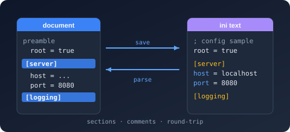

# Bodu.Text.Ini

**Bodu.Text.Ini** reads and writes INI documents — global keys plus `[section]` blocks of `key=value` entries — as a standalone `System.Text.Json`-shaped library: two forward-only `ref struct` readers (one in source order, one normalized), a writer, a typed section serializer, a **comment-preserving** mutable DOM, and a read-only document DOM. It is one of the three [Bodu line formats](../index.md) and shares the [Bodu.Text.Serialization](../../serialization/core/index.md) attribute, naming-policy, and callback vocabulary with every other Bodu serializer.

The dialect is conservative (`=` only; values run literally to end of line; `;` and `#` start full-line comments) and duplicate handling is a **document-model policy** — the source-order reader reports the file verbatim, and `Merge` / `LastWins` apply when the document materializes. The wire is string-only, so scalars convert with `InvariantCulture`; for trimming and ahead-of-time compilation, `IniSerializer` also binds one section through a compile-time [section factory](../generators.md). For EditorConfig-style *layered* configuration, use `Bodu.Text.Configuration` instead — it carries its own INI model.

Part of the **[Text & Serialization](../../topics/text-and-serialization.md)** topic.

## Install

```shell
dotnet add package Bodu.Text.Ini
```

Targets `net8.0`. Depends on `Bodu.Text.Serialization` and `Bodu.Core`. Also available through the `Bodu.Text.Formats` umbrella package.

## Headline types

| Type | Purpose |
|---|---|
| <xref:Bodu.Text.Ini.Reader.Utf8IniReader> / <xref:Bodu.Text.Ini.Reader.IniDocumentReader> | The source-order lexer (comments included) and the normalized cursor over the logical object-of-objects shape (globals hoisted, duplicate sections merged); configured by <xref:Bodu.Text.Ini.Reader.IniReaderOptions>. |
| <xref:Bodu.Text.Ini.Writer.Utf8IniWriter> | Forward-only writer for section headers, entries, and comment lines; configured by <xref:Bodu.Text.Ini.Writer.IniWriterOptions>. |
| <xref:Bodu.Text.Ini.IniSerializer> | Section POCOs / nested dictionaries ↔ INI text (`Serialize` / `Deserialize<T>`, with the `GlobalSectionName` mapping and the depth-2 gate), plus the reflection-free `SerializeSection` / `DeserializeSection` overloads over <xref:Bodu.Text.Ini.IIniSectionFactory`1>. |
| <xref:Bodu.Text.Ini.IniSerializerOptions> / <xref:Bodu.Text.Ini.IniSerializerDefaults> | Naming policy, case sensitivity, `IncludeFields`, `DefaultIgnoreCondition`, `GlobalSectionName`, duplicate policies; `General` / `Strict` (configparser strict mode) presets. |
| <xref:Bodu.Text.Ini.IniDocumentOptions> with <xref:Bodu.Text.Ini.IniDuplicateSectionBehavior> / <xref:Bodu.Text.Ini.IniDuplicateKeyBehavior> | How repeated sections and keys resolve when the document materializes. |
| <xref:Bodu.Text.Ini.Nodes.IniNode> / <xref:Bodu.Text.Ini.Nodes.IniObject> / <xref:Bodu.Text.Ini.Nodes.IniValue> | Mutable, comment-preserving DOM for faithful rewrites of human-owned files. |
| <xref:Bodu.Text.Ini.Document.IniDocument> / <xref:Bodu.Text.Ini.Document.IniElement> / <xref:Bodu.Text.Ini.Document.IniProperty> | Read-only, trivia-free, disposable document model. |
| <xref:Bodu.Text.Ini.IniSectionAttribute> | Marks a partial section POCO for the source generator. |
| <xref:Bodu.Text.Ini.IniFormatException> / <xref:Bodu.Text.Ini.IniSerializationException> | Malformed input or a policy violation (with position) vs a binding failure. |

## A first edit, comments intact

```csharp
using System.Text;
using Bodu.Text.Ini.Nodes;

const string ini = "; app.ini\nenvironment=production\n\n[server]\nhost=localhost\nport=8080\n";

IniObject root = IniNode.Parse(Encoding.UTF8.GetBytes(ini));
root["server"]!.AsObject()["port"]!.AsValue().Value = "9090";

byte[] back = root.ToUtf8Bytes();   // "; app.ini" survives; port is now 9090
```

## Where to go next

- **[Line formats introduction](../index.md)**, **[Core concepts](../concepts.md)**, and **[Getting started](../getting-started.md)** — the umbrella trio shared by all three formats.
- **[Using INI](../../../guides/formats/ini.md)** — global keys and sections, typed binding, comment-preserving edits, duplicate policies, the two readers.
- **[Reflection-free binding](../generators.md)** — the `[IniSection]` source generator and the section-factory overloads.
- **[Runnable samples](../../../samples/formats.md)** — the `ConfigFiles` sample project.
- **API reference** — <xref:Bodu.Text.Ini>.
