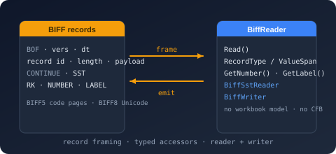

# Bodu.IO.Biff



**Bodu.IO.Biff** is a low-level codec for the Excel Binary Interchange File Format — the **BIFF5** (Excel 5.0/95) and **BIFF8** (Excel 97–2003) record streams stored inside legacy `.xls` workbooks. Part of the **[Binary Formats & I/O](../topics/binary-formats.md)** topic, it is the substrate beneath [`Bodu.Formats.Excel.Binary`](../excel/index.md) in the same relation [`Bodu.IO.Pst`](../io-pst/index.md) has to `Bodu.Formats.Outlook.Pst`: it understands **how BIFF is encoded**, not **what an Excel workbook means**. There is no compound-file dependency, no workbook or cell model, and no formula evaluation.

An `.xls` file is an OLE2 compound file whose `Workbook` (BIFF8) or `Book` (BIFF5) stream is a flat sequence of records — a two-byte identifier, a two-byte length, and a payload. <xref:Bodu.IO.Biff.BiffReader> walks that sequence forward over a span, one physical record at a time, and <xref:Bodu.IO.Biff.BiffWriter> emits it. Both are `ref struct`s in the mould of the `Utf8BencodeReader` / `Utf8TomlReader` family: allocation-free traversal, typed accessors that decode only the current record, and raw access to every record the codec does not name.

| Concept | Type | Role |
|---|---|---|
| **Reader** | <xref:Bodu.IO.Biff.BiffReader> | Frames records, establishes the version and code page, exposes `RecordId` / `RecordType` / `ValueSpan`, decodes the named records through `Get…` accessors. |
| **Shared strings** | <xref:Bodu.IO.Biff.BiffSstReader> | Walks the BIFF8 shared string table one string at a time across its `CONTINUE` records. |
| **Writer** | <xref:Bodu.IO.Biff.BiffWriter> | Emits records under an explicit version — raw from an identifier and payload, or typed — splitting oversized structures into `CONTINUE` records. |
| **Text** | <xref:Bodu.IO.Biff.BiffString> | A span-backed view over a BIFF8 Unicode string or a BIFF5 code-page byte string; nothing is materialized until `GetString()`. |

## Key concepts

| Concept | Plain-language meaning |
|---|---|
| **Record** | The unit of the stream: `id (2) · length (2) · payload`. <xref:Bodu.IO.Biff.BiffRecordType> names the common identifiers; any other identifier is still framed and readable. |
| **Version** | <xref:Bodu.IO.Biff.BiffVersion> — established from the first `BOF` record (`0x0500` BIFF5, `0x0600` BIFF8) or supplied through <xref:Bodu.IO.Biff.BiffReaderOptions>. It selects string representation, the `DIMENSIONS` layout, and the maximum record length. |
| **Substream** | A `BOF` … `EOF` bracket: the workbook globals first, then one per sheet. <xref:Bodu.IO.Biff.BiffSubstreamType> names the kinds. |
| **CONTINUE** | A record carrying the overflow of the record before it. The reader reports it as a physical record; the shared-string reader and `TryReadContinuation` consume it where a logical value spans records. |
| **Code page** | BIFF5 text is bytes in the code page the `CODEPAGE` record declares; the reader tracks it as state, like the version, so `BiffString.GetString()` needs no argument. |
| **RK number** | A compact 30-bit numeric encoding used by `RK` and `MULRK` cells; <xref:Bodu.IO.Biff.BiffRk> encodes and decodes it. |

For the full glossary, see [Core concepts](concepts.md); for every record the codec names — identifier, BIFF5 and BIFF8 layouts, decoded type, accessor, and writer — see the [Record reference](records.md).

## Scope and limitations

- **A codec, not a spreadsheet library.** The reader keeps only the state needed to interpret the forward stream — the version, the code page, the current record. Sheets, cells by address, formats, and formula results as *values* belong to `Bodu.Formats.Excel.Binary`.
- **BIFF5 and BIFF8.** A stream opening with a BIFF2, BIFF3, or BIFF4 beginning-of-file record is rejected with <xref:Bodu.IO.Biff.BiffUnsupportedVersionException> — recognized, not mis-parsed.
- **Untrusted input.** Every declared length is bounds-checked; a truncated header, a payload that overruns the buffer, or a known record shorter than its layout is a <xref:Bodu.IO.Biff.BiffFormatException>. An unknown record identifier is never an error.
- **Reader over a span.** Supply the whole stream, or read incrementally by carrying <xref:Bodu.IO.Biff.BiffReaderState> between buffers; a record is at most 8,228 bytes, so a modest chunk always holds one.
- **Writer over `IBufferWriter<byte>`.** The writer serializes records; it does not order them, and the sheet offsets a `BOUNDSHEET` carries are computed by the caller from <xref:Bodu.IO.Biff.BiffWriter.BytesCommitted>.

## Worked example — walk a workbook stream

The stream bytes come from wherever the workbook is stored — here, the `Workbook` stream of a compound file read with `Bodu.IO.Compound`, which this package does not itself reference.

```csharp
using Bodu.IO.Biff;

var reader = new BiffReader(workbookStreamBytes);
string[] sharedStrings = [];

while (reader.Read())
{
    switch (reader.RecordType)
    {
        case BiffRecordType.Bof:
            Console.WriteLine($"BOF {reader.Version} {reader.GetBof().SubstreamType}");
            break;

        case BiffRecordType.Sst:
            var strings = new BiffSstReader(ref reader);
            var list = new List<string>();
            while (strings.Read(ref reader))
                list.Add(strings.GetString());
            sharedStrings = [.. list];
            break;

        case BiffRecordType.Number:
            BiffNumberRecord number = reader.GetNumber();
            Console.WriteLine($"R{number.Row}C{number.Column} = {number.Value}");
            break;

        case BiffRecordType.LabelSst:
            BiffLabelSstRecord label = reader.GetLabelSst();
            Console.WriteLine($"R{label.Row}C{label.Column} = {sharedStrings[label.SstIndex]}");
            break;

        default:
            // Every other record stays inspectable: reader.RecordId, reader.RecordLength, reader.ValueSpan.
            break;
    }
}
```

## Common scenarios

| Scenario | Reach for |
|---|---|
| Walk every record of a stream | `new BiffReader(bytes)` → `while (reader.Read())` |
| Identify a record the codec does not name | `reader.RecordId` / `reader.ValueSpan` |
| Learn the version without reading further | `reader.Version` after the first `Read()` (a `BOF` record) |
| Read a sheet substream knowing the version already | `new BiffReader(bytes, new BiffReaderOptions { Version = …, CodePage = … })` |
| Read incrementally from a stream | Capture `reader.CurrentState` and `reader.BytesConsumed`; construct the next reader with `isFinalBlock: false` |
| Materialize the shared string table | `new BiffSstReader(ref reader)` → `strings.Read(ref reader)` / `strings.GetString()` |
| Decode a cell record | `reader.GetNumber()`, `GetRk()`, `GetMulRk()`, `GetLabel()`, `GetLabelSst()`, `GetBoolErr()`, `GetFormula()` |
| Read text without allocating | `record.Text.RawCharacters`, `record.Text.CopyTo(Span<char>)` |
| Encode a number compactly | `BiffRk.TryEncode(value, out uint rk)` → `writer.WriteRk(…)`; fall back to `WriteNumber` |
| Copy a stream record for record | `writer.WriteRecord(reader.RecordId, reader.ValueSpan)` |
| Write a shared string table | `writer.WriteSst(strings)` — `CONTINUE` splitting is handled |
| Distinguish "corrupt" from "too old" | `catch (BiffFormatException)` versus `catch (BiffUnsupportedVersionException)` |

## Headline types — <xref:Bodu.IO.Biff>

| Type | Purpose |
|---|---|
| <xref:Bodu.IO.Biff.BiffReader> | The forward-only reader: `Read`, `RecordId` / `RecordType` / `RecordLength` / `ValueSpan`, `Version` / `CodePage`, `TryReadContinuation`, the typed `Get…` accessors, and `CurrentState` / `BytesConsumed` for resumption. |
| <xref:Bodu.IO.Biff.BiffSstReader> | The shared-string-table walker: `Header`, `Read(ref reader)`, `Index`, `Current` (contiguous view) or `GetString()` / `CopyTo` for fragmented strings. |
| <xref:Bodu.IO.Biff.BiffWriter> | The writer: `WriteRecord`, `WriteContinuedRecord`, `WriteBof` / `WriteEof`, the cell and globals writers, `WriteSst`, `BytesCommitted`. |
| <xref:Bodu.IO.Biff.BiffString> | The text view: `Length`, `IsUnicode` / `IsHighByte`, `RawCharacters`, rich-run and extended-data trailers, `GetString()` / `CopyTo`. |
| <xref:Bodu.IO.Biff.BiffRk> | The RK number codec: `TryEncode` for the compact form a cell may take, `Decode` to reverse it. |
| **Decoded records** — <xref:Bodu.IO.Biff.BiffBofRecord>, <xref:Bodu.IO.Biff.BiffBoundSheetRecord>, <xref:Bodu.IO.Biff.BiffDimensionsRecord>, <xref:Bodu.IO.Biff.BiffRowRecord>, <xref:Bodu.IO.Biff.BiffNumberRecord>, <xref:Bodu.IO.Biff.BiffRkRecord>, <xref:Bodu.IO.Biff.BiffMulRkRecord> (+ <xref:Bodu.IO.Biff.BiffRkCell>), <xref:Bodu.IO.Biff.BiffBlankRecord>, <xref:Bodu.IO.Biff.BiffMulBlankRecord>, <xref:Bodu.IO.Biff.BiffBoolErrRecord>, <xref:Bodu.IO.Biff.BiffLabelRecord>, <xref:Bodu.IO.Biff.BiffLabelSstRecord>, <xref:Bodu.IO.Biff.BiffRStringRecord>, <xref:Bodu.IO.Biff.BiffFormulaRecord> (+ <xref:Bodu.IO.Biff.BiffCachedResultKind>), <xref:Bodu.IO.Biff.BiffStringRecord>, <xref:Bodu.IO.Biff.BiffXfRecord>, <xref:Bodu.IO.Biff.BiffFormatRecord>, <xref:Bodu.IO.Biff.BiffFontRecord>, <xref:Bodu.IO.Biff.BiffCodePageRecord>, <xref:Bodu.IO.Biff.BiffDateModeRecord>, <xref:Bodu.IO.Biff.BiffFilePassRecord> (+ <xref:Bodu.IO.Biff.BiffEncryptionType>), <xref:Bodu.IO.Biff.BiffSstHeader> | One decoded type per record the reader's `Get…` accessors return and the writer's `Write…` methods take; `ref struct`s where they carry text or spans, `record struct`s otherwise. Layouts per version are tabulated in the [Record reference](records.md). |
| <xref:Bodu.IO.Biff.BiffRecordType> / <xref:Bodu.IO.Biff.BiffVersion> / <xref:Bodu.IO.Biff.BiffSubstreamType> | The catalogue of named records, the two versions, and the substream kinds. |
| <xref:Bodu.IO.Biff.BiffSheetState> / <xref:Bodu.IO.Biff.BiffSheetType> | The visibility and kind a `BOUNDSHEET` record declares. |
| <xref:Bodu.IO.Biff.BiffReaderOptions> / <xref:Bodu.IO.Biff.BiffReaderState> / <xref:Bodu.IO.Biff.BiffWriterOptions> | Seed a known version and code page; carry the established state between readers; select the version and BIFF5 code page a writer emits. |
| <xref:Bodu.IO.Biff.BiffRecordHeader> / <xref:Bodu.IO.Biff.BiffLimits> | The four-byte header (`TryParse` / `WriteTo`) and the format's structural limits. |
| <xref:Bodu.IO.Biff.BiffFormatException> / <xref:Bodu.IO.Biff.BiffUnsupportedVersionException> | Invalid data (with the record offset) versus a version the codec does not process (with the raw marker). |

## The Excel reader built on this package

**`Bodu.Formats.Excel.Binary`** layers the spreadsheet vocabulary on top: `ExcelBinaryWorkbook` opens an `.xls` through `Bodu.IO.Compound`, parses the globals with this codec, and surfaces each sheet's cells as `ExcelCell` values with number-format and date detection.

## Where to go next

- **[Core concepts](concepts.md)** — full vocabulary: records and framing, versions, substreams, strings and code pages, continuation, RK numbers.
- **[Record reference](records.md)** — every named record with its identifier, BIFF5 and BIFF8 layouts, decoded type, accessor, and writer.
- **[Getting started](getting-started.md)** — install + minimal samples for reading, resuming, decoding strings, and writing.
- **[Runnable sample](../../samples/io-biff.md)** — the `BiffBasics` console project.
- **API reference** — [Bodu.IO.Biff](xref:Bodu.IO.Biff) · [Bodu.Formats.Excel](xref:Bodu.Formats.Excel).
- **[Binary Formats & I/O topic overview](../topics/binary-formats.md)** — where the codec sits between the container and the format reader.
