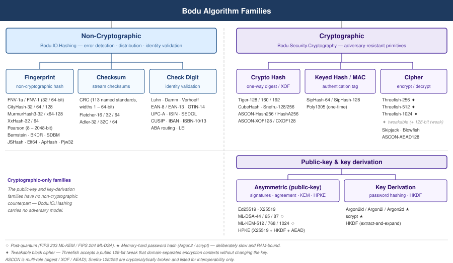
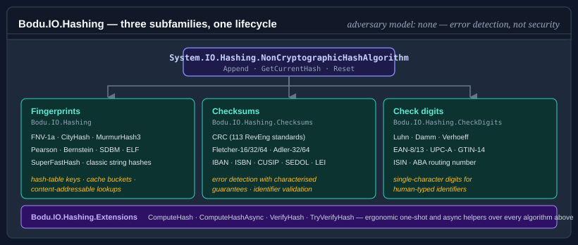

# Bodu.IO.Hashing

**Bodu.IO.Hashing** is the non-cryptographic hashing package of the Bodu suite, and one half of the **[Hashing & Cryptography](../topics/hashing-and-cryptography.md)** topic. Everything in the package derives from <xref:System.IO.Hashing.NonCryptographicHashAlgorithm?displayProperty=nameWithType>, so the lifecycle (`Append` / `GetCurrentHash` / `Reset`) is identical regardless of which algorithm you pick.

> **Adversary model: none.** Nothing in this library is safe against an attacker who can choose inputs. Use it for error detection, distribution, fingerprinting, and identifier validation — for anything security-sensitive, see [Bodu.Security.Cryptography](../cryptography/index.md).

## The shape of the suite



Nothing in this library is designed against an **adversary model**. Its fingerprints, checksums, and check digits are tuned for speed, even distribution, and the detection of accidental errors on *trusted* input — every one of them is trivially forgeable by anyone who controls the bytes. That is the line between this package and [Bodu.Security.Cryptography](../cryptography/index.md), whose ciphers, keyed hashes (MACs), and cryptographic digests are each designed so that even an attacker who knows the algorithm, observes many inputs and outputs, and chooses inputs adaptively cannot forge, invert, or find collisions. Cross that line the moment an attacker can influence the input or the result protects a security decision.

The library is organized around three subfamilies, each in its own namespace.



## Namespaces and headline types

### `Bodu.IO.Hashing` — Fingerprints

Fast, distribution-quality hash functions for hash-table keys, in-memory cache buckets, and content-addressable lookups.

| Type | Output | Notes |
|---|---|---|
| <xref:Bodu.IO.Hashing.Fnv1a32> / <xref:Bodu.IO.Hashing.Fnv1a64> | 32 / 64 bits | Constant-memory, streaming. Preferred over FNV-1 for better avalanche. |
| <xref:Bodu.IO.Hashing.Fnv132> / <xref:Bodu.IO.Hashing.Fnv164> | 32 / 64 bits | Original FNV-1; legacy interoperability only. |
| <xref:Bodu.IO.Hashing.CityHash32> / <xref:Bodu.IO.Hashing.CityHash64> / <xref:Bodu.IO.Hashing.CityHash128> | 32 / 64 / 128 bits | SIMD-friendly; fastest on long inputs (buffers internally). |
| <xref:Bodu.IO.Hashing.MurmurHash3_32> / <xref:Bodu.IO.Hashing.MurmurHash3_128> | 32 / 128 bits | Seeded; excellent avalanche; widely used in databases. |
| <xref:Bodu.IO.Hashing.Pearson> | 8–2048 bits | Table-driven; configurable output width in 8-bit steps. |
| <xref:Bodu.IO.Hashing.Bernstein> | 32 bits | Classic djb2; configurable add-vs-XOR variant. |
| <xref:Bodu.IO.Hashing.BKDR> / <xref:Bodu.IO.Hashing.SDBM> / <xref:Bodu.IO.Hashing.JSHash> / <xref:Bodu.IO.Hashing.Elf64> / <xref:Bodu.IO.Hashing.ApHash> / <xref:Bodu.IO.Hashing.Pjw32> | 32–64 bits | Classic string hashes from compilers and early web servers. |
| <xref:Bodu.IO.Hashing.SuperFastHash> | 32 bits | Paul Hsieh's hash; designed for short keys. |
| <xref:Bodu.IO.Hashing.BlockNonCryptographicHashAlgorithm`1> | — | Abstract base for buffered block-oriented algorithms; CRTP-style extension point. |
| <xref:Bodu.IO.Hashing.IResumableHashAlgorithm> | — | Optional contract: reverse-finalize a stored digest, append more bytes, finalize again. Implemented by `Crc`. |

> **BCL note.** `XxHash32` / `XxHash64` / `XxHash3` / `XxHash128` from `System.IO.Hashing` already cover the xxHash family — Bodu does not duplicate them. Use the BCL types directly when you want xxHash.

### `Bodu.IO.Hashing.Checksums` — Checksums

Error-detection algorithms with characterized guarantees over specific error patterns. Also hosts the multi-character / alphanumeric check-digit algorithms for codes like IBAN, ISBN, and CUSIP.

| Type | Output | Subfamily |
|---|---|---|
| <xref:Bodu.IO.Hashing.Checksums.Crc> + <xref:Bodu.IO.Hashing.Checksums.CrcStandard> + <xref:Bodu.IO.Hashing.Checksums.CrcStandards> | 1–64 bits | Polynomial-remainder; 113 named standards from the RevEng catalogue, plus custom parameter sets. |
| <xref:Bodu.IO.Hashing.Checksums.CrcLookupTableBuilder> / <xref:Bodu.IO.Hashing.Checksums.CrcLookupTableCache> | — | Shared lookup-table cache so identical CRC parameter sets share a table. |
| <xref:Bodu.IO.Hashing.Checksums.Fletcher16> / <xref:Bodu.IO.Hashing.Checksums.Fletcher32> / <xref:Bodu.IO.Hashing.Checksums.Fletcher64> | 16 / 32 / 64 bits | Twin-accumulator; catches transpositions a simple sum or XOR misses. |
| <xref:Bodu.IO.Hashing.Checksums.Adler32> / <xref:Bodu.IO.Hashing.Checksums.Adler32C> / <xref:Bodu.IO.Hashing.Checksums.Adler64> | 32 / 32 / 64 bits | Prime / power-of-two modulus twin accumulator; Adler-32 is the canonical zlib checksum. |
| <xref:Bodu.IO.Hashing.CheckDigits.Iban>, <xref:Bodu.IO.Hashing.CheckDigits.Isbn10>, <xref:Bodu.IO.Hashing.CheckDigits.Isbn13>, <xref:Bodu.IO.Hashing.CheckDigits.Sedol>, <xref:Bodu.IO.Hashing.CheckDigits.Cusip>, <xref:Bodu.IO.Hashing.CheckDigits.Lei> | Multi-char | Alphanumeric / multi-character identifier checksums. |
| <xref:Bodu.IO.Hashing.CheckDigits.Iso7064Mod11_2>, <xref:Bodu.IO.Hashing.CheckDigits.Iso7064Mod97_10> | 1–2 chars | Generic ISO 7064 checksum building blocks for custom alphanumeric schemes. |
| <xref:Bodu.IO.Hashing.CheckDigits.CheckDigitInputAlphabet> / <xref:Bodu.IO.Hashing.CheckDigits.CheckDigitOutputAlphabet> | — | Character-set enums consumed by the alphanumeric check-digit algorithms. |

### `Bodu.IO.Hashing.CheckDigits` — Check digits

Single-character check-digit algorithms over decimal alphabets, for human-typed identifiers like credit card numbers and barcodes.

| Type | Used by |
|---|---|
| <xref:Bodu.IO.Hashing.CheckDigits.Luhn> | Credit cards (Visa, Mastercard, Amex), IMEI, SIN |
| <xref:Bodu.IO.Hashing.CheckDigits.Damm> | General purpose; detects all single-digit and adjacent-transposition errors |
| <xref:Bodu.IO.Hashing.CheckDigits.Verhoeff> | German ID, medical device codes; widest decimal-alphabet error coverage |
| <xref:Bodu.IO.Hashing.CheckDigits.Ean8> / <xref:Bodu.IO.Hashing.CheckDigits.Ean13> | Retail barcodes |
| <xref:Bodu.IO.Hashing.CheckDigits.Gtin14> | Shipping cartons |
| <xref:Bodu.IO.Hashing.CheckDigits.UpcA> | US/Canada retail barcodes |
| <xref:Bodu.IO.Hashing.CheckDigits.Isin> | International securities identifiers (ISO 6166) |
| <xref:Bodu.IO.Hashing.CheckDigits.AbaRoutingNumber> | US bank routing numbers |
| <xref:Bodu.IO.Hashing.CheckDigits.CheckDigitAlgorithm>, <xref:Bodu.IO.Hashing.CheckDigits.AlphanumericCheckDigitAlgorithm>, <xref:Bodu.IO.Hashing.CheckDigits.MultiCharCheckDigitAlgorithm> | Abstract base classes — extension points for custom schemes. |

### `Bodu.IO.Hashing.Extensions`

Extension methods over `NonCryptographicHashAlgorithm` for ergonomic one-shot computation, async streaming, and verification.

| Type | Provides |
|---|---|
| <xref:Bodu.IO.Hashing.Extensions.NonCryptographicHashAlgorithmExtensions> | `AppendData`, `AppendDataAsync`, `ComputeHash`, `ComputeHashAsync`, `VerifyHash`, `VerifyHashAsync`, `TryVerifyHash`, `TryVerifyHashAsync`. |

## Choosing a subfamily

All three subfamilies derive from the same base type, but they are tuned for different jobs — and the best algorithm for one job is a poor choice for another.

| Subfamily | Optimized for | Operates on | Adversary model |
|---|---|---|---|
| Fingerprint | Even distribution and speed | Binary buffer | None |
| Checksum | Detecting specific error patterns | Binary buffer | None |
| Check digit | Catching human transcription errors | Character sequence | None |

**Fingerprints** map an arbitrary byte sequence to a fixed-size integer that distributes evenly across the output range. They are judged on *avalanche* (a single input-bit change flips roughly half the output bits), *distribution* (hash-table buckets fill evenly), and *streaming* behaviour (FNV and Pearson are constant-memory; CityHash and MurmurHash3 buffer internally for SIMD throughput). Reach for them for hash-table keys, cache bucketing, deduplication, and content-addressable lookups inside a trust boundary — never for error-pattern detection or authentication.

**Checksums** produce a short tag engineered to catch the error patterns of a transmission or storage channel — single-bit flips, burst errors, adjacent transpositions. Two structural shapes: *polynomial-remainder* (CRC — divides the input as a polynomial over GF(2) by a generator polynomial) and *twin-accumulator* (Fletcher and Adler — two running sums whose cross-position coupling catches transpositions a simple sum misses).

The two shapes differ in the guarantees they offer, which is the axis to choose on:

| Property | CRC | Fletcher / Adler |
|---|---|---|
| Single-bit error | Always detected | Always detected |
| Adjacent transposition | Always detected | Always detected |
| Burst error of length ≤ width | **Always detected** | No per-position guarantee |
| Odd number of bit-flips | Always detected (most polynomials) | Not guaranteed |
| Per-byte cost | Higher (table lookup + XOR) | Lower (two adds + a fold) |
| Documented blind spots | None for accidental noise | Zero-byte runs (Fletcher); short inputs (Adler) |

Reach for CRC when you must match a wire format or need the published burst guarantee; reach for Fletcher or Adler when you control both endpoints and want the cheapest position-dependent checksum. The [concepts page](concepts.md#crc-error-detection-guarantees) carries the full guarantee tables.

**Check digits** operate on a *printed identifier* — a short, human-readable string — and append one or two characters so a later reader can confirm it was not mis-typed. Five mathematical subfamilies trade off error coverage:

| Subfamily | Detects | Bodu types |
|---|---|---|
| **Mod 10 (weighted sum)** | All single-digit substitutions; most adjacent transpositions | `Luhn`, `Ean8`, `Ean13`, `Gtin14`, `UpcA`, `AbaRoutingNumber`, `Isin` |
| **Quasigroup (Damm)** | All single-digit substitutions and all adjacent transpositions | `Damm` |
| **Dihedral group D₅ (Verhoeff)** | The widest error coverage of any decimal scheme | `Verhoeff` |
| **Mod 11** | All single-digit errors; most transpositions | `Isbn10`, `Sedol`, `Cusip`, `Iso7064Mod11_2` |
| **Mod 97-10 (ISO 7064)** | Almost all transcription errors at scale | `Iban`, `Lei`, `Iso7064Mod97_10` |

> **Picking between them.** A checksum guards a *binary payload* that only software sees; a check digit guards a *printed identifier* a human copies by hand; a fingerprint just needs fast, even distribution across a table. CRC and Fletcher distribute poorly as hash functions, and FNV and CityHash give weaker burst-error guarantees than CRC — match the algorithm to the job.

> **Need an adversary model?** Everything in this package is forgeable by an attacker who controls the input. For keyed and cryptographic hashes — SipHash, Poly1305, Tiger, ASCON, Merkle trees — that resist a deliberate attacker, see [Bodu.Security.Cryptography](../cryptography/index.md).

## Selecting a specific algorithm

Once the subfamily is chosen, this table compares the algorithms within each subfamily on the dimensions that matter most for picking one: output size, streaming behaviour, resumability, and the typical scenario the algorithm is tuned for.

| Algorithm | Output | Streaming | Resumable | Typical scenario |
|---|---|---|---|---|
| `Fnv1a32` / `Fnv1a64` | 32 / 64 bits | Constant memory | No | Hash-table keys; the default fingerprint when in doubt. |
| `MurmurHash3_32` / `MurmurHash3_128` | 32 / 128 bits | Constant memory | No | Database index keys; widely used in distributed systems. |
| `CityHash32` / `CityHash64` / `CityHash128` | 32 / 64 / 128 bits | Buffered (SIMD) | No | Fastest on long inputs; CDN and large-blob fingerprints. |
| `Pearson` | 8 – 2048 bits | Constant memory | No | Configurable output width in 8-bit steps; embedded scenarios. |
| `Bernstein`, `BKDR`, `SDBM`, `JSHash`, `Elf64`, `ApHash`, `Pjw32`, `SuperFastHash` | 32 / 64 bits | Constant memory | No | Compiler-style string hashing; legacy interop. |
| `Crc` (any standard from <xref:Bodu.IO.Hashing.Checksums.CrcStandard>) | 1 – 64 bits | Constant memory | **Yes** (`IResumableHashAlgorithm`) | Error-detection checksum on transmission / storage channels; choice driven by published `CrcStandard` (e.g. CRC-32/ISO-HDLC for zlib / PNG / Ethernet). |
| `Fletcher16` / `Fletcher32` / `Fletcher64` | 16 / 32 / 64 bits | Constant memory | No | Faster than CRC at comparable error coverage; protocol checksums. |
| `Adler32` / `Adler32C` / `Adler64` | 32 / 32 / 64 bits | Constant memory | No | Used by zlib; checksum for short, low-entropy payloads. |
| `Luhn`, `Damm`, `Verhoeff`, `Ean8`, `Ean13`, `UpcA`, `Gtin14`, `AbaRoutingNumber` | 1 character | Constant memory | No | Single-character check digit for human-typed numeric identifiers. |
| `Isbn10`, `Sedol`, `Cusip`, `Isin`, `Iso7064Mod11_2` | 1 character | Constant memory | No | Single-character check digit for mixed numeric / alphanumeric identifiers. |
| `Iban`, `Lei`, `Iso7064Mod97_10` | 2 characters | Constant memory | No | Two-character check digit (ISO 7064 Mod 97-10) for high-coverage validation. |

> Only `Crc` currently implements `IResumableHashAlgorithm` — the ability to reverse-finalize a stored digest, append more bytes, and finalize again.

> The `Bodu.IO.Hashing.Extensions` namespace adds ergonomic one-shot and async helpers (`ComputeHash`, `ComputeHashAsync`, `VerifyHash`, `TryVerifyHash`) over every algorithm in the table.

## Common lifecycle

```csharp
using Bodu.IO.Hashing;

using var hash = new Crc();      // or Fletcher32, Adler32, Fnv1a64, CityHash64, …

hash.Append(chunk1);
hash.Append(chunk2);
byte[] partial = hash.GetCurrentHash();   // snapshot, non-destructive
hash.Append(chunk3);
byte[] full    = hash.GetCurrentHash();

hash.Reset();                              // back to the initial state
```

Only `Crc` currently implements `IResumableHashAlgorithm` (reverse-finalize a stored digest, append more bytes, finalize again).

## Where to go next

- **[Core concepts](concepts.md)** — glossary the rest of the documentation assumes.
- **[Getting started](getting-started.md)** — install + one minimal sample per subfamily.
- **[Bodu.IO.Hashing guides](../../guides/io-hashing/index.md)** — recipe-style walk-throughs per algorithm.
- **[Bodu.IO.Hashing API reference](xref:Bodu.IO.Hashing)** — full type-by-type docs.
- **For keyed and cryptographic hashes** (SipHash, Poly1305, Tiger, ASCON, Merkle trees), see [Bodu.Security.Cryptography](../cryptography/index.md).
- **[Hashing & Cryptography topic](../topics/hashing-and-cryptography.md)** — this package and its sibling Bodu.Security.Cryptography side by side.
