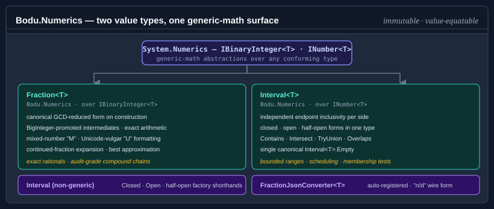

# Bodu.Numerics

**Bodu.Numerics** is the numeric-primitives package of the Bodu suite. It centers on two value types — `Fraction<T>` for exact rational arithmetic and `Interval<T>` for intervals over ordered numeric coordinates — both built on the generic-math interfaces (`INumber<T>`, `ISignedNumber<T>`) so they compose with anything that targets the .NET 7+ numeric abstractions. Around `Interval<T>` sit its set-algebra companions: the integer-domain `DiscreteInterval<T>`, the binary-result `IntervalPair<T>` / `DiscreteIntervalPair<T>`, and the N-ary `IntervalSet<T>`. Part of the **[Numerics & Financial](../topics/numerics-and-financial.md)** topic.

`Bodu.Numerics` is the dependency that `Bodu.Financial` reaches for when an accounting workflow needs sub-minor-unit precision: `Money<TCurrency>.ToFraction()` round-trips through `Fraction<BigInteger>` for compound interest, percentage-of-percentage, and other chains where deferred rounding matters.



## Namespaces and headline types

### `Bodu.Numerics`

| Type | Purpose |
|---|---|
| <xref:Bodu.Numerics.Fraction`1> | Immutable canonical rational over any `IBinaryInteger<T>` backing type. Auto-reduces to GCD-normalised form on construction, raises overflow to `BigInteger` precision internally, and implements the full `INumber<T>` / `ISignedNumber<T>` surface. |
| <xref:Bodu.Numerics.Interval`1> | Immutable continuous interval over any `INumber<T>` endpoint type. Endpoint inclusivity is independent on each side (closed-closed, open-open, closed-open, open-closed), each side may be unbounded (`All` / `AtLeast` / `AtMost` …), and the full set algebra — `Intersect`, `TryUnion`, `Difference`, `SymmetricDifference`, `&` / `|` — is provided. |
| <xref:Bodu.Numerics.Interval> | Non-generic helper class with factory methods (`Closed`, `Open`, `ClosedOpen`, `OpenClosed`, `AtLeast`, `AtMost`, …) that infer the endpoint type from the arguments. |
| <xref:Bodu.Numerics.DiscreteInterval`1> | Immutable integer-domain interval over any `IBinaryInteger<T>` type. Canonicalizes every shape to closed integer bounds, so an open interval over consecutive integers is empty and successor-adjacent runs merge — the discrete counterpart to `Interval<T>`. |
| <xref:Bodu.Numerics.DiscreteInterval> | Non-generic helper class mirroring the `DiscreteInterval<T>` factories with type inference. |
| <xref:Bodu.Numerics.IntervalPair`1>, <xref:Bodu.Numerics.DiscreteIntervalPair`1> | Allocation-free results of a binary `Difference` / `SymmetricDifference` — zero, one, or two disjoint pieces, indexable and enumerable. |
| <xref:Bodu.Numerics.IntervalSet`1> | Immutable normalized union of disjoint, non-adjacent intervals — the N-ary home for `Union` / `Intersect` / `Except` / `Complement` when a result can be a disconnected range. |
| <xref:Bodu.Numerics.Serialization.FractionJsonConverter`1>, <xref:Bodu.Numerics.Serialization.FractionJsonConverterFactory> | `System.Text.Json` converters auto-registered via `[JsonConverter]` on `Fraction<T>`. The attribute path defaults to the `Strict` object shape `{ "numerator": …, "denominator": … }`; the compact `"numerator/denominator"` string is opt-in via `AddNumericsJsonConverters(NumericsJsonPolicy.Compact)`. |

### `Bodu.Numerics.Serialization`

| Type | Purpose |
|---|---|
| <xref:Bodu.Numerics.Serialization.NumericsJsonPolicy> | Selects the wire shape and read strictness for both converters — `Strict` (canonical object), `Lenient` (object + import aliases), or `Compact` (single string). |
| <xref:Bodu.Numerics.Serialization.IntervalJsonConverter`1>, <xref:Bodu.Numerics.Serialization.IntervalJsonConverterFactory> | `System.Text.Json` converters auto-registered via `[JsonConverter]` on `Interval<T>`. |
| <xref:Bodu.Numerics.Serialization.NumericsJsonSerializerOptionsExtensions> | `AddNumericsJsonConverters(this JsonSerializerOptions, NumericsJsonPolicy)` — registers a coherent converter pair for both numeric types from one policy value. |

### Interface surface

Both value types are wide `readonly struct`s that opt into the relevant BCL contracts, so they substitute into generic-math, comparison, parsing, formatting, and span/UTF-8 pipelines without adapters.

| Interface | `Fraction<T>` | `Interval<T>` | What it unlocks |
|---|:---:|:---:|---|
| <xref:System.Numerics.INumber`1> | ✓ | — | First-class number — `Sum`, `Aggregate`, any `INumber`-constrained algorithm. |
| <xref:System.Numerics.ISignedNumber`1> | ✓ | — | `NegativeOne`, signed-only generic constraints. |
| <xref:System.IEquatable`1> | ✓ | ✓ | Structural value equality; safe hash-set / dictionary keys. |
| <xref:System.IComparable`1> / <xref:System.IComparable> | ✓ | — | Ordering, `OrderBy`, `SortedSet`. (`Interval<T>` is a set, not a scalar — it does not order.) |
| <xref:System.IParsable`1> / <xref:System.ISpanParsable`1> | ✓ | ✓ | `Parse` / `TryParse` over `string` and `ReadOnlySpan<char>`. |
| <xref:System.IUtf8SpanParsable`1> | ✓ | — | `Parse` directly from a UTF-8 byte span. |
| <xref:System.IFormattable> / <xref:System.ISpanFormattable> / <xref:System.IUtf8SpanFormattable> | ✓ | ✓ | `ToString(format, provider)` plus allocation-free `TryFormat` into char and UTF-8 buffers. |

## Formatting and parsing

<xref:Bodu.Numerics.Fraction`1> ships four text forms behind standard format specifiers, and every output form is also an accepted input form — any `ToString` result feeds back through `Parse` to the same value:

| Specifier | Output | Example (`7/3`) |
|---|---|---|
| `G` (default) | improper ratio | `7/3` |
| `M` | mixed number | `2 1/3` |
| `U` | Unicode vulgar fraction, mixed-number fallback | `2⅓` |
| `P` | percentage | `700/3%` |

> [!NOTE]
> The `P` specifier scales the value by 100 and re-reduces, then renders the result as a *ratio* `numerator/denominator%` (or a bare `numerator%` when the scaled value is whole) — it does **not** switch to mixed-number form. So `7/3` formats as `700/3%`, `7/4` as `175%`, and `3/4` as `75%`. Specifiers are case-insensitive; any specifier other than `G`/`M`/`U`/`P` throws <xref:System.FormatException>.

The `"U"` specifier emits one of the 18 Unicode "Number Forms" vulgar-fraction glyphs (`½`, `⅓`, `⅗`, `¾`, …) when one exists for the proper-fraction part, falling back to the mixed-number form otherwise. The parser accepts whole integers, ratios, mixed numbers, the glyph forms (including whole + glyph, `"2⅜"`), and percentage syntax:

```csharp
var x = Fraction<int>.Create(7, 3);

x.ToString();         // "7/3"
x.ToString("M");      // "2 1/3"
x.ToString("U");      // "2⅓"

Fraction<int>.Parse("2 1/3");   // 7/3
Fraction<int>.Parse("⅗");       // 3/5
Fraction<int>.Parse("75%");     // 3/4
```

Culture handling is deliberately narrow: the structural characters — the `/`, the mixed-number space, the glyph codepoints, the trailing `%` — are invariant, while the supplied <xref:System.IFormatProvider> is forwarded to the `BigInteger` component formatting and parsing so culture-specific digit shapes are respected. Both value types also implement the span and UTF-8 formatting / parsing interfaces (`ISpanFormattable`, `IUtf8SpanFormattable`, `ISpanParsable<T>`, `IUtf8SpanParsable<T>`) for low-allocation pipelines, and `Interval<T>` formats and parses ISO 31-11 bracket notation (`"[0, 100)"`, `"∅"` for empty). See [Formatting and parsing `Fraction<T>`](../../guides/numerics/formatting-and-parsing.md) for the full grammar and glyph table.

## Approximation and continued fractions

`Fraction<T>.Approximate(value, maxDenominator)` returns the **best rational approximation** to a value within a denominator bound — no rational with a smaller denominator, and none with the same denominator, gets closer. Overloads accept `double`, `decimal`, and string input. The search walks the **convergents** of the value's continued-fraction expansion, the sequence of progressively better rational approximations produced by truncating the expansion at successive coefficients:

```csharp
Fraction<int> piApprox = Fraction<int>.Approximate(Math.PI, maxDenominator: 1000);
// 355/113 — the Zǔ Chōngzhī approximation, error ≈ 2.7×10⁻⁷

int[] coeffs = Fraction<int>.Create(610, 377).ToContinuedFraction();
// [1, 1, 1, 1, …] — golden-ratio convergent

Fraction<int> reconstructed = Fraction<int>.FromContinuedFraction(coeffs);
```

`Fraction<T>.LimitDenominator(maxDenominator)` re-approximates an existing fraction within a tighter denominator bound, and `ToContinuedFraction()` / `FromContinuedFraction(coeffs)` expose the coefficient list `[a0; a1, a2, …]` directly — the leading coefficient carries the sign, every following coefficient is strictly positive.

Approximation complements the exact converters: `FromDouble` is exact in the IEEE 754 sense and may produce a fraction with a very large denominator for values that look "nice" in base 10 (`FromDouble(0.1)` is not `1/10`). Reach for `Approximate` when you want the *intended* rational rather than the bit-exact one. See [Working with `Fraction<T>`](../../guides/numerics/fraction.md) for the full walkthrough.

## JSON serialization

Both value types carry type-level `[JsonConverter]` attributes (<xref:Bodu.Numerics.Serialization.FractionJsonConverterFactory>, <xref:Bodu.Numerics.Serialization.IntervalJsonConverterFactory>), so `System.Text.Json` round-trips them with the default options — no registration required. The attribute path defaults to the `Strict` policy, which emits the canonical object shape; each component is written as a *raw* JSON number under the invariant culture, so a `Fraction<BigInteger>` survives at any magnitude and payloads remain stable regardless of the ambient culture:

```csharp
using System.Text.Json;

string json = JsonSerializer.Serialize(Fraction<int>.Create(3, 4));
// {"numerator":3,"denominator":4}

Fraction<int> roundTrip = JsonSerializer.Deserialize<Fraction<int>>(json);
```

To select a different wire shape across a whole `JsonSerializerOptions` instance, register the converters with a <xref:Bodu.Numerics.Serialization.NumericsJsonPolicy> via `AddNumericsJsonConverters` — `Strict` (explicit object shape), `Lenient` (`Strict` plus import-friendly aliases and defaulted inclusivity), or `Compact` (string forms: `"3/4"` for fractions, ISO 31-11 bracket notation `"[1, 5)"` for intervals). A converter registered on `JsonSerializerOptions.Converters` takes precedence over the type-level attribute. See [JSON serialization](../../guides/numerics/json-serialization.md) for the policy table and worked examples.

## Scenarios this library covers

| Scenario | Reach for |
|---|---|
| Exact rational arithmetic across arbitrary backing integer types | <xref:Bodu.Numerics.Fraction`1> |
| Arbitrary-precision rational arithmetic (no overflow) | `Fraction<BigInteger>` |
| Best rational approximation to a `double` or `decimal` within a denominator bound | `Fraction<T>.Approximate(value, maxDenominator)` |
| Continued-fraction expansion and reconstruction | `Fraction<T>.ToContinuedFraction()` / `FromContinuedFraction(coeffs)` |
| Closed / open / half-open numeric intervals | <xref:Bodu.Numerics.Interval`1> |
| Unbounded or half-bounded ranges (`(-∞, 5]`, `[0, +∞)`, the whole line) | `Interval<T>.All` / `AtLeast` / `GreaterThan` / `AtMost` / `LessThan` |
| Membership tests, intersection, union, adjacency over numeric intervals | `Interval<T>.Contains`, `Intersect`, `TryUnion`, `Overlaps` |
| Difference and symmetric difference of two intervals (≤ 2 pieces) | `Interval<T>.Difference` / `SymmetricDifference` → <xref:Bodu.Numerics.IntervalPair`1> |
| Discrete integer intervals — successor-aware emptiness and adjacency | <xref:Bodu.Numerics.DiscreteInterval`1> |
| An arbitrary union of disjoint ranges, with complement over the line | <xref:Bodu.Numerics.IntervalSet`1> (`Union` / `Intersect` / `Except` / `Complement`) |
| Mixed-number and Unicode-vulgar-fraction formatting | `Fraction<T>.ToString("M")` / `.ToString("U")` |
| Round-trippable text for intervals (ISO 31-11 bracket notation) | `Interval<T>.ToString()` / `Parse` |
| Generic-math algorithms (`Sum`, `Aggregate`, linear algebra) over exact rationals | `Fraction<T>` as `INumber<Fraction<T>>` |
| Selecting a JSON wire shape (object, import-lenient, compact string) | `AddNumericsJsonConverters(NumericsJsonPolicy.…)` |
| Sub-minor-unit-precise monetary calculations | <xref:Bodu.Numerics.Fraction`1> via [`Money<TCurrency>.ToFraction()`](xref:Bodu.Financial.Money`1) |

## Design choices

- **Canonical form on construction.** Every `Fraction<T>` is GCD-reduced with the sign on the numerator and the denominator strictly positive. There is no unreduced form, and `2/4` and `1/2` are indistinguishable after construction. The benefit is that equality, comparison, and hashing are all structural — `Equals` compares the stored components directly, `GetHashCode` combines them, and there is no separate "normalise then compare" step.
- **`BigInteger` intermediates.** Arithmetic operations promote operands to `BigInteger`, evaluate exactly, reduce, then narrow back to `T`. The intermediate magnitude can exceed `T`'s range freely; only the final canonical components must fit. Overflow on narrowing raises `OverflowException` — never a silent wrap, saturation, or truncation. `Fraction<BigInteger>` eliminates the narrowing step entirely.
- **No NaN, no infinity.** `Fraction<T>` models only the rationals: division by zero throws <xref:System.DivideByZeroException>, non-finite `double` input to `FromDouble` throws <xref:System.ArgumentException>, and the `INumber` predicates report this honestly — `IsNaN` and the `IsInfinity` family are always `false`, `IsFinite` and `IsRealNumber` always `true`. If you need IEEE 754 propagation semantics, stay with `double`.
- **One empty interval.** `Interval<T>` honours the mathematical fact that there is one empty set: any inverted-bounds or equal-bounds-with-open-endpoint interval compares equal to `Interval<T>.Empty`, shares its hash code (zero), and reads identically through every set operation. `default(Interval<T>)` is therefore the empty interval, not a malformed value — a struct field that was never assigned is well-formed.
- **Generic-math first.** Both types implement the relevant `INumber`-style interfaces so they slot into algorithms written against the generic-math abstractions without bespoke wrappers.

## Cost and allocation model

- **`Fraction<T>` is a wide `readonly struct`** holding two `T` components (the numerator and the canonical denominator). For a fixed-width `T` (`int`, `long`, `Int128`) the value lives entirely on the stack and copies by value — no heap traffic. `Fraction<BigInteger>` carries two `BigInteger`s, each of which heap-allocates for magnitudes beyond a machine word.
- **Every arithmetic operation promotes to `BigInteger`** to evaluate exactly, so even `Fraction<int>` arithmetic allocates the transient `BigInteger` operands. Construction additionally runs one `BigInteger.GreatestCommonDivisor` (Euclidean, `O(log min(|n|, |d|))` divisions). This is the price of exactness; for hot inner loops over bounded `int` values where rounding is acceptable, plain `int` arithmetic is faster.
- **`Interval<T>` stores two `T` endpoints plus a one-byte inclusivity flag.** Its operations — `Contains`, `Overlaps`, `Intersect`, `TryUnion` — are a handful of `T` comparisons and allocate nothing; the whole type is allocation-free over a fixed-width endpoint type.
- **Formatting allocates a `string`; `TryFormat` does not.** The `ISpanFormattable` / `IUtf8SpanFormattable` surfaces let both types render into a caller-supplied `Span<char>` / `Span<byte>` without an intermediate `string`, and the span/UTF-8 parse surfaces read without allocating one.

## Where to go next

- **[Core concepts](concepts.md)** — glossary the rest of the documentation assumes.
- **[Getting started](getting-started.md)** — install the package and run minimal samples for `Fraction<T>` and `Interval<T>`.
- **[Working with `Fraction<T>`](../../guides/numerics/fraction.md)** — construction, arithmetic, parsing, formatting, continued fractions, rational approximation.
- **[Working with `Interval<T>`](../../guides/numerics/interval.md)** — endpoint inclusivity, membership, intersection, union, adjacency.
- **[Interval algebra](../../guides/numerics/interval-algebra.md)** — unbounded endpoints, difference / symmetric difference, the `&` / `|` operators, and the N-ary `IntervalSet<T>`.
- **[Discrete integer intervals](../../guides/numerics/discrete-intervals.md)** — the integer-domain `DiscreteInterval<T>` and how it differs from the continuous type.
- **[Formatting and parsing `Fraction<T>`](../../guides/numerics/formatting-and-parsing.md)** — specifiers, the parsing grammar, culture handling, span / UTF-8 surfaces.
- **[JSON serialization](../../guides/numerics/json-serialization.md)** — the converter factories and the `NumericsJsonPolicy` wire shapes.
- **[Numerics & Financial topic overview](../topics/numerics-and-financial.md)** — how this package and `Bodu.Financial` fit together.
- **[Numerics & Financial guides](../../guides/topics/numerics-and-financial.md)** — the guides landing page for both libraries.
- **[Bodu.Financial introduction](../financial/index.md)** — the monetary library that uses `Fraction<BigInteger>` as its precision escape hatch.
- **[Bodu.Numerics API reference](xref:Bodu.Numerics)** — full type-by-type docs.
