# Bodu package matrix

<style>
  .bodu-matrix-gallery { display: grid; grid-template-columns: repeat(auto-fill, minmax(220px, 1fr)); gap: .8rem; margin: 1rem 0 1.5rem; }
  .bodu-matrix-gallery figure { margin: 0; }
  .bodu-matrix-gallery img { display: block; width: 100%; height: auto; aspect-ratio: 480 / 220; border-radius: 6px; }
  .bodu-matrix-gallery figcaption { margin-top: .3rem; font-size: .8rem; opacity: .85; overflow-wrap: anywhere; }
</style>

The Bodu suite ships as a family of focused NuGet packages, each with a clear responsibility. This page is the authoritative list — what every package is for, where it lives in the dependency graph, and how mature its public surface is today.

For the high-level shape of each library, follow the **Intro** link in the table; for runnable samples, the **Get started** link.

## At a glance

| Category | Package | Status | Depends on | Intro | Get started |
|---|---|---|---|---|---|
| **Foundation** | <xref:Bodu> · `Bodu.Core` | Stable | (BCL only) | [Bodu.Core](core/index.md) | [Get started](core/getting-started.md) |
| **Collections** | `Bodu.Collections` | Stable | `Bodu.Core` | [Bodu.Collections](collections/index.md) | [Get started](collections/getting-started.md) |
| **Concurrent collections** | `Bodu.Collections.Concurrent` | Stable | `Bodu.Collections` | [Bodu.Collections.Concurrent](collections-concurrent/index.md) | [Get started](collections-concurrent/getting-started.md) |
| **Hashing** | `Bodu.IO.Hashing` | Stable | `Bodu.Core`, `System.IO.Hashing` | [Bodu.IO.Hashing](io-hashing/index.md) | [Get started](io-hashing/getting-started.md) |
| **Cryptography** | `Bodu.Security.Cryptography` | Stable | `Bodu.Core`, `System.Security.Cryptography` | [Bodu.Security.Cryptography](cryptography/index.md) | [Get started](cryptography/getting-started.md) |
| **Calendar runtime** | `Bodu.Globalization.Calendar` | Stable | `Bodu.Core` | [Bodu.Globalization.Calendar](calendar/index.md) | [Get started](calendar/getting-started.md) |
| **Text encoding** | `Bodu.Text.Encoding` | Stable | `Bodu.Core` | [Bodu.Text.Encoding](text-encoding/index.md) | [Get started](text-encoding/getting-started.md) |
| **Text filtering** | `Bodu.Text.Filtering` | Preview | `Bodu.Core` | [Bodu.Text.Filtering](text-filtering/index.md) | [Get started](text-filtering/getting-started.md) |
| **Text formats (umbrella)** | `Bodu.Text.Formats` | Preview | `Bodu.Text.Delimited`, `Bodu.Text.DotEnv`, `Bodu.Text.Ini` | [Bodu.Text.Formats](formats/index.md) | [Get started](formats/getting-started.md) |
| **Delimited (CSV / TSV)** | `Bodu.Text.Delimited` | Preview | `Bodu.Text.Serialization`, `Bodu.Core` | [Bodu.Text.Formats](formats/index.md) | [Get started](formats/getting-started.md) |
| **DotEnv** | `Bodu.Text.DotEnv` | Preview | `Bodu.Text.Serialization`, `Bodu.Core` | [Bodu.Text.Formats](formats/index.md) | [Get started](formats/getting-started.md) |
| **INI** | `Bodu.Text.Ini` | Preview | `Bodu.Text.Serialization`, `Bodu.Core` | [Bodu.Text.Formats](formats/index.md) | [Get started](formats/getting-started.md) |
| **TOML serializer** | `Bodu.Text.Toml` | Stable | `Bodu.Core` | [Bodu.Text.Toml](serialization/toml/index.md) | [Get started](serialization/toml/getting-started.md) |
| **Bencode serializer** | `Bodu.Text.Bencode` | Stable | `Bodu.Core` | [Bodu.Text.Bencode](serialization/bencode/index.md) | [Get started](serialization/bencode/getting-started.md) |
| **YAML serializer** | `Bodu.Text.Yaml` | Preview | `Bodu.Core` | [Bodu.Text.Yaml](serialization/yaml/index.md) | [Get started](serialization/yaml/getting-started.md) |
| **Text configuration** | `Bodu.Text.Configuration` | Stable | `Bodu.Core` | [Bodu.Text.Configuration](text-configuration/index.md) | [Get started](text-configuration/getting-started.md) |
| **Configuration bridge** | `Bodu.Extensions.Configuration.Text` | Stable | `Bodu.Text.Configuration`, `Bodu.Text.Toml`, `Microsoft.Extensions.Configuration` | [Bodu.Extensions.Configuration.Text](extensions-configuration-text/index.md) | [Get started](extensions-configuration-text/getting-started.md) |
| **Numerics** | `Bodu.Numerics` | Stable | `Bodu.Core` | [Bodu.Numerics](numerics/index.md) | [Get started](numerics/getting-started.md) |
| **Financial** | `Bodu.Financial` | Stable | `Bodu.Numerics`, `Bodu.Core` | [Bodu.Financial](financial/index.md) | [Get started](financial/getting-started.md) |

## Companion packages

Several capabilities ship as independent companion packages so they can release on their own cadence without forcing a main-library rebuild. The calendar runtime in particular is intentionally small — fluent rule authoring, plugin loading, and dependency-injection registration are all opt-in.

| Package | Status | Purpose | Depends on |
|---|---|---|---|
| `Bodu.Globalization.Calendar.Builder` | Stable | Fluent, chainable C# API for authoring notable-date documents in code, with XML / JSON serialization and load/save. | `Bodu.Globalization.Calendar` |
| `Bodu.Globalization.Calendar.DependencyInjection` | Stable | `IServiceCollection` extensions for registering `INotableDateService` over a loaded `NotableDateResource`. | `Bodu.Globalization.Calendar`, `Microsoft.Extensions.DependencyInjection.Abstractions` |
| `Bodu.Globalization.Calendar.Plugins` | Stable | Trust-gated loading of external assemblies that contribute custom `INotableDateAlgorithm` implementations. | `Bodu.Globalization.Calendar` |
| `Bodu.Globalization.Calendar.Tool` | Preview | The `bodu-calendar` command-line tool (installed with `dotnet tool install`): validates notable-date XML/JSON documents with the stable `BODU-CAL-*` diagnostics (`lint`), compiles them to sealed `.bcal` binary packs (`compile`), and inspects compiled packs (`info`). | `Bodu.Globalization.Calendar` |
| `Bodu.Globalization.Calendar.Build` | Preview | MSBuild integration for notable-date rule packs: the `CompileNotableDatePack` task and `NotableDatePack` items compile XML/JSON documents to sealed `.bcal` packs during build, incrementally, via the bundled `bodu-calendar` tool. A development dependency — no runtime reference is added to the consuming project. | (build-time only; bundles the `bodu-calendar` tool) |
| `Bodu.Globalization.Calendar.Caching` | Stable | `CachingNotableDateService`, a decorator that wraps any `INotableDateService` and serves computed notable dates from a per-territory, per-civil-year cache (in-memory, or one TOML/JSON file per territory), refreshing on a configurable time-to-live or a resource-version change. Includes its own DI registration. | `Bodu.Globalization.Calendar`, `Bodu.Text.Toml`, `Bodu.Core` |
| `Bodu.Globalization.Calendar.Caching.Distributed` | Stable | Distributed (`IDistributedCache` / Redis) storage backend for the notable-date cache: `DistributedNotableDateCache` over any `IDistributedCache`, with the `AddDistributedNotableDateCache` / `AddRedisNotableDateCache` DI registrations. | `Bodu.Globalization.Calendar.Caching`, `Bodu.Globalization.Calendar`, `Bodu.Core`, `Microsoft.Extensions.Caching.StackExchangeRedis` |
| `Bodu.Globalization.Calendar.Caching.Sqlite` | Stable | SQLite storage backend for the notable-date cache: `SqliteNotableDateCache` persisting computed years in a SQLite database, with the `AddSqliteNotableDateCache` DI registration. | `Bodu.Globalization.Calendar.Caching`, `Bodu.Globalization.Calendar`, `Bodu.Core`, `Microsoft.Data.Sqlite` |
| `Bodu.Globalization.Recurrence` | Preview | RFC 5545 (iCalendar) recurrence rules — `RecurrenceRule` / `RecurrenceRuleBuilder` / `RecurrenceSet` parsing, formatting, and occurrence enumeration — plus `CronExpression` cron-schedule parsing and `AnchoredInterval` instant-anchored intervals, every form answering both next- and previous-occurrence queries. | `Bodu.Core` |
| `Bodu.Text.Serialization` | Stable | Shared, format-agnostic serialization primitives for the Bodu `System.Text.Json`-shaped text serializers (Bencode, TOML): the attribute family, ignore/creation/unmapped-member/naming enums, serialization callback interfaces, and naming policies. Consumed by the per-format serializer packages. | `Bodu.Core` |
| `Bodu.Financial.DependencyInjection` | Stable | `IServiceCollection` extensions for registering Bodu.Financial currency-lookup and monetary services via `AddFinancialService`. | `Bodu.Financial`, `Microsoft.Extensions.DependencyInjection.Abstractions` |
| `Bodu.Financial.Serialization.Json` | Stable | `System.Text.Json` converters, the `FinancialJsonPolicy` (`Strict` / `Lenient` / `Compact`), the `AddFinancialJsonConverters()` registration, and the `AddFinancialJson()` DI registration for the `Bodu.Financial` types (`Money`, `Money<TCurrency>`, `MoneyBag`, `ExchangeRate`, `CurrencyPair`), keeping the core financial library serialization-agnostic. | `Bodu.Financial`, `System.Text.Json`, `Microsoft.Extensions.DependencyInjection.Abstractions` |
| `Bodu.Numerics.Serialization.Json` | Preview | `System.Text.Json` converters, converter factories, and the `AddNumericsJsonConverters()` registration for the `Bodu.Numerics` types (`Fraction<T>`, `BigDecimal`, `Interval<T>`, `DiscreteInterval<T>`, `IntervalSet<T>`), keeping the core numerics library serialization-agnostic. | `Bodu.Numerics`, `System.Text.Json` |

<div class="bodu-matrix-gallery">
<figure><figcaption><code>Bodu.Globalization.Calendar.Builder</code></figcaption></figure>
<figure><figcaption><code>Bodu.Globalization.Calendar.DependencyInjection</code></figcaption></figure>
<figure><figcaption><code>Bodu.Globalization.Calendar.Plugins</code></figcaption></figure>
<figure>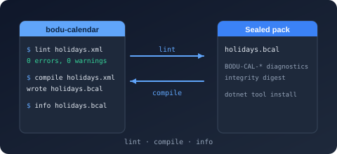<figcaption><code>Bodu.Globalization.Calendar.Tool</code></figcaption></figure>
<figure>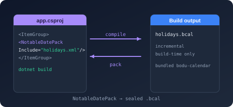<figcaption><code>Bodu.Globalization.Calendar.Build</code></figcaption></figure>
<figure>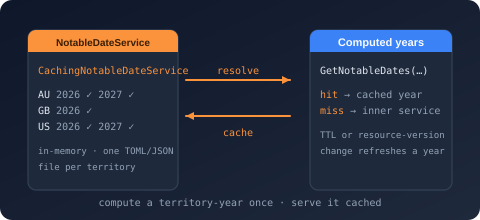<figcaption><code>Bodu.Globalization.Calendar.Caching</code></figcaption></figure>
<figure>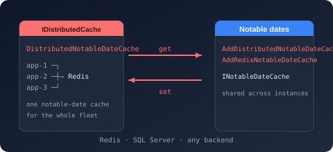<figcaption><code>Bodu.Globalization.Calendar.Caching.Distributed</code></figcaption></figure>
<figure>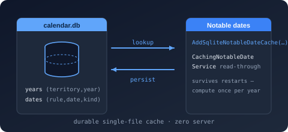<figcaption><code>Bodu.Globalization.Calendar.Caching.Sqlite</code></figcaption></figure>
<figure>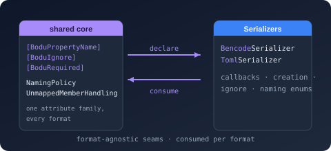<figcaption><code>Bodu.Text.Serialization</code></figcaption></figure>
<figure><figcaption><code>Bodu.Financial.DependencyInjection</code></figcaption></figure>
<figure>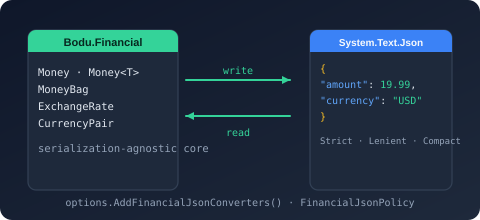<figcaption><code>Bodu.Financial.Serialization.Json</code></figcaption></figure>
<figure><figcaption><code>Bodu.Numerics.Serialization.Json</code></figcaption></figure>
</div>

## File formats and exchange-rate data

Several exchange-rate providers ship as independent packages over a shared `IDatedRateProvider` / `IRateProvider` contract, so consumers pull in only the data sources they need, each paired with an opt-in dependency-injection companion. The contract exposes a symmetric single-date/range lookup matrix (synchronous and asynchronous): single-date getters return a `RateLookupResult` (the resolved rate plus the applied date-resolution and offset), and range getters return a `RateRangeResult` (the rates, the requested window, and the observed span; it is itself an `IReadOnlyList<ExchangeRate>`). The HTTP-backed providers share the `WebRateProvider` base from the `Bodu.Financial.ExchangeRates` infrastructure package and are `IDisposable` — each either builds and owns its `HttpClient` from options (via `RateProviderHttpClientFactory`) or borrows a caller-supplied one. The Reserve Bank of Australia provider sits on a small, strictly layered stack whose lower two layers carry no financial or RBA-specific concepts and can be reused on their own: a generic compound-file reader, and a narrow binary-`.xls` reader built on it. A standalone caching layer can decorate any provider with a shared on-disk TOML cache.

| Package | Status | Purpose | Depends on |
|---|---|---|---|
| `Bodu.IO.Compound` | Stable | Reader and writer for the OLE2 / Compound File Binary (CFB) container — the structured-storage envelope used by legacy Office files. Opens existing containers (exposing the embedded named streams) and authors new ones via `CompoundFile.Create` and the builder API, with no application-format knowledge. | `Bodu.Core` |
| `Bodu.Formats.Excel.Binary` | Stable | Narrow, read-only BIFF8 (`.xls`) reader that surfaces raw worksheet cell values — strings, numbers, booleans, and errors — without formula evaluation, styling, or higher-level interpretation. | `Bodu.IO.Compound`, `Bodu.Core` |
| `Bodu.IO.Pst` | Preview | Low-level, read-only container reader for the Outlook personal-folders format (PST / MS-PST). Reads the Unicode-format node database — header, node and block B-trees, block data with the permute and cyclic encodings decoded and checksums verified, multi-block data trees, and per-node subnode trees — as the substrate a message-level reader builds on. No MAPI semantics and no writing. | `Bodu.Core` |
| `Bodu.Formats.Outlook` | Preview | The shared MAPI value model for the Outlook format readers: property tags and types, decoded property values with a tag-addressed collection, named-property identities, recipient and attachment enumerations, and the shared exception hierarchy. Container-free — the `.msg` and future `.pst` readers build on it rather than owning the model. | `Bodu.Core` |
| `Bodu.Formats.Outlook.Msg` | Preview | Read-only reader for the Outlook message format (`.msg` / MS-OXMSG) over the `Bodu.IO.Compound` OLE2 container. Opens a message as a disposable session exposing every decoded MAPI property, the recipient and attachment tables, nested attached messages, named-property resolution, and the text, HTML, and compressed-RTF bodies — with no MAPI session emulation or message authoring. | `Bodu.IO.Compound`, `Bodu.Formats.Outlook`, `Bodu.Core` |
| `Bodu.Financial.ExchangeRates` | Preview | Web exchange-rate provider infrastructure: the abstract `WebRateProvider` and `PairWebRateProvider<TSeries>` bases every per-source provider package builds on, plus the shared fetch machinery — `WebRateProviderOptions`, single-flight request coalescing (`SingleFlightCoordinator<TKey>`), on-disk raw-response caching (`FileSystemByteCache<TKey>`), `HttpClient` construction (`RateProviderHttpClientFactory`), and the pair-load contracts (`IPairRateLoader`, `IPairRateSource<TSeries>`). Keeps the HTTP machinery out of the core `Bodu.Financial` package. | `Bodu.Financial`, `Bodu.Core`, `Microsoft.Extensions.Logging.Abstractions` |
| `Bodu.Financial.ExchangeRates.DependencyInjection` | Stable | Shared dependency-injection machinery for the web-based exchange-rate providers. Exposes `AddWebRateProvider` on `IFinancialServiceBuilder` (declared in the `Bodu.Financial.ExchangeRates` namespace), handling `HttpClient` configuration with Polly resilience, options binding, and singleton registration so each provider package's own DI registration delegates its plumbing here. | `Bodu.Financial.ExchangeRates`, `Bodu.Financial.DependencyInjection`, `Bodu.Core`, `Microsoft.Extensions.Http.Resilience` |
| `Bodu.Financial.ExchangeRates.Rba` | Stable | Downloads and parses the RBA's published daily exchange-rate `.xls` files, serving them as `ExchangeRate` values through `IDatedRateProvider` / `IRateProvider`, with an async range API and in-memory plus on-disk caching. Includes its own `AddRbaExchangeRates` DI registration (in the `Bodu.Financial.ExchangeRates` namespace), binding `RbaRateProviderOptions` and backing the provider with a configured `HttpClient`. | `Bodu.Formats.Excel.Binary`, `Bodu.Financial.ExchangeRates`, `Bodu.Financial.ExchangeRates`, `Bodu.Financial`, `Bodu.Financial.ExchangeRates.DependencyInjection`, `Bodu.Core` |
| `Bodu.Financial.ExchangeRates.Boe` | Stable | Queries the Bank of England's Interactive Statistical Database (IADB) CSV endpoint for daily spot rates, serving them as `ExchangeRate` values through `IDatedRateProvider` / `IRateProvider`, with an async range API and in-memory plus on-disk caching. Includes its own `AddBoeExchangeRates` DI registration (in the `Bodu.Financial.ExchangeRates` namespace), binding `BoeRateProviderOptions` and backing the provider with a configured `HttpClient`. | `Bodu.Text.Formats`, `Bodu.Financial.ExchangeRates`, `Bodu.Financial.ExchangeRates`, `Bodu.Financial`, `Bodu.Financial.ExchangeRates.DependencyInjection`, `Bodu.Core` |
| `Bodu.Financial.ExchangeRates.Ecb` | Stable | Downloads and parses the ECB's published `eurofxref` euro foreign-exchange reference-rate XML feeds, serving them as `ExchangeRate` values through `IDatedRateProvider` / `IRateProvider`, with an async range API and in-memory plus on-disk caching. Includes its own `AddEcbExchangeRates` DI registration (in the `Bodu.Financial.ExchangeRates` namespace), binding `EcbRateProviderOptions` and backing the provider with a configured `HttpClient`. | `Bodu.Financial.ExchangeRates`, `Bodu.Financial.ExchangeRates`, `Bodu.Financial`, `Bodu.Financial.ExchangeRates.DependencyInjection`, `Bodu.Core` |
| `Bodu.Financial.ExchangeRates.Yahoo` | Stable | Fetches and parses the Yahoo Finance v8 chart JSON service, serving the results as `ExchangeRate` values through `IDatedRateProvider` / `IRateProvider`, with an async range API over arbitrary currency pairs. Includes its own `AddYahooExchangeRates` DI registration (in the `Bodu.Financial.ExchangeRates` namespace), binding `YahooRateProviderOptions` and backing the provider with a configured `HttpClient`. | `Bodu.Financial.ExchangeRates`, `Bodu.Financial.ExchangeRates`, `Bodu.Financial`, `Bodu.Financial.ExchangeRates.DependencyInjection`, `Bodu.Core` |
| `Bodu.Financial.ExchangeRates.Ofx` | Stable | Fetches and parses the OFX (ofx.com) public spot-rate-history JSON service, serving the results as `ExchangeRate` values through `IDatedRateProvider` / `IRateProvider`, with an async range API over arbitrary currency pairs. Includes its own `AddOfxExchangeRates` DI registration (in the `Bodu.Financial.ExchangeRates` namespace), binding `OfxRateProviderOptions` and backing the provider with a configured `HttpClient`. | `Bodu.Financial.ExchangeRates`, `Bodu.Financial.ExchangeRates`, `Bodu.Financial`, `Bodu.Financial.ExchangeRates.DependencyInjection`, `Bodu.Core` |
| `Bodu.Financial.ExchangeRates.Xe` | Stable | Fetches and parses the XE.com charting-rates JSON service, serving the results as `ExchangeRate` values through `IDatedRateProvider` / `IRateProvider`, with an async range API over arbitrary currency pairs; the authorization token the endpoint requires is acquired automatically from the XE website. Includes its own `AddXeExchangeRates` DI registration (in the `Bodu.Financial.ExchangeRates` namespace), binding `XeRateProviderOptions` and backing the provider with a configured `HttpClient`. | `Bodu.Financial.ExchangeRates`, `Bodu.Financial.ExchangeRates`, `Bodu.Financial`, `Bodu.Financial.ExchangeRates.DependencyInjection`, `Bodu.Core` |
| `Bodu.Financial.ExchangeRates.Oanda` | Stable | Fetches and parses the OANDA Historical Currency Converter rate-history JSON service, serving the results as `ExchangeRate` values through `IDatedRateProvider` / `IRateProvider`, with an async range API over arbitrary currency pairs. The anonymous endpoint serves a rolling recent window (roughly the last 180 days), advertised through the provider's `HistoryAvailability`. Includes its own `AddOandaExchangeRates` DI registration (in the `Bodu.Financial.ExchangeRates` namespace), binding `OandaRateProviderOptions` and backing the provider with a configured `HttpClient`. | `Bodu.Financial.ExchangeRates`, `Bodu.Financial.ExchangeRates`, `Bodu.Financial`, `Bodu.Financial.ExchangeRates.DependencyInjection`, `Bodu.Core` |
| `Bodu.Financial.ExchangeRates.Fixer` | Preview | Fetches and parses the Fixer (fixer.io) time-series and single-date JSON endpoints per currency pair, serving the results as `ExchangeRate` values through `IDatedRateProvider` / `IRateProvider`. Requires a Fixer `access_key` on `FixerRateProviderOptions`. Includes its own `AddFixerExchangeRates` DI registration (in the `Bodu.Financial.ExchangeRates` namespace). | `Bodu.Financial.ExchangeRates`, `Bodu.Financial`, `Bodu.Financial.ExchangeRates.DependencyInjection`, `Bodu.Core` |
| `Bodu.Financial.ExchangeRates.ExchangeRateHost` | Preview | Fetches and parses the exchangerate.host time-series and single-date JSON endpoints per currency pair (quotes keyed by concatenated source+quote code), serving the results through `IDatedRateProvider` / `IRateProvider`. Requires an `access_key` on `ExchangeRateHostRateProviderOptions`. Includes its own `AddExchangeRateHostExchangeRates` DI registration (in the `Bodu.Financial.ExchangeRates` namespace). | `Bodu.Financial.ExchangeRates`, `Bodu.Financial`, `Bodu.Financial.ExchangeRates.DependencyInjection`, `Bodu.Core` |
| `Bodu.Financial.ExchangeRates.Fred` | Preview | Fetches and parses the St. Louis Fed FRED `series/observations` JSON endpoint, mapping each currency pair to a FRED `series_id` through `FredRateProviderOptions.SeriesMap` (built-in map for the major USD pairs). Requires an `api_key`. Includes its own `AddFredExchangeRates` DI registration (in the `Bodu.Financial.ExchangeRates` namespace). | `Bodu.Financial.ExchangeRates`, `Bodu.Financial`, `Bodu.Financial.ExchangeRates.DependencyInjection`, `Bodu.Core` |
| `Bodu.Financial.ExchangeRates.Imf` | Preview | Downloads and parses the IMF's monthly Representative Exchange Rates tab-separated report, serving daily USD-anchored rates through `IDatedRateProvider` / `IRateProvider`. A single-base bulk provider over `WebRateProvider` (base USD, cross pairs rejected) that normalizes the report's quotation direction on ingest; keyless, with a per-month on-disk cache. Includes its own `AddImfExchangeRates` DI registration (in the `Bodu.Financial.ExchangeRates` namespace). | `Bodu.Text.Formats`, `Bodu.Financial.ExchangeRates`, `Bodu.Financial`, `Bodu.Financial.ExchangeRates.DependencyInjection`, `Bodu.Core` |
| `Bodu.Financial.ExchangeRates.Caching` | Stable | `CachingRateProvider`, a one-cache-per-provider decorator that wraps any `IDatedRateProvider` and serves fresh rates from a pluggable cache cascade — `InMemoryRateCache` and the on-disk `TomlFileRateCache` (one TOML file per provider and currency pair) — delegating to the inner provider only on a miss; plus `AggregatingRateProvider`, which groups named child providers behind one entry point and combines them with a pluggable strategy (prioritised fallback, averaging, or per-FX-pair routing). Includes its own DI registration (`AddCachedRateProvider`, `AddAggregatedRateProvider`, in the `Bodu.Financial.ExchangeRates` namespace). | `Bodu.Text.Toml`, `Bodu.Financial`, `Bodu.Financial.DependencyInjection`, `Bodu.Core` |
| `Bodu.Financial.ExchangeRates.Caching.Distributed` | Stable | `DistributedRateCache`, an `IRateCache` over a `Microsoft.Extensions.Caching.Distributed.IDistributedCache` (Redis-capable), persisting a provider's dated rates and fetch-coverage windows as a per-pair JSON blob; behaviourally identical to the in-memory, TOML, and SQLite caches and validated against the same `RateCacheContractTests`. Includes its own `AddDistributedRateCache` / `AddRedisRateCache` DI registration (in the `Bodu.Financial.ExchangeRates` namespace). | `Bodu.Financial.ExchangeRates.Caching`, `Bodu.Financial`, `Bodu.Financial.DependencyInjection`, `Bodu.Core`, `Microsoft.Extensions.Caching.Abstractions` |
| `Bodu.Financial.ExchangeRates.Caching.Sqlite` | Stable | `SqliteRateCache`, an `IRateCache` over a SQLite database (via `Microsoft.Data.Sqlite`), persisting a provider's dated rates and fetch-coverage windows in `rates` and `coverage` tables; behaviourally identical to the in-memory and TOML caches and validated against the same `RateCacheContractTests`. Includes its own `AddSqliteRateCache` DI registration (in the `Bodu.Financial.ExchangeRates` namespace), binding `SqliteRateCacheOptions`. | `Bodu.Financial.ExchangeRates.Caching`, `Bodu.Financial`, `Bodu.Financial.DependencyInjection`, `Bodu.Core`, `Microsoft.Data.Sqlite` |

<div class="bodu-matrix-gallery">
<figure>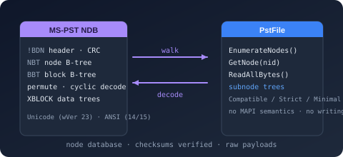<figcaption><code>Bodu.IO.Pst</code></figcaption></figure>
<figure>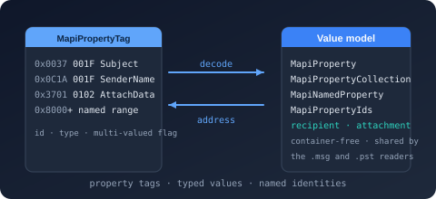<figcaption><code>Bodu.Formats.Outlook</code></figcaption></figure>
<figure>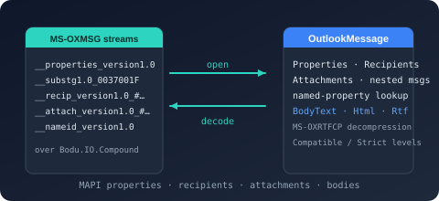<figcaption><code>Bodu.Formats.Outlook.Msg</code></figcaption></figure>
<figure>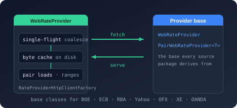<figcaption><code>Bodu.Financial.ExchangeRates</code></figcaption></figure>
<figure><figcaption><code>Bodu.Financial.ExchangeRates.DependencyInjection</code></figcaption></figure>
<figure><figcaption><code>Bodu.Financial.ExchangeRates.Rba</code></figcaption></figure>
<figure><figcaption><code>Bodu.Financial.ExchangeRates.Boe</code></figcaption></figure>
<figure><figcaption><code>Bodu.Financial.ExchangeRates.Ecb</code></figcaption></figure>
<figure><figcaption><code>Bodu.Financial.ExchangeRates.Yahoo</code></figcaption></figure>
<figure><figcaption><code>Bodu.Financial.ExchangeRates.Ofx</code></figcaption></figure>
<figure><figcaption><code>Bodu.Financial.ExchangeRates.Xe</code></figcaption></figure>
<figure><figcaption><code>Bodu.Financial.ExchangeRates.Oanda</code></figcaption></figure>
<figure>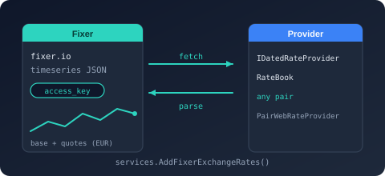<figcaption><code>Bodu.Financial.ExchangeRates.Fixer</code></figcaption></figure>
<figure>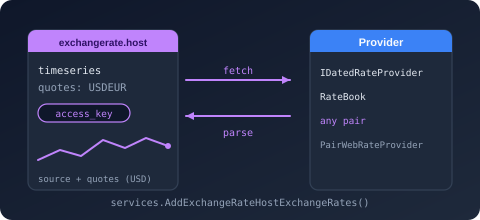<figcaption><code>Bodu.Financial.ExchangeRates.ExchangeRateHost</code></figcaption></figure>
<figure>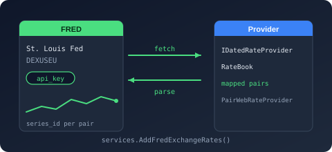<figcaption><code>Bodu.Financial.ExchangeRates.Fred</code></figcaption></figure>
<figure>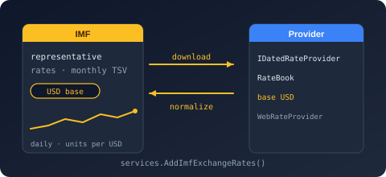<figcaption><code>Bodu.Financial.ExchangeRates.Imf</code></figcaption></figure>
<figure><figcaption><code>Bodu.Financial.ExchangeRates.Caching</code></figcaption></figure>
<figure><figcaption><code>Bodu.Financial.ExchangeRates.Caching.Distributed</code></figcaption></figure>
<figure><figcaption><code>Bodu.Financial.ExchangeRates.Caching.Sqlite</code></figcaption></figure>
</div>

## Calendar data packs

Region-specific public-holiday rules ship as independent NuGet packages — one per region — so consumers pull in only the territories they need. Each is built on the notable-date schema and exposes a `<Region>CalendarData` factory over per-country embedded resource packs.

| Package | Status | Purpose | Depends on |
|---|---|---|---|
| `Bodu.Globalization.Calendar.Americas` | Stable | Curated public-holiday rules for the Americas territory bundle (e.g. `US`, `CA`). | `Bodu.Globalization.Calendar` |
| `Bodu.Globalization.Calendar.AsiaPacific` | Stable | Asia-Pacific bundle (e.g. `AU` with subdivisions, `CN`, `IN`, `JP`, `KR`, `MY`, `NZ`, `SG`). | `Bodu.Globalization.Calendar` |
| `Bodu.Globalization.Calendar.Europe` | Stable | Europe bundle (e.g. `DE`, `ES`, `FR`, `GB`, `IT`, `NL`). | `Bodu.Globalization.Calendar` |
| `Bodu.Globalization.Calendar.Africa` | Stable | Africa bundle (e.g. `ZA`, `NG`, `KE`, `GH`, `ET`, `EG`, `MA`). | `Bodu.Globalization.Calendar` |
| `Bodu.Globalization.Calendar.MiddleEast` | Stable | Middle East bundle (e.g. `AE`, `SA`, `IL`, `TR`, `QA`, `JO`). | `Bodu.Globalization.Calendar` |

<div class="bodu-matrix-gallery">
<figure><figcaption><code>Bodu.Globalization.Calendar.Americas</code></figcaption></figure>
<figure><figcaption><code>Bodu.Globalization.Calendar.AsiaPacific</code></figcaption></figure>
<figure><figcaption><code>Bodu.Globalization.Calendar.Europe</code></figcaption></figure>
<figure><figcaption><code>Bodu.Globalization.Calendar.Africa</code></figcaption></figure>
<figure><figcaption><code>Bodu.Globalization.Calendar.MiddleEast</code></figcaption></figure>
</div>

See the [Calendar introduction](calendar/index.md) for how the companion packages compose with the runtime, and the [data-packs guide](../guides/calendar/data-packs.md) for per-bundle install commands and territory coverage.

## Status meanings

| Status | What it commits to |
|---|---|
| **Stable** | The public API surface is committed. Breaking changes are reserved for a major-version bump; additive changes ship in minor versions; bug fixes in patch versions. |
| **Preview** | The package is published for early evaluation. The public API surface is still taking shape and may change between releases without a major-version bump. |

## Install commands

The standard `dotnet add package` invocation for each shipped package:

```bash
# Primary libraries
dotnet add package Bodu.Core
dotnet add package Bodu.Collections
dotnet add package Bodu.Collections.Concurrent
dotnet add package Bodu.IO.Hashing
dotnet add package Bodu.Security.Cryptography
dotnet add package Bodu.Globalization.Calendar
dotnet add package Bodu.Text.Encoding
dotnet add package Bodu.Text.Filtering
dotnet add package Bodu.Text.Formats
dotnet add package Bodu.Text.Delimited
dotnet add package Bodu.Text.DotEnv
dotnet add package Bodu.Text.Ini
dotnet add package Bodu.Text.Toml
dotnet add package Bodu.Text.Bencode
dotnet add package Bodu.Text.Yaml
dotnet add package Bodu.Text.Configuration
dotnet add package Bodu.Extensions.Configuration.Text
dotnet add package Bodu.Numerics
dotnet add package Bodu.Financial

# Companions
dotnet add package Bodu.Globalization.Calendar.Builder
dotnet add package Bodu.Globalization.Calendar.DependencyInjection
dotnet add package Bodu.Globalization.Calendar.Plugins
dotnet add package Bodu.Globalization.Calendar.Caching
dotnet add package Bodu.Globalization.Calendar.Caching.Distributed
dotnet add package Bodu.Globalization.Calendar.Caching.Sqlite
dotnet add package Bodu.Globalization.Recurrence
dotnet add package Bodu.Text.Serialization
dotnet add package Bodu.Financial.DependencyInjection
dotnet add package Bodu.Financial.Serialization.Json
dotnet add package Bodu.Numerics.Serialization.Json

# File formats and exchange-rate data
dotnet add package Bodu.IO.Compound
dotnet add package Bodu.Formats.Excel.Binary
dotnet add package Bodu.IO.Pst
dotnet add package Bodu.Formats.Outlook
dotnet add package Bodu.Formats.Outlook.Msg
dotnet add package Bodu.Financial.ExchangeRates
dotnet add package Bodu.Financial.ExchangeRates.DependencyInjection
dotnet add package Bodu.Financial.ExchangeRates.Rba
dotnet add package Bodu.Financial.ExchangeRates.Boe
dotnet add package Bodu.Financial.ExchangeRates.Ecb
dotnet add package Bodu.Financial.ExchangeRates.Yahoo
dotnet add package Bodu.Financial.ExchangeRates.Ofx
dotnet add package Bodu.Financial.ExchangeRates.Xe
dotnet add package Bodu.Financial.ExchangeRates.Oanda
dotnet add package Bodu.Financial.ExchangeRates.Fixer
dotnet add package Bodu.Financial.ExchangeRates.ExchangeRateHost
dotnet add package Bodu.Financial.ExchangeRates.Fred
dotnet add package Bodu.Financial.ExchangeRates.Imf
dotnet add package Bodu.Financial.ExchangeRates.Caching
dotnet add package Bodu.Financial.ExchangeRates.Caching.Distributed
dotnet add package Bodu.Financial.ExchangeRates.Caching.Sqlite

# Calendar regional data packs (install only what you need)
dotnet add package Bodu.Globalization.Calendar.Americas
dotnet add package Bodu.Globalization.Calendar.AsiaPacific
dotnet add package Bodu.Globalization.Calendar.Europe
dotnet add package Bodu.Globalization.Calendar.Africa
dotnet add package Bodu.Globalization.Calendar.MiddleEast
```

## Design principles

- **Minimal external runtime dependencies.** Core libraries depend only on the BCL. Extension packages (`Bodu.Extensions.Configuration.Text`, `Bodu.Globalization.Calendar.DependencyInjection`) intentionally bridge to the Microsoft.Extensions ecosystem.
- **Nullable reference types** are enabled throughout. Public APIs declare their null-intent explicitly.
- **Analyzer-clean**: StyleCop, Roslynator, .NET analyzers, AsyncFixer, and Threading analyzers run at build time; doc-comment warnings are treated as errors.
- **Deterministic builds** for reproducible package outputs.
- **Documentation-first**: every public type and member carries XML documentation in US English, which drives the API reference.
- **MIT licensed.**

## Where to go next

- **[Introduction](introduction.md)** — high-level overview of the suite.
- **[Getting started](getting-started.md)** — install and run minimal samples across the suite.
