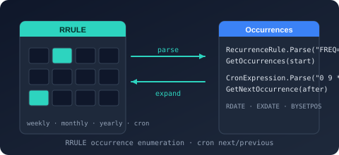

# Bodu.Globalization.Recurrence

**Bodu.Globalization.Recurrence** evaluates recurring schedules expressed in the industry-standard textual grammars — RFC 5545 (iCalendar) recurrence rules, Vixie-style cron expressions, and instant-anchored intervals in the RFC 5545 duration grammar. Every form parses from text, renders back to canonical text, compares by value, and answers the two questions a scheduler asks: *when is the next occurrence?* and *when was the previous one?* It is an independent sibling of the notable-date engine in the **[Globalization & Calendars](../topics/globalization-and-calendars.md)** topic.

The package is published as **Preview**: the API surface is stable enough to evaluate and build on, but may still change between releases without a major-version bump. It depends only on `Bodu.Core` and carries no calendar data.

## The four schedule forms

| Form | Type | Canonical text | Shape |
|---|---|---|---|
| RFC 5545 recurrence rule | <xref:Bodu.Globalization.Recurrence.RecurrenceRule> | `FREQ=WEEKLY;INTERVAL=2;BYDAY=MO,WE,FR` | Calendar-aligned. A base frequency (`DAILY` … `YEARLY`) refined by `INTERVAL`, bounded by `COUNT` or `UNTIL`, and filtered by the `BY*` parts. The rule carries no start of its own — the series start (`DTSTART`) is passed to every query. |
| Composed rule set | <xref:Bodu.Globalization.Recurrence.RecurrenceSet> | An iCalendar property block: `DTSTART`, one or more `RRULE` lines, optional `RDATE` / `EXDATE` | One or more rules anchored at a common start, merged with explicit recurrence dates and with exception dates removed. |
| Cron expression | <xref:Bodu.Globalization.Recurrence.CronExpression> | `0 2 * * MON-FRI`, `*/15 * * * *`, `@daily` | Calendar-aligned. The five-field Vixie layout (<xref:Bodu.Globalization.Recurrence.CronFormat>`.Standard`) or the six-field layout with a leading seconds field (`CronFormat.WithSeconds`), plus the `@yearly` / `@annually`, `@monthly`, `@weekly`, `@daily` / `@midnight`, and `@hourly` macros. |
| Anchored interval | <xref:Bodu.Globalization.Recurrence.AnchoredInterval> | `PT4H`, `P1DT2H30M`, `P2W` | Instant-aligned. Occurrences at `anchor + k·interval` for `k ≥ 1`; the anchor ("the last completed run", "contract start") is supplied to every query and is *not* itself an occurrence. |

## The common contract

Whatever the form, the query surface is the same, so a host can put all four behind one adapter:

- **`GetNextOccurrence(after, inclusive)`** returns the first occurrence strictly after `after` — or at `after` when `inclusive` is `true` — as a nullable value; `null` means the schedule produces nothing further (a `COUNT` exhausted, an `UNTIL` passed, or a cron expression that can never match).
- **`GetPreviousOccurrence(before, inclusive)`** returns the last occurrence strictly before `before` — or at `before` when `inclusive` is `true`. Due-ness is a one-line comparison over this answer: `lastCompleted < schedule.GetPreviousOccurrence(now, inclusive: true)`.
- Both queries have **`DateTime` and `DateTimeOffset` overloads**. The `DateTime` overloads preserve the argument's `Kind`; the `DateTimeOffset` overloads evaluate on the wall-clock time and reattach the argument's offset. The rule-based forms additionally expose windowed and open-ended `GetOccurrences` enumerators.
- **`Parse` / `TryParse`** follow the BCL `IParsable<T>` shape, and every form adds a **`TryParse(s, out result, out failureMessage)`** overload whose message names the specific defect (`The cron field '25' is not valid.`, `The COUNT and UNTIL rule parts cannot both appear in the same rule.`) rather than a generic "invalid format".
- **`ToString()`** renders the canonical text, which re-parses to an equal value; **`Equals`** compares by value, so a host can detect a changed schedule by comparing the parsed objects rather than the raw strings.

### Purity

Every answer is a pure function of its arguments. No member reads the wall clock (`DateTime.Now`, `DateTimeOffset.UtcNow`) or consults the machine time zone (`TimeZoneInfo.Local`); the library's own test suite enforces this with a metadata scan. Consequences:

- Tests are deterministic — supply the "now" you want to test against.
- The library never owns a timer, stores a last-run, or marks an occurrence consumed. Missed occurrences coalesce structurally: an evaluation long after five missed occurrences answers exactly as an evaluation just after the first one, because the answer is an instant, not a backlog.
- Daylight-saving transitions are the caller's concern. The rule-based forms carry no time zone; a host that wants a *local-time* schedule across a transition re-derives the offset on each evaluation and passes it in. See [Core concepts](concepts.md#offsets-and-daylight-saving).

### Independence from the calendar engine

`Bodu.Globalization.Recurrence` and `Bodu.Globalization.Calendar` share no dependency in either direction. The calendar engine's own `<Recurrence>` sources (`<DailyInterval>`, `<Weekly>`, `<MonthlyDay>`, `<MonthlyWeekday>`) are calendar-internal strategies for resolving notable dates; this package is the standalone, data-free scheduling grammar. Calendar-aware filtering of a recurrence stream — "the next weekday occurrence that is not a public holiday" — is composition from outside: enumerate here, filter with a `NotableDateService` there. The [recurrence guide](../../guides/recurrence/index.md#calendar-aware-filtering-is-composition-not-a-feature) shows the pattern.

## Which form do I need?

| Schedule | Reach for | Why |
|---|---|---|
| "Daily at 02:00", "weekdays at 09:00", "every 15 minutes" | `CronExpression` | The operational shapes cron was designed for; the six-field layout adds seconds. |
| "The last Friday of every month", "the second Tuesday", "every other week on Monday and Thursday" | `RecurrenceRule` | `BYDAY` ordinals (`-1FR`, `2TU`), `BYSETPOS`, `INTERVAL`, and the `COUNT` / `UNTIL` bounds. |
| Schedules that must interoperate with iCalendar data (`RRULE` text from a calendar feed) | `RecurrenceRule` / `RecurrenceSet` | The text *is* the RFC 5545 grammar; a set parses the `DTSTART` / `RRULE` / `RDATE` / `EXDATE` block directly. |
| "The Monday rule, plus this extra Thursday, minus the two dates we cancelled" | `RecurrenceSet` | Rules, explicit additions, and exclusions composed into one ascending, duplicate-free stream. |
| "Every 4 hours after the previous run completed" | `AnchoredInterval` | Instant-aligned rather than calendar-aligned — the spacing is measured from an anchor the caller supplies. |
| A schedule bounded to *n* occurrences or an end date | `RecurrenceRule` (`COUNT` / `UNTIL`) | Cron and anchored intervals are unbounded by construction. |

## Main types

| Type | Purpose |
|---|---|
| <xref:Bodu.Globalization.Recurrence.RecurrenceRule> | Immutable RFC 5545 `RRULE`: `Frequency`, `Interval`, `Count`, `Until`, `WeekStart`, and the `BySecond` … `BySetPos` part lists; `Parse` / `TryParse`, `ToString`, and the anchored `GetOccurrences` / `GetNextOccurrence` / `GetPreviousOccurrence` queries. |
| <xref:Bodu.Globalization.Recurrence.RecurrenceRuleBuilder> | Fluent construction of a rule (`WithInterval`, `WithCount` / `WithUntil`, `WithWeekStart`, `ByDay`, `ByMonthDay`, `ByMonth`, `BySetPos`, …) terminated by `Build()`. |
| <xref:Bodu.Globalization.Recurrence.RecurrenceSet> | A start plus rules, explicit dates, and exception dates; parses and formats the iCalendar property block. |
| <xref:Bodu.Globalization.Recurrence.CronExpression> | Parsed Vixie cron with next / previous queries; `Format` reports the layout it was parsed as. |
| <xref:Bodu.Globalization.Recurrence.CronFormat> | `Standard` (five fields) or `WithSeconds` (six fields). |
| <xref:Bodu.Globalization.Recurrence.AnchoredInterval> | A positive whole-second `Interval` whose occurrences are `anchor + k·interval`; canonical text is the RFC 5545 duration grammar. |
| <xref:Bodu.Globalization.Recurrence.RecurrenceFrequency> | `Secondly` … `Yearly` — the `FREQ` scale. Sub-daily frequencies parse and round-trip, but enumerating them is not yet supported. |
| <xref:Bodu.Globalization.Recurrence.WeekDayNum> | One `BYDAY` entry: an `Ordinal` (`0` for every occurrence, `1` for the first, `-1` for the last) and a `Day`. |

## Where to go next

- **[Core concepts](concepts.md)** — occurrence vs. due-ness, anchor / `DTSTART`, inclusive boundaries, `WKST`, the `BY*` parts and `BYSETPOS`, the cron day-field rule and search horizon, the duration grammar, offsets and daylight saving, value equality.
- **[Getting started](getting-started.md)** — install plus a parse → next / previous → enumerate sample for each form, the builder, a set round trip, and defect-naming `TryParse`.
- **[Recurrence and scheduling guide](../../guides/recurrence/index.md)** — choosing a form, the due-ness recipe, calendar-aware filtering by composition, bounded searches, and conformance.
- **[Runnable samples](../../samples/recurrence.md)** — one console project per form plus a scheduling host that puts all four behind one adapter.
- **[Bodu.Globalization.Recurrence API reference](xref:Bodu.Globalization.Recurrence)** — full type-by-type docs.
- **[Globalization & Calendars topic](../topics/globalization-and-calendars.md)** — how this package sits beside the calendar engine and its companions.
