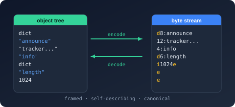

# Bodu.Text.Bencode

**Bodu.Text.Bencode** is a self-contained library for [Bencode (BEP 3)](https://www.bittorrent.org/beps/bep_0003.html), the compact binary encoding used by BitTorrent for `.torrent` metadata and tracker responses. It is one of the three [Bodu serializers](../index.md) and shares the architecture described in the [family introduction](../index.md) (the serializer / DOM / reader-writer tiers, converters, attributes, naming policies) member-for-member with its siblings [Bodu.Text.Toml](../toml/index.md) and [Bodu.Text.Yaml](../yaml/index.md). This page covers what is *specific* to Bencode.

## The format in one paragraph

Bencode has exactly four kinds: **byte strings** (`4:spam`), **integers** (`i42e`), **lists** (`l…e`), and **dictionaries** (`d…e`) whose keys are byte strings in ascending bytewise order. There is no Boolean, no floating-point, no date-time, and no null. Documents are binary, self-framing, and — when the BEP 3 canonical rules are followed — byte-for-byte deterministic for the same data, which is why torrent info-hashes can be computed over the encoded form.

## Byte strings, not text

The native Bencode scalar is a *byte* string, not a character string. <xref:Bodu.Text.Bencode.BencodeSerializer> therefore treats binary data as a first-class citizen:

- `byte[]`, `Memory<byte>`, and `ReadOnlyMemory<byte>` map directly to byte strings with no transcoding or Base64 detour.
- `string` values are written as UTF-8 byte strings.
- `enum` values are written as member-name byte strings.

This makes Bencode a natural fit for payloads that mix identifiers with raw hashes or binary blobs — the torrent `pieces` field being the canonical example.

## Canonical output

The writer always emits canonical BEP 3: dictionary entries appear in ascending bytewise key order regardless of member declaration order, integers carry no leading or negative zeros, and a `null` member is omitted. The reader is equally strict by default — it accepts only canonical input (unique ascending keys, a single root, no trailing bytes), so a successful round trip is byte-identical. Two opt-in switches relax the *read* path alone for documents from older, looser encoders — `AllowUnsortedKeys` and `AllowDuplicateKeys` on <xref:Bodu.Text.Bencode.BencodeSerializerOptions> — while the writer stays unconditionally canonical. The library's conformance is audited in the [BEP 3 compliance review](../../../reviews/bencode-bep3-compliance-review.md).

## What Bencode cannot represent

Because the format has only four kinds, several everyday .NET types have **no native Bencode form**. The serializer refuses to guess: serializing such a member fails with `NotSupportedException` ("No converter is configured for type '…'") unless a converter supplies a representation.

| .NET kind | Native form | Bridge |
|---|---|---|
| `bool` | none | a [custom converter](../../../guides/serialization/bencode/converters.md) — e.g. map to `i0e` / `i1e` |
| `double` / `float` / `decimal` | none | a custom converter — e.g. a scaled integer or a byte string |
| `DateTime` / `DateTimeOffset` / `DateOnly` / `TimeOnly` | none | a custom converter — e.g. Unix seconds as an integer |
| `null` values | none | omitted on write by design |

The library never invents a lossy representation on your behalf; the choice of encoding for these kinds is yours, made explicit through a <xref:Bodu.Text.Bencode.Serialization.BencodeConverter`1>.

## Headline types

| Type | Purpose |
|---|---|
| <xref:Bodu.Text.Bencode.BencodeSerializer> | `Serialize` / `Deserialize<T>` over `byte[]`, `ReadOnlySpan<byte>`, `IBufferWriter<byte>`, and `Stream` (with async variants), plus the DOM bridges `SerializeToNode` / `SerializeToDocument` and `Deserialize<T>(BencodeNode)`. |
| <xref:Bodu.Text.Bencode.BencodeSerializerOptions> | Converters, naming policy, case-insensitive matching, ignore conditions, unmapped-member and object-creation policy, read-path leniency (`AllowUnsortedKeys` / `AllowDuplicateKeys`), depth. |
| <xref:Bodu.Text.Bencode.NamingPolicy> | Property-name policy: `CamelCase`, `SnakeCaseLower`, `SnakeCaseUpper`, `KebabCaseLower`, `KebabCaseUpper`. |
| <xref:Bodu.Text.Bencode.Serialization.BencodeConverter`1> | Base class for a custom converter over the reader/writer pair; attach one to a member or type with <xref:Bodu.Text.Bencode.Serialization.ConverterAttribute>. Built-in enum converters: <xref:Bodu.Text.Bencode.Serialization.BencodeStringEnumConverter> and <xref:Bodu.Text.Bencode.Serialization.BencodeNumberEnumConverter`1>. |
| <xref:Bodu.Text.Bencode.Nodes.BencodeNode> | Mutable DOM — `Parse`, index, mutate, write back. |
| <xref:Bodu.Text.Bencode.Document.BencodeDocument> | Read-only, low-allocation DOM walked through `RootElement`. |
| <xref:Bodu.Text.Bencode.Reader.Utf8BencodeReader> / <xref:Bodu.Text.Bencode.Writer.Utf8BencodeWriter> | Forward-only, allocation-free `ref struct` token machines. |
| <xref:Bodu.Text.Bencode.BencodeFormatException> / <xref:Bodu.Text.Bencode.BencodeSerializationException> | Malformed input vs a value that cannot bind. |

## Common scenarios

| You want to… | Use |
|---|---|
| Encode or decode torrent-style metadata | `BencodeSerializer.Serialize` / `Deserialize<T>` |
| Inspect a `.torrent` file without a model | <xref:Bodu.Text.Bencode.Document.BencodeDocument> and `RootElement` |
| Edit one dictionary entry and write the document back | <xref:Bodu.Text.Bencode.Nodes.BencodeNode> |
| Carry raw hashes alongside text fields | `byte[]` members — they map straight to byte strings |
| Produce deterministic bytes for hashing or signing | the canonical writer — output order is independent of member order |
| Represent a `bool` or timestamp on the wire | a [custom converter](../../../guides/serialization/bencode/converters.md) |

## Where to go next

- **[Bodu serializers introduction](../index.md)** — the shared shape: tiers, converters, attributes, callbacks, naming policies.
- **[Core concepts](concepts.md)** — the Bencode vocabulary, including the full Bencode value-mapping table.
- **[Getting started](getting-started.md)** — install and the first round trip.
- **[Using Bencode](../../../guides/serialization/bencode/using.md)** — worked patterns: type mapping, converters for unrepresentable kinds, both DOMs, raw tokens.
- **[BEP 3 compliance review](../../../reviews/bencode-bep3-compliance-review.md)** — the standards audit behind the canonical-output claims.
- **API reference** — <xref:Bodu.Text.Bencode>.
