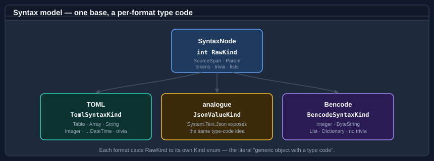
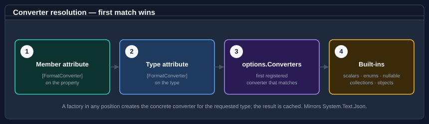

# Core concepts

A small vocabulary explains how the serializer is put together. The engine is format-agnostic; everything format-specific lives behind two seams.

## The "type code" syntax tree

Every parsed document is a **concrete syntax tree** of <xref:Bodu.Text.Serialization.Syntax.SyntaxNode>. The base node carries an integer <xref:Bodu.Text.Serialization.Syntax.SyntaxNode.RawKind> — a "type code" — plus a `SourceSpan` and a parent link. Each format maps the raw code onto its own strongly-typed `Kind` enumeration (`TomlSyntaxKind`, `BencodeSyntaxKind`), exactly as `System.Text.Json` exposes a `JsonValueKind`.

The tree is **lossless**. A text format such as TOML retains the source so `TomlSyntaxTree.Parse(s).ToFullString()` reproduces `s` exactly; a binary format such as Bencode re-encodes its canonical values so `BencodeSyntaxTree.Parse(b).ToByteArray()` reproduces `b`.

## The adapter seam

Converters never touch a format directly. They read and write **format-neutral value tokens** — start object, property name, string, int64, and so on — through <xref:Bodu.Text.Serialization.ISerializationReader> and <xref:Bodu.Text.Serialization.ISerializationWriter>. The token kinds are the <xref:Bodu.Text.Serialization.SerializationValueKind> enumeration. Each format implements the two interfaces over its CST, so a converter written against the seam works for every format.

## Converters and resolution

A <xref:Bodu.Text.Serialization.FormatConverter`1> converts one type; a <xref:Bodu.Text.Serialization.FormatConverterFactory> produces converters for a family (every `Nullable<T>`, every enum, every collection). For a given type the engine resolves a converter by checking, in order: a member-level <xref:Bodu.Text.Serialization.FormatConverterAttribute>, a type-level attribute, the converters registered on the options, then the built-ins. The result is cached.

## Options

<xref:Bodu.Text.Serialization.FormatSerializerOptions> holds the converter list, the <xref:Bodu.Text.Serialization.FormatNamingPolicy>, the <xref:Bodu.Text.Serialization.FormatNullHandling> policy, and the maximum depth. An options instance becomes read-only the first time it is used, and caches its resolved converters and type metadata — so reuse one configured options object across many operations. Each format subclasses it (`TomlSerializerOptions`, `BencodeSerializerOptions`) to add its own settings.

## Errors

A malformed document raises a format-specific parse exception (`TomlFormatException`, `BencodeFormatException`). A document that parses but cannot bind to your type — a type mismatch, a missing required member, a value the format cannot represent — raises <xref:Bodu.Text.Serialization.FormatSerializationException>.
