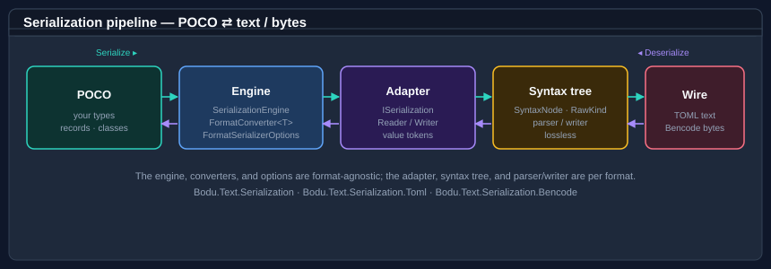

# Bodu.Text.Serialization

**Bodu.Text.Serialization** is the object-mapping layer of the Bodu suite: a [`System.Text.Json`](https://learn.microsoft.com/dotnet/api/system.text.json.jsonserializer)-style serializer that maps your own types (POCOs, records, collections) to and from document formats. It ships as a shared engine plus one package per format:

| Package | Namespace | Format | Entry point |
|---|---|---|---|
| **Bodu.Text.Serialization** | <xref:Bodu.Text.Serialization> | *(shared engine — converters, options, syntax tree)* | — |
| **Bodu.Text.Serialization.Toml** | <xref:Bodu.Text.Serialization.Toml> | [TOML](https://toml.io/) v1.0.0 / v1.1.0 (text) | <xref:Bodu.Text.Serialization.Toml.TomlSerializer> |
| **Bodu.Text.Serialization.Bencode** | <xref:Bodu.Text.Serialization.Bencode> | [Bencode (BEP 3)](https://www.bittorrent.org/beps/bep_0003.html) (binary) | <xref:Bodu.Text.Serialization.Bencode.BencodeSerializer> |

It complements [`Bodu.Text.Formats`](../formats/index.md): where the Formats package gives you a document model to walk by hand, the Serialization package binds documents straight to your types.

## Core mental model

A single, format-agnostic engine drives every format. It resolves a converter for your type, then reads or writes **format-neutral value tokens** through an adapter seam. Each format supplies that adapter over its own **concrete syntax tree (CST)**, and a parser/writer turns the CST into text or bytes. The shape generalises: TOML (text, with trivia) and Bencode (binary, canonical) are two adapters over the same engine.

## Headline types

### `Bodu.Text.Serialization`

| Type | Purpose |
|---|---|
| <xref:Bodu.Text.Serialization.FormatConverter`1> | Base for a custom converter — the `JsonConverter<T>` analogue. |
| <xref:Bodu.Text.Serialization.FormatConverterFactory> | Produces converters for a family of types (nullable, enum, collection). |
| <xref:Bodu.Text.Serialization.FormatSerializerOptions> | Converters, naming policy, null handling, and depth — the `JsonSerializerOptions` analogue. |
| <xref:Bodu.Text.Serialization.FormatNamingPolicy> | Camel, snake, and kebab casing policies. |
| <xref:Bodu.Text.Serialization.Syntax.SyntaxNode> | Base CST node carrying the integer `RawKind` "type code". |

### Format serializers

| Type | Purpose |
|---|---|
| <xref:Bodu.Text.Serialization.Toml.TomlSerializer> | `Serialize` / `Deserialize` for TOML (string, `TextWriter`, `Stream`). |
| <xref:Bodu.Text.Serialization.Bencode.BencodeSerializer> | `Serialize` / `Deserialize` for Bencode (`byte[]`, `IBufferWriter<byte>`, `Stream`). |

## Common scenarios

| You want to… | Use |
|---|---|
| Map a config record to and from TOML | `TomlSerializer.Serialize` / `Deserialize<T>` |
| Encode a torrent-style object to Bencode bytes | `BencodeSerializer.Serialize` / `Deserialize<T>` |
| Rename members on the wire | <xref:Bodu.Text.Serialization.FormatPropertyNameAttribute> or a <xref:Bodu.Text.Serialization.FormatNamingPolicy> |
| Control how a tricky type is written | a <xref:Bodu.Text.Serialization.FormatConverter`1> |
| Reproduce a parsed document exactly | `TomlSyntaxTree.Parse(...).ToFullString()` / `BencodeSyntaxTree.Parse(...).ToByteArray()` |

## Where to go next

- **[Core concepts](concepts.md)** — the syntax tree, the adapter seam, converter resolution, and the options model.
- **[Getting started](getting-started.md)** — install and the first round trip.
- **Guides** — [TOML](../../guides/serialization/toml.md), [Bencode](../../guides/serialization/bencode.md), and [writing converters](../../guides/serialization/converters.md).
