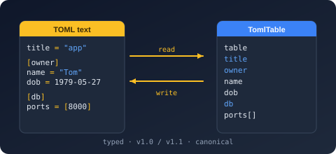

# Bodu.Text.Toml

**Bodu.Text.Toml** is a self-contained library for [TOML](https://toml.io/) v1.0.0 and v1.1.0, the human-readable configuration format built around typed key/value pairs and tables. It is one of the three [Bodu serializers](../index.md) — it shares the architecture described in the [family introduction](../index.md) (the serializer / DOM / reader-writer tiers, converters, attributes, naming policies) with its sibling libraries [Bodu.Text.Bencode](../bencode/index.md) and [Bodu.Text.Yaml](../yaml/index.md), so the family vocabulary applies here unchanged. This page covers what is *specific* to TOML.

## The format in one paragraph

TOML is a text format aimed squarely at configuration files: obvious to read, typed without annotations, and table-structured. It has a rich native value model — strings, integers, floats (including `inf` / `nan`), Booleans, arrays, tables, arrays of tables, and the four RFC 3339 date-time forms (offset date-time, local date-time, local date, local time). The document root is always a table, so the type you serialize at the root must map to an object; a top-level scalar or array throws.

## A rich native value model

Because TOML carries real scalar kinds, most everyday .NET types map without converters:

- `bool` → boolean; `double` / `float` / `Half` → float; the integer family → integer (within the i64 range).
- `DateTimeOffset`, `DateTime`, `DateOnly`, and `TimeOnly` map one-to-one onto the four RFC 3339 date-time forms — no string conventions to invent.
- `string`, `char`, `Guid`, `Uri`, and `Version` → string; `TimeSpan` → the invariant `"c"`-format string.
- `decimal` and `byte[]` have two representations each, selected on the options: <xref:Bodu.Text.Toml.TomlDecimalHandling> chooses between a native (binary64-bounded) float and a lossless string, and <xref:Bodu.Text.Toml.TomlByteArrayHandling> chooses between an integer array and a Base64 string.

TOML has no null, so a `null` member is omitted on write by default. The full per-type catalog lives in the [type-mapping table](../../../guides/serialization/toml/using.md) and the [built-in converter catalog](../../../guides/serialization/toml/builtin-converters.md).

## Spec versions

<xref:Bodu.Text.Toml.TomlSpecVersion> on the options selects the grammar the reader enforces. The default is strict **v1.0.0**; opting in to **v1.1.0** additionally accepts the `\e` and `\xHH` escapes, time values without seconds, and multi-line and trailing-comma inline tables. The writer always emits output valid under *both* versions, so produced documents never lock consumers into the newer grammar.

## Diagnostics with positions

TOML files are edited by hand, so parse failures must point at the offending line. A malformed document raises <xref:Bodu.Text.Toml.TomlFormatException> carrying the **line, column, and byte offset**; a document that parses but cannot bind to your type raises <xref:Bodu.Text.Toml.TomlSerializationException>.

## Headline types

| Type | Purpose |
|---|---|
| <xref:Bodu.Text.Toml.TomlSerializer> | `Serialize` to `string` / `IBufferWriter<byte>` (UTF-8), or to a `Stream` via `SerializeAsync`; `Deserialize<T>` from `string` / `ReadOnlySpan<byte>` / `Stream` (with `DeserializeAsync`). |
| <xref:Bodu.Text.Toml.TomlSerializerOptions> | Converters, naming policy, ignore conditions, `SpecVersion`, `ByteArrayHandling`, `DecimalHandling`, depth. |
| <xref:Bodu.Text.Toml.Serialization.TomlConverter`1> | Base class for a custom converter over the reader/writer pair. |
| <xref:Bodu.Text.Toml.Nodes.TomlNode> | Mutable DOM — `Parse`, index, mutate, write back. |
| <xref:Bodu.Text.Toml.Document.TomlDocument> | Read-only, low-allocation DOM walked through `RootElement`. |
| <xref:Bodu.Text.Toml.Reader.Utf8TomlReader> / <xref:Bodu.Text.Toml.Writer.Utf8TomlWriter> | Forward-only, allocation-free `ref struct` token machines. |
| <xref:Bodu.Text.Toml.TomlFormatException> / <xref:Bodu.Text.Toml.TomlSerializationException> | Malformed input (with line/column/offset) vs a value that cannot bind. |

## Common scenarios

| You want to… | Use |
|---|---|
| Load an application's `.toml` configuration into a typed record | `TomlSerializer.Deserialize<T>` |
| Emit configuration a human will edit | `TomlSerializer.Serialize` — canonical output in document order, `[TomlPropertyOrder]` honored |
| Patch one value in an existing file without a model | <xref:Bodu.Text.Toml.Nodes.TomlNode> — index, mutate, write back |
| Inspect a document with minimal allocation | <xref:Bodu.Text.Toml.Document.TomlDocument> and `RootElement` |
| Accept TOML v1.1.0 input | `SpecVersion = TomlSpecVersion.V1_1` on the options |
| Keep `decimal` values lossless on the wire | `DecimalHandling = TomlDecimalHandling.String` |

## Where to go next

- **[Bodu serializers introduction](../index.md)** — the shared shape: tiers, converters, attributes, callbacks, naming policies.
- **[Core concepts](concepts.md)** — the TOML vocabulary, including the full value-mapping table.
- **[Getting started](getting-started.md)** — install and the first round trip.
- **[Using TOML](../../../guides/serialization/toml/using.md)** — worked patterns: type mapping, spec-version selection, both DOMs, raw tokens.
- **API reference** — <xref:Bodu.Text.Toml>.
