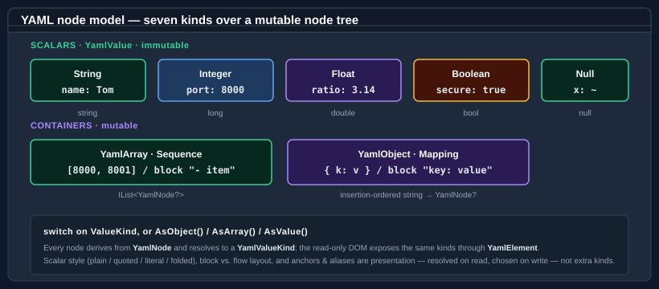

# Core concepts

This page describes the moving parts of **Bodu.Text.Yaml** — the serializer, the converter model, the two DOMs, and the reader/writer seam. The library keeps the [Bodu serializer family](../index.md) architecture but tunes its serializer surface to YAML; where a feature the [TOML](../toml/index.md) and [Bencode](../bencode/index.md) siblings carry has no equivalent here, that is called out below.

Part of the **[Text & Serialization](../../topics/text-and-serialization.md)** topic.

## The serializer

The static <xref:Bodu.Text.Yaml.YamlSerializer> is the high-level entry point. `Serialize` writes an object graph to YAML; `Deserialize<T>` binds YAML back to a type. Its surface is deliberately narrow — string text and UTF-8 bytes, with **no `Stream` overloads and no async API**:

- `Serialize<T>(T value, YamlSerializerOptions? options = null)` → `string`, and `Serialize(object? value, Type inputType, …)` → `string` for a runtime-typed value.
- `Deserialize<T>(string yaml, …)` → `T?` and `Deserialize<T>(ReadOnlySpan<byte> utf8Yaml, …)` → `T?`, plus `Deserialize(ReadOnlySpan<byte> utf8Yaml, Type returnType, …)` → `object?`.

`Deserialize<T>` returns a **nullable** `T?` — a top-level null scalar binds to `null`. Use the null-forgiving `!` where you know the document is non-null.

```csharp
using Bodu.Text.Yaml;

string yaml = YamlSerializer.Serialize(new ServerConfig { Host = "localhost", Port = 8080 });
ServerConfig config = YamlSerializer.Deserialize<ServerConfig>(yaml)!;
```

## Options

<xref:Bodu.Text.Yaml.YamlSerializerOptions> configures the serializer. The real properties are:

| Property | Effect |
|---|---|
| `PropertyNamingPolicy` | The <xref:Bodu.Text.Yaml.YamlNamingPolicy> applied to member names (`null` keeps the declared name). |
| `IncludeFields` | When `true`, public fields participate alongside properties. |
| `IgnoreNullValues` | When `true`, members whose value is `null` are omitted on write. |
| `WriteEnumsAsStrings` | When `true` (the default), enums write as member-name strings; when `false`, as integers. |
| `PropertyNameCaseInsensitive` | When `true`, mapping keys match members case-insensitively on read. |
| `SpecVersion` | <xref:Bodu.Text.Yaml.YamlSpecVersion> — `V1_2` (default) or `V1_1`. |
| `NumberHandling` | <xref:Bodu.Text.Yaml.YamlNumberHandling> — `Strict` (default) or `AllowFloatToInteger`. |
| `DuplicateKeyBehavior` | <xref:Bodu.Text.Yaml.YamlDuplicateKeyBehavior> — `Throw` (default), `UseFirst`, or `UseLast`. |
| `MergeKeyBehavior` | <xref:Bodu.Text.Yaml.YamlMergeKeyBehavior> — `Expand` (default), `Disabled`, or `PreserveAsNormalKey`. |
| `UnmappedMemberHandling` | <xref:Bodu.Text.Yaml.YamlUnmappedMemberHandling> — `Skip` (default) or `Disallow`. |
| `MaxDepth` | Maximum nesting depth; default 64. |
| `Converters` | The ordered list of custom <xref:Bodu.Text.Yaml.Serialization.YamlConverter> instances. |

An options instance becomes read-only the first time it is used — or eagerly via `MakeReadOnly()` (`IsReadOnly` reports the state) — and then caches its resolved converters and type metadata. **Configure one options object and reuse it** across many operations; constructing fresh options per call discards the caches.

## Converters and resolution



A <xref:Bodu.Text.Yaml.Serialization.YamlConverter`1> converts one type. It reads from a <xref:Bodu.Text.Yaml.Document.YamlElement> (the already-parsed value) and writes through the <xref:Bodu.Text.Yaml.Writer.Utf8YamlWriter>:

```csharp
public abstract T? Read(YamlElement element, YamlSerializerOptions options);
public abstract void Write(ref Utf8YamlWriter writer, T value, YamlSerializerOptions options);
```

For a given type the serializer resolves a converter by checking, in order:

1. the first matching converter in `options.Converters`;
2. the built-in converters.

The first match wins, and the result is cached on the options. **There is no member-level or type-level converter attribute, and no converter factory** — those exist on the TOML and Bencode siblings but not here. One `YamlConverter<T>` handles exactly one type (`CanConvert` defaults to an exact-type check); register it on `options.Converters`. To shape members without a custom converter, use the naming policy, the `[YamlPropertyName]` / `[YamlIgnore]` attributes, and the options flags.

## The document object models

When you do not want a model, two DOMs serve the same documents:

- **Mutable** — <xref:Bodu.Text.Yaml.Nodes.YamlNode> / <xref:Bodu.Text.Yaml.Nodes.YamlObject> / <xref:Bodu.Text.Yaml.Nodes.YamlArray> / <xref:Bodu.Text.Yaml.Nodes.YamlValue>. `YamlNode.Parse(string)` builds the tree; index into it with `[int]` / `[string]`, build scalars with `YamlValue.Create(…)`, and write it back with `ToYamlString()` (or `WriteTo(ref Utf8YamlWriter)`).
- **Read-only** — <xref:Bodu.Text.Yaml.Document.YamlDocument> / <xref:Bodu.Text.Yaml.Document.YamlElement> / <xref:Bodu.Text.Yaml.Document.YamlProperty>. A low-allocation view over a parsed buffer, walked through `RootElement`. `YamlDocument` is `IDisposable` — a document you parse is caller-owned, so dispose it when finished. `ParseAllDocuments` returns every document in a multi-document stream.

Typed access on a `YamlElement` goes through `GetString` / `GetInt64` / `GetDouble` / `GetBoolean`, with `GetProperty` / `TryGetProperty`, `EnumerateMapping`, `GetSequenceLength` / `EnumerateSequence`, the `[int]` indexer, and `ValueKind` / `ScalarStyle`.

## The buffered reader and the writer

<xref:Bodu.Text.Yaml.Reader.Utf8YamlReader> and <xref:Bodu.Text.Yaml.Writer.Utf8YamlWriter> are forward-only `ref struct` token machines, and the surface every converter receives. Two YAML-specific points:

- **The reader is buffered**, not a single-pass streaming scanner. Because YAML's anchors, aliases, and merge keys require a resolved tree, the reader parses the input into an in-memory node store and then walks it as a token stream — exposing the current token through `TokenType` with `Read()`, `GetString()` / `GetInt64()` / `GetDouble()` / `GetBoolean()`, and `CurrentDepth`. <xref:Bodu.Text.Yaml.Reader.YamlReaderOptions> mirrors the relevant options (`SpecVersion`, `DuplicateKeyBehavior`, `MergeKeyBehavior`, `MaxDepth`).
- **The writer emits block-style YAML.** Collections are written in block form for readability; only empty containers fall back to flow `[]` / `{}`. <xref:Bodu.Text.Yaml.Writer.YamlWriterOptions> sets `IndentSize` (default 2), `MaxDepth`, and `NewLine`.

## Value mapping

The serializer maps the BCL types it can represent natively and reads `object`-typed members back as a `YamlElement`:

- `string` / `char` / `Guid` / `Uri` and the integer family → string or integer scalars; `double` / `float` → float scalars; `bool` → a Boolean scalar; `null` → the null scalar.
- Enums → member-name strings (or integers when `WriteEnumsAsStrings` is `false`).
- Collections → sequences; dictionaries and plain objects → mappings, in insertion order.
- An `object`-typed member writes its runtime type and reads back as a <xref:Bodu.Text.Yaml.Document.YamlElement>. Public fields participate when `IncludeFields` is set.

The full per-type catalog is in the [built-in converter catalog](../../../guides/serialization/yaml/builtin-converters.md).

## Multi-document streams

A YAML stream may carry several documents separated by `---` and optionally terminated by `...`. <xref:Bodu.Text.Yaml.Document.YamlDocument.ParseAllDocuments*> returns every document; the single-document `Parse` and the serializer's `Deserialize<T>` read the first document only.

## Errors

A malformed document raises <xref:Bodu.Text.Yaml.YamlFormatException>, carrying `LineNumber`, `ColumnNumber`, and `Offset`. A document that parses but cannot bind — a kind mismatch, a value the format cannot represent, or an unmapped member under `Disallow` — raises <xref:Bodu.Text.Yaml.YamlSerializationException>, carrying `Offset`, `LineNumber`, `ColumnNumber`, and a dotted member `Path`.

## Where to go next

- **[Bodu.Text.Yaml introduction](index.md)** — the format specifics: presentation, spec versions, and multi-document streams.
- **[Getting started](getting-started.md)** — install and the first round trip.
- **[Using YAML](../../../guides/serialization/yaml/using.md)** — worked patterns across the serializer and both DOMs.
- **[Writing converters](../../../guides/serialization/yaml/converters.md)** and the **[built-in converter catalog](../../../guides/serialization/yaml/builtin-converters.md)**.
- **[Bodu serializers introduction](../index.md)** and the **[guides hub](../../../guides/serialization/index.md)**.
- **API reference** — <xref:Bodu.Text.Yaml>.
