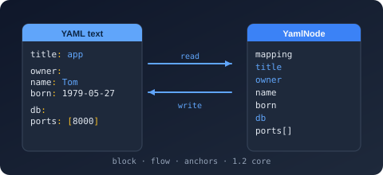

# Bodu.Text.Yaml

**Bodu.Text.Yaml** is a self-contained library for [YAML](https://yaml.org/), the indentation-structured document format. It is the third member of the [Bodu serializer family](../index.md), alongside [Bodu.Text.Toml](../toml/index.md) and [Bodu.Text.Bencode](../bencode/index.md). It keeps the family architecture — a static serializer façade, a mutable DOM, a read-only DOM, and a low-level reader/writer pair — but **tunes the serializer surface to YAML**: there is no converter-attribute, converter-factory, callback, or wider attribute family here. Member shaping is the naming policies, the `[YamlPropertyName]` / `[YamlIgnore]` attributes, the options flags, and custom `YamlConverter<T>` converters. In their place YAML adds its own presentation richness. This page covers what is *specific* to YAML.

## The format in one paragraph

YAML is a text format built around indentation rather than brackets: a mapping is a block of `key: value` lines, a sequence is a block of `- item` lines, and nesting is expressed by indenting. It also offers a flow form (`{a: 1}`, `[1, 2]`), quoted and block scalars, comments (`#`), reusable anchors (`&a`) and aliases (`*a`), document directives (`%YAML`, `%TAG`), and multi-document streams delimited by `---` and `...`. Bodu.Text.Yaml implements the **Bodu YAML Core Tree Profile**: a YAML 1.2 core-schema, JSON-compatible tree where mapping keys resolve to unique scalar strings, anchors are unique and acyclic (resolved transparently on read), and tabs are rejected as indentation.

## The node and value model

Under the surface presentation, every YAML document is a tree of three node shapes — a **mapping** (key/value pairs), a **sequence** (an ordered list), and a **scalar** (a single value). The scalar resolves to one of the core kinds the profile recognises, surfaced as <xref:Bodu.Text.Yaml.YamlValueKind>:

| Kind | YAML | Example |
|---|---|---|
| `Mapping` | block or flow mapping | `host: localhost` |
| `Sequence` | block or flow sequence | `- a` / `[a, b]` |
| `String` | plain, quoted, or block scalar | `name: Ada` |
| `Integer` | integer scalar | `port: 8080` |
| `Float` | float scalar | `ratio: 1.5` |
| `Boolean` | `true` / `false` (plus 1.1 forms) | `enabled: true` |
| `Null` | the null scalar (`null`, `~`, or empty) | `value:` |

The same kinds drive the token stream (<xref:Bodu.Text.Yaml.YamlTokenType>) that the reader and writer exchange.

## Presentation is resolved, not stored

YAML carries presentation information a JSON-style tree does not. Bodu.Text.Yaml resolves it on read and chooses it on write rather than exposing each variant as a distinct value kind:

- **Scalar styles** — plain, single- and double-quoted, literal (`|`) and folded (`>`) block scalars. The five presentations plus the `Any` "writer chooses" sentinel are enumerated by <xref:Bodu.Text.Yaml.YamlScalarStyle>; <xref:Bodu.Text.Yaml.Document.YamlElement.ScalarStyle> records the original style of a parsed scalar (and reports `Any` for a non-scalar node). Block scalars carry a chomping indicator — `Clip` / `Strip` / `Keep` — modelled by <xref:Bodu.Text.Yaml.YamlBlockChomping>.
- **Block vs. flow** — the writer emits block-style collections for readability, falling back to flow `[]` / `{}` only for empty containers, and writes a scalar plain unless plain rendering would change its meaning, in which case it double-quotes and escapes. There is no public scalar-style control on the write path.
- **Anchors and aliases** — `&a` defines an anchor, `*a` references it; the reader resolves aliases transparently into the composed tree (they must be unique and acyclic, or a <xref:Bodu.Text.Yaml.YamlFormatException> is raised).

## Spec versions: 1.2 core, opt-in 1.1

Parsing defaults to the strict **1.2 core schema**, where only `true` / `false` are Booleans — this sidesteps the well-known "Norway problem", in which YAML 1.1 silently reads unquoted `no` as `false`. Setting <xref:Bodu.Text.Yaml.YamlSerializerOptions.SpecVersion> to <xref:Bodu.Text.Yaml.YamlSpecVersion.V1_1> additionally accepts the `yes` / `no` / `on` / `off` / `y` / `n` Boolean spellings, leading-zero octal integers, and sexagesimal (base-60) numbers, and enables YAML 1.1 **merge keys** (`<<`) through <xref:Bodu.Text.Yaml.YamlMergeKeyBehavior>. The version controls only *implicit scalar typing*; anchors, aliases, and the hex (`0x`) and `0o`-octal integer forms are recognised under both. A `%YAML` directive overrides the typing per document.

## Multi-document streams

A single YAML stream can hold several documents separated by `---` (and optionally terminated by `...`). <xref:Bodu.Text.Yaml.Document.YamlDocument.ParseAllDocuments*> returns every document as an `IReadOnlyList<YamlDocument>`; the single-document `Parse` and the serializer's `Deserialize<T>` read the first.

## Diagnostics with positions

YAML is edited by hand, so failures point at the offending location. A malformed document raises <xref:Bodu.Text.Yaml.YamlFormatException> carrying the **line, column, and byte offset**; a document that parses but cannot bind to your type raises <xref:Bodu.Text.Yaml.YamlSerializationException>, which carries the offset and a dotted member `Path`.

## Headline types

| Type | Purpose |
|---|---|
| <xref:Bodu.Text.Yaml.YamlSerializer> | `Serialize` to a `string` (from a typed value or an `object` + `Type`); `Deserialize<T>` from a `string` or `ReadOnlySpan<byte>` (UTF-8). |
| <xref:Bodu.Text.Yaml.YamlSerializerOptions> | Naming policy, converters, `IncludeFields`, `IgnoreNullValues`, `WriteEnumsAsStrings`, `PropertyNameCaseInsensitive`, `SpecVersion`, `NumberHandling`, `DuplicateKeyBehavior`, `MergeKeyBehavior`, `UnmappedMemberHandling`, `MaxDepth`. Frozen on first use. |
| <xref:Bodu.Text.Yaml.YamlNamingPolicy> | `CamelCase`, `SnakeCaseLower`, `KebabCaseLower`. |
| <xref:Bodu.Text.Yaml.Serialization.YamlConverter`1> | Base class for a custom per-type converter, reading a <xref:Bodu.Text.Yaml.Document.YamlElement> and writing through the <xref:Bodu.Text.Yaml.Writer.Utf8YamlWriter>. |
| <xref:Bodu.Text.Yaml.Nodes.YamlNode> | Mutable DOM — `Parse`, index, mutate, write back with `ToYamlString()`. |
| <xref:Bodu.Text.Yaml.Document.YamlDocument> | Read-only, low-allocation DOM walked through `RootElement`; `ParseAllDocuments` for multi-document streams. |
| <xref:Bodu.Text.Yaml.Reader.Utf8YamlReader> / <xref:Bodu.Text.Yaml.Writer.Utf8YamlWriter> | Forward-only `ref struct` token machines. The reader is **buffered** (it parses into an in-memory node store, then `Read()` walks it; `ValueTextEquals` compares keys allocation-free); the writer emits block-style YAML and enforces a well-formed call sequence. |
| <xref:Bodu.Text.Yaml.YamlFormatException> / <xref:Bodu.Text.Yaml.YamlSerializationException> | Malformed input (line/column/offset) vs a value that cannot bind. |

## Common scenarios

| You want to… | Use |
|---|---|
| Round-trip an object through YAML | `YamlSerializer.Serialize` / `Deserialize<T>` |
| Read every document in a multi-document stream | <xref:Bodu.Text.Yaml.Document.YamlDocument.ParseAllDocuments*> |
| Accept YAML 1.1 Booleans and merge keys | `SpecVersion = YamlSpecVersion.V1_1` on the options |
| Rename members on the wire | a naming policy or `[YamlPropertyName]` |
| Control how a tricky type is written | a custom <xref:Bodu.Text.Yaml.Serialization.YamlConverter`1> |
| Edit a document in place without a model | the mutable <xref:Bodu.Text.Yaml.Nodes.YamlNode> DOM |
| Inspect a document with minimal allocation | the read-only <xref:Bodu.Text.Yaml.Document.YamlDocument> / <xref:Bodu.Text.Yaml.Document.YamlElement> DOM |

## Where to go next

- **[Core concepts](concepts.md)** — the serializer, the converter model, the two DOMs, and the reader/writer seam, with the full value-mapping table.
- **[Getting started](getting-started.md)** — install and the first round trip.
- **[Using YAML](../../../guides/serialization/yaml/using.md)** — worked patterns: type mapping, spec-version selection, both DOMs, and multi-document streams.
- **[Writing converters](../../../guides/serialization/yaml/converters.md)** — custom shapes with `YamlConverter<T>`.
- **[Bodu serializers introduction](../index.md)** — the family parent: the shared tiers and how to choose a format. The sibling [TOML](../toml/index.md) and [Bencode](../bencode/index.md) introductions cover the twin libraries.
- **[Text & Serialization topic](../../topics/text-and-serialization.md)** — how the serializers sit alongside `Bodu.Text.Encoding` and `Bodu.Text.Formats`.
- **API reference** — <xref:Bodu.Text.Yaml>.
