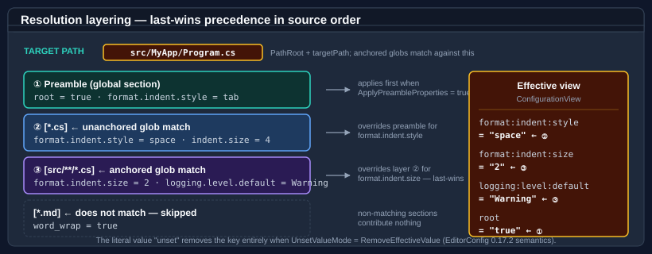

# Bodu.Text.Configuration — Core concepts

This page is the vocabulary the rest of the documentation assumes. Read it once before the
[getting-started samples](getting-started.md), and refer back whenever a term feels imprecise.

For the high-level shape of the library and the pipeline diagram, start with the [introduction](index.md).

## Document and view

A **document** is the parsed-but-not-yet-resolved representation of the source text. It is an
<xref:Bodu.Text.Ini.IniDocument> from <xref:Bodu.Text.Formats> — the same structure the INI codec produces — with a
preamble (the global section) and zero or more named sections in source order. The document preserves comments,
ordering, and duplicate-policy decisions, so it can be re-emitted byte-for-byte.

A **view** is the resolved snapshot for one **target path** — a flat dictionary of colon-delimited configuration keys
to their effective string values. <xref:Bodu.Text.Configuration.ConfigurationView> is one-shot: subsequent mutation
of the originating document does not retroactively update the view. Take a fresh view whenever the document changes or
the target path changes.

```
source text ──► ConfigurationDocument.Parse ──► IniDocument
IniDocument ──► .Resolve(targetPath) ───────────► ConfigurationView
ConfigurationView ──► .GetXxx(key) ──────────► typed value
```

## Profile

A **profile** is a named, validated combination of parse, resolve, and write options. Four profiles ship in the box:

| Profile | Intent |
|---|---|
| `Bodu` (default) | Permissive Bodu defaults: dotted-to-colon keys, whitespace-introduced inline comments, last-wins duplicates, preamble participates in resolve. |
| `EditorConfigCompatible` | Strict alignment with EditorConfig 0.17.2: inline comments disabled, identity key mapping, only the `root` key in the preamble takes part in resolve. |
| `Strict` | Deterministic parsing for generated files: duplicate keys are rejected, key-only properties are not permitted. |
| `Relaxed` | Permissive parsing of user-authored files: inline comments enabled, duplicates last-wins, diagnostics collected rather than thrown. |

Each option type — <xref:Bodu.Text.Configuration.ConfigurationParseOptions>,
<xref:Bodu.Text.Configuration.ConfigurationResolveOptions>,
<xref:Bodu.Text.Configuration.ConfigurationWriteOptions> — has a static `For(profile)` factory plus the four named
properties `Bodu`, `EditorConfigCompatible`, `Strict`, `Relaxed`. Profiles are starting points, not contracts; every
property on every options bag is mutable through `init` setters.

## Parse, resolve, and write options

Each option type controls one stage of the pipeline.

**<xref:Bodu.Text.Configuration.ConfigurationParseOptions>** controls the reader:

| Property | Role |
|---|---|
| `Profile` | The profile this bag represents. |
| `InlineCommentMode` | Disabled / WhitespaceIntroduced (default) / Always. |
| `DuplicateKeyMode` | LastWins (default) / Disallowed / FirstWins (from `IniDuplicateKeyBehavior`). |
| `DuplicateSectionMode` | Preserve / Disallowed / Merge (from `IniDuplicateSectionBehavior`). |
| `DiagnosticMode` | Throw (default) / Collect / Ignore. |
| `MaxLineLength` / `MaxKeyLength` | DoS-resistant caps; defaults 8192 / 1024. |
| `TrimKeysAndValues` | EditorConfig-compatible trimming; default `true`. |
| `AllowKeyOnlyProperties` | Whether lines without `=` are accepted as boolean-true; default `false`. |
| `KeyOptions` | The <xref:Bodu.Text.Configuration.ConfigurationKeyOptions> applied while reading raw keys. |

**<xref:Bodu.Text.Configuration.ConfigurationResolveOptions>** controls the resolver:

| Property | Role |
|---|---|
| `PathRoot` | The directory anchor for glob matches. When `null`, the document's load path is used; when neither is available, `MissingPathRootMode` decides. |
| `MissingPathRootMode` | UseEmptyRoot (default) / Throw / IgnoreAnchoredPatterns. |
| `ApplyPreambleProperties` | Whether preamble (global section) properties contribute to the view. |
| `PathComparison` | The <xref:System.StringComparison> used when matching target paths against patterns. |
| `UnsetValueMode` | TreatAsLiteral (default) / RemoveEffectiveValue (EditorConfig sentinel). |
| `KeyOptions` | The key options applied when expanding raw keys into colon-delimited form. |

**<xref:Bodu.Text.Configuration.ConfigurationWriteOptions>** controls `Save`: encoding, newline style, blank-line
policy, property layout. Use the static `Bodu` / `EditorConfigCompatible` / `Strict` / `Relaxed` presets, or supply a
custom bag.

## Key — raw, segments, configuration

A configuration key has three concurrent forms:

| Form | Example | Where used |
|---|---|---|
| **Raw key** | `logging.level.default` | The text as authored in the source file. |
| **Segments** | `["logging", "level", "default"]` | Split on the configured separators. |
| **Path** | `logging:level:default` | The canonical colon-delimited form stored in the view. |

<xref:Bodu.Text.Configuration.ConfigurationKey> is the read-only struct that holds all three.
`ConfigurationKey.Parse(rawKey)` is the entry point; `TryParse` is the non-throwing variant.

Lookups on a <xref:Bodu.Text.Configuration.ConfigurationView> accept either the dotted or the colon-delimited form
— `view["logging.level.default"]` and `view["logging:level:default"]` return the same value. The view stores keys in
the colon-delimited form to interoperate with `Microsoft.Extensions.Configuration`.

## Key mapping

`ConfigurationKey` uses a <xref:Bodu.Text.Configuration.ConfigurationKeyOptions> to govern splitting and
mapping:

| Mapping | Behaviour |
|---|---|
| `DotToColon` (default) | Split on `.` and `:`; emit `:`-joined. |
| `Colon` | Split on `:` only; emit `:`-joined. |
| `Identity` | Split on the configured separators; rejoin with the first separator (preserves the original delimiter). |

`SegmentSeparators` defaults to `{ '.', ':' }`. `CaseSensitive` defaults to `false`, matching
`Microsoft.Extensions.Configuration`. `AllowEmptySegments` defaults to `false` — `a..b` is rejected unless the
property is set explicitly.

## Glob pattern and target path

Section headers are interpreted as **glob patterns** matched against the resolver's target path. The pattern
language follows EditorConfig:

| Pattern | Matches |
|---|---|
| `*` | Any characters except `/`. |
| `**` | Any characters including `/`. |
| `?` | Any single character. |
| `[abc]` / `[!abc]` | Character class / negated character class. |
| `{a,b,c}` | Alternation. |
| `[*.cs]` | All `.cs` files at any depth (unanchored). |
| `[src/**/*.cs]` | All `.cs` files under `src/` (anchored to `PathRoot`). |

The **target path** is the value passed to `document.Resolve(targetPath)`. Anchored patterns (those that contain `/`)
are tested against `PathRoot + targetPath`. Unanchored patterns are tested against the filename only.

When `PathRoot` is unset and the document was loaded from a string,
<xref:Bodu.Text.Configuration.ConfigurationMissingPathRootMode> decides: `UseEmptyRoot` matches against the bare
target path, `Throw` rejects anchored patterns at resolve time, `IgnoreAnchoredPatterns` silently skips them.

The pattern compiler is <xref:Bodu.Text.Configuration.ConfigurationPattern> — the same engine the resolver uses,
exposed for callers who want to test pattern matching directly without instantiating a document.

## Preamble

The **preamble** is the EditorConfig name for the file's global section — properties that appear before any `[...]`
section header. Bodu exposes it as <xref:Bodu.Text.Ini.IniDocument.GlobalSection> and the
<xref:Bodu.Text.Configuration.ConfigurationExtensions.Preamble(Bodu.Text.Ini.IniDocument)> alias.

Under the default `Bodu` profile, the resolver layers the preamble first and then each matching section in source
order, so preamble properties act as defaults that any matching section can override. Under
`EditorConfigCompatible`, only the well-known `root` key is honoured from the preamble; every other preamble property
is ignored during resolve.

## Resolution layering



The resolver walks the document once:

1. If `ApplyPreambleProperties` is true, copy every preamble property into the working dictionary.
2. For each named section in source order, test the header pattern against the target path. If it matches, copy each
   property into the working dictionary, overwriting any earlier value for the same key (**last-wins**).
3. Apply the `UnsetValueMode` policy to any property whose value is the literal `unset`.
4. Wrap the working dictionary in a <xref:Bodu.Text.Configuration.ConfigurationView>.

The walk is single-pass and source-order — no precedence rule beyond "later wins for a given key". This matches
EditorConfig semantics; tools that need different precedence rules should layer multiple documents or filter the
sections before resolving.

## Diagnostic mode

The reader can route recoverable issues three ways:

| Mode | Behaviour |
|---|---|
| `Throw` (default) | On the first recoverable error, raise <xref:Bodu.Text.Configuration.ConfigurationParseException> and stop. The document is not returned. |
| `Collect` | Run the parser to completion and attach diagnostics to a <xref:Bodu.Text.Configuration.ConfigurationParseResult>. The document is still returned and its valid portions remain usable. |
| `Ignore` | Discard diagnostics; return the document anyway. |

Use `Throw` for generated files where any deviation is a programmer error; use `Collect` for user-authored files where
you want to surface every problem at once; use `Ignore` only when you are happy to trust whatever the parser produces.
<xref:Bodu.Text.Configuration.ConfigurationDocument.ParseWithDiagnostics(System.String,Bodu.Text.Configuration.ConfigurationParseOptions)>
returns a <xref:Bodu.Text.Configuration.ConfigurationParseResult> directly, even under `Throw` (where the
diagnostic list is always empty on a successful parse).

## Unset sentinel

EditorConfig defines the literal string `unset` as a directive that *removes* the effective value of a property for
the matching path — useful when a deeply nested section should opt out of a default established by an earlier
section.

<xref:Bodu.Text.Configuration.ConfigurationUnsetValueMode> controls how the resolver treats it:

| Mode | Behaviour |
|---|---|
| `TreatAsLiteral` (default) | The string `"unset"` is preserved verbatim in the view. |
| `RemoveEffectiveValue` | The key is removed from the working dictionary; it does not appear in the view. |

`Bodu` and `Strict` profiles default to `TreatAsLiteral` so the literal text is not silently dropped. The
`EditorConfigCompatible` profile defaults to `RemoveEffectiveValue` to match the specification.

## Typed accessors

<xref:Bodu.Text.Configuration.ConfigurationView> exposes a family of typed getters built on top of
<xref:System.ISpanParsable`1>:

| Getter family | Behaviour on missing key | Behaviour on malformed value |
|---|---|---|
| `GetString` | Throws `KeyNotFoundException`. | n/a — value is already string. |
| `GetString(key, fallback)` | Returns the fallback. | n/a. |
| `TryGetString` | Returns `false`. | n/a. |
| `GetInt32` / `GetInt64` / `GetBoolean` / `GetEnum<T>` | Throws `KeyNotFoundException`. | Throws `FormatException`. |
| `GetXxx(key, fallback)` | Returns the fallback. | Throws `FormatException` (malformed values are never silently swallowed). |
| `TryGetXxx` | Returns `false`. | Returns `false` (never throws on parse failure). |
| `GetValue<T>(key)` | Throws `KeyNotFoundException`. | Throws `FormatException`. |
| `TryGetValue<T>(key, out value)` | Returns `false`. | Returns `false`. |

The `GetValue<T>` and `TryGetValue<T>` generics accept any type that implements
<xref:System.ISpanParsable`1> — `int`, `long`, `double`, `Guid`, `TimeSpan`, `DateTimeOffset`, custom enums, custom
records, anything with a span-parseable surface. All parsing is done with
<xref:System.Globalization.CultureInfo.InvariantCulture> to keep behaviour deterministic across locales.

## Saving (round-trip)

<xref:Bodu.Text.Configuration.ConfigurationDocument.Save(Bodu.Text.Ini.IniDocument,System.String,Bodu.Text.Configuration.ConfigurationWriteOptions)>
emits the document back to text. The writer preserves comment lines, section ordering, and the original property
ordering within each section, so a parse-then-save round-trip is byte-stable for any document the library produced.
The write options control encoding (default UTF-8 without BOM), newline style (default `\n`), and blank-line policy
between sections.

For documents the library *did not* produce — hand-authored INI files with idiosyncratic whitespace — the writer
emits canonical formatting, so the round-trip is semantically stable but may rearrange incidental whitespace.

## Where to go next

- **[Getting started](getting-started.md)** — install + runnable minimal samples.
- **[Bodu.Extensions.Configuration.Text](../extensions-configuration-text/index.md)** — `IConfigurationBuilder` integration.
- **[Bodu.Text.Configuration API reference](xref:Bodu.Text.Configuration)** — full type-by-type docs.
- **[Introduction](index.md)** — the high-level shape of the library.
