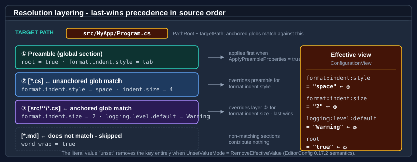

# Bodu.Text.Configuration - Core concepts

This page is the vocabulary the rest of the documentation assumes. Read it once before the
[getting-started samples](getting-started.md), and refer back whenever a term feels imprecise.

Part of the **[Configuration](../topics/configuration.md)** topic.

For the high-level shape of the library and the pipeline diagram, start with the [introduction](index.md).

## Document and view

A **document** is the parsed-but-not-yet-resolved representation of the source text.
<xref:Bodu.Text.Configuration.ConfigurationDocument> is a `sealed` type that *inherits* the read-only
<xref:Bodu.Text.Configuration.IniDocumentBase> model - the library's own trivia-preserving INI structure, which the reader
produces - with a preamble (the <xref:Bodu.Text.Configuration.IniDocumentBase.GlobalSection>) and zero or more named
<xref:Bodu.Text.Configuration.IniDocumentBase.Sections> in source order. The document preserves comments, ordering, and
duplicate-policy decisions, so it can be re-emitted byte-for-byte.

Because it derives from `IniDocumentBase`, every read member of the INI model is available directly on the document:
`doc.GlobalSection["root"]`, `doc.Sections[0].Name`, `section.Entries`, `section["indent_size"]`, and the typed
`section.TryGetValue<T>(...)` accessors all work without first resolving a view. The document-level surface is
read-only - `ConfigurationDocument` exposes no way to add or remove sections (that mutation surface lives on the
standalone <xref:Bodu.Text.Configuration.IniDocument>, which adds `AddSection` / `GetOrAddSection` / `RemoveSection`) -
but each <xref:Bodu.Text.Configuration.IniSection> stays editable through `AddEntry` / `SetEntry` / `RemoveEntry`,
which is how a value is changed before a round-trip `Save`.

A **view** is the resolved snapshot for one **target path** - a flat dictionary of colon-delimited configuration keys
to their effective string values. <xref:Bodu.Text.Configuration.ConfigurationView> is one-shot: subsequent mutation
of the originating document does not retroactively update the view. Take a fresh view whenever the document changes or
the target path changes.

```
source text ──► ConfigurationDocument.Parse ──► ConfigurationDocument
ConfigurationDocument ──► .Resolve(targetPath) ──► ConfigurationView
ConfigurationView ──► .GetXxx(key) ──────────► typed value
```

## Profile

A **profile** is a named, validated combination of parse, resolve, and write options. Four profiles ship in the box:

| Profile | Intent |
|---|---|
| `Bodu` (default) | Permissive Bodu defaults: dotted-to-colon keys, whitespace-introduced inline comments, last-wins duplicates, preamble participates in resolve (its `root` pair excepted). |
| `EditorConfigCompatible` | Strict alignment with EditorConfig 0.17.2: inline comments disabled, strict section headers, identity key mapping (keys keep their dots), keys lowercased, and the whole preamble, `root` included, dropped from resolve. |
| `Strict` | Deterministic parsing for generated files: duplicate keys are rejected, key-only properties are not permitted. |
| `Relaxed` | Permissive parsing of user-authored files: inline comments enabled, duplicates last-wins, diagnostics collected rather than thrown. |

Each option type - <xref:Bodu.Text.Configuration.ConfigurationParseOptions>,
<xref:Bodu.Text.Configuration.ConfigurationResolveOptions>,
<xref:Bodu.Text.Configuration.ConfigurationWriteOptions> - has a static `For(ConfigurationProfile)` factory that
materialises any of the four profiles, plus a set of cached named presets. The three option types are sealed *classes*
(not structs); each is immutable once constructed because every property is `init`-only, so the cached presets are safe
to share across threads. Profiles are starting points, not contracts: compose a custom bag with an object initialiser
and override only the properties that need to differ.

> [!NOTE]
> The named static presets differ slightly per option type. `ConfigurationParseOptions` exposes all four
> (`Bodu`, `EditorConfigCompatible`, `Strict`, `Relaxed`); `ConfigurationResolveOptions` exposes only `Bodu` and
> `EditorConfigCompatible` as static properties (use `For(profile)` for the others); and `ConfigurationWriteOptions`
> exposes `Bodu`, `EditorConfigCompatible`, and `Normalized` (the last is `For(ConfigurationProfile.Strict)`). The
> `For(profile)` factory on every type covers all four profiles regardless.

## Parse, resolve, and write options

Each option type controls one stage of the pipeline.

**<xref:Bodu.Text.Configuration.ConfigurationParseOptions>** controls the reader:

| Property | Role |
|---|---|
| `Profile` | The profile this bag represents. Default `Bodu`. |
| `InlineCommentMode` | Disabled / WhitespaceIntroduced (default) / Always. |
| `DuplicateKeyMode` | LastWins (default) / FirstWins / Disallowed (from <xref:Bodu.Text.Configuration.DuplicateKeyPolicy>). |
| `DuplicateSectionMode` | Preserve (default) / Merge / MergeAdjacent / Disallowed (from <xref:Bodu.Text.Configuration.IniDuplicateSectionBehavior>). |
| `SectionHeaderMode` | Lenient (default) / Strict / AllowTrailingInlineComment - how trailing content after `]` is treated. |
| `DiagnosticMode` | Throw (default) / Collect / Ignore. |
| `MaxLineLength` / `MaxKeyLength` | DoS-resistant caps; defaults 8192 / 1024 characters. Over-length input emits `LineTooLong` / `KeyTooLong`. |
| `TrimKeysAndValues` | EditorConfig-compatible trimming of leading/trailing whitespace; default `true`. |
| `AllowKeyOnlyProperties` | Whether lines without `=` are accepted (the value becomes the empty string); default `false`. |
| `KeyOptions` | The <xref:Bodu.Text.Configuration.ConfigurationKeyOptions> applied while reading raw keys. |
| `DefaultEncoding` | The encoding `Load` assumes for a stream/file with no byte-order mark; default `Encoding.UTF8`. |

The `SectionHeaderMode` knob has no INI equivalent and is worth calling out: under `Lenient` (the `Bodu`/`Relaxed`
default) trailing words after the closing `]` are accepted silently; under `Strict` (the `EditorConfigCompatible`/`Strict`
default) they raise the `TrailingContentAfterSectionHeader` diagnostic; under `AllowTrailingInlineComment` a `#`/`;`
after `]` is consumed as a comment while any other trailing content still errors.

The configuration engine parses with its own reader over its own INI document model (the
`IniDocumentBase` / `IniSection` / `IniEntry` family in the `Bodu.Text.Configuration` namespace) - it does not
depend on the standalone `Bodu.Text.Ini` format library, so its inline-comment modes, diagnostics, and preamble
handling are free to diverge from the raw-INI dialect.

**<xref:Bodu.Text.Configuration.ConfigurationResolveOptions>** controls the resolver:

| Property | Role |
|---|---|
| `Profile` | The profile this bag represents. Default `Bodu`. |
| `PathRoot` | The directory a target path is rebased against before globs are matched; an explicit value always wins. When `null`, a document loaded with `Load(path)` uses the directory of its file; when neither is available, the target is matched as given, and `MissingPathRootMode` decides what a path-less resolve does. |
| `MissingPathRootMode` | UseEmptyRoot (default) / Throw. There is no `IgnoreAnchoredPatterns` value. |
| `ApplyPreambleProperties` | Whether preamble (global section) properties contribute to the view. Default `true` (`Bodu`/`Strict`/`Relaxed`); `false` for `EditorConfigCompatible`. |
| `PathComparison` | The `StringComparison` used when matching target paths against patterns. Default `Ordinal`. |
| `UnsetValueMode` | TreatAsLiteral (default) / RemoveEffectiveValue (EditorConfig sentinel). |
| `KeyOptions` | The key options applied when expanding raw keys into the view's keys: colon-delimited under the default mapping, as written under the `Identity` mapping of the `EditorConfigCompatible` profile. |

> [!IMPORTANT]
> `MissingPathRootMode` only changes behaviour when **no target path is supplied to `Resolve` at all**. The `Throw`
> mode raises `InvalidOperationException` when `PathRoot` is `null`, the document carries no load path, and `targetPath`
> is `null` - the `EditorConfigCompatible` and `Strict` resolve profiles select it so a path-less resolve fails loudly
> rather than silently returning a preamble-only view. When a target path *is* supplied and no root is known (no
> `PathRoot`, and a document parsed rather than loaded from a file), anchored globs are matched against the bare target
> path (the empty-root behaviour).

**<xref:Bodu.Text.Configuration.ConfigurationWriteOptions>** controls `Save`: encoding, newline style, blank-line
policy, property layout. Use the static `Bodu` / `EditorConfigCompatible` / `Normalized` presets (or `For(profile)`), or supply a
custom bag.

## Key - raw, segments, configuration

A configuration key has three concurrent forms:

| Form | Example | Where used |
|---|---|---|
| **Raw key** | `logging.level.default` | The text as authored in the source file. |
| **Segments** | `["logging", "level", "default"]` | Split on the configured separators, each trimmed of the whitespace around it; under `Identity`, the whole key, its ends trimmed, is the one segment. |
| **Path** | `logging:level:default` | The canonical form stored in the view: colon-delimited, or the key as written under `Identity`. |

<xref:Bodu.Text.Configuration.ConfigurationKey> is the read-only struct that holds all three.
`ConfigurationKey.Parse(rawKey)` is the entry point; `TryParse` is the non-throwing variant.

Under the default mapping, lookups on a <xref:Bodu.Text.Configuration.ConfigurationView> accept either the dotted or the
colon-delimited form - `view["logging.level.default"]` and `view["logging:level:default"]` return the same value - and
the view stores keys in the colon-delimited form to interoperate with `Microsoft.Extensions.Configuration`. Under the
`Identity` mapping, which the `EditorConfigCompatible` profile uses, a key is stored and looked up as written, so
`logging.level.default` and `logging:level:default` are two keys.

## Key mapping

`ConfigurationKey` uses a <xref:Bodu.Text.Configuration.ConfigurationKeyOptions> to govern splitting and
mapping:

| Mapping | Behaviour |
|---|---|
| `DotToColon` (default) | Split on the configured separators; rejoin with `:`. |
| `Colon` | Split on the configured separators; rejoin with `:`. |
| `Identity` | Keep the key as written, apart from the whitespace at its ends and the lowercasing `LowercaseKeys` asks for; the key is not split, so its dots and colons, and the whitespace inside it, stay as they are. |

`DotToColon` and `Colon` split on the full `SegmentSeparators` set and join with `:`, so they produce identical `Path`
output - the distinction is naming intent, not behaviour. `Identity` does not split a key at all: `a:b`, `a.b` and
`a.b:c` keep their form, so a dotted key and a colon-delimited one are two keys, and neither `SegmentSeparators` nor
`AllowEmptySegments` applies to it.

`SegmentSeparators` defaults to `{ '.', ':' }`. `CaseSensitive` defaults to `false`, matching
`Microsoft.Extensions.Configuration`, and is surfaced as a ready-made comparer via
<xref:Bodu.Text.Configuration.ConfigurationKeyOptions.KeyComparer> (`StringComparer.Ordinal` or
`StringComparer.OrdinalIgnoreCase`). `LowercaseKeys` defaults to `false`; when set, as the `EditorConfigCompatible`
profile sets it, the segments and the path are lowercased with the invariant culture, as EditorConfig lowercases every
key after parsing, while the raw key keeps its case. Whitespace around each segment is trimmed, so `a . b` and `a.b` are
the same key, and a segment of whitespace alone, as in `a. .b`, counts as empty. `AllowEmptySegments` defaults to
`false` - `a..b` is rejected with `ArgumentException` unless the property is set explicitly or the mapping is
`Identity`, which trims only the ends of a key. Keys are constructed through the
<xref:Bodu.Text.Configuration.ConfigurationKey.Parse(System.String)> / `TryParse` factories or the equivalent
constructor; control characters in a raw key are rejected at construction time. Equality compares the *segment
sequence* under the configured comparer, so the raw form is informational only - `Logging.Level` and
`logging:level` compare equal under the default options.

## Glob pattern and target path

Section headers are interpreted as **glob patterns** matched against the resolver's target path. The pattern
language follows EditorConfig:

| Pattern | Matches |
|---|---|
| `*` | Any characters except `/`. |
| `**` | Any characters including `/`. |
| `?` | Any single character. |
| `[abc]` / `[!abc]` | Character class / negated character class; a bracket expression that holds a `/` is literal text. |
| `{a,b,c}` | Alternation; a group without a comma, such as `{single}` or `{}`, is literal text. |
| `[*.cs]` | All `.cs` files at any depth (unanchored). |
| `[src/**/*.cs]` | All `.cs` files under `src/` (anchored at the root: `PathRoot`, or the directory of a file loaded by path). |

The **target path** is the value passed to `document.Resolve(targetPath)`. Before matching, the resolver normalises the
path to forward slashes and rebases it relative to the root, which is `PathRoot`, or when that is unset the directory of
the file a document was loaded from with `Load(path)`: if the path begins with the root plus `/` that prefix is
stripped; if it equals the root exactly, only the filename survives; otherwise, or when no root is known, the path is
matched as-is. Anchored patterns (those that contain `/`) are then tested against the whole relative path; unanchored
patterns (no `/`) match at any directory depth.

A pattern that starts with `/` is anchored at the root as well, and a relative target matches it as if the target
began with `/`: `[/src/*.cs]` applies to `src/Foo.cs`, to `/src/Foo.cs`, and to `/repo/src/Foo.cs` rebased under
`PathRoot = "/repo"`, but not to `lib/src/Foo.cs`, nor to `/elsewhere/src/Foo.cs`, which lies outside that root.

> [!IMPORTANT]
> Section matching requires a target path. When `Resolve` is called with no target path (or `null`), the normalised
> target is empty and **every named section is skipped** - only the preamble (when `ApplyPreambleProperties` is `true`)
> contributes to the view. A path-less resolve is therefore a preamble-only projection, not an "all sections" merge.

When no root is known, because `PathRoot` is unset and the document was not loaded from a file,
<xref:Bodu.Text.Configuration.ConfigurationMissingPathRootMode> decides what a *path-less* resolve does: `UseEmptyRoot`
returns the preamble-only view described above, while `Throw` raises `InvalidOperationException`. The mode has no effect
once a non-null target path is supplied.

The pattern compiler is <xref:Bodu.Text.Configuration.ConfigurationPattern> - the same engine the resolver uses,
exposed for callers who want to test pattern matching directly without instantiating a document. `Compile` memoises
results in a bounded process-wide cache keyed on `(pattern, comparison)`, and each compiled pattern carries a bounded
match timeout so an untrusted section-name glob cannot become a ReDoS vector.

## Preamble

The **preamble** is the EditorConfig name for the file's global section - properties that appear before any `[...]`
section header. Bodu exposes it as <xref:Bodu.Text.Configuration.IniDocumentBase.GlobalSection>.

Under the default `Bodu` profile, the resolver layers the preamble first and then each matching section in source
order, so preamble properties act as defaults that any matching section can override. The preamble's `root` pair is
the exception under every profile: it marks the file as the root of its directory tree rather than configuring
anything, so the resolver never projects it into a view. Under
`EditorConfigCompatible`, `ApplyPreambleProperties` is `false`, so the preamble is dropped from resolve entirely, its
well-known `root` pair included. The pair stays in the global section: resolution reads one document and searches no
parent directory, so acting on `root = true` (no further `.editorconfig` files up the tree) is left to the caller.

## Resolution layering



The resolver walks the document once:

1. If `ApplyPreambleProperties` is true, copy every preamble property into the working dictionary. Each raw key is run
   through <xref:Bodu.Text.Configuration.ConfigurationKey> so it is stored in its canonical colon-delimited form.
2. For each named section in source order, test the header pattern against the normalised target path. If it matches,
   copy each property into the working dictionary, overwriting any earlier value for the same key (**last-wins**).
3. While copying, apply the `UnsetValueMode` policy: under `RemoveEffectiveValue`, a property whose value equals
   `unset` (matched case-insensitively) *removes* the key from the working dictionary rather than setting it.
4. Record per-key origin metadata (<xref:Bodu.Text.Configuration.ConfigurationResolvedEntry>) so the winning section
   and source line are recoverable, then wrap the working dictionary in a
   <xref:Bodu.Text.Configuration.ConfigurationView>.

The walk is single-pass and source-order - no precedence rule beyond "later wins for a given key". This matches
EditorConfig semantics; tools that need different precedence rules should layer multiple documents or filter the
sections before resolving.

## Diagnostic mode

The reader can route recoverable issues three ways:

| Mode | Behaviour |
|---|---|
| `Throw` (default) | On the first recoverable error, raise <xref:Bodu.Text.Configuration.ConfigurationParseException> and stop. The document is not returned. |
| `Collect` | Run the parser to completion and attach diagnostics to a <xref:Bodu.Text.Configuration.ConfigurationParseResult>. The document is still returned and its valid portions remain usable. |
| `Ignore` | Discard diagnostics; return the document anyway. |

Use `Throw` for generated files where any deviation is a programmer error; use `Collect` for user-authored files where
you want to surface every problem at once; use `Ignore` only when you are happy to trust whatever the parser produces.
<xref:Bodu.Text.Configuration.ConfigurationDocument.ParseWithDiagnostics(System.String,Bodu.Text.Configuration.ConfigurationParseOptions)>
returns a <xref:Bodu.Text.Configuration.ConfigurationParseResult> directly, even under `Throw` (where the
diagnostic list is always empty on a successful parse).

## Unset sentinel

EditorConfig defines the literal string `unset` as a directive that *removes* the effective value of a property for
the matching path - useful when a deeply nested section should opt out of a default established by an earlier
section.

<xref:Bodu.Text.Configuration.ConfigurationUnsetValueMode> controls how the resolver treats it:

| Mode | Behaviour |
|---|---|
| `TreatAsLiteral` (default) | The string `"unset"` is preserved verbatim in the view. |
| `RemoveEffectiveValue` | The key is removed from the working dictionary; it does not appear in the view. |

The sentinel is matched **case-insensitively** (`unset`, `UNSET`, `Unset` all qualify) to align with real-world
EditorConfig tooling - a deliberate deviation from the strict lower-case-only reading of the spec. `Bodu` and `Relaxed`
profiles default to `TreatAsLiteral` so the literal text is not silently dropped; `EditorConfigCompatible` and `Strict`
default to `RemoveEffectiveValue`.

## Typed accessors

<xref:Bodu.Text.Configuration.ConfigurationView> exposes a family of typed getters built on top of
<xref:System.ISpanParsable`1>:

| Getter family | Behaviour on missing key | Behaviour on malformed value |
|---|---|---|
| `GetString` | Throws `KeyNotFoundException`. | n/a - value is already string. |
| `GetString(key, fallback)` | Returns the fallback. | n/a. |
| `TryGetString` | Returns `false`. | n/a. |
| `GetInt32` / `GetInt64` / `GetBoolean` / `GetEnum<T>` | Throws `KeyNotFoundException`. | Throws `FormatException`. |
| `GetXxx(key, fallback)` | Returns the fallback. | Throws `FormatException` (malformed values are never silently swallowed). |
| `TryGetXxx` | Returns `false`. | Returns `false` (never throws on parse failure). |
| `GetValue<T>(key)` | Throws `KeyNotFoundException`. | Throws `FormatException`. |
| `TryGetValue<T>(key, out value)` | Returns `false`. | Returns `false`. |

The `GetValue<T>` and `TryGetValue<T>` generics accept any type that implements `ISpanParsable<T>` - `int`, `long`,
`double`, `Guid`, `TimeSpan`, `DateTimeOffset`, custom records, anything with a span-parseable surface. All numeric and
`GetValue<T>` parsing is done with `CultureInfo.InvariantCulture` (and `NumberStyles.Integer` for `GetInt32`/`GetInt64`)
to keep behaviour deterministic across locales.

Two getters apply extra rules beyond plain parsing:

- `GetBoolean` accepts only the EditorConfig literals `true`/`false`, case-insensitively. `yes`/`no`, `on`/`off`, and
  `1`/`0` are rejected with `FormatException` - broadening the set would break EditorConfig 0.17.2 parity. Wrap
  `GetString` yourself if you need a relaxed boolean parser.
- `GetEnum<TEnum>` parses member names case-insensitively but guards the result with `Enum.IsDefined`, so an undefined
  integer (`severity = 99` against a three-member enum) and an unlisted combined-flags value (`Read, Write` when only the
  individual flags are declared) are both rejected. Parse against `GetString` with `Enum.Parse` directly when you need
  combined-flag handling.

## Resolved-entry provenance

Every key in a view carries origin metadata, surfaced as <xref:Bodu.Text.Configuration.ConfigurationResolvedEntry>
through `view.GetEntry(key)` and `view.Entries`. An entry records the canonical `Key`, the resolved `Value`, a
`SourceLocation`, and the `SectionPattern` of the section that won under last-wins precedence (`null` when the value came
from the preamble). This is the debugging surface for layered configuration - when a key resolves to an unexpected value,
the entry tells you which section supplied it and where.

```csharp
ConfigurationResolvedEntry? entry = view.GetEntry("format:indent:size");
if (entry is not null)
    Console.WriteLine($"{entry.Key} = {entry.Value} (from {entry.SectionPattern ?? "<preamble>"})");
```

Only the `SourceLocation.LineNumber` is reliably populated; line position and length are approximate, and
`SourceLocation.Path` is the full path of the file when the document was loaded from one with `Load(path)`, and `null`
when it was parsed from a string or loaded from a stream or a text reader.

## Saving (round-trip)

<xref:Bodu.Text.Configuration.ConfigurationDocument.Save(Bodu.Text.Configuration.IniDocumentBase,System.String,Bodu.Text.Configuration.ConfigurationWriteOptions)>
emits the document back to text. The writer preserves comment lines, section ordering, and the original property
ordering within each section, so a parse-then-save round-trip is byte-stable for any document the library produced.
<xref:Bodu.Text.Configuration.ConfigurationWriteOptions> controls encoding (default UTF-8 *without* BOM), newline style
(`NewLine`, default `\n`), the key/value separator (`KeyValueSeparator`, default `" = "`), comment prefix
(`CommentPrefix`, default `#`), and three booleans - `PreserveComments`, `WriteInlineComments`, and
`InsertBlankLineBetweenSections`. The `EditorConfigCompatible` preset suppresses inline comments; the `Normalized`
preset (which is `For(ConfigurationProfile.Strict)`) additionally drops preserved comments for deterministic output.

For documents the library *did not* produce - hand-authored INI files with idiosyncratic whitespace - the writer
emits canonical formatting, so the round-trip is semantically stable but may rearrange incidental whitespace.

## Where to go next

- **[Getting started](getting-started.md)** - install + runnable minimal samples.
- **[Bodu.Extensions.Configuration.Text](../extensions-configuration-text/index.md)** - `IConfigurationBuilder` integration.
- **[Bodu.Text.Configuration API reference](xref:Bodu.Text.Configuration)** - full type-by-type docs.
- **[Introduction](index.md)** - the high-level shape of the library.
- **[Configuration topic](../topics/configuration.md)** - this package and its sibling Bodu.Extensions.Configuration.Text; the [topic concepts](../topics/configuration-concepts.md) page collects the shared vocabulary.
