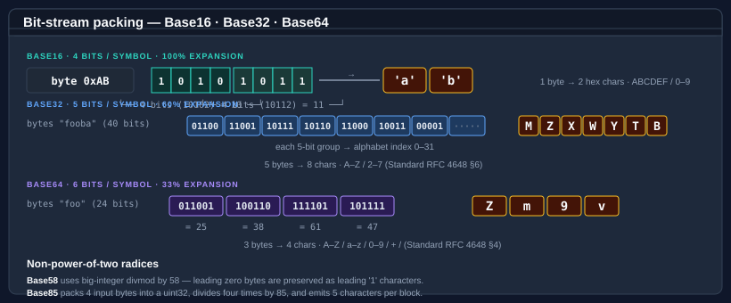
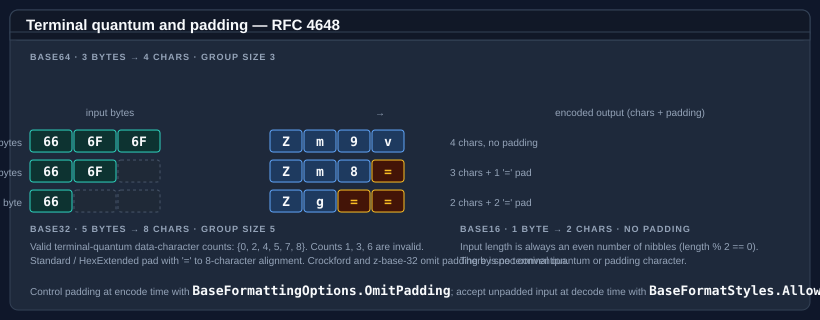

# Bodu.Text.Encoding — Core concepts

This page is the vocabulary the rest of the documentation assumes. Read it once before the
[getting-started samples](getting-started.md) or the [guides](../../guides/text-encoding/index.md), and refer back
whenever a term feels imprecise.

Part of the **[Text & Serialization](../topics/text-and-serialization.md)** topic.

For the high-level shape of the library and the type map, start with the [introduction](index.md).

## Encoding and variant

An **encoding** is the family-level concept: the five core radices — Base16, Base32, Base64, Base58, Base85 — plus
the special-purpose Base45, Base62, and Bech32. Each family has a radix (16, 32, 64, 58, 85, 45, 62, 32) which
determines how many bits each output symbol represents.

A **variant** is a specific choice within an encoding family — typically a different *alphabet* but sometimes
different padding, line-wrap, or shortcut rules:

| Family | Variants in this library |
|---|---|
| Base16 | `Lower` (default), `Upper` — via the `Base16Variant` enum, or equivalently `BaseFormattingOptions.UpperCase` |
| Base32 | `Standard` (RFC 4648 §6), `HexExtended` (RFC 4648 §7), `Crockford`, `ZBase32` |
| Base64 | `Standard` (RFC 4648 §4), `UrlSafe` (RFC 4648 §5), `Mime` (RFC 2045) |
| Base58 | `BitcoinFlickr` (default), `Ripple` |
| Base85 | `Ascii85` (Adobe Tech Note 5045), `Z85` (RFC 32 ZeroMQ), `GitCompact` (Git `base85.c`) |
| Base45 | RFC 9285 (single alphabet) |
| Base62 | GMP-style (single alphabet) |
| Bech32 | `Bech32` (BIP 173, default), `Bech32m` (BIP 350) — selected by `Bech32Encoding` |

## Alphabet

The **alphabet** is the set of characters a variant uses to represent the radix digits. The position of each
character in the alphabet string is its numeric value.

```
Base16:                "0123456789abcdef"          (lower case, 16 chars)
Base32 Standard:       "ABCDEFGHIJKLMNOPQRSTUVWXYZ234567"   (RFC 4648 §6)
Base32 HexExtended:    "0123456789ABCDEFGHIJKLMNOPQRSTUV"   (RFC 4648 §7)
Base32 Crockford:      "0123456789ABCDEFGHJKMNPQRSTVWXYZ"   (no I L O U)
Base32 Z-Base-32:      "ybndrfg8ejkmcpqxot1uwisza345h769"
Base64 Standard:       "A..Za..z0..9+/"             (RFC 4648 §4)
Base64 URL-safe:       "A..Za..z0..9-_"             (RFC 4648 §5)
Base58 Bitcoin/Flickr: "123456789ABCDEFGHJKLMNPQRSTUVWXYZabcdefghijkmnopqrstuvwxyz"  (no 0 O I l)
Base85 Ascii85:        '!' (33) through 'u' (117)   (Adobe alphabet)
Base85 Z85:            "0..9a..zA..Z.-:+=^!/*?&<>()[]{}@%$#"  (shell-safe)
Base45:                "0..9A..Z" + " $%*+-./:"      (45 chars, RFC 9285)
Base62:                "0..9A..Za..z"               (GMP order: digits, upper, lower)
Bech32:                "qpzry9x8gf2tvdw0s3jn54khce6mua7l"   (5-bit values 0..31, BIP 173)
```

## Bit packing

For power-of-two radices (Base16, Base32, Base64), encoding is a **bit-stream operation**: input bytes are
concatenated into a bit stream, then chunked into N-bit groups (where N is `log2(radix)`). Each N-bit group becomes
one output symbol.



Base58 is **not** a power of two: it uses big-integer divmod by 58. Base62 works the same way with divmod by 62.
Base85 uses **4-byte blocks** packed into a 32-bit unsigned integer, then divided by 85 four times to emit five
characters. Base45 packs each **2-byte group** into a base-45 triple (a trailing single byte becomes 2 characters).
Bech32 is a 5-bit (base-32) bit-stream like Base32, but wrapped with a human-readable part, a `1` separator, and a
six-symbol checksum computed over the whole data part.

The **quantum** is the smallest whole number of input bytes that maps to a whole number of output characters — the
unit the encoder and decoder repeat across the stream. For the power-of-two radices it is the least common multiple
of the byte (8 bits) and the symbol width:

| Family | Quantum | Bits | Output symbols | Why |
|---|---|---|---|---|
| Base16 | 1 byte | 8 | 2 | 8 ÷ 4 = 2, no remainder — every byte is self-contained |
| Base32 | 5 bytes | 40 | 8 | lcm(8, 5) = 40 → 40 ÷ 5 = 8 |
| Base64 | 3 bytes | 24 | 4 | lcm(8, 6) = 24 → 24 ÷ 6 = 4 |
| Base85 | 4 bytes | 32 | 5 | a 32-bit block is the natural unit; 85⁵ ≥ 2³² |
| Base45 | 2 bytes | 16 | 3 | 45³ = 91 125 ≥ 2¹⁶ = 65 536 |

Base58 and Base62 have **no quantum** — big-integer divmod runs over the whole input at once, so there is no
repeating block and no exact per-block ratio (only the data-dependent `GetMaxEncodedLength` bound applies).

## Terminal quantum

The **terminal quantum** is the last group at the end of the input. When the input does not divide evenly into
the group size, the spec defines which character counts are legal and how padding aligns the output.



RFC 4648 quantum rules:

| Encoding | Group size | Valid terminal-quantum data-character counts |
|---|---|---|
| Base16 | 1 byte → 2 chars | Always even (length must be a multiple of 2) |
| Base32 (Standard / HexExtended) | 5 bytes → 8 chars | **{0, 2, 4, 5, 7, 8}** — counts 1, 3, 6 are invalid |
| Base64 (Standard / UrlSafe / Mime) | 3 bytes → 4 chars | **{0, 2, 3, 4}** — count 1 is invalid |

Crockford Base32 and z-base-32 do not impose terminal-quantum rules. Base58 has no quantum. Base85 partial-group
sizes are 1, 2, or 3 bytes for Ascii85; Z85 requires exact 4-byte alignment.

## Padding

**Padding** is the `=` character that Base32 and Base64 append after a partial terminal quantum so the output
length aligns to the group size. For a *3-byte* Base64 input, no padding is needed (3 → 4 chars exactly); for
*2-byte* input the output is 4 chars including one `=`; for *1-byte* input, two `=`.

| Variant | Padding by default |
|---|---|
| Base32 Standard / HexExtended | Yes (RFC 4648 mandates) |
| Base32 Crockford / ZBase32 | No (by spec convention) |
| Base64 Standard / Mime | Yes (RFC 4648 / 2045 mandate) |
| Base64 UrlSafe | No (JWT / OAuth convention; can be added with omission of `OmitPadding`) |
| Base58 | No padding character |
| Base85 | No padding character — alignment is via partial-group truncation (Ascii85) or fixed 4-byte alignment (Z85) |

Control padding at encode time with `BaseFormattingOptions.OmitPadding`, and accept unpadded input at decode time
with `BaseFormatStyles.AllowMissingPadding`.

## Shortcut

A **shortcut** is a single character that stands in for a full all-zero group. Only Adobe Ascii85 defines one:

| Variant | Shortcut | Meaning |
|---|---|---|
| Base85 Ascii85 | `z` | Four zero bytes (`0x00 0x00 0x00 0x00`) |

Z85 has no shortcut — even all-zero input emits five `0` characters.

## Decoration

A **decoration** is an optional, non-data character or marker added at encode time for human readability or
container framing, and tolerated at decode time when explicitly allowed:

| Decoration | Encode flag | Decode flag | Applies to |
|---|---|---|---|
| `0x` prefix | `BaseFormattingOptions.IncludePrefix` | `BaseFormatStyles.AllowPrefix` | Base16 |
| Byte spacing (e.g. `DE AD BE EF`) | `BaseFormattingOptions.InsertSpacing` | (combine with `IgnoreWhitespace`) | Base16 |
| Line breaks every N chars (64 for Base16, 76 for Base64 Mime) | `BaseFormattingOptions.InsertLineBreaks` | (combine with `IgnoreWhitespace`) | Base16, Base32, Base64 |
| Case folding (lower / upper) | `BaseFormattingOptions.UpperCase` | implicit (decoders are case-insensitive) | Base16, Base32 |

## Encoder vs. decoder strictness

Encoders are **deterministic** — given a byte sequence and an options set they always produce the same canonical
output. Decoders are typically **strict** by default — only the canonical alphabet, padding, and quantum length
are accepted — and **lenient** when `BaseFormatStyles` flags are set:

```
strict mode (BaseFormatStyles.None)
  • only alphabet characters
  • exact padding alignment for padded variants
  • valid terminal-quantum length

lenient mode (one or more BaseFormatStyles flags)
  AllowPrefix              → tolerate "0x" / "0X" prefix at the start
  IgnoreWhitespace         → strip ASCII space, tab, CR, LF anywhere
  AllowMissingPadding      → accept inputs without the trailing "=" characters

stricter mode (a flag that tightens, not relaxes)
  RequireCanonicalEncoding → reject a non-canonical terminal symbol whose unused
                             trailing bits are non-zero
```

The `Decode` overloads throw `FormatException` on validation failure. The `TryDecode` overloads return
`false` instead. The `IsValid` predicate returns `true` only for inputs that the strict decoder would accept
(when no leniency flags are passed).

### Canonical-form enforcement

`BaseFormatStyles.AllowPrefix`, `IgnoreWhitespace`, and `AllowMissingPadding` all *relax* the decoder.
<xref:Bodu.Text.Encoding.BaseFormatStyles> carries one flag that goes the other way —
`RequireCanonicalEncoding` *tightens* it. For a partial terminal quantum the spec only fills some of the bits a
symbol can carry; RFC 4648 §3.5 leaves the unused trailing bits unconstrained, so several distinct encoded strings
can decode to the same bytes. The Base64 pair `QQ==` and `QR==` both yield the single byte `0x41`; only `QQ==` is
canonical (its 4 unused trailing bits are zero). Passing `RequireCanonicalEncoding` rejects every form whose unused
bits are non-zero, so each byte sequence has exactly one accepted encoding:

```csharp
Base64.Decode("QR==", Base64Variant.Standard);                                          // ok — non-canonical tolerated, → 0x41
Base64.Decode("QR==", Base64Variant.Standard, BaseFormatStyles.RequireCanonicalEncoding); // FormatException
```

The flag applies to <xref:Bodu.Text.Encoding.Base32> and <xref:Bodu.Text.Encoding.Base64> — the bit-stream
families with unused terminal bits. It is a no-op for <xref:Bodu.Text.Encoding.Base16> (no unused bits per
character), <xref:Bodu.Text.Encoding.Base58> (canonicity is leading-zero preservation, enforced unconditionally),
and <xref:Bodu.Text.Encoding.Base85> (block-based, with its own tail convention). Reach for it on a decode path
where a single canonical representation is a security or comparison requirement — content-addressed identifiers,
deduplication keys, signature inputs.

## UTF-8 path

Every encoding family exposes a UTF-8 byte path alongside the character path:

```
encode:  EncodeToUtf8(ReadOnlySpan<byte>) → byte[]
         TryEncodeToUtf8(ReadOnlySpan<byte>, Span<byte>, out int, …)

decode:  FromBase{N}String(ReadOnlySpan<byte> utf8Source, Span<byte> dst, out int consumed, out int written)
                                                                      → OperationStatus
         DecodeFromUtf8(ReadOnlySpan<byte>, Span<byte>, out int, out int, …, isFinalBlock)
                                                                      → OperationStatus
```

Because every encoding alphabet is ASCII, the UTF-8 byte form is bit-identical to the character form. This path is
the natural choice when bytes come from a network / file pipeline and you want to avoid allocating a `string` or
`char[]` between stages.

## GUID convenience surface

Each of the five core families ships an overload pair that encodes a <xref:System.Guid> directly, so you never have
to materialise the 16-byte buffer yourself:

```csharp
string id  = Base58.Encode(Guid.NewGuid());            // compact, ambiguity-free GUID token
Guid value = Base58.DecodeGuid(id);                    // throws FormatException unless it decodes to 16 bytes
bool ok    = Base58.TryDecodeGuid(id, out Guid parsed); // non-throwing form
```

The members are `Encode(Guid, …)`, `DecodeGuid(ReadOnlySpan<char>, …)`, and
`TryDecodeGuid(ReadOnlySpan<char>, out Guid, …)`, each carrying the same `variant` / `options` / `styles`
arguments as the byte overloads (Base16 takes no variant; Base58 has no encode-side `options`). The bytes are the
GUID's native mixed-endian layout — identical to `Guid.TryWriteBytes` — so `DecodeGuid(Encode(g))` reconstructs `g`
exactly, and `DecodeGuid` raises `FormatException` if the input does not decode to precisely 16 bytes.

## OperationStatus and streaming

The `OperationStatus` return convention (from `System.Buffers`) is the same one `System.Buffers.Text.Base64` uses:

| Value | Meaning |
|---|---|
| `Done` | Input fully consumed and decoded |
| `DestinationTooSmall` | Destination span cannot hold the output |
| `InvalidData` | Input contains a character outside the variant alphabet or violates structural rules |
| `NeedMoreData` | (Streaming only — `isFinalBlock: false`) The input ends mid-quantum and may resolve with more bytes |

Use `isFinalBlock: true` when the input you are passing is the entire data (default). Use `isFinalBlock: false` to
stream data through chunk by chunk — the decoder will report `NeedMoreData` instead of `InvalidData` for inputs
that could complete with another chunk.

> Base58 and Base85 are not streamable: each requires the entire input to be available before decode (Base58 because
> of big-integer arithmetic, Base85 because of fixed-size block packing). The `isFinalBlock` parameter on those
> variants is accepted for API consistency but has no behavioural effect.
>
> The special-purpose encodings — Base45, Base62, and Bech32 — are likewise single-shot and expose no
> `OperationStatus` path at all (Base45 packs in fixed groups, Base62 uses big-integer arithmetic, and Bech32 must
> read the whole string to verify its checksum). They throw `FormatException` on invalid input and offer `Try*`
> methods that report failure as `false`.

## IBinaryEncoding interface

The static classes are the primary entry point. For code that must select an encoding at **runtime** — a
configuration-driven serializer, a plugin pipeline, a generic utility — use the <xref:Bodu.Text.Encoding.IBinaryEncoding>
interface and one of the pre-configured instances in <xref:Bodu.Text.Encoding.BinaryEncodings>:

```csharp
IBinaryEncoding encoding = BinaryEncodings.Get("base64-urlsafe");
string token = encoding.Encode(secretKey);
```

The interface deliberately hides variant-specific options (line breaks, padding control, MIME wrapping). Code that
needs those should keep using the static classes directly.

## Where to go next

- **[Getting started](getting-started.md)** — install + minimal sample per encoding type.
- **[Bodu.Text.Encoding guides](../../guides/text-encoding/index.md)** — using each encoding, choosing variants, streaming, the `IBinaryEncoding` interface.
- **[Bodu.Text.Encoding API reference](xref:Bodu.Text.Encoding)** — full type-by-type docs.
- **[Introduction](index.md)** — type map, scenarios, where each encoding fits.
- **[Text & Serialization topic](../topics/text-and-serialization.md)** — this package alongside Bodu.Text.Formats and the Bencode / TOML serializers; the [topic concepts](../topics/text-and-serialization-concepts.md) page collects the shared vocabulary.
