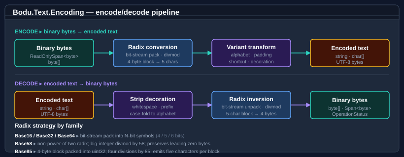
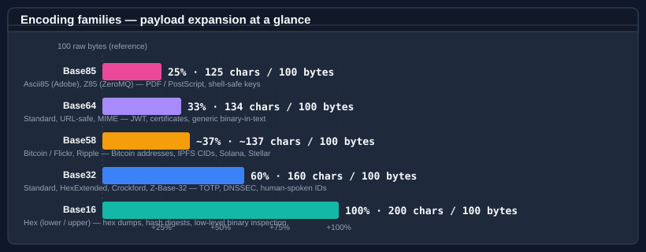
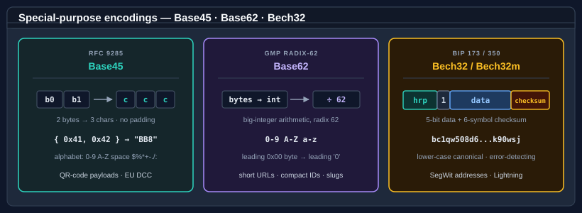

# Bodu.Text.Encoding

**Bodu.Text.Encoding** is a focused, allocation-conscious library of binary-to-text encodings. The five core radix
encodings that .NET applications reach for — **Base16**, **Base32**, **Base64**, **Base58**, and **Base85** — each
carry the same modern API shape: span- and UTF-8-friendly overloads, `OperationStatus`-returning streaming methods,
length-prediction helpers, validation predicates, and a unified `IBinaryEncoding` interface that lets code select an
encoding at runtime. Three special-purpose encodings sit alongside them — **Base45** (RFC 9285, QR-code payloads),
**Base62** (compact identifiers), and **Bech32 / Bech32m** (BIP 173 / 350, checksummed addresses) — plus the
convenience wrappers **Base58Check** and **Base64Url**.

Part of the **[Text & Serialization](../topics/text-and-serialization.md)** topic.

It fills two gaps that `System.Convert` and `System.Buffers.Text.Base64` leave open:

1. **Variants** the BCL does not cover — base32hex, Crockford Base32, z-base-32, Base58 (Bitcoin / Flickr / Ripple), Ascii85, Z85, Base45, Base62, Bech32 / Bech32m.
2. **Lenient parsing** and **formatting decoration** — `0x` prefix tolerance, whitespace stripping, byte spacing, line breaks every 64 / 76 characters — for the encodings that benefit from them.

## Core mental model

Every encoding in the library follows the same four-stage pipeline. Encoding takes raw binary bytes, runs the
radix conversion (bit-stream pack for Base16 / Base32 / Base64, big-integer divmod for Base58, 4-byte block packing
for Base85), applies the variant-specific transform (alphabet swap, padding, shortcut), and optionally adds
decorations (case folding, prefix, byte spacing, line breaks). Decoding is the same path in reverse — strip
decoration, apply alphabet lookup, then bit-stream unpack / divmod / block expansion.

## Where each encoding fits

| Encoding | Bits per symbol | Payload expansion | Typical use cases |
|---|---|---|---|
| **Base16** | 4 | 100 % | Hex dumps, hash digests, low-level binary inspection |
| **Base32** | 5 | 60 % | TOTP / HOTP secrets, DNSSEC NSEC3, S/MIME, human-spoken IDs (Crockford / z-base-32) |
| **Base64** | 6 | 33 % | MIME / SMTP, JWT (URL-safe), TLS certificates, generic binary-in-text |
| **Base58** | ≈5.86 | ≈37 % | Bitcoin addresses, IPFS CIDs, Solana, NEAR, Stellar, Flickr short URLs |
| **Base85** | ≈6.41 | 25 % | PDF / PostScript (Ascii85), ZeroMQ keys (Z85), tight ASCII transport |
| **Base45** | ≈5.49 | 50 % (2 bytes → 3 chars) | QR-code payloads (RFC 9285), EU Digital COVID Certificate |
| **Base62** | ≈5.95 | ≈35 % | Short URLs, compact identifiers, URL-safe slugs (no special characters) |
| **Bech32 / Bech32m** | 5 (+ HRP + checksum) | base-32 data + 6-symbol checksum | Bitcoin SegWit addresses, Lightning invoices (BIP 173 / 350) |

## A shared shape

Every **core** encoding type (Base16, Base32, Base64, Base58, Base85) exposes the same public surface:

| Member group | Methods |
|---|---|
| **Encode** | `Encode(byte[]/span)`, `Encode(byte[], int, int)`, `Encode(span, span)`, `TryEncode(span, span, out int)` |
| **Decode** | `Decode(string)`, `Decode(char[], int, int)`, `Decode(span)`, `TryDecode(span, span, out int)` |
| **BCL-style aliases** | `ToBase{N}String(...)`, `FromBase{N}String(...)`, `TryToBase{N}String(...)` |
| **UTF-8 path** | `EncodeToUtf8(span)`, `TryEncodeToUtf8(span, span, out int)`, `DecodeFromUtf8(span, span, out int, out int)` returning `OperationStatus` |
| **Streaming decode** | `FromBase{N}String(span char/byte, span byte, out int, out int)` returning `OperationStatus` |
| **Sizing** | `GetEncodedLength(int)`, `GetMaxDecodedLength(int)`, `GetDecodedLength(span)`, `TryGetDecodedLength(span, out int)` — variable-ratio encodings (Base58, Base85) expose `GetMaxEncodedLength(int)` in place of the exact `GetEncodedLength` / `GetDecodedLength` / `TryGetDecodedLength` forms |
| **Validation** | `IsValid(span)`, `IsBase{N}Digit(char)` |

For runtime-selected encoding choice, see the **[IBinaryEncoding](../../guides/text-encoding/binary-encodings-interface.md)** interface and the
`BinaryEncodings` registry: `BinaryEncodings.Base64`, `BinaryEncodings.Base32Crockford`,
`BinaryEncodings.Z85`, etc.

The **special-purpose** encodings (Base45, Base62, Bech32) share the `Encode` / `Decode` / `TryEncode` / `TryDecode`,
sizing, and `IsValid` members but omit the `OperationStatus` streaming path — each needs the whole input at once.
Base45 and Base62 are registered as `BinaryEncodings.Base45` / `BinaryEncodings.Base62`; Bech32 takes a
human-readable part and verifies a checksum, so it stays outside the flat-byte `IBinaryEncoding` contract.
See the per-encoding guides — [Base45](../../guides/text-encoding/base45.md), [Base62](../../guides/text-encoding/base62.md),
and [Bech32](../../guides/text-encoding/bech32.md).

## Variants at a glance

| Encoding | Variant enum | Variants |
|---|---|---|
| Base16 | <xref:Bodu.Text.Encoding.Base16Variant> | Lower (default), Upper |
| Base32 | <xref:Bodu.Text.Encoding.Base32Variant> | Standard (RFC 4648 §6), HexExtended (RFC 4648 §7), Crockford, ZBase32 |
| Base64 | <xref:Bodu.Text.Encoding.Base64Variant> | Standard (RFC 4648 §4), UrlSafe (RFC 4648 §5), Mime (RFC 2045 with 76-char wrap) |
| Base58 | <xref:Bodu.Text.Encoding.Base58Variant> | BitcoinFlickr (default), Ripple |
| Base85 | <xref:Bodu.Text.Encoding.Base85Variant> | Ascii85 (Adobe), Z85 (RFC 32 ZeroMQ), GitCompact (Git `base85.c`) |
| Base45 | (none) | RFC 9285 |
| Base62 | (none) | GMP-style (`0-9 A-Z a-z`) |
| Bech32 | <xref:Bodu.Text.Encoding.Bech32Encoding> | Bech32 (BIP 173, default), Bech32m (BIP 350) |

## Common scenarios

| Scenario | Reach for |
|---|---|
| "Print this hash as hex" | `Base16.Encode(hash)` or `hash.ToBase16String()` |
| "Decode this JWT token segment" | `Base64.Decode(segment, Base64Variant.UrlSafe, BaseFormatStyles.AllowMissingPadding)` |
| "Format a TOTP secret for a user" | `Base32.Encode(secret, Base32Variant.Standard, BaseFormattingOptions.OmitPadding)` |
| "Read a Bitcoin address" | `Base58.Decode(address)` |
| "Hex dump with `0x` and spacing" | `Base16.Encode(bytes, BaseFormattingOptions.IncludePrefix \| BaseFormattingOptions.InsertSpacing \| BaseFormattingOptions.UpperCase)` |
| "Validate a UUID-like hex string" | `Base16.IsValid(s)` |
| "Turn a `Guid` into a short token" | `Base58.Encode(id)` / `Base58.DecodeGuid(token)` |
| "Reject non-canonical Base64 on a signature input" | `Base64.Decode(s, Base64Variant.Standard, BaseFormatStyles.RequireCanonicalEncoding)` |
| "Stream-decode hex from a network buffer" | `Base16.DecodeFromUtf8(buffer, dst, out int read, out int wrote, BaseFormatStyles.None, isFinalBlock: false)` |
| "Pick the encoding from configuration at runtime" | `var enc = BinaryEncodings.Get(configName); enc.Encode(bytes);` |
| "Encode a MIME message body" | `QuotedPrintable.Encode(body)` |
| "Escape a value for a URL query" | `PercentEncoding.EncodeString(value, mode: PercentEncodingMode.UriComponent)` |
| "Decode an `application/x-www-form-urlencoded` field" | `PercentEncoding.DecodeString(field, mode: PercentEncodingMode.FormUrlEncoded)` |

## Main types

### Per-encoding static classes

| Type | Purpose |
|---|---|
| <xref:Bodu.Text.Encoding.Base16> | Hexadecimal — 4 bits per symbol; flexible formatting (case, prefix, line breaks, spacing); lenient parsing |
| <xref:Bodu.Text.Encoding.Base32> | Base32 — 5 bits per symbol; four variants (Standard, HexExtended, Crockford, Z-Base32); padding control |
| <xref:Bodu.Text.Encoding.Base64> | Base64 — 6 bits per symbol; three variants (Standard, UrlSafe, Mime); delegates inner conversion to BCL for SIMD speed |
| <xref:Bodu.Text.Encoding.Base58> | Base58 — non-power-of-two radix using big-integer arithmetic; preserves leading zeros |
| <xref:Bodu.Text.Encoding.Base85> | Base85 — 4-byte block → 5 chars; Ascii85 with <c>z</c> shortcut and partial groups; Z85 with 4-byte alignment; Git binary-patch alphabet (compact and padded) |
| <xref:Bodu.Text.Encoding.Base45> | Base45 — RFC 9285; 2 bytes → 3 chars; QR-code Alphanumeric-mode alphabet; no padding |
| <xref:Bodu.Text.Encoding.Base62> | Base62 — GMP-style `0-9 A-Z a-z`; big-integer arithmetic; preserves leading zeros |
| <xref:Bodu.Text.Encoding.Bech32> | Bech32 / Bech32m — HRP + `1` separator + 5-bit data + 6-symbol checksum; scheme via <xref:Bodu.Text.Encoding.Bech32Encoding> |
| <xref:Bodu.Text.Encoding.Base58Check> | Base58 plus the Bitcoin four-byte double-SHA-256 checksum, verified on decode |
| <xref:Bodu.Text.Encoding.Base64Url> | RFC 4648 §5 URL-safe Base64 as a first-class type; padding omitted by default; UTF-8 path |

### Escape-based encodings

These escape a *subset* of octets (`=HH` or `%HH`) while leaving most printable ASCII literal, so their output is
content-dependent and mode-driven. They are intentionally **not** <xref:Bodu.Text.Encoding.IBinaryEncoding> members.

| Type | Purpose |
|---|---|
| <xref:Bodu.Text.Encoding.QuotedPrintable> | MIME Quoted-Printable body encoding (RFC 2045 §6.7); binary / text mode; 76-column soft wrapping; strict-vs-relaxed decode |
| <xref:Bodu.Text.Encoding.PercentEncoding> | URI / form percent-encoding (RFC 3986 §2.1 + WHATWG form rules); UriComponent / PathSegment / Query / FormUrlEncoded modes; string helpers |

### Runtime selection

| Type | Purpose |
|---|---|
| <xref:Bodu.Text.Encoding.IBinaryEncoding> | Unified contract for runtime-pluggable encoding choice |
| <xref:Bodu.Text.Encoding.BinaryEncodings> | Pre-configured singleton instances, plus `Get(name)` lookup |
| <xref:Bodu.Text.Encoding.BinaryEncodingExtensions> | Fluent extension methods on `byte[]`, `ReadOnlySpan<byte>`, and `string` |

### Shared option types

| Type | Purpose |
|---|---|
| <xref:Bodu.Text.Encoding.BaseFormattingOptions> | Encode-side flags: `UpperCase`, `InsertLineBreaks`, `IncludePrefix`, `InsertSpacing`, `OmitPadding` |
| <xref:Bodu.Text.Encoding.BaseFormatStyles> | Decode-side flags: `AllowPrefix`, `IgnoreWhitespace`, `AllowMissingPadding`, plus the tightening `RequireCanonicalEncoding` |

## Where to go next

- **[Core concepts](concepts.md)** — vocabulary: alphabet, variant, terminal quantum, padding, shortcut, decoration.
- **[Getting started](getting-started.md)** — install + minimal sample per encoding type.
- **[Bodu.Text.Encoding guides](../../guides/text-encoding/index.md)** — using each encoding, choosing variants, streaming, the `IBinaryEncoding` interface.
- **[Bodu.Text.Encoding API reference](xref:Bodu.Text.Encoding)** — full type-by-type docs.
- **Special-purpose guides** — [Base45](../../guides/text-encoding/base45.md) (QR codes), [Base62](../../guides/text-encoding/base62.md) (compact IDs), [Bech32](../../guides/text-encoding/bech32.md) (checksummed addresses).
- **Escape-encoding guides** — [Quoted-Printable](../../guides/text-encoding/quoted-printable.md) (MIME bodies), [Percent-encoding](../../guides/text-encoding/percent-encoding.md) (URIs and forms).
- **For structured document formats** (Bencode, INI, TOML) with their own self-describing grammar, see [Bodu.Text.Formats](../formats/index.md).
- **[Text & Serialization topic](../topics/text-and-serialization.md)** — this package alongside its siblings Bodu.Text.Formats and the Bencode / TOML serializers.
