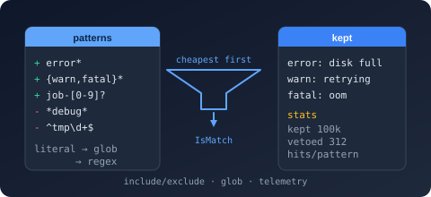

# Bodu.Text.Filtering

`Bodu.Text.Filtering` filters lists of text values through include/exclude pattern sets. Glob
(wildcard) and regular-expression patterns compile once into an immutable
[`TextFilter`](xref:Bodu.Text.Filtering.TextFilter) that is then applied to any number of values —
designed for bulk work in the 100k+ values × 10–100+ patterns range, with built-in telemetry that
reports what matched, what was vetoed, and by which pattern.

Part of the **[Text & Serialization](../topics/text-and-serialization.md)** topic.

## Core mental model

A filter is a compiled set of **rules**. Each rule is a
[`TextFilterPattern`](xref:Bodu.Text.Filtering.TextFilterPattern): a pattern text, an **action**
(include or exclude), a **kind** (glob or regex), and an optional per-pattern case override. You
compile the set once — with `TextFilter.Build`, `TextFilter.Parse`, or a
[`TextFilterBuilder`](xref:Bodu.Text.Filtering.TextFilterBuilder) — and then ask it questions:
`IsMatch(value)`, `Evaluate(value)` (which also reports the deciding pattern), or
`Filter(sequence)`.

The library deliberately adopts designs users already know from established tools:

| Borrowed design | Source |
|---|---|
| Unordered include/exclude sets; empty includes ⇒ include-all; excludes veto | Ant, MSBuild globs, `Microsoft.Extensions.FileSystemGlobbing` |
| Ordered rules where the **last matching rule wins**, `!` negation, `#` comments | gitignore / ESLint ignore files |
| Compile many patterns at once; run cheap literal/prefix strategies before regex; report which patterns matched | Rust `globset` (ripgrep) |
| Fluent builder (`AddInclude` / `AddExclude`) over a compiled matcher | `Microsoft.Extensions.FileSystemGlobbing.Matcher` |
| Glob grammar: `*`, `?`, `[abc]` / `[!abc]`, `{a,b}`, `\` escape | Java `PathMatcher`, minimatch, shell glob |

## The two evaluation modes

[`TextFilterEvaluationMode`](xref:Bodu.Text.Filtering.TextFilterEvaluationMode) selects how rules
combine:

- **`AnyMatch`** (default) — the Ant / MSBuild set model. A value is accepted when the include set
  is empty **or** at least one include matches, **and** no exclude matches. Declaration order never
  affects the outcome, which frees the engine to evaluate the cheapest patterns first.
- **`LastMatchWins`** — the gitignore model. Rules form one ordered list; the last matching rule's
  action decides, and unmatched values are included. A later include re-admits what an earlier
  exclude rejected; allowlists start with an exclude-everything rule (`!*`).

## Glob grammar

Globs match the **whole value** (use `*abc*` for contains). Comparison is ordinal and
case-insensitive by default.

| Syntax | Meaning |
|---|---|
| `*` | zero or more characters |
| `?` | exactly one character |
| `[abc]`, `[a-z]` | one character from a set / range |
| `[!abc]` | one character *not* in the set |
| `{a,b}` | alternation, expanded at build time |
| `\x` | literal `x` (escapes metacharacters) |

Anything richer is a `TextFilterPatternKind.Regex` pattern — compiled preferring the linear-time
`NonBacktracking` engine, always with a match timeout, and timeouts fail safe (a timed-out exclude
still vetoes).

## Cost tiers

At build time every glob is classified into the cheapest strategy its shape permits and each group
is evaluated cheapest-first with short-circuiting:

`*` (match-all) → literal equality → prefix / suffix (`abc*`, `*abc`, `abc*def`) → contains
(`*abc*`) → general wildcard matcher → regex.

`{error,warn}*` expands at build time into two cheap prefix matchers — alternation costs nothing at
evaluation time.

## Main types

### The engine

- [`TextFilter`](xref:Bodu.Text.Filtering.TextFilter) — `Build` / `Parse`, `IsMatch`, `Evaluate`, `GetMatchingPatterns`, `Filter` / `FilterToList`, `GetStatistics`, `Observer`.
- [`TextFilterBuilder`](xref:Bodu.Text.Filtering.TextFilterBuilder) — fluent `AddInclude` / `AddExclude` / `AddIncludeRegex` / `AddParsed`.

### The model

- [`TextFilterPattern`](xref:Bodu.Text.Filtering.TextFilterPattern), [`TextFilterAction`](xref:Bodu.Text.Filtering.TextFilterAction), [`TextFilterPatternKind`](xref:Bodu.Text.Filtering.TextFilterPatternKind)
- [`TextFilterOptions`](xref:Bodu.Text.Filtering.TextFilterOptions), [`TextFilterEvaluationMode`](xref:Bodu.Text.Filtering.TextFilterEvaluationMode)
- [`TextFilterResult`](xref:Bodu.Text.Filtering.TextFilterResult), [`TextFilterDecision`](xref:Bodu.Text.Filtering.TextFilterDecision)

### Telemetry

- [`TextFilterStatistics`](xref:Bodu.Text.Filtering.TextFilterStatistics), [`TextFilterPatternStatistics`](xref:Bodu.Text.Filtering.TextFilterPatternStatistics)
- [`ITextFilterObserver`](xref:Bodu.Text.Filtering.ITextFilterObserver)

## Common scenarios

- **Log/line selection** — keep `error*`/`warn*` lines, veto `*debug*` noise, stream through `Filter`.
- **Name allowlists and blocklists** — parse a config file's raw lines with the gitignore conventions.
- **Routing and diagnostics** — `Evaluate` reports the deciding pattern; `GetMatchingPatterns` reports every matching pattern.
- **Filter tuning** — per-pattern hit counts show which patterns actually decide outcomes at volume.

## Where to go next

- **[Core concepts](concepts.md)** — the vocabulary: actions, kinds, modes, tiers, deciding patterns.
- **[Getting started](getting-started.md)** — install and minimal samples.
- **[Guides](../../guides/text-filtering/index.md)** — pattern grammar, evaluation modes, telemetry.
- **[Runnable samples](../../samples/text-filtering.md)** — the FilteringTour console sample.
- **[API reference](xref:Bodu.Text.Filtering)** — full type-by-type docs.
