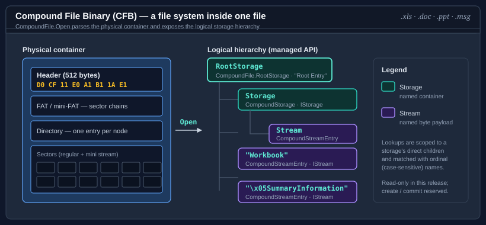

# Binary Formats & I/O

The **Binary Formats & I/O** topic covers read-only readers for legacy binary container and document formats. The packages form a strictly layered stack: a general-purpose container reader at the bottom, with narrower format readers built on top, so each layer carries only the concepts it needs.

[`Bodu.IO.Compound`](../io-compound/index.md) reads the OLE2 / Compound File Binary (CFB) envelope — the structured-storage "file system in a file" used by legacy Microsoft Office documents — and exposes the embedded named streams with no application-format knowledge. [`Bodu.Formats.Excel.Binary`](xref:Bodu.Formats.Excel.Binary) builds on it to surface raw worksheet cell values from BIFF8 `.xls` workbooks.

The dependency runs one way: `Bodu.Formats.Excel.Binary` references `Bodu.IO.Compound` to reach the `Workbook` stream inside an `.xls` file, then interprets the BIFF8 record stream within it. The container reader has no knowledge of Excel — it is reused unchanged by the Reserve Bank of Australia exchange-rate provider, which parses the same `.xls` shape.



## The packages

| Package | Status | What it provides | Docs |
|---|---|---|---|
| `Bodu.IO.Compound` | Stable | A read-only CFB container reader: the `CompoundFile` entry point, the `CompoundStorage` / `CompoundStreamEntry` hierarchy, the seekable `CompoundStream` cursor, and OLE property-set readers. | [Intro](../io-compound/index.md) · [Concepts](../io-compound/concepts.md) · [Get started](../io-compound/getting-started.md) |
| `Bodu.Formats.Excel.Binary` | Stable | A narrow, read-only BIFF8 (`.xls`) reader that surfaces raw worksheet cell values — strings, numbers, booleans, and errors — without formula evaluation, styling, or higher-level interpretation. | [API reference](xref:Bodu.Formats.Excel.Binary) |

## Why a layered reader

Legacy binary formats nest: an `.xls` file is a BIFF8 record stream stored *inside* a CFB container's `Workbook` stream. Modelling those two responsibilities as separate packages keeps each one small and independently reusable:

- **`Bodu.IO.Compound`** answers "what named streams does this container hold, and what are their bytes?" — and nothing more. It works for any compound file, Office or not.
- **`Bodu.Formats.Excel.Binary`** answers "what are the cell values on this worksheet?" by reading the BIFF8 records out of the container's `Workbook` stream.

A consumer that only needs the container — to pull an embedded thumbnail, a property set, or a custom application stream — depends on `Bodu.IO.Compound` alone and never pulls in the Excel record vocabulary.

## Choosing a package

| Scenario | Reach for |
|---|---|
| Read named streams or storages from any `.xls` / `.doc` / `.ppt` / `.msg` file | <xref:Bodu.IO.Compound.CompoundFile> |
| Test whether a file is a compound file at all | `CompoundFile.IsCompoundFile(stream)` |
| Read authored document metadata (title, author, timestamps) | `CompoundFile.TryGetSummaryInformation(...)` |
| Read worksheet cell values from a BIFF8 `.xls` workbook | <xref:Bodu.Formats.Excel.Binary> |
| Bound memory while reading a large container | `CompoundFile.Open(stream, buffered: false)` |

## Scope

Both readers are **read-only** in the current release. `Bodu.IO.Compound` supports only <xref:Bodu.IO.Compound.CompoundFileMode.Read>; `Bodu.Formats.Excel.Binary` surfaces raw cell values without evaluating formulas, applying styles, or interpreting higher-level workbook structure.

## Install

```bash
dotnet add package Bodu.IO.Compound
dotnet add package Bodu.Formats.Excel.Binary
```

`Bodu.Formats.Excel.Binary` depends on `Bodu.IO.Compound`, which depends only on `Bodu.Core` — install the topmost package your application consumes.

## Where to go next

- **[Binary Formats & I/O concepts](binary-formats-concepts.md)** — the shared vocabulary: container, storage, stream, sector chain, BIFF record.
- **[Bodu.IO.Compound introduction](../io-compound/index.md)** — the container reader in detail.
- **[Bodu.IO.Compound getting started](../io-compound/getting-started.md)** — install + minimal samples.
- **[Binary Formats & I/O guides](../../guides/topics/binary-formats.md)** — recipe-style walk-throughs across the topic.
- **API reference:** [Bodu.IO.Compound](xref:Bodu.IO.Compound) · [Bodu.Formats.Excel.Binary](xref:Bodu.Formats.Excel.Binary).
