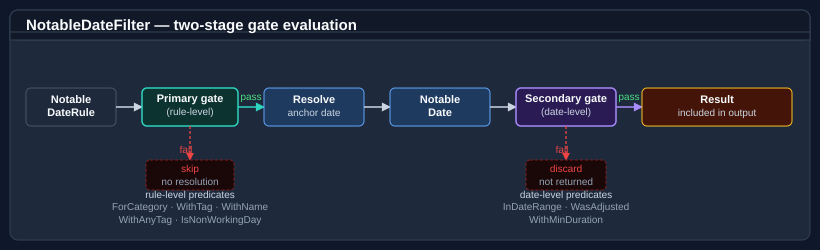

# Using NotableDateService

`NotableDateService` is the main entry point for resolving notable dates — public holidays, observances, religious festivals, regional events — for a given date, range, or year and territory. It is built over an immutable, already-validated `NotableDateResource` and resolves `NotableDate` occurrences on demand.

For the vocabulary used below (document vs. resource, rule vs. resolved date, nominal vs. observed, territory containment, …) see [Core concepts](../../docs/calendar/concepts.md).

## Pattern 1 — a minimal service from a bundled catalogue

Load one of the bundled common catalogues to create a service without referencing a companion data pack — handy for smoke tests and demos. `default-minimal` carries just New Year's Day:

```csharp
using Bodu.Globalization.Calendar;

NotableDateResource resource = NotableDateResourceLoader.Load(
    CommonNotableDateResources.Resolve("default-minimal")!);
var service = new NotableDateService(resource);

IReadOnlyList<NotableDate> dates = service.Resolve(DateTime.Today.Year, "XX");
// → New Year's Day on 1 January
```

Region-specific public holidays ship in dedicated `Bodu.Globalization.Calendar.Data.*` companion assemblies. See [Calendar data packs](data-packs.md).

## Pattern 2 — load a data pack and filter by territory

Each pack exposes a static factory with `CreateService(territory)` (and `LoadResource(territory)` if you want the resource alone):

```csharp
using Bodu.Globalization.Calendar;
using Bodu.Globalization.Calendar.Data.AsiaPacific;

// Loads Australia's resource (imports resolved against the bundled catalogues).
NotableDateService service = AsiaPacificCalendarData.CreateService("AU");

// By-year resolution is an extension (NotableDateServiceExtensions.Resolve):
IReadOnlyList<NotableDate> auDates  = service.Resolve(2026, "AU");
IReadOnlyList<NotableDate> nswDates = service.Resolve(2026, "AU-NSW");

foreach (NotableDate date in nswDates)
    Console.WriteLine($"{date.Date:d MMM yyyy}  {date.DisplayName}");
```

`TerritoryCode` containment applies: a query for `"AU-NSW"` returns dates scoped to `AU` *and* `AU-NSW` (plus any unscoped rules), but not other states. See [Territories and regional composition](territories.md).

All examples below assume a service constructed with the relevant data pack.

## Pattern 3 — filter by category

`NotableDateFilter` is a composable predicate built from static factory methods. Pass it to the filtered `Resolve` overloads:

```csharp
using Bodu.Globalization.Calendar;
using Bodu.Globalization.Calendar.Data.Europe;

NotableDateService service = EuropeCalendarData.CreateService("GB");

// Only public holidays for Great Britain.
NotableDateFilter publicFilter = NotableDateFilter.ForCategory(NotableDateCategory.PublicHoliday);
IReadOnlyList<NotableDate> holidays = service.Resolve(2026, "GB", publicFilter);

// Non-working public holidays — combine predicates with And:
NotableDateFilter nonWorkingFilter = NotableDateFilter
    .ForCategory(NotableDateCategory.PublicHoliday)
    .And(NotableDateFilter.IsNonWorkingDay());
IReadOnlyList<NotableDate> nonWorking = service.Resolve(2026, "GB", nonWorkingFilter);

// Multiple categories in one call:
NotableDateFilter culturalOrObservance =
    NotableDateFilter.ForAnyCategory(NotableDateCategory.Cultural, NotableDateCategory.Observance);
```

## Pattern 4 — query a date range

```csharp
using Bodu.Globalization.Calendar;
using Bodu.Globalization.Calendar.Data.AsiaPacific;

NotableDateService service = AsiaPacificCalendarData.CreateService("AU");

var window = new DateRange(new DateOnly(2026, 3, 1), new DateOnly(2026, 4, 30));
IReadOnlyList<NotableDate> autumn = service.Resolve(window, "AU");
```

Multi-day events (`DurationDays > 1`) are included when their span intersects the query window; which occurrence (actual or observed) controls inclusion is governed by the resource's [`ObservedDateRangePolicy`](identity-and-resolution.md).

## Pattern 5 — query a single day

```csharp
using Bodu.Globalization.Calendar;
using Bodu.Globalization.Calendar.Data.AsiaPacific;

NotableDateService service = AsiaPacificCalendarData.CreateService("AU");

IReadOnlyList<NotableDate> onDay = service.Resolve(new DateOnly(2026, 4, 25), "AU");  // ANZAC Day
```

This overload also returns multi-day spans whose nominal date lies on a preceding day but whose span covers the queried date.

## Pattern 6 — check non-working days and weekends

These are working-day extension methods in `Bodu.Extensions` (over `DateOnly`, `DateTime`, and `DateTimeOffset`):

```csharp
using Bodu.Globalization.Calendar;
using Bodu.Globalization.Calendar.Data.AsiaPacific;
using Bodu.Extensions;

NotableDateService service = AsiaPacificCalendarData.CreateService("AU");
DateOnly christmas = new DateOnly(2026, 12, 25);

bool isWeekend       = christmas.IsWeekend();                       // weekend per the default Mon–Fri working week
bool isNonWorking    = christmas.IsNonWorkingDay(service, "AU");    // weekend or a non-working notable date
bool isNonWorkingNSW = christmas.IsNonWorkingDay(service, "AU-NSW");
```

For full working-day arithmetic (`IsWorkingDay`, `AddWorkingDays`, `NextWorkingDay`, `SnapToWorkingDay`, `WorkingDaysBetween`, …) see [Working-day arithmetic](working-days.md).

## Pattern 7 — ID-targeted overrides at load time

Because a resource is immutable, edits to imported concepts are authored as ID-targeted `<Overrides>` in the document and applied during loading — add a rule, patch one, or remove one:

```xml
<Overrides>
  <!-- Suppress a base rule … -->
  <RemoveRule notableDateRef="boxing-day" ruleRef="default" />
  <!-- … and add a company event. -->
  <AddRule notableDateRef="company-founding-day">
    <Rule id="default"><Strategy><Fixed month="June" day="15" /></Strategy></Rule>
  </AddRule>
</Overrides>
```

See [Authoring notable date rules](rule-authoring.md) for the full override vocabulary.

## Pattern 8 — swap the rule set at runtime

A *live* change means loading a new resource and swapping it in. Build the service over a `MutableNotableDateResourceProvider` via `ReloadableNotableDateService`:

```csharp
using Bodu.Globalization.Calendar;

var provider = new MutableNotableDateResourceProvider(NotableDateResourceLoader.Load(initialXml));
INotableDateService service = new ReloadableNotableDateService(provider);

// later, when the rules change — the live service picks it up atomically:
provider.Reload(NotableDateResourceLoader.Load(updatedXml));
```

## Working with `NotableDate` results

`NotableDate` is an immutable record. Key members:

| Member | Description |
|---|---|
| `Date` | The emitted (observed) date — the post-adjustment date to display. |
| `ActualDate` | The originally calculated (nominal) date. |
| `IsObserved` | Whether `Date` differs from `ActualDate` because an adjustment applied. |
| `EndDate` | The inclusive last day (`Date + DurationDays − 1`). |
| `DurationDays` | Span in days (1 for single-day events). |
| `DisplayName` | The display name (subject to optional localisation). |
| `Category` | `NotableDateCategory` value. |
| `Priority` | Tie-break weight carried from the rule; consulted by the collision policy when several dates share a day. |
| `TerritoryCode` | The territory the date applies to. |
| `IsNonWorkingDay` | Whether the date is flagged as a non-working day. |
| `AdjustmentPolicyId`, `AdjustmentReason` | Which adjustment policy moved the date, and why (when `IsObserved`). |
| `Identity` (`NotableDateId`, `RuleId`) | The originating concept and rule. |
| `Tags` | Optional non-exclusive classification tags. |

```csharp
foreach (NotableDate date in service.Resolve(2026, "AU"))
{
    Console.WriteLine($"{date.Date:d}  {date.DisplayName}");

    if (date.DurationDays > 1)
        Console.WriteLine($"  Multi-day: ends {date.EndDate:d}");

    if (date.IsObserved)
        Console.WriteLine($"  Observed (nominal was {date.ActualDate:d}, via {date.AdjustmentPolicyId})");
}
```

## Composing filters



`NotableDateFilter` is a predicate over resolved occurrences (`Matches(NotableDate)`). Build one from the static factories and combine them:

```csharp
// Category + non-working:
NotableDateFilter nonWorkingHolidays = NotableDateFilter
    .ForCategory(NotableDateCategory.PublicHoliday)
    .And(NotableDateFilter.IsNonWorkingDay());

// Observed (adjusted) occurrences only:
NotableDateFilter adjusted = NotableDateFilter.WasAdjusted();

// Category pre-screen + date-range:
NotableDateFilter easterWeek = NotableDateFilter
    .ForCategory(NotableDateCategory.PublicHoliday)
    .And(NotableDateFilter.InDateRange(new DateOnly(2026, 4, 1), new DateOnly(2026, 4, 14)));

// AllOf / AnyOf for multi-filter composition:
NotableDateFilter combined = NotableDateFilter.AllOf(
    NotableDateFilter.ForCategory(NotableDateCategory.PublicHoliday),
    NotableDateFilter.IsNonWorkingDay(),
    NotableDateFilter.WithTag("national"));
```

The factory set: `ForCategory`, `ForAnyCategory`, `WithName`, `WithAnyName`, `WithId`, `WithTag`, `WithAnyTag`, `WithAllTags`, `WithMinDuration`, `IsNonWorkingDay`, `WasAdjusted`, `InDateRange`, combined with `And`, `Or`, `Not`, `AllOf`, `AnyOf`.

## Understanding the resolution pipeline

Loading turns a document into a resource; querying turns a resource into occurrences:

```
NotableDateResourceLoader.Load(xml[, resolver][, algorithms])
   parse → resolve <Imports> → apply <Overrides> → assemble → validate
      → immutable NotableDateResource
NotableDateService.Resolve(date | range | year, territory[, filter])
   strategy → nominal date → adjustment policies → observed date
      → duplicate/collision settlement → emission → NotableDate set
```

1. **Load** — `NotableDateResourceLoader` parses the document, resolves `<Imports>` through the supplied resolver, applies `<Overrides>`, assembles the definitions, and runs semantic validation, throwing `NotableDateValidationException` on any error-severity diagnostic.
2. **Resolve** — for each applicable rule the <xref:Bodu.Globalization.Calendar.Algorithms.IDateCalculationStrategy> computes the nominal date; the referenced <xref:Bodu.Globalization.Calendar.AdjustmentPolicy> shifts it to the observed date when a trigger matches.
3. **Settle** — the resource's <xref:Bodu.Globalization.Calendar.RangeResolution.ResolutionPolicy> reconciles duplicates and same-day collisions and decides which occurrences are emitted.

See [The resolution pipeline](resolution-pipeline.md) for the full walk-through with a concrete trace.

## Where to go next

- [Core concepts](../../docs/calendar/concepts.md) — the vocabulary used throughout this guide.
- [Territories and regional composition](territories.md) — how `TerritoryCode` and containment govern query results.
- [Working-day arithmetic](working-days.md) — `IsWorkingDay`, `AddWorkingDays`, `NextWorkingDay`, snap operations.
- [Calendar data packs](data-packs.md) — the official Americas / Europe / Asia-Pacific companion assemblies.
- [Authoring notable date rules](rule-authoring.md) — XML / JSON documents, imports, and overrides.
- [Date calculation algorithms](algorithms.md) — the built-in keys and how to implement a custom algorithm.
- [Bodu.Globalization.Calendar API reference](xref:Bodu.Globalization.Calendar) — full type reference.
