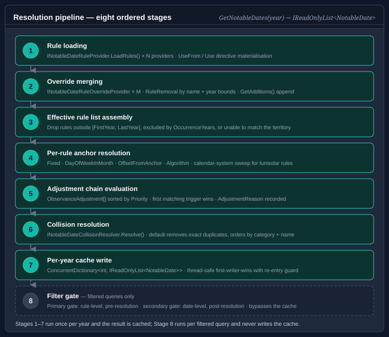

# The resolution pipeline

This page walks through every stage the `NotableDateService` executes between a caller
invoking `GetNotableDates` and the returned `IReadOnlyList<NotableDate>`. Understanding the
pipeline helps diagnose why a date appears, does not appear, or was shifted from its expected
position.

---

## Pipeline overview



---

## Stage 1 — Rule loading

Each `INotableDateRuleProvider` registered in the `ruleProviders` constructor parameter is
called once via `LoadRules()`. The results are combined in registration order.

### XML and JSON providers

`XmlResourceNotableDateRuleProvider` and `JsonResourceNotableDateRuleProvider` parse their
embedded resource file on the first call and cache the resulting rule list internally; subsequent
calls return the cached list without re-parsing.

### ParsedNotableDateDocument

Both parsers produce a `ParsedNotableDateDocument` containing:

- **LocalRules** — `NotableDateRule` instances declared directly in the file.
- **UseGroups** — `<UseFrom>` directives that cherry-pick rules from other resource files.
- **Removals** — `<Remove>` directives that suppress named rules imported from other files.

### UseFrom directive materialisation

Before rules reach the pipeline, the provider resolves all `<UseFrom>` / `<Use>` directives
recursively:

1. The referenced resource file is loaded (from the same assembly or the next assembly in the
   chain, in order).
2. Named rules from the referenced file are cherry-picked or imported wholesale via `<UseAll>`.
3. Any field overrides in the `<Use>` directive are applied to the cherry-picked rule —
   `territory`, `nonWorking`, `firstYear`, `lastYear`, `durationDays`, `priority`, and `as`
   (rename).
4. When `clearInherited="true"` is set, the inherited rule variants are discarded and replaced
   by the rule body declared inside the `<Use>` element.
5. Removals specified in `<Remove>` elements suppress matching rules imported from the same
   `<UseFrom>` source.

The materialised rules are flattened into the provider's effective rule list before returning
from `LoadRules()`. Callers of `NotableDateService` see only fully-resolved `NotableDateRule`
instances.

---

## Stage 2 — Override merging

Override providers implement `INotableDateRuleOverrideProvider` and are evaluated after all
base providers. Each override provider supplies two collections:

- **`GetRemovals()`** — a sequence of `RuleRemoval` records, each identifying a rule by
  `Name` with optional `FromYear` and `ToYear` bounds. A `RuleRemoval` removes all rules
  whose `Name` matches and whose effective year range overlaps the specified bounds. A removal
  with no year bounds removes the rule for all years.

- **`GetAdditions()`** — a sequence of `NotableDateRule` instances appended to the effective
  rule list after removals are applied.

Override providers are processed in the order they are registered. Multiple providers are
supported; their removals and additions are applied in sequence.

After override merging, the combined list is the **effective rule list** for the current
service instance.

```csharp
public sealed class CompanyCalendarOverrides : INotableDateRuleOverrideProvider
{
    public IEnumerable<RuleRemoval> GetRemovals()
    {
        // Remove Boxing Day for 2026 only
        yield return new RuleRemoval("Boxing Day", FromYear: 2026, ToYear: 2026);
    }

    public IEnumerable<NotableDateRule> GetAdditions()
    {
        yield return new NotableDateRule
        {
            Name            = "Company Founding Day",
            Strategy        = DateResolutionStrategy.Fixed,
            Category        = NotableDateCategory.Observance,
            Month           = 6,
            Day             = 15,
            IsNonWorkingDay = true,
        };
    }
}
```

> **Cache invalidation:** the effective rule list is computed once and reused across years.
> Call `service.Invalidate()` after changing override provider state so the next
> `GetNotableDates` call re-derives the list from scratch.

---

## Stage 3 — Effective rule list assembly

Before per-rule resolution begins, rules that cannot produce a result for the requested year
are filtered out:

1. **Year bounds** — rules with `FirstYear` set are dropped if the target year is before
   `FirstYear`. Rules with `LastYear` set are dropped if the target year is after `LastYear`.

2. **OccurrenceYears** — when `OccurrenceYears` is non-empty, the rule is included only when
   the target year is in the set. This allows jubilee events or irregular one-off observances
   to be authored with a fixed list of applicable years.

3. **Territory pre-filter** — rules whose `TerritoryCode` cannot possibly match the requested
   territory (i.e. neither the rule's territory nor any of its parents contains or equals the
   requested territory) are excluded. This avoids the cost of resolving dates for unrelated
   territories.

---

## Stage 4 — Anchor resolution

The anchor is the raw calendar date produced by the rule's `DateResolutionStrategy` before
any adjustments are applied.

### Fixed

For Gregorian rules (`CalendarType` is `null`):
`new DateTime(year, Month, Day)` — direct construction. No calculation required.

An invalid combination (e.g. `Month=2, Day=29` in a non-leap year) causes the rule to return
no date for that year. The resolver treats this as `null` and skips the rule.

For rules authored against a non-Gregorian calendar (`CalendarType` is non-null), the
resolver projects the authored (month, day) tuple through the target calendar — typically
via the calendar-year sweep described in the [Calendar-system sweep](#calendar-system-sweep)
section below. See [Working with non-Gregorian calendars](non-gregorian-calendars.md) for
the per-calendar decision tree.

### DayOfWeekInMonth

The resolver finds the *n*th occurrence of `DayOfWeek` within `Month` for the target year:

1. Set `candidate` to the first day of `Month`.
2. Advance `candidate` until `candidate.DayOfWeek == DayOfWeek`.
3. Add `(WeekOrdinal - 1) * 7` days for ordinals `First` through `Fifth`.
4. For `Last`, continue advancing by 7 until the next occurrence would fall outside the month.

If `WeekOrdinal = Fifth` and a fifth occurrence does not exist in the month, the rule
returns no date for that year.

### OffsetFromAnchor

1. Locate the rule whose `Name` equals `AnchorRuleName` in the effective rule list.
2. Resolve the anchor rule's date for the same year (recursively, if the anchor is itself an
   `OffsetFromAnchor` rule).
3. Add `OffsetDays` to the resolved anchor date.

The resolver maintains a resolution stack to detect circular chains. If rule A anchors on
rule B and rule B anchors on rule A (directly or transitively), an exception is raised with
the names of the rules involved in the cycle.

When the anchor rule produces no date for the year (e.g. because it is a leap-year-only
algorithm that returned `null`), the offset rule also produces no date.

### Algorithm

1. Look up `AlgorithmKey` in the `INotableDateAlgorithmRegistry`. If not found, fall back to
   `AlgorithmType` (assembly-qualified type name) and attempt to activate the type via
   reflection.
2. Call `INotableDateAlgorithm.GetDate(year, calendar)`.
3. If the method returns `null`, the rule is skipped for this year.

`AlgorithmMonth` and `AlgorithmDay` are passed to algorithms that accept a hint about which
month or day within the target calendar system to compute (e.g.
`HinduLunarNotableDateAlgorithm` uses these to identify the target festival).

### Calendar-system sweep

When `SweepCalendarYears = true` and `CalendarType` is non-null, the resolver routes through
`ResolveCalendarYearSweep`:

1. Determine the **calendar year** that contains 1 January of the requested **Gregorian
   year** via `cal.GetYear(new DateTime(year, 1, 1))`.
2. Evaluate the authored (month, day) — resolving any Hebrew `CalendarMonthAlias` against
   the candidate year's leap-year state — against that calendar year and the next.
3. Project each candidate through `cal.ToDateTime(...)` and accept the first result whose
   Gregorian year matches the requested year.

This is required for every supported non-Gregorian calendar except `ChineseLunisolarCalendar`,
because their year numbering does not match the Gregorian year. When both candidate calendar
years contain a valid occurrence in the requested Gregorian year — possible for fast-drifting
lunar calendars such as Hijri and Umm al-Qura, where the same month can fall in the same
Gregorian year twice approximately every 33 years — the chronologically earlier occurrence
is returned.

When `SkipLeapMonth = true` (Chinese lunisolar only), the resolver maps the conventional
ordinal lunar month to the calendar's consecutive month numbering by advancing past any
intercalary leap month that precedes it. See [Working with non-Gregorian
calendars](non-gregorian-calendars.md) for worked examples and per-calendar guidance.

---

## Stage 5 — Adjustment chain evaluation

After the anchor is resolved, the rule's `Adjustments` array is evaluated in ascending
`Priority` order.

### Per-adjustment evaluation

For each adjustment (in priority order):

1. **Scope check** — if the adjustment's `TerritoryCode`, `CalendarType`,
   `EffectiveFromYear`, or `EffectiveToYear` excludes the current resolution context, skip
   to the next adjustment.
2. **Trigger evaluation** — check whether the trigger condition is met against the current
   anchor date (see [trigger catalogue](adjustment-rules.md#trigger-catalogue)).
3. If the trigger fires:
   a. Apply the action to produce a new date (see [action catalogue](adjustment-rules.md#action-catalogue)).
   b. Enforce `MaxAdjustmentReachDays` — if the adjusted date is more than
      `MaxAdjustmentReachDays` days from the original anchor, the action is not applied.
   c. Record an `AdjustmentReason` with the original anchor, trigger, action, and handler key.
   d. Stop evaluating remaining adjustments.
4. If the trigger did not fire, move to the next adjustment.

### The NotableDateGenerationContext

The `IfNonWorkingDay` trigger, `MoveToNextWorkingDay` action, and `Custom` handlers all
receive a `NotableDateGenerationContext` that exposes two capabilities:

- **`IsNonWorkingDay(date, territory)`** — returns `true` when `date` is a weekend or when a
  rule already resolved (earlier in this pass) is marked `IsNonWorkingDay` for the same date
  and territory.

- **`ResolveByName(name)`** — returns the resolved `DateTime` for a named rule if it has
  already been resolved in the current pass. Returns `null` if the rule has not yet been
  resolved or does not exist.

The ordering implication is important: rules resolved earlier can influence the `IfNonWorkingDay`
trigger evaluation of rules resolved later. When Boxing Day must skip past a relocated Christmas
Day, Christmas Day must be resolved first. This is controlled by the `Priority` field on
`NotableDateRule`: rules with lower priority values are resolved first.

---

## Stage 6 — Collision resolution

When two or more rules resolve to the same calendar date, `INotableDateCollisionResolver.Resolve`
is called with the conflicting `NotableDate` instances.

### Default behaviour

`DefaultNotableDateCollisionResolver`:

1. Removes entries that are exact duplicates (same name, category, territory, and date).
2. Preserves all distinct entries, ordered — most significant first — by **provenance**
   (runtime override > local > imported), then ascending `Priority` (lower wins), then
   `Category` (ascending enum value), then `Name` then `TerritoryCode` (ordinal string
   comparison).

This means two different holidays that land on the same date both appear in the result — the
resolver does not silently suppress either.

### Replacing the resolver

Supply a custom `INotableDateCollisionResolver` to the `NotableDateService` constructor to
change this behaviour. `Resolve` receives a `NotableDateCollisionContext` exposing the shared
`Day`, the `Overlapping` occurrences, and their `Provenances` — for example, to keep only the
highest-priority entry:

```csharp
public sealed class PriorityCollisionResolver : INotableDateCollisionResolver
{
    public IReadOnlyList<NotableDate> Resolve(NotableDateCollisionContext context)
    {
        // Return only the entry with the lowest Priority value (highest precedence)
        NotableDate winner = context.Overlapping
            .OrderBy(d => d.Priority)
            .First();

        return new[] { winner };
    }
}
```

---

## Stage 7 — Per-year cache

Resolved dates for each year are stored in a `ConcurrentDictionary<int, IReadOnlyList<NotableDate>>`
keyed by year. The cache is populated lazily on the first `GetNotableDates` call for each year.

### Thread safety

Concurrent calls for the same year are protected by a per-year lock. The second thread to
arrive blocks until the first thread completes the resolution and writes to the cache, then
reads the cached result rather than performing a duplicate resolution pass. This prevents
both duplicate work and the extra memory allocation that would result from two simultaneous
resolutions.

### Cache invalidation

```csharp
// Clear the cached result for one year
service.Invalidate(2026);

// Clear the entire cache (all years)
service.Invalidate();
```

After calling `Invalidate`, the next `GetNotableDates` call for the affected year(s) starts
a fresh resolution pass — re-loading rules from providers and re-running stages 1–6.

---

## Stage 8 — Filter gate (filtered queries only)

Filtered queries — those passing a `NotableDateFilter` — apply a two-stage predicate to
avoid polluting the per-year cache with a partial result set.

### Primary gate (rule-level, pre-resolution)

The primary gate is evaluated against the `NotableDateRule` before the anchor date is
resolved. If the rule fails the primary gate, stages 4 and 5 are skipped entirely for that
rule. This makes the primary gate essentially free: it avoids algorithm invocations and
adjustment evaluations for non-matching rules.

Factory methods that produce primary-gate predicates:

| Factory method | Gate level |
|---|---|
| `ForCategory(category)` | Rule-level |
| `ForAnyCategory(categories)` | Rule-level |
| `WithTag(tag)` | Rule-level |
| `WithAnyTag(tags)` | Rule-level |
| `WithAllTags(tags)` | Rule-level |
| `WithName(name)` | Rule-level |
| `WithAnyName(names)` | Rule-level |
| `IsNonWorkingDay()` | Rule-level |

### Secondary gate (date-level, post-resolution)

The secondary gate is evaluated against the resolved `NotableDate` after stages 4 and 5 are
complete. Every rule must be resolved before the secondary gate is applied.

| Factory method | Gate level |
|---|---|
| `InDateRange(start, end)` | Date-level |
| `WasAdjusted()` | Date-level |
| `WithMinDuration(days)` | Date-level |

### Composition

`NotableDateFilter` instances compose with `And`, `Or`, `AllOf`, and `AnyOf`:

```csharp
// Only non-working public holidays — rule-level gates, efficient
NotableDateFilter efficient = NotableDateFilter
    .ForCategory(NotableDateCategory.Holiday)
    .And(NotableDateFilter.IsNonWorkingDay());

// Easter week adjusted dates — rule-level pre-screen, date-level post-screen
NotableDateFilter easterWeek = NotableDateFilter
    .ForCategory(NotableDateCategory.Holiday)
    .And(NotableDateFilter.InDateRange(
        new DateTime(2026, 3, 30),
        new DateTime(2026, 4, 7)));

// All adjusted dates — date-level only; every rule must be resolved
NotableDateFilter adjusted = NotableDateFilter.WasAdjusted();
```

Filtered queries bypass the per-year cache in both directions — they do not write to the
cache and do not read from it — so unfiltered queries continue to return the complete set.

---

## Worked trace — Christmas Day (AU) 2027

Christmas Day 2027 falls on a Saturday. Boxing Day falls on a Sunday. Here is a step-by-step
trace through the pipeline for `GetNotableDates(2027, "AU")`.

**Stage 1 — Rule loading**

The provider loads (among others):

```
Christmas Day:  Strategy=Fixed, Month=12, Day=25, territory=null, IsNonWorkingDay=true
Boxing Day:     Strategy=Fixed, Month=12, Day=26, territory=null, IsNonWorkingDay=true
```

**Stage 3 — Effective rule list**

Both rules pass year-bound and territory checks. Both are included.

**Stage 4 — Anchor resolution**

```
Christmas Day anchor: 25 Dec 2027 (Saturday)
Boxing Day anchor:    26 Dec 2027 (Sunday)
```

**Stage 5 — Adjustment chain, Christmas Day**

Adjustments (AU rule):
- Priority 1: `IfDayOfWeek(Saturday) → AddDays(2)` — **fires** (25 Dec is Saturday)
  - Adjusted date: 27 Dec 2027 (Monday)
  - `AdjustmentReason.OriginalDate = 25 Dec 2027`

Christmas Day result: `Date = 27 Dec 2027, WasAdjusted = true`

**Stage 5 — Adjustment chain, Boxing Day**

At this point the generation context knows that 27 Dec 2027 (Monday) is now a non-working
day (Christmas Day substitute).

Adjustments (AU rule):
- Priority 1: `IfNonWorkingDay → MoveToNextWorkingDay` — evaluates 26 Dec:
  - Is 26 Dec (Sunday) a non-working day? Yes (weekend) → advance
  - Is 27 Dec (Monday) a non-working day? Yes (Christmas Day substitute) → advance
  - Is 28 Dec (Tuesday) a non-working day? No → **stop**
  - Trigger fires; action produces 28 Dec 2027
  - `AdjustmentReason.OriginalDate = 26 Dec 2027`

Boxing Day result: `Date = 28 Dec 2027, WasAdjusted = true`

**Final output (excerpt)**

```
27 Dec 2027  Christmas Day       WasAdjusted=true  OriginalDate=25 Dec 2027
28 Dec 2027  Boxing Day          WasAdjusted=true  OriginalDate=26 Dec 2027
```

---

## Where to go next

- [NotableDateRule and ObservanceAdjustment reference](rule-reference.md) — field definitions for every property used in the pipeline.
- [Observance adjustment rules](adjustment-rules.md) — full trigger and action catalogues.
- [Holiday patterns and examples](holiday-patterns.md) — end-to-end examples with pipeline traces.
- [Building and extending the service](building-the-service.md) — registries, filter composition, and override providers.
