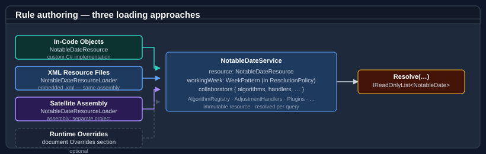

# Authoring notable date rules

`NotableDateService` resolves dates from one or more `INotableDateRuleProvider` sources. There are three ways to supply rules, and they can be combined freely in a single service instance:

| Approach | Best for |
|---|---|
| **In-code objects** | Tests, dynamic rules, generated rule sets. |
| **XML resource files** | Large or versioned rule sets shared across assemblies. |
| **Satellite assemblies** | Distributing rule sets as an independent NuGet package or selectively loading market-specific rules at runtime. |



---

## Approach 1 — In-code rule objects

### Implementing INotableDateRuleProvider

Implement the single-method `INotableDateRuleProvider` interface and return `NotableDateRule` instances from `LoadRules`:

```csharp
using Bodu.Globalization.Calendar;

public sealed class InMemoryRuleProvider : INotableDateRuleProvider
{
    private readonly IReadOnlyList<NotableDateRule> _rules;

    public InMemoryRuleProvider(params NotableDateRule[] rules) =>
        _rules = rules;

    public IEnumerable<NotableDateRule> LoadRules() => _rules;
}
```

### Authoring rules — Fixed date

A fixed-date rule specifies a month and day. Add an `ObservanceAdjustment` to shift the date when it falls on a weekend:

```csharp
using System.Collections.Immutable;
using Bodu.Globalization.Calendar;

NotableDateRule australiaDay = new NotableDateRule
{
    Name            = "Australia Day",
    Strategy        = DateResolutionStrategy.Fixed,
    Category        = NotableDateCategory.Holiday,
    Month           = 1,
    Day             = 26,
    TerritoryCode   = "AU",
    IsNonWorkingDay = true,
    Tags            = ImmutableHashSet.Create("NationalHoliday"),
    Adjustments     = ImmutableArray.Create(new ObservanceAdjustment
    {
        Key    = "weekend-roll",
        Trigger = AdjustmentTrigger.IfWeekend,
        Action  = AdjustmentAction.MoveToNextWeekday,
    }),
};
```

### Authoring rules — Nth weekday of month

Specify `DayOfWeek` and `WeekOrdinal` (from `Bodu.Extensions.WeekOfMonthOrdinal`):

```csharp
using Bodu.Extensions;
using Bodu.Globalization.Calendar;

// Third Monday in January (US Martin Luther King Jr. Day).
NotableDateRule mlkDay = new NotableDateRule
{
    Name            = "Martin Luther King Jr. Day",
    Strategy        = DateResolutionStrategy.DayOfWeekInMonth,
    Category        = NotableDateCategory.Holiday,
    Month           = 1,
    DayOfWeek       = DayOfWeek.Monday,
    WeekOrdinal     = WeekOfMonthOrdinal.Third,
    TerritoryCode   = "US",
    IsNonWorkingDay = true,
    FirstYear       = 1986,
};
```

### Authoring rules — Offset from an anchor

An `OffsetFromAnchor` rule is resolved relative to another rule's date. The anchor must appear in the same provider or in a provider registered earlier in the list:

```csharp
using Bodu.Globalization.Calendar;

// Good Friday — 2 days before Easter Sunday.
NotableDateRule goodFriday = new NotableDateRule
{
    Name            = "Good Friday",
    Strategy        = DateResolutionStrategy.OffsetFromAnchor,
    Category        = NotableDateCategory.Holiday,
    AnchorRuleName  = "Easter Sunday",
    OffsetDays      = -2,
    IsNonWorkingDay = true,
};

// Easter Monday — 1 day after Easter Sunday.
NotableDateRule easterMonday = new NotableDateRule
{
    Name            = "Easter Monday",
    Strategy        = DateResolutionStrategy.OffsetFromAnchor,
    Category        = NotableDateCategory.Holiday,
    AnchorRuleName  = "Easter Sunday",
    OffsetDays      = 1,
    IsNonWorkingDay = true,
};
```

### Authoring rules — Algorithm

Algorithm rules delegate date calculation to a registered `INotableDateAlgorithm`. Supply the registry key and register the implementation when building `NotableDateService`:

```csharp
using Bodu.Globalization.Calendar;
using Bodu.Globalization.Calendar.Algorithms;

NotableDateRule easterSunday = new NotableDateRule
{
    Name            = "Easter Sunday",
    Strategy        = DateResolutionStrategy.Algorithm,
    Category        = NotableDateCategory.Holiday,
    AlgorithmKey    = "easter-sunday",
    IsNonWorkingDay = true,
};
```

### Wiring up a provider

Pass the provider to `NotableDateService` via `ruleProviders`. Multiple providers can be combined; their rule sets are merged in order:

```csharp
using Bodu.Globalization.Calendar;
using Bodu.Globalization.Calendar.Algorithms;

NotableDateAlgorithmRegistry registry = new NotableDateAlgorithmRegistry()
    .Register("easter-sunday", new EasterSundayNotableDateAlgorithm());

var provider = new InMemoryRuleProvider(easterSunday, goodFriday, easterMonday, australiaDay);

var service = new NotableDateService(
    ruleProviders:     new[] { provider },
    weekendDefinition: CalendarWeekendDefinition.SaturdaySunday,
    options: new NotableDateServiceOptions { AlgorithmRegistry = registry });
```

---

## Approach 2 — XML resource files

XML resources are the recommended format for large or shared rule sets. The file is schema-validated, supports composition via `<UseFrom>` directives, and can be updated independently of code.

### Document structure

Every rule file must declare the `urn:bodu:globalization:calendar` namespace:

```xml
<?xml version="1.0" encoding="utf-8"?>
<NotableDates xmlns="urn:bodu:globalization:calendar"
              xmlns:xsi="http://www.w3.org/2001/XMLSchema-instance">

  <!-- UseFrom directives and NotableDate elements go here. -->

</NotableDates>
```

### Declaring a rule — Fixed date

Each `<NotableDate>` element groups one or more `<Rule>` variants under a canonical name. Rules apply globally unless `territory` restricts them:

```xml
<NotableDate name="Australia Day">
  <Rule name="Fixed Australia Day With Weekend Roll"
        category="Holiday"
        territory="AU"
        nonWorking="true"
        comment="Substitute Monday observed when 26 January falls on a weekend.">
    <Fixed month="January" day="26" />
    <Tag>NationalHoliday</Tag>
    <Adjustment key="weekend-roll" when="IfWeekend" action="MoveToNextWeekday" />
  </Rule>
</NotableDate>
```

**`<Rule>` attributes**

| Attribute | Required | Description |
|---|---|---|
| `name` | Yes | Variant identifier within the notable date. Required when a notable date has multiple `<Rule>` elements. |
| `category` | Yes | `Holiday`, `Observance`, `Remembrance`, `Cultural`, `Seasonal`, or `Other`. |
| `territory` | No | ISO 3166-1 alpha-2 code or subdivision (e.g. `AU`, `AU-NSW`). Omit for global scope. |
| `nonWorking` | No | `true` if this date is a non-working day. |
| `firstYear` | No | Inclusive first year the rule applies. |
| `lastYear` | No | Inclusive last year the rule applies. |
| `durationDays` | No | Multi-day span (default: `1`). |
| `priority` | No | Tie-break priority when multiple rules resolve to the same date (default: `100`). |
| `comment` | No | Authoring annotation — not surfaced to consumers. |

### Strategy elements

Each `<Rule>` contains exactly one strategy element:

**`<Fixed>`** — fixed month and day:

```xml
<Fixed month="December" day="25" />
```

For rules authored against a non-Gregorian calendar (`calendarType` set on the parent
`<Rule>`), additional attributes control how the calendar's month/day projects to a
Gregorian date — `sweepCalendarYears="true"` for Hijri, Umm al-Qura, Hebrew, and Persian;
`skipLeapMonth="true"` for Chinese lunisolar. See
[Working with non-Gregorian calendars](non-gregorian-calendars.md) for a per-calendar
authoring checklist and worked examples.

```xml
<!-- Ramadan: 1 Ramadan in the Umm al-Qura calendar -->
<Rule name="ramadan" calendarType="System.Globalization.UmAlQuraCalendar">
  <Fixed month="9" day="1" sweepCalendarYears="true" />
</Rule>
```

**`<DayOfWeekInMonth>`** — nth occurrence of a weekday in a month:

```xml
<!-- Third Monday in January -->
<DayOfWeekInMonth month="January" dayOfWeek="Monday" weekOrdinal="Third" />
```

`weekOrdinal` accepts: `First`, `Second`, `Third`, `Fourth`, `Fifth`, `Last`.

**`<OffsetFromAnchor>`** — days relative to another rule's resolved date:

```xml
<!-- Good Friday: 2 days before Easter Sunday -->
<OffsetFromAnchor name="Easter Sunday" offset="-2" />
```

**`<WeekdayNearDate>`** — a weekday positioned relative to a fixed reference date; `direction` is `OnOrAfter`, `OnOrBefore`, or `Nearest`:

```xml
<!-- Midsummer Day: the Saturday on or after 20 June -->
<WeekdayNearDate dayOfWeek="Saturday" month="June" day="20" direction="OnOrAfter" />

<!-- Repentance Day: the Wednesday on or before 22 November -->
<WeekdayNearDate dayOfWeek="Wednesday" month="November" day="22" direction="OnOrBefore" />
```

**`<RelativeWeekdayInMonth>`** — a target weekday (`relativeDayOfWeek`) positioned, via `direction`, relative to an anchor that is the `weekOrdinal`-th `dayOfWeek` of the month:

```xml
<!-- US Election Day: the Tuesday on or after the first Monday in November -->
<RelativeWeekdayInMonth month="November" weekOrdinal="First" dayOfWeek="Monday"
                        relativeDayOfWeek="Tuesday" direction="OnOrAfter" />
```

**`<Algorithm>`** — delegated to a registered algorithm; identified by key or assembly-qualified type name:

```xml
<Algorithm key="easter-sunday"
           type="Bodu.Globalization.Calendar.Algorithms.EasterSundayNotableDateAlgorithm, Bodu.Globalization.Calendar" />
```

### Adjustments and tags

`<Adjustment>` elements shift the anchor date when a trigger condition fires. Multiple adjustments are evaluated in `priority` order (ascending):

```xml
<NotableDate name="Christmas Day">
  <Rule name="Christmas Day With Substitute" category="Holiday" nonWorking="true">
    <Fixed month="December" day="25" />
    <Tag>Christian</Tag>
    <!-- Move to the next non-working day when Christmas falls on a Saturday or Sunday. -->
    <Adjustment key="weekend-roll" when="IfNonWorkingDay" action="MoveToNextNonWorkingDay" />
  </Rule>
</NotableDate>
```

**Common `when` / `action` values**

| `when` | Fires when… |
|---|---|
| `IfWeekend` | The date falls on a weekend (per the configured `CalendarWeekendDefinition`). |
| `IfWeekday` | The date falls on a weekday. |
| `IfNonWorkingDay` | The date is already a non-working day (weekend or another notable date). |
| `IfDayOfWeek` | The date falls on the weekday specified by an additional `dayOfWeek` attribute. |
| `Always` | Unconditionally. |

| `action` | Effect |
|---|---|
| `MoveToNextWeekday` | Advance to the next weekday. |
| `MoveToPreviousWeekday` | Retreat to the previous weekday. |
| `MoveToNextNonWorkingDay` | Advance past all non-working days. |
| `AddDays` | Add a fixed `offset` in days (negative moves backwards). |

### Composing rule sets with UseFrom

`<UseFrom>` imports rules from another resource file. Imported rules must be explicitly opted in via `<UseAll>` (import everything) or individual `<Use>` directives (cherry-pick by name). This keeps composition intentional — adding a rule to a shared library does not cascade into consumers automatically.

**`<UseAll>`** — opt in to every rule in the referenced file:

```xml
<UseFrom resource="./global-core.xml">
  <UseAll />
</UseFrom>
```

**`<Use>`** — cherry-pick a named rule and optionally apply overrides:

```xml
<UseFrom resource="./christian-gregorian.xml">
  <!-- Adopt Easter Sunday as-is, scoped to AU. -->
  <Use name="Easter Sunday" territory="AU" />

  <!-- Adopt Good Friday as a non-working holiday for AU. -->
  <Use name="Good Friday" territory="AU" nonWorking="true" />

  <!-- Rename "Holy Saturday" to "Easter Saturday" for AU and add an adjustment. -->
  <Use name="Holy Saturday" as="Easter Saturday" territory="AU" nonWorking="true">
    <Rule name="Australian Christmas Day With Non-Working-Day Roll"
          category="Holiday" nonWorking="true">
      <Adjustment key="weekend-roll" when="IfNonWorkingDay" action="MoveToNextNonWorkingDay" />
    </Rule>
  </Use>
</UseFrom>
```

**`clearInherited="true"`** — drop all inherited rule variants and replace with the rule declared in the directive body:

```xml
<UseFrom resource="./christian-gregorian.xml">
  <Use name="Christmas Day" territory="AU-NT" clearInherited="true">
    <Rule name="NT Christmas Day" category="Holiday" nonWorking="true">
      <Fixed month="December" day="25" />
      <Adjustment key="weekend-roll" when="IfWeekend" action="MoveToNextWeekday" />
    </Rule>
  </Use>
</UseFrom>
```

`resource` paths use forward slashes. Relative paths resolve from the directory of the declaring file; absolute paths (starting with `/`) resolve from the root of the manifest resource namespace.

### Embedding as a resource

Add the XML file as an `<EmbeddedResource>` item in the project file. The manifest resource name is derived by replacing path separators with dots:

```xml
<ItemGroup>
  <EmbeddedResource Include="Calendar\Resources\my-rules.xml" />
</ItemGroup>
```

### Loading the provider

Construct `XmlResourceNotableDateRuleProvider` with the logical path (forward-slash delimited) and a `ResourcePathResolver` to handle `<UseFrom>` path resolution:

```csharp
using Bodu.Globalization.Calendar;

var provider = new XmlResourceNotableDateRuleProvider(
    "MyApp/Calendar/Resources/my-rules.xml",
    new ResourcePathResolver());

var service = new NotableDateService(
    ruleProviders:     new[] { provider },
    weekendDefinition: CalendarWeekendDefinition.SaturdaySunday);
```

The logical path `"MyApp/Calendar/Resources/my-rules.xml"` is mapped to the manifest resource name `MyApp.Calendar.Resources.my-rules.xml`. Ensure the embedded resource path in the `.csproj` produces that manifest name (typically by placing the file under `MyApp/Calendar/Resources/` relative to the project root).

---

## XML vs. JSON parity

`JsonResourceNotableDateRuleProvider` accepts the same document model as the XML provider — rule body, `use` directives, removals, override layering, and adjustments. The choice between formats is presentation-only; the same parser pipeline normalises both into `ParsedNotableDateDocument` before resolution. Mix the two freely in a single service — XML for one provider, JSON for another.

The mapping is straightforward:

| XML | JSON |
|---|---|
| `<NotableDates>` root | `{ "notableDates": [ ... ] }` |
| `<NotableDate name="…">` | object with `"name"` |
| `<Rule …>` | object inside `"rules"` |
| `<Fixed month="…" day="…" />` | `"fixed": { "month": "…", "day": … }` |
| `<DayOfWeekInMonth month="…" dayOfWeek="…" weekOrdinal="…" />` | `"dayOfWeekInMonth": { "month": "…", "dayOfWeek": "…", "weekOrdinal": "…" }` |
| `<OffsetFromAnchor name="…" offset="…" />` | `"offsetFromAnchor": { "name": "…", "offset": … }` |
| `<WeekdayNearDate dayOfWeek="…" month="…" day="…" direction="…" />` | `"weekdayNearDate": { "dayOfWeek": "…", "month": "…", "day": …, "direction": "…" }` |
| `<RelativeWeekdayInMonth month="…" weekOrdinal="…" dayOfWeek="…" relativeDayOfWeek="…" direction="…" />` | `"relativeWeekdayInMonth": { "month": "…", "weekOrdinal": "…", "dayOfWeek": "…", "relativeDayOfWeek": "…", "direction": "…" }` |
| `<Algorithm key="…" />` | `"algorithm": { "key": "…" }` |
| `<Tag>…</Tag>` | `"tags": [ "…" ]` |
| `<Adjustment key="…" when="…" action="…" />` | object inside `"adjustments"` |
| `<UseFrom resource="…">` + `<Use name="…" />` | `"useFrom": { "resource": "…", "uses": [ { "name": "…" } ] }` |

### The same rule rendered in both formats

```xml
<?xml version="1.0" encoding="utf-8"?>
<NotableDates xmlns="urn:bodu:globalization:calendar">
  <NotableDate name="King's Birthday">
    <Rule name="October Variant" category="Holiday" firstYear="2016">
      <DayOfWeekInMonth month="October" dayOfWeek="Monday" weekOrdinal="First" />
      <Tag>SourceOctober</Tag>
    </Rule>
  </NotableDate>
</NotableDates>
```

```json
{
  "notableDates": [
    {
      "name": "King's Birthday",
      "rules": [
        {
          "name": "October Variant",
          "category": "Holiday",
          "firstYear": 2016,
          "dayOfWeekInMonth": {
            "month": "October",
            "dayOfWeek": "Monday",
            "weekOrdinal": "First"
          },
          "tags": [ "SourceOctober" ]
        }
      ]
    }
  ]
}
```

### Loading a JSON provider

`JsonResourceNotableDateRuleProvider` mirrors the XML provider's constructors — supply a logical resource path, a `ResourcePathResolver`, and (optionally) an assembly chain:

```csharp
using Bodu.Globalization.Calendar;

var provider = new JsonResourceNotableDateRuleProvider(
    "MyApp/Calendar/Resources/my-rules.json",
    new ResourcePathResolver());

var service = new NotableDateService(
    ruleProviders:     new[] { provider },
    weekendDefinition: CalendarWeekendDefinition.SaturdaySunday);
```

Embed the JSON file the same way as XML — `<EmbeddedResource Include="…" />` in the `.csproj` — and the logical-to-manifest mapping rules in [Embedding as a resource](#embedding-as-a-resource) apply unchanged. Cross-format `useFrom` directives work too: a JSON rule file can reference an XML resource and vice versa, as long as the resolver finds them.

---

## Approach 3 — Companion data assemblies

Embedding rule XML in a separate assembly keeps rules and application code independently versioned. This is useful for distributing a rule library, loading market-specific calendars on demand, or shrinking the main assembly. Bodu ships official region packs that follow exactly this shape — see [Calendar data packs](data-packs.md) for the prebuilt Americas, Europe, and Asia-Pacific assemblies.

### Setting up the companion project

Create a class library that contains only the embedded XML resources. The `<LogicalName>` override is what lets cross-assembly cherry-picks line up cleanly — pin each XML to the same logical path the consuming rule files expect:

```xml
<!-- MyApp.CalendarRules.csproj -->
<Project Sdk="Microsoft.NET.Sdk">
  <PropertyGroup>
    <TargetFramework>net8.0</TargetFramework>
    <AssemblyName>MyApp.CalendarRules</AssemblyName>
  </PropertyGroup>

  <ItemGroup>
    <EmbeddedResource Include="Resources\my-rules.xml">
      <LogicalName>MyApp.CalendarRules.Resources.my-rules.xml</LogicalName>
    </EmbeddedResource>
    <EmbeddedResource Include="Resources\region-apac.xml">
      <LogicalName>MyApp.CalendarRules.Resources.region-apac.xml</LogicalName>
    </EmbeddedResource>
  </ItemGroup>
</Project>
```

### Loading from a single companion assembly

Pass the assembly as the third constructor argument. The logical path resolves relative to that assembly's manifest resource namespace:

```csharp
using System.Reflection;
using Bodu.Globalization.Calendar;

Assembly rulesAssembly = Assembly.Load("MyApp.CalendarRules");

var provider = new XmlResourceNotableDateRuleProvider(
    "MyApp/CalendarRules/Resources/my-rules.xml",
    new ResourcePathResolver(),
    assembly: rulesAssembly);

var service = new NotableDateService(
    ruleProviders:     new[] { provider },
    weekendDefinition: CalendarWeekendDefinition.SaturdaySunday);
```

### Cross-assembly cherry-picks

`XmlResourceNotableDateRuleProvider` accepts an ordered chain of assemblies. The provider walks the chain in order on each manifest lookup, so a `<UseFrom>` directive declared in one assembly can resolve its target from another:

```csharp
var provider = new XmlResourceNotableDateRuleProvider(
    "MyApp/CalendarRules/Resources/region-apac.xml",
    new ResourcePathResolver(),
    new[] {
        typeof(MyAppRules).Assembly,           // pack-local rules win first
        typeof(NotableDateService).Assembly,   // global anchors fall back to the main library
    });
```

This is the mechanism that lets the official `Bodu.Globalization.Calendar.Data.*` packs cherry-pick from the main library's `global-*.xml` and `christian-*.xml` files even though those files live in a different DLL. If your custom rules reference rules in another assembly, list every assembly in the chain rather than wiring up several providers.

---

## Runtime overrides

`INotableDateRuleOverrideProvider` layers additions and removals on top of the base rule set at runtime, without modifying the source XML or in-code providers. Override providers are evaluated after all base providers:

```csharp
using Bodu.Globalization.Calendar;

public sealed class CompanyCalendarOverrides : INotableDateRuleOverrideProvider
{
    public IEnumerable<RuleRemoval> GetRemovals()
    {
        // Suppress Boxing Day for 2026 only.
        yield return new RuleRemoval("Boxing Day", FromYear: 2026, ToYear: 2026);
    }

    public IEnumerable<NotableDateRule> GetAdditions()
    {
        yield return new NotableDateRule
        {
            Name            = "Company Founding Day",
            Strategy        = DateResolutionStrategy.Fixed,
            Category        = NotableDateCategory.Observance,
            Month           = 6,
            Day             = 15,
            IsNonWorkingDay = true,
        };
    }
}
```

Register override providers via the `overrideProviders` constructor parameter:

```csharp
var service = new NotableDateService(
    ruleProviders:     new[] { provider },
    weekendDefinition: CalendarWeekendDefinition.SaturdaySunday,
    options: new NotableDateServiceOptions
    {
        OverrideProviders = new[] { new CompanyCalendarOverrides() },
    });
```

After changing override state, call `Invalidate()` to clear the resolved cache:

```csharp
service.Invalidate();       // Clear all years.
service.Invalidate(2026);   // Clear 2026 only.
```

---

## Choosing an approach

| | In-Code | XML Files | Companion Assembly |
|---|---|---|---|
| Schema validation | Manual | Yes (XSD) | Yes (XSD) |
| Versioning | With code | Independent | Independent |
| Cherry-pick composition | Manual | `<UseFrom>` / `<Use>` | `<UseFrom>` / `<Use>` (across assembly chain) |
| Runtime overhead | Minimal | Parse + cache on first use | Parse + cache on first use |
| Suitable for large rule sets | Impractical | Yes | Yes |
| Independent deployment | No | No | Yes |

Use in-code objects for unit tests or small dynamic rule sets. Use XML resource files when authoring dozens or more rules within the same project. Use companion assemblies to distribute rule sets as a separate package or to load regional calendars on demand — and check whether one of the official [calendar data packs](data-packs.md) already covers your region before authoring your own.

## Where to go next

- [Using NotableDateService](notable-dates.md) — filtering, territory queries, overrides, and caching.
- [Date calculation algorithms](algorithms.md) — registering built-in algorithms and implementing custom ones.
- [Bodu.Globalization.Calendar API reference](xref:Bodu.Globalization.Calendar) — full type reference.
