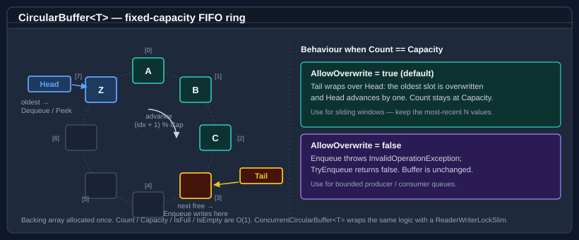

# Circular buffer

`CircularBuffer<T>` is a fixed-capacity, first-in first-out (FIFO) ring buffer. It is allocation-free after construction: elements overwrite the oldest slot when the buffer is full (if overwrite is enabled), or throw / return `false` when the buffer is full and overwrite is disabled.

For concurrent access, use `ConcurrentCircularBuffer<T>` — a thread-safe wrapper that uses a `ReaderWriterLockSlim` internally.



The backing array is allocated once. `Head` marks the oldest entry (the next `Dequeue` / `Peek` target) and `Tail` marks the next free slot (the next `Enqueue` target). Both indices advance with `(idx + 1) % Capacity`, which is what makes the storage a ring rather than a shifting array.

## Pattern 1 — basic enqueue and dequeue

```csharp
using Bodu.Collections.Generic;

var buffer = new CircularBuffer<int>(capacity: 4);

buffer.Enqueue(1);
buffer.Enqueue(2);
buffer.Enqueue(3);

int oldest = buffer.Dequeue();   // 1
int next   = buffer.Peek();      // 2, non-destructive
```

## Pattern 2 — bounded buffer that rejects excess

The capacity-only and default constructors set `AllowOverwrite = true` (sliding-window semantics — see Pattern 3). Pass `allowOverwrite: false` to flip the buffer into bounded mode, where `Enqueue` into a full buffer throws `InvalidOperationException`. Use `TryEnqueue` to avoid exceptions:

```csharp
using Bodu.Collections.Generic;

var buffer = new CircularBuffer<string>(capacity: 3, allowOverwrite: false);

buffer.Enqueue("a");
buffer.Enqueue("b");
buffer.Enqueue("c");

bool added = buffer.TryEnqueue("d");   // false — buffer is full
```

## Pattern 3 — ring buffer that overwrites the oldest entry

`AllowOverwrite = true` — the default — implements a sliding window of the most-recent *N* values:

```csharp
using Bodu.Collections.Generic;

// Keep only the 3 most recent readings.
var window = new CircularBuffer<double>(capacity: 3, allowOverwrite: true);

window.Enqueue(1.1);
window.Enqueue(2.2);
window.Enqueue(3.3);
window.Enqueue(4.4);   // overwrites 1.1

double[] readings = window.ToArray();   // [2.2, 3.3, 4.4]
```

## Pattern 4 — peek without removing

```csharp
using Bodu.Collections.Generic;

var buffer = new CircularBuffer<int>(capacity: 5);
buffer.Enqueue(10);
buffer.Enqueue(20);

if (buffer.TryPeek(out int first))
    Console.WriteLine(first);   // 10 — not removed
```

## Pattern 5 — concurrent access with ConcurrentCircularBuffer

`ConcurrentCircularBuffer<T>` provides the same `Enqueue` / `Dequeue` / `Peek` API but synchronises all operations using a `ReaderWriterLockSlim`. Use it when multiple threads read or write the buffer concurrently:

```csharp
using Bodu.Collections.Generic.Concurrent;

var buffer = new ConcurrentCircularBuffer<int>(capacity: 100, allowOverwrite: true);

// Producer thread
Task.Run(() =>
{
    for (int i = 0; i < 1000; i++)
        buffer.Enqueue(i);
});

// Consumer thread
Task.Run(() =>
{
    while (buffer.TryDequeue(out int value))
        Process(value);
});
```

> **Note.** `ConcurrentCircularBuffer<T>` serialises writes and excludes readers during writes. For very high-throughput single-producer / single-consumer scenarios, `CircularBuffer<T>` used with external coordination may be faster.

## API summary

| Member | Description |
|---|---|
| `Enqueue(T)` | Adds an element; throws if full and `AllowOverwrite` is `false`. |
| `TryEnqueue(T)` | Adds an element; returns `false` if full and `AllowOverwrite` is `false`. |
| `Dequeue()` | Removes and returns the oldest element; throws if empty. |
| `TryDequeue(out T)` | Removes and returns the oldest element; returns `false` if empty. |
| `Peek()` | Returns the oldest element without removing it; throws if empty. |
| `TryPeek(out T)` | Returns the oldest element without removing it; returns `false` if empty. |
| `Count` | The number of elements currently in the buffer. |
| `Capacity` | The maximum number of elements the buffer can hold. |
| `IsFull` | `true` when `Count == Capacity`. |
| `IsEmpty` | `true` when `Count == 0`. |
| `AllowOverwrite` | Whether adding to a full buffer overwrites the oldest entry. |
| `Clear()` | Removes all elements. |
| `ToArray()` | Returns a snapshot in insertion order. |

## Where to go next

- [Deque](deque.md) — double-ended queue with the same fixed-vs-growable choice on both ends.
- [Evicting dictionary](evicting-dictionary.md) — a fixed-capacity key-value cache with LRU / LFU / FIFO eviction.
- [WeekPattern](week-pattern.md) — immutable bitmask value type for sets of days of the week.
- [Bodu.Core overview](index.md) — all key types at a glance.
- [Bodu.Collections.Generic API reference](../../apidoc/Bodu.Collections.Generic.md) — full namespace overview.
