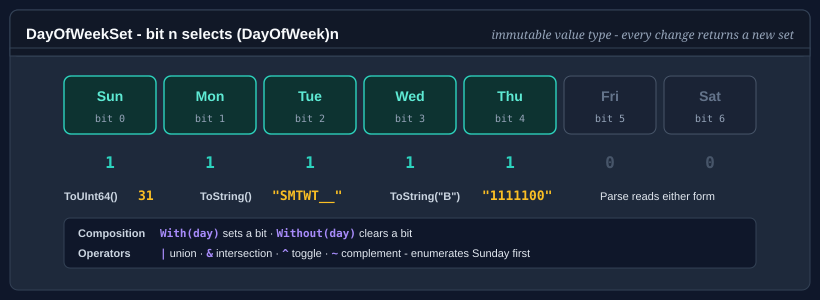

# DayOfWeekSet

`DayOfWeekSet` is an immutable set of days of the week. It is the day-of-week member of the
[calendar value sets](calendar-value-sets.md), held in one `ulong` as they are and implementing
`ICalendarValueSet<DayOfWeekSet, DayOfWeek>` with them, and it is the type the working-day APIs in Bodu.Core and
Bodu.Globalization.Calendar take for a working week. It replaces `WeekPattern`, which Bodu.Core 1.3.0 removed; see
[Migrating from WeekPattern](#migrating-from-weekpattern).

Every operation that changes the selection returns a new set rather than changing the one it is called on.



## Pattern 1 - build a set

Pass the days to the constructor, or start from a set and add or remove days with `With` and `Without`:

<!-- run -->
```csharp
using Bodu;

DayOfWeekSet weekdays = new DayOfWeekSet(
    DayOfWeek.Monday, DayOfWeek.Tuesday, DayOfWeek.Wednesday, DayOfWeek.Thursday, DayOfWeek.Friday);

DayOfWeekSet fourDays = weekdays.Without(DayOfWeek.Friday);
DayOfWeekSet withSaturday = fourDays.With(DayOfWeek.Saturday);

Console.WriteLine(fourDays.Count);                         // 4
Console.WriteLine(withSaturday.Contains(DayOfWeek.Monday)); // True
Console.WriteLine(withSaturday.Contains(DayOfWeek.Friday)); // False
```

`Contains` answers `false` for a value that is not one of the seven days, such as `(DayOfWeek)7`, so a membership
test against `DateTime.DayOfWeek` never throws. The constructor, `With` and `Without` throw
`ArgumentOutOfRangeException` for such a value.

## Pattern 2 - use the presets

<!-- run -->
```csharp
using Bodu;

DayOfWeekSet workweek = DayOfWeekSet.Weekdays;          // Mon-Fri
DayOfWeekSet weekend  = DayOfWeekSet.Weekend;           // Sat-Sun
DayOfWeekSet every    = DayOfWeekSet.All;               // all seven days
DayOfWeekSet none     = DayOfWeekSet.Empty;             // no days

// Regional working weeks, one preset per WorkingDaysOfWeek member.
DayOfWeekSet gulf     = DayOfWeekSet.SundayToThursday;  // Sun-Thu
DayOfWeekSet sixDay   = DayOfWeekSet.MondayToSaturday;  // Mon-Sat
```

`MondayToFriday` is the same set as `Weekdays`.

## Pattern 3 - combine sets

`|` is union, `&` intersection, `^` symmetric difference (the days in exactly one of the sets), and `~` the
complement within the week:

<!-- run -->
```csharp
using Bodu;

DayOfWeekSet mondayAndFriday = new DayOfWeekSet(DayOfWeek.Monday) | new DayOfWeekSet(DayOfWeek.Friday);

// Intersect with the working week to drop any weekend days.
DayOfWeekSet working = mondayAndFriday & DayOfWeekSet.Weekdays;

// The days not in the set.
DayOfWeekSet restDays = ~DayOfWeekSet.Weekdays;          // Sat-Sun

// The days that differ between two schedules.
DayOfWeekSet oldShift = DayOfWeekSet.Parse("_MTW___");
DayOfWeekSet newShift = DayOfWeekSet.Parse("__TWT__");
DayOfWeekSet changed  = oldShift ^ newShift;              // Mon and Thu
```

Two sets are equal (`==`, `Equals`) when they select the same days. The sets are not ordered; to test whether one set
contains another, use `(a & b) == b`.

## Pattern 4 - parse and format the mask

The text form is a seven-character mask with one character per day: the day's letter when it is selected and `_`
when it is not, Sunday first. `ToString` writes that form, and `ToString(format)` writes the others:

| Format | Mask | Monday to Friday |
|---|---|---|
| `S` or `G`, the default | Sunday first, `_` for a day not selected | `_MTWTF_` |
| `M` | Monday first, `_` for a day not selected | `MTWTF__` |
| `E`, `U`, `D`, `A` | Sunday first, with a space, `_`, `-` or `*` for a day not selected | `-MTWTF-` for `D` |
| `S` or `M` with `E`, `U`, `D` or `A` | that order with that placeholder | `MTWTF--` for `MD` |
| `B`, `0`, `1`, `01` | binary, Sunday first, `1` for a selected day | `0111110` |

`Parse` reads any of them. A day's letter, in either case, selects the day; `_`, `-`, `*` or a space leaves it out,
one placeholder throughout; and the letters show whether the mask starts on Sunday or on Monday. A mask that begins
with `0` or `1` is read as the binary form. `ParseExact` reads a mask in a format you name, which is the way to read
Monday-first text whose only letter is a final `S`: `"______S"` fits both orders, and `Parse` reads it Sunday first,
as Saturday. Anything else, an abbreviated list such as `"MF"` included, is not a mask: `Parse` throws
`FormatException`, and `TryParse` returns `false` with the empty set.

<!-- run -->
```csharp
using Bodu;

DayOfWeekSet mwf  = DayOfWeekSet.Parse("_M_W_F_");         // Mon, Wed, Fri
DayOfWeekSet tuth = DayOfWeekSet.Parse("__T_T__");         // Tue, Thu
DayOfWeekSet bin  = DayOfWeekSet.Parse("0111110");         // Mon-Fri, binary form
DayOfWeekSet sun  = DayOfWeekSet.ParseExact("______S", "M"); // Sunday, Monday first

string mask   = DayOfWeekSet.Weekdays.ToString();          // "_MTWTF_"
string monday = DayOfWeekSet.Weekdays.ToString("M");       // "MTWTF__"
string binary = DayOfWeekSet.Weekdays.ToString("B");       // "0111110"

bool ok = DayOfWeekSet.TryParse("MF", out DayOfWeekSet result); // false; result is empty
```

`DayOfWeekSet` implements `IFormattable`, so `$"{set:M}"` and `string.Format("{0:B}", set)` apply the format, and
`IParsable<DayOfWeekSet>`, whose members ignore the format provider: the mask does not depend on culture. An
unsupported format throws `FormatException` from `ToString` and `ParseExact`, and makes `TryParseExact` return
`false`. `G` is the general format every calendar value set reads, and here it names the default mask.

The mask is ASCII, and the span and UTF-8 members of the
[calendar value sets](calendar-value-sets.md#spans-and-utf-8) apply here too: `TryFormat` writes it into a span of
seven characters or bytes without allocating, `Parse` and `TryParse` read a `ReadOnlySpan<char>` or UTF-8 bytes, and
`ParseExact` and `TryParseExact` a `ReadOnlySpan<char>`.

<!-- run -->
```csharp
using Bodu;

Span<char> mask = stackalloc char[7];
bool written = DayOfWeekSet.Weekdays.TryFormat(mask, out int charsWritten, "M");   // true: "MTWTF__"

DayOfWeekSet fromUtf8 = DayOfWeekSet.Parse("_M_W_F_"u8);                           // Mon, Wed, Fri
```

## Pattern 5 - enumerate the days

`foreach` over a set yields the selected days in `DayOfWeek` order, Sunday first, without allocating:

<!-- run -->
```csharp
using Bodu;

foreach (DayOfWeek day in DayOfWeekSet.Parse("_MTWTF_"))
    Console.WriteLine(day);

// Monday, Tuesday, Wednesday, Thursday, Friday
```

## Pattern 6 - read and write the bits

`ToUInt64` returns the set's bits and `FromUInt64` builds a set from them. Bit `n` selects `(DayOfWeek)n`, so Sunday
is bit 0 and Saturday bit 6; `FromUInt64` throws `ArgumentOutOfRangeException` for a bit above bit 6.

<!-- run -->
```csharp
using Bodu;

ulong gulfBits = DayOfWeekSet.SundayToThursday.ToUInt64();  // 31: bits 0 to 4
DayOfWeekSet same = DayOfWeekSet.FromUInt64(gulfBits);       // Sun-Thu again
```

The binary text form is written Sunday first, so it reads the bits from bit 0 up: Sunday to Thursday is `"1111100"`,
the reverse of how 31 is usually written in binary.

## Pattern 7 - find matching dates

<!-- run -->
```csharp
using Bodu;

// Every Tuesday and Thursday in April 2025.
DayOfWeekSet tuesdayAndThursday = new DayOfWeekSet(DayOfWeek.Tuesday, DayOfWeek.Thursday);

for (DateOnly day = new DateOnly(2025, 4, 1); day <= new DateOnly(2025, 4, 30); day = day.AddDays(1))
{
    if (tuesdayAndThursday.Contains(day.DayOfWeek))
        Console.WriteLine(day);
}
```

## Pattern 8 - bridge to and from WorkingDaysOfWeek

<xref:Bodu.WorkingDaysOfWeek> names the common working weeks (`MondayToFriday`, `SaturdayToThursday`, ...). Convert
between the two with the extension methods on <xref:Bodu.Extensions.WorkingDaysOfWeekExtensions>, for an API that
takes one when you have the other:

<!-- run -->
```csharp
using Bodu;
using Bodu.Extensions;

DayOfWeekSet saudiWeek = WorkingDaysOfWeek.SaturdayToWednesday.ToDayOfWeekSet();
WorkingDaysOfWeek back = DayOfWeekSet.Weekdays.ToWorkingDaysOfWeek();   // MondayToFriday
```

## Migrating from WeekPattern

`DayOfWeekSet` keeps `WeekPattern`'s text forms and presets, so text that a `WeekPattern` wrote, including the
`workingDays` attributes of calendar documents, reads unchanged. The rest of the surface moved to the shape of the
other calendar value sets:

| `WeekPattern` | `DayOfWeekSet` |
|---|---|
| `WeekPattern.AllDays` | `DayOfWeekSet.All` |
| `Empty`, `Weekdays`, `Weekend` and the other presets, static fields | the same names, static properties |
| `new WeekPattern(string)` | `DayOfWeekSet.Parse(string)` |
| `pattern[day]` (indexer) | `set.Contains(day)` |
| `Contains(day)` throws for a value that is not a day | `Contains(day)` returns `false` for it |
| `FromByte(byte)` / `ToByte()` / `ToInt32()`, Sunday at bit 6 | `FromUInt64(ulong)` / `ToUInt64()`, Sunday at bit 0 |
| implicit conversion to `byte`, `IEquatable<byte>` | removed: use `ToUInt64()` |
| `<`, `<=`, `>`, `>=`, `IComparable` | removed: the order meant nothing as a set relation |
| `[Serializable]` / `ISerializable` | removed: store the text form |
| `ToString(IFormatProvider)` | `ToString()` |
| unsupported format in `ToString` throws `ArgumentException` | throws `FormatException`; an empty format means the default |
| `ToWeekPattern()` on `WorkingDaysOfWeek` | `ToDayOfWeekSet()` |
| `ToWeekPattern()` on `IWeekendDefinitionProvider` | `ToWorkingWeek()` |

To move a stored `WeekPattern.ToByte` value over, reverse its seven bits, or rebuild the set from the days whose bit
`6 - (int)day` is set.

## API summary

| Member | Description |
|---|---|
| `Empty`, `All` | The set of no day and the set of all seven. |
| `Weekdays`, `Weekend` | Monday to Friday, and Saturday and Sunday. |
| `MondayToFriday`, `MondayToSaturday`, `MondayToThursdayAndSaturday`, `SaturdayToThursday`, `SaturdayToWednesday`, `SundayToFriday`, `SundayToThursday` | The regional working weeks, one per `WorkingDaysOfWeek` member. |
| `DayOfWeekSet(params DayOfWeek[])` | The set of the days given. |
| `Count` | The number of days selected, 0 to 7. |
| `Contains(DayOfWeek)` | Whether the day is selected; `false` for a value that is not a day. |
| `With(DayOfWeek)`, `Without(DayOfWeek)` | A set with the day added or removed. |
| `FromUInt64(ulong)`, `ToUInt64()` | The set's bits, bit `n` for `(DayOfWeek)n`. |
| `Parse`, `TryParse`, `ParseExact`, `TryParseExact` | Read a seven-character mask, from a `string` or a `ReadOnlySpan<char>`; `Parse` and `TryParse` also from UTF-8 bytes. |
| `ToString()`, `ToString(string)`, `ToString(string, IFormatProvider)` | Write a seven-character mask. |
| `TryFormat(Span<char>, ...)`, `TryFormat(Span<byte>, ...)` | Write the mask into a span of characters or of UTF-8 bytes, without allocating. |
| `\|`, `&`, `^`, `~`, `==`, `!=` | Union, intersection, symmetric difference, complement and equality. |
| `GetEnumerator()` | The selected days in `DayOfWeek` order, Sunday first, without allocating. |

`DayOfWeekSet` implements `ICalendarValueSet<DayOfWeekSet, DayOfWeek>`, the interface it shares with the other
[calendar value sets](calendar-value-sets.md#pattern-6---work-with-any-set).

## Where to go next

- [Calendar value sets](calendar-value-sets.md) - the sets of months, days of the month, hours, minutes and seconds.
- [Fiscal quarters, working weeks, and weekend providers](calendar-shapes-and-providers.md) - `WorkingDaysOfWeek`
  and the weekend providers.
- [Working-day arithmetic](../calendar/working-days.md) - working weeks in the calendar engine.
- **[Core Foundations guides](../topics/core-foundations.md)** - every guide in this topic.
