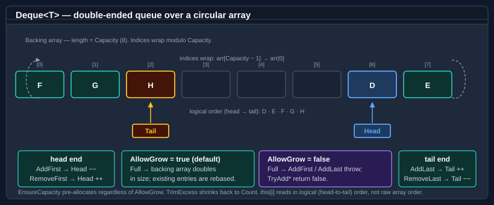

# Deque

`Deque<T>` is a double-ended queue (deque) backed by a contiguous circular array. Elements may be added or removed from either end in amortized O(1) time. The `AllowGrow` property controls whether the backing array expands automatically when full or whether the deque rejects further inserts — letting one type cover both growable and fixed-capacity scenarios.

For a single-ended FIFO buffer with eviction-on-full semantics, see [Circular buffer](circular-buffer.md). For thread-safe concurrent FIFO access, use `ConcurrentCircularBuffer<T>` (a separate, lock-free implementation).



`Head` and `Tail` index into a contiguous backing array but advance modulo `Capacity`, so the logical sequence may wrap past the end of the array. `AddFirst` / `RemoveFirst` operate at the head end; `AddLast` / `RemoveLast` operate at the tail end. The indexer `this[i]` reads in logical order, hiding the wrap from callers.

`Deque<T>` and <xref:Bodu.Collections.Generic.CircularBuffer`1> share the <xref:Bodu.Collections.Generic.RingBackedCollection`1> base, so they share enumeration, copy, indexer, and trim behaviour. Adds and removes at either end are **amortised O(1)** (the amortisation absorbs the occasional array-doubling pass in growable mode), and the indexer is an O(1) random read. The type accepts `null` for reference `T` and permits duplicates.

> [!NOTE]
> Enumeration is **fail-fast**: the deque carries a structural-version counter, and a `struct` enumerator created by `foreach` throws <xref:System.InvalidOperationException> on the next `MoveNext` if the deque is structurally mutated — including `Clear`, `TrimExcess`, or any add/remove — while the enumerator is live. The struct enumerator means `foreach` allocates nothing.

## Pattern 1 — growable double-ended queue (default)

`new Deque<T>()` and `new Deque<T>(capacity)` both produce a growable deque. The capacity argument is a hint — the backing array doubles automatically when filled.

```csharp
using Bodu.Collections.Generic;

var deque = new Deque<int>();
deque.AddLast(2);
deque.AddFirst(1);
deque.AddLast(3);          // contents: 1, 2, 3

int first = deque.RemoveFirst();   // 1
int last  = deque.RemoveLast();    // 3
```

## Pattern 2 — fixed-capacity deque that throws when full

Pass `allowGrow: false` to switch off automatic growth. Adds to a full deque throw `InvalidOperationException`; the `Try*` overloads return `false` without modifying state:

```csharp
using Bodu.Collections.Generic;

var bounded = new Deque<int>(capacity: 8, allowGrow: false);

for (int i = 0; i < 8; i++)
    bounded.AddLast(i);

bool added = bounded.TryAddLast(8);   // false — bounded is full
bool full  = bounded.IsFull;          // true

// Throwing variant:
// bounded.AddLast(8);                // InvalidOperationException
```

## Overflow policy — evict from the opposite end

Rejecting is only the default. `OverflowPolicy` selects what a full, fixed-capacity deque does with the next add: `DequeOverflowPolicy.Reject` (throw / return `false`, as above) or `DequeOverflowPolicy.EvictOpposite`, which silently discards the element at the *opposite* end to make room — `AddFirst` drops the tail element, `AddLast` drops the head element, and `Count` stays at `Capacity`. This is the double-ended analogue of Python's `collections.deque(maxlen=N)`:

```csharp
using Bodu.Collections.Generic;

var recent = new Deque<int>(capacity: 3, allowGrow: false)
{
    OverflowPolicy = DequeOverflowPolicy.EvictOpposite,
};

recent.AddLast(1);
recent.AddLast(2);
recent.AddLast(3);          // full: 1, 2, 3
recent.AddLast(4);          // evicts 1 → 2, 3, 4
recent.AddFirst(0);         // evicts 4 → 0, 2, 3

bool added = recent.TryAddLast(5);   // true — evicts 0 → 2, 3, 5
```

`EvictOpposite` is the deque counterpart of `CircularBuffer<T>.AllowOverwrite` — the same overwrite-on-full idea, generalised to both ends — and mirrors its event pair: `ItemEvicting` fires immediately before each eviction (a handler that throws vetoes the eviction in place, leaving the deque unchanged) and `ItemEvicted` fires immediately after, both carrying the discarded element.

The policy is consulted only when the deque is full and `AllowGrow` is `false`. While `AllowGrow` is `true`, growth always wins and nothing is ever evicted, regardless of the configured policy. Assigning a value that is not a defined `DequeOverflowPolicy` member throws `ArgumentOutOfRangeException`.

## Pattern 3 — sliding window from both ends

Use `AddFirst` / `AddLast` together with `RemoveFirst` / `RemoveLast` to build a sliding window or undo/redo buffer. (The drop-the-oldest step below is exactly what `OverflowPolicy = DequeOverflowPolicy.EvictOpposite` automates — shown here in its manual form for when the eviction needs custom logic.)

```csharp
using Bodu.Collections.Generic;

var recent = new Deque<string>(capacity: 5, allowGrow: false);

void Record(string action)
{
    if (recent.IsFull)
        recent.RemoveFirst();   // drop the oldest
    recent.AddLast(action);
}

Record("open");
Record("edit");
Record("save");

string mostRecent = recent.PeekLast();   // "save"
```

## Pattern 4 — peek without removing

```csharp
using Bodu.Collections.Generic;

var deque = new Deque<int>();
deque.AddLast(10);
deque.AddLast(20);

if (deque.TryPeekFirst(out int head)) Console.WriteLine(head);   // 10
if (deque.TryPeekLast(out int tail))  Console.WriteLine(tail);   // 20

// Throwing variants:
int h = deque.PeekFirst();   // 10
int t = deque.PeekLast();    // 20
```

## Pattern 5 — toggling between growable and fixed at runtime

`AllowGrow` is a settable property. Toggling from `true` to `false` does not shrink the existing capacity — call `TrimExcess` afterwards if a smaller footprint is wanted.

```csharp
using Bodu.Collections.Generic;

var deque = new Deque<int>(capacity: 4);   // growable

for (int i = 0; i < 100; i++)
    deque.AddLast(i);                       // backing array grows past 4

// Lock the deque to its current size so subsequent adds are rejected:
deque.AllowGrow = false;
bool added = deque.TryAddLast(101);          // false — at capacity

// Switch back to growable later if needed:
deque.AllowGrow = true;
deque.AddLast(101);                          // OK; grows again
```

## Pattern 6 — pre-grow with EnsureCapacity

`EnsureCapacity` works regardless of `AllowGrow` — it is the explicit pre-grow hatch even on fixed-capacity deques. Use it to reserve space ahead of a known burst of inserts:

```csharp
using Bodu.Collections.Generic;

var deque = new Deque<int>(capacity: 4, allowGrow: false);
deque.EnsureCapacity(10_000);   // pre-allocate; AllowGrow stays false

for (int i = 0; i < 10_000; i++)
    deque.AddLast(i);            // no throws — capacity already covers it
```

## Growth and seeding

In growable mode the backing array doubles on overflow — the new capacity is `max(MinGrowCapacity, Capacity × 2)` (with a small floor for tiny deques), capped at <xref:System.Array.MaxLength>. Doubling keeps the per-element cost amortised O(1) over a run of appends.

A deque can be seeded from a sequence. When the source is longer than the supplied capacity, growable mode bumps the capacity to fit the whole source (nothing is dropped), whereas `allowGrow: false` with an over-long source throws `InvalidOperationException`. The default capacity is `16` and the default `allowGrow` is `true` on every constructor overload:

```csharp
using Bodu.Collections.Generic;

var grown  = new Deque<int>(new[] { 1, 2, 3, 4, 5 }, capacity: 2);             // grows to fit: holds all 5
// var fail = new Deque<int>(new[] { 1, 2, 3 }, capacity: 2, allowGrow: false); // InvalidOperationException
```

## API summary

| Member | Description |
|---|---|
| `AddFirst(T)` | Adds an element at the head. On a full fixed-capacity deque, throws under `Reject` or evicts the tail element under `EvictOpposite`. |
| `AddLast(T)` | Adds an element at the tail. On a full fixed-capacity deque, throws under `Reject` or evicts the head element under `EvictOpposite`. |
| `TryAddFirst(T)` / `TryAddLast(T)` | Non-throwing variants. Return `false` only when full, `AllowGrow` is `false`, and `OverflowPolicy` is `Reject`; otherwise `true` (growing or evicting as configured). |
| `RemoveFirst()` / `RemoveLast()` | Removes and returns the head or tail element. Throws if empty. |
| `TryRemoveFirst(out T)` / `TryRemoveLast(out T)` | Non-throwing remove variants; return `false` if empty. |
| `PeekFirst()` / `PeekLast()` | Reads the head or tail element without removing it. Throws if empty. |
| `TryPeekFirst(out T)` / `TryPeekLast(out T)` | Non-throwing peek variants; return `false` if empty. |
| `Count` | The number of elements currently in the deque. |
| `Capacity` | The current backing-array length. Mutable in growable mode. |
| `IsEmpty` | `true` when `Count == 0`. |
| `IsFull` | `true` when `Count == Capacity`. |
| `AllowGrow` | Whether the backing array expands automatically when full. Settable at runtime. While `true`, growth wins and `OverflowPolicy` is never consulted. |
| `OverflowPolicy` | How a full fixed-capacity deque handles adds: `Reject` (default — throw / `false`) or `EvictOpposite` (Python `deque(maxlen=N)` semantics). |
| `ItemEvicting` / `ItemEvicted` | Events raised around each `EvictOpposite` eviction with the discarded element. A throwing `ItemEvicting` handler vetoes the eviction in place. |
| `EnsureCapacity(int)` | Expands the backing array to hold at least the requested capacity. Ignores `AllowGrow`. |
| `Clear()` | Removes all elements; capacity unchanged. |
| `TrimExcess()` | Shrinks the backing array to `Count` (or 1 when empty). |
| `ToArray()` | Returns a snapshot in head-to-tail logical order. |
| `this[int]` | Read-only indexer in head-to-tail logical order. |

## Where to go next

- [Circular buffer](circular-buffer.md) — fixed-capacity FIFO with eviction-on-full semantics.
- [Evicting dictionary](evicting-dictionary.md) — fixed-capacity key-value cache with LRU / LFU / FIFO eviction.
- [Bodu.Core overview](index.md) — all key types at a glance.
- [Bodu.Collections.Generic API reference](xref:Bodu.Collections.Generic) — full namespace overview.
- **[Core Foundations guides](../topics/core-foundations.md)** — every guide in this topic.
