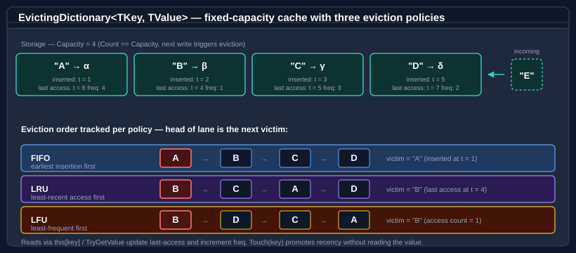

# Evicting dictionary

`EvictingDictionary<TKey, TValue>` is a fixed-capacity dictionary that automatically removes the least-worthy entry when capacity is exceeded. It supports three eviction policies:

| Policy | Evicts | Best for |
|---|---|---|
| `FirstInFirstOut` | The entry that was added earliest. | Bounded queues; sliding time windows. |
| `LeastRecentlyUsed` | The entry that was accessed furthest in the past. | General-purpose caches where recency predicts future use. |
| `LeastFrequentlyUsed` | The entry with the lowest access count. | Long-lived caches where popularity predicts future use. |



Every entry carries three pieces of metadata — insertion timestamp, last-access timestamp, and access count. Each policy maintains its own ordering over those metadata, and the head of that ordering is the next victim. Reads via `this[key]` and `TryGetValue` update the recency and frequency metadata; `Touch` promotes a key without reading the value.

## Pattern 1 — LRU cache

```csharp
using Bodu.Collections.Generic;

var cache = new EvictingDictionary<string, byte[]>(
    capacity: 50,
    EvictingDictionaryPolicy.LeastRecentlyUsed);

cache["config.json"] = LoadFile("config.json");
cache["schema.xsd"]  = LoadFile("schema.xsd");

// Reading a key marks it as recently used.
if (cache.TryGetValue("config.json", out byte[]? data))
    Use(data);
```

## Pattern 2 — FIFO bounded store

```csharp
using Bodu.Collections.Generic;

var recent = new EvictingDictionary<Guid, string>(
    capacity: 100,
    EvictingDictionaryPolicy.FirstInFirstOut);

// Oldest entry is evicted once capacity is reached.
foreach (var (id, message) in incoming)
    recent[id] = message;
```

## Pattern 3 — LFU cache for hot-spot data

```csharp
using Bodu.Collections.Generic;

var hot = new EvictingDictionary<int, CompiledQuery>(
    capacity: 200,
    EvictingDictionaryPolicy.LeastFrequentlyUsed);

hot[queryId] = Compile(sql);
if (hot.TryGetValue(queryId, out CompiledQuery? q))
    Execute(q);   // increments the access counter
```

## Pattern 4 — explicit eviction promotion (Touch)

Call `Touch` to promote a key without reading its value — useful when you want to mark an entry as recently used based on external logic:

```csharp
using Bodu.Collections.Generic;

var lru = new EvictingDictionary<string, Session>(
    capacity: 1000,
    EvictingDictionaryPolicy.LeastRecentlyUsed);

// Extend the session's lifetime on heartbeat.
void OnHeartbeat(string sessionId)
{
    lru.Touch(sessionId);
}
```

## Pattern 5 — assignment semantics

Unlike `Dictionary<TKey, TValue>.Add`, assigning to an existing key replaces the value **and** resets its eviction metadata:

```csharp
using Bodu.Collections.Generic;

var lru = new EvictingDictionary<string, int>(
    capacity: 3,
    EvictingDictionaryPolicy.LeastRecentlyUsed);

lru["a"] = 1;
lru["b"] = 2;
lru["c"] = 3;

// Re-assigning "a" resets its recency to newest.
lru["a"] = 10;

// Adding "d" evicts the LRU entry, which is now "b".
lru["d"] = 4;

bool hasB = lru.ContainsKey("b");   // false — evicted
```

## Thread safety

`EvictingDictionary<TKey, TValue>` is **not thread-safe**. Concurrent reads can mutate eviction metadata (LRU access order, LFU access counts), so concurrent read-read is also not safe without external synchronisation. Wrap with a lock or `ReaderWriterLockSlim` when multiple threads access the same instance.

## API summary

| Member | Description |
|---|---|
| `this[TKey]` (get) | Returns the value; throws if the key is not present. Promotes the key in LRU / LFU. |
| `this[TKey]` (set) | Adds or replaces the entry. Evicts if capacity is exceeded. |
| `Add(TKey, TValue)` | Equivalent to the indexer set; replaces rather than throwing on duplicate keys. |
| `TryGetValue(TKey, out TValue)` | Returns the value without throwing; promotes the key. |
| `ContainsKey(TKey)` | Returns `true` without promoting the key. |
| `Touch(TKey)` | Promotes the key in LRU / LFU without reading the value. |
| `Remove(TKey)` | Removes the entry. |
| `Count` | Number of entries currently held. |
| `Capacity` | Maximum entries before eviction. |
| `Policy` | The active `EvictingDictionaryPolicy`. |
| `Keys` / `Values` | Snapshot collections in current eviction order. |
| `Clear()` | Removes all entries. |

## Where to go next

- [Circular buffer](circular-buffer.md) — fixed-capacity FIFO ring buffer.
- [WeekPattern](week-pattern.md) — immutable bitmask value type for sets of days of the week.
- [Bodu.Core overview](index.md) — all key types at a glance.
- [Bodu.Collections.Generic API reference](../../apidoc/Bodu.Collections.Generic.md) — full namespace overview.
