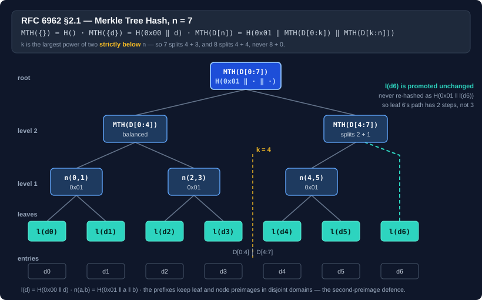

# RFC 6962 Merkle trees and proofs

<xref:Bodu.Collections.Merkle.Rfc6962MerkleTree> — in the **Bodu.Collections** package, namespace `Bodu.Collections.Merkle` — implements the Merkle tree of [RFC 6962](https://www.rfc-editor.org/rfc/rfc6962#section-2.1): the Merkle Tree Hash, inclusion (audit) proofs, consistency proofs, and length-bound roots. It is the type to reach for when a root has to interoperate with a transparency log, an artifact attestation, or anything else built to the standard, and it is the only Bodu type that produces proofs.

The package depends on `Bodu.Core` alone. Reaching for a commitment does not pull in a cipher catalogue — the hash is supplied by the caller as a `Func<HashAlgorithm>`, so the BCL algorithms and the Bodu digests both work while the package references neither. The types live beside the collection catalogue for the same reason the approximate sketches do: they need nothing else, and a package of their own would buy a consumer nothing.

```bash
dotnet add package Bodu.Collections
```

> [!IMPORTANT]
> `Bodu.Security.Cryptography` also ships <xref:Bodu.Security.Cryptography.MerkleTreeHash> and <xref:Bodu.Security.Cryptography.ParallelMerkleTreeHash>. Those two borrow RFC 6962's **domain separation** but not its **tree shape**: they reduce level by level with a configurable `fanOut` and re-hash a lone leftover child, so their roots agree with RFC 6962's only when the leaf count is a power of two, and must not be cross-checked against a transparency log. See [Using Merkle trees](../cryptography/merkle-trees.md) for those, and the table there for the choice between all three.



## The construction, precisely

RFC 6962 §2.1 defines the Merkle Tree Hash over a list `D[n]`:

```text
MTH({})       = H()                                     the hash of zero bytes
MTH({d(0)})   = H(0x00 || d(0))                          a leaf, not a bare digest
MTH(D[n])     = H(0x01 || MTH(D[0:k]) || MTH(D[k:n]))    for n > 1
```

with `k` the largest power of two **strictly** below *n*. Two details are where plausible-looking implementations diverge, and both matter because a divergent root simply does not verify anywhere else:

- **Three leaves split 2 + 1**, not 1 + 2 and not a rounded half. For `n = 8`, `k = 4` — the case where "strictly below" and "at or below" disagree, and where getting it wrong produces a tree one level too deep.
- **A subtree with one leaf contributes its leaf hash unchanged.** It is not re-hashed as a one-child node. This is precisely where the two `Bodu.Security.Cryptography` types differ.

The tree is binary by definition, so there is no `fanOut` to choose, and an empty tree's root is `H()` rather than an exception.

## A root and a proof over a list of entries

```csharp
using System.Security.Cryptography;
using Bodu.Collections.Merkle;

var tree = new Rfc6962MerkleTree(SHA256.Create);   // immutable; safe to share across threads

ReadOnlyMemory<byte>[] entries = [new byte[0], new byte[] { 0x00 }, new byte[] { 0x10 }];

byte[]   root = tree.ComputeRoot(entries);
byte[][] path = tree.AuthenticationPath(entries, leafIndex: 2);

bool ok = tree.VerifyInclusion(
    root, treeSize: entries.Length, leafIndex: 2,
    entry: entries[2].Span,
    path: path.Select(step => (ReadOnlyMemory<byte>)step).ToArray());
```

The instance keeps no digest state between calls and is deliberately **not** `IDisposable` — it creates and disposes a `HashAlgorithm` inside each call, so there is nothing on the tree itself to dispose and a `using` would imply a lifetime it does not have.

`ComputeRootOfLeafHashes`, `AuthenticationPath(IReadOnlyList<byte[]>, long)`, and `VerifyInclusionOfLeafHash` are the counterparts for callers that already hold leaf hashes — from a cache, a previous pass, or a <xref:Bodu.Collections.Merkle.MerkleComputation>.

## Block mode over a stream

For a byte stream, block mode cuts the input into fixed-size leaves and returns the root **and** the leaf hashes a path needs from the same pass, so a large object is never read twice:

```csharp
MerkleComputation computation = tree.ComputeBlocked(stream, blockSize: 1024 * 1024);

byte[]   root      = computation.Root;
long     length    = computation.InputLength;
byte[][] blockPath = tree.AuthenticationPath(computation.LeafHashes, blockIndex);
```

Two conventions differ from padding-based schemes, and both are deliberate:

- a **zero-length input has no blocks at all**, not one empty block, so its root is `H()`;
- a **final short block is hashed at its actual length**, never zero-padded — padding would let a shorter input collide with a zero-extended longer one.

<xref:Bodu.Collections.Merkle.MerkleBlocks> exposes the arithmetic (`BlockCount`, `BlockOffset`, `BlockLength`) in 64-bit form, so blocks of a multi-gigabyte object can be addressed without overflow.

### Root only, in logarithmic memory

`ComputeRootOfBlocks` folds the tree as it reads rather than retaining every leaf:

```csharp
byte[] root = tree.ComputeRootOfBlocks(stream, blockSize: 1024 * 1024);
```

Each leaf is pushed as a one-leaf subtree, equal-sized tops are merged immediately, and what remains is folded right-to-left at the end — so the stack holds one subtree per set bit of the leaf count, `popcount(n)` hashes and never more. Peak memory is `O(blockSize + log n · HashLength)` whatever the input size.

The trade is that no path can be produced afterwards without a second pass. `ComputeBlocked` retains every leaf hash for that reason, at `leafCount × HashLength` bytes — 16 KiB for a 512 MiB object at one-mebibyte blocks, which is usually the better deal if a proof is ever wanted.

## Hashing leaves in parallel

`ComputeBlockedParallel` and `ComputeRootParallel` spread **leaf hashing** across threads. The tree shape is untouched — every path folds the resulting leaf hashes through the same reduction — so the root is bit-identical to the sequential one for every input, and switching between them is a performance question and never a compatibility one.

```csharp
// Bytes already in memory — this is the one that scales.
MerkleComputation computation = tree.ComputeBlockedParallel(buffer.AsMemory(), blockSize: 1024 * 1024);

// From a stream, when the object is too large to hold.
MerkleComputation streamed = tree.ComputeBlockedParallel(stream, blockSize: 1024 * 1024);

// Entry mode, root only.
byte[] root = tree.ComputeRootParallel(entries);
```

Prefer the `ReadOnlyMemory<byte>` overload where you can. A stream must be read sequentially, so that overload copies each block on the calling thread before any worker can touch it, which caps the gain; the in-memory overload copies *and* hashes each block inside its own worker.

How much you actually gain depends on how fast the leaf hash is relative to memory bandwidth — and it can be **negative**:

| Leaf hash | Stream overload | In-memory overload |
|---|---|---|
| SHA-256 (hardware-accelerated) | ~1.1× | ~1.9× |
| SHA-512 | ~1.8× | ~2.5× |
| Tiger (managed) | ~2.4× | ~3.0× |
| BLAKE2b (managed) | ~2.5× | ~2.6× |

> [!NOTE]
> Measured over 64 MiB at one-mebibyte blocks on four cores. Treat these as shape, not specification. A hardware-accelerated SHA-256 already runs close to memory bandwidth, so there is little for extra threads to recover — and on a fast source the sequential overload can beat the parallel stream overload outright. Measure your own case before reaching for these.

## Why the prefixes are there

Leaves are `H(0x00 ‖ entry)`, internal nodes `H(0x01 ‖ left ‖ right)`, and bound roots `H(0x02 ‖ uint64_be(value) ‖ root)`. The prefixes are not decoration — they are what makes the construction sound, and two classic attacks are the reason:

- **The second-preimage attack.** Without a prefix, leaf and node hashes are drawn from the same space, so an attacker can present an internal node's two concatenated child hashes as the contents of a single leaf. The `0x00` / `0x01` split makes the two domains disjoint, so no leaf preimage can collide with a node preimage.
- **CVE-2012-2459**, Bitcoin's duplicate-last-leaf rule. A tree that pads an odd level by hashing the last node with *itself* lets two different transaction lists produce the same root. RFC 6962's promote-unchanged rule has no padding step, so the construction is immune by shape — and the duplicated-leaf forgery is pinned as an explicit negative in the test suite rather than merely assumed impossible.

`HashLeaf`, `HashNode`, and `BindRoot` expose the three primitives directly for callers composing a custom shape or caching subtrees, and `HashLength` reports the digest width the supplied factory produces.

## Trust the size, or bind it

> [!WARNING]
> `VerifyInclusion`'s `treeSize` is **trusted input**. A four-entry tree's path for entry 0 has exactly the length a three-entry tree's first path wants and walks to the same head, so verification accepts both. If you take the size from the party you are examining, they can understate it — exempting their last entries from ever being challenged — and every check still passes.

That is RFC 6962 behaving as specified, not a defect. When the size comes from an untrusted party, publish a **length-bound** root and verify against that instead:

```csharp
byte[] published = tree.BindRoot(computation.Root, computation.InputLength);

bool ok = tree.VerifyBlockInclusion(
    published, computation.InputLength, blockSize, blockIndex, block, blockPath);
```

`VerifyBlockInclusion` derives the tree size from the bound length and block size, so there is no size left to misstate, and it requires the block to be exactly the length its position demands. `VerifyInclusionBound` is the entry-mode equivalent.

| Verifier | Size comes from | Use when |
|---|---|---|
| `VerifyInclusion` / `VerifyInclusionOfLeafHash` | the caller | the size is already trusted — you published it yourself |
| `VerifyInclusionBound` | the bound root | entry mode, size supplied by an untrusted party |
| `VerifyBlockInclusion` | the bound length ÷ block size | block mode, size supplied by an untrusted party |

The `0x02` prefix keeps a bound root out of both other domains, so it can never be mistaken for a leaf or a node.

## Consistency proofs

For an append-only log, a consistency proof shows that an earlier published tree is a prefix of a later one:

```csharp
byte[][] proof = tree.ConsistencyProof(entries, firstSize: 3);

bool ok = tree.VerifyConsistency(
    firstRoot, firstSize: 3, secondRoot, secondSize: entries.Length,
    proof.Select(step => (ReadOnlyMemory<byte>)step).ToArray());
```

Both sizes and both roots are inputs and the proof must reconstruct both, so the size ambiguity above has no analogue here. Three cases are decided without walking the proof: a later size below the earlier one is rejected outright, equal sizes require identical roots *and* an empty proof, and a first size of zero requires an empty proof because every tree extends the empty tree.

`ConsistencyProofOfLeafHashes` is the leaf-hash counterpart.

> [!NOTE]
> RFC 6962's inclusion walk and consistency walk terminate on different conditions (`sn = 0` versus `fn = 0`). That asymmetry is the standard's own; both are implemented verbatim rather than harmonised, because harmonising them would produce proofs that other implementations reject.

## Verification never throws

All verification entry points are **total**: they return `false` for malformed input — a leaf index at or past the tree size, a zero tree size, a path longer or shorter than the position demands, an element of the wrong width, a root of the wrong width — and only a `null` path or proof array throws. A verifier sits directly behind untrusted input, and an exception where a `false` belongs is a denial of service.

The suite behind that claim is a systematic mutation matrix rather than a fixed list of cases: shifted and flipped indices and sizes, wrong, empty, and swapped roots, each root injected as a proof step at either end, and every step bit-flipped, removed, duplicated, and mis-sized — plus seeded malformed-input sweeps asserting only that verification never throws.

## Path lengths are not uniform

In a seven-leaf tree, leaves 0–5 carry three path steps but leaf 6 carries two, because the right subtree of three leaves is shallower on that side. An implementation — or a wire format — that assumes a fixed depth for a given tree size gets this wrong. `AuthenticationPath` returns exactly the steps the position needs, and the verifiers reject a path of any other length.

## When to use which

| You have | You want | Call |
|---|---|---|
| a list of records | the root | `ComputeRoot` |
| a list of records | the root and a proof for one | `ComputeRoot` + `AuthenticationPath` |
| a stream | the root only, minimal memory | `ComputeRootOfBlocks` |
| a stream | the root and proofs for chunks | `ComputeBlocked` |
| an in-memory buffer and spare cores | the root and proofs, faster | `ComputeBlockedParallel(ReadOnlyMemory<byte>, …)` |
| an append-only log | to prove nothing was rewritten | `ConsistencyProof` + `VerifyConsistency` |
| an untrusted counterparty's size | a proof they cannot dodge | `BindRoot` + `VerifyInclusionBound` / `VerifyBlockInclusion` |
| leaf hashes already computed | the root or a proof | the `…OfLeafHashes` overloads |

For a single end-to-end digest where partial verification is not a requirement, a plain `SHA256` is simpler and does not need a tree at all.

## Where to go next

- **[Bodu.Collections introduction](../../docs/collections/index.md)** · **[core concepts](../../docs/collections/concepts.md#merkle-commitments)** · **[getting started](../../docs/collections/getting-started.md)** — the package these types ship in.
- **[Using Merkle trees](../cryptography/merkle-trees.md)** — the level-by-level streaming digests in `Bodu.Security.Cryptography`, and why their roots differ from this one's.
- **[Hashing overview](../cryptography/hashing.md)** — where tree hashing sits alongside the other families.
- <xref:Bodu.Collections.Merkle.Rfc6962MerkleTree> · <xref:Bodu.Collections.Merkle.MerkleComputation> · <xref:Bodu.Collections.Merkle.MerkleBlocks>.
- **[Hashing & Cryptography guides](../topics/hashing-and-cryptography.md)** — every guide in this topic.
