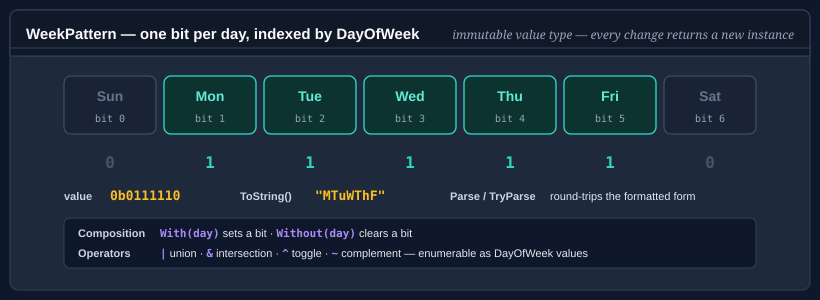

# WeekPattern

`WeekPattern` is an immutable value-type bitmask representing a set of selected days in a standard seven-day week. It supports non-destructive composition, bitwise operators, string parsing, formatting, and enumeration — making it a natural primitive for schedules, recurrence rules, and working-day calculations.

Because `WeekPattern` is a value type, every operation that changes the selection returns a new instance rather than mutating the receiver.



## Pattern 1 — build a pattern with With / Without

```csharp
using Bodu;

WeekPattern weekdays = WeekPattern.Empty
    .With(DayOfWeek.Monday)
    .With(DayOfWeek.Tuesday)
    .With(DayOfWeek.Wednesday)
    .With(DayOfWeek.Thursday)
    .With(DayOfWeek.Friday);

Console.WriteLine(weekdays.Count);                      // 5
Console.WriteLine(weekdays.Contains(DayOfWeek.Monday)); // True
Console.WriteLine(weekdays.Contains(DayOfWeek.Sunday)); // False
```

## Pattern 2 — use the built-in well-known patterns

```csharp
using Bodu;

WeekPattern workweek  = WeekPattern.Weekdays;           // Mon–Fri
WeekPattern weekend   = WeekPattern.Weekend;            // Sat–Sun
WeekPattern allDays   = WeekPattern.AllDays;            // Mon–Sun
WeekPattern empty     = WeekPattern.Empty;              // no days
```

## Pattern 3 — bitwise combination

The `|`, `&`, and `~` operators compose or intersect patterns:

```csharp
using Bodu;

WeekPattern mon    = WeekPattern.Empty.With(DayOfWeek.Monday);
WeekPattern fri    = WeekPattern.Empty.With(DayOfWeek.Friday);
WeekPattern monFri = mon | fri;

// Intersect with weekdays to strip any weekend days.
WeekPattern safeSchedule = monFri & WeekPattern.Weekdays;

// Invert — days NOT in the pattern.
WeekPattern nonWorking = ~WeekPattern.Weekdays;  // Sat–Sun
```

## Pattern 4 — parse from a compact string

`WeekPattern.Parse` accepts standard abbreviations (case-insensitive):

```csharp
using Bodu;

WeekPattern mwf  = WeekPattern.Parse("MWF");          // Mon, Wed, Fri
WeekPattern tuth = WeekPattern.Parse("TuTh");         // Tue, Thu
WeekPattern all  = WeekPattern.Parse("MTuWThFSaSu"); // every day

bool ok = WeekPattern.TryParse("MF", out WeekPattern result);
```

## Pattern 5 — enumerate selected days

`WeekPattern` implements `IEnumerable<DayOfWeek>`, always yielding selected days in `DayOfWeek` order (Sunday = 0 first, unless the first day of the week is configured otherwise):

```csharp
using Bodu;

WeekPattern schedule = WeekPattern.Parse("MTuWThF");

foreach (DayOfWeek day in schedule)
    Console.WriteLine(day);

// Monday, Tuesday, Wednesday, Thursday, Friday
```

## Pattern 6 — remove a day

```csharp
using Bodu;

WeekPattern fiveDays = WeekPattern.Weekdays;
WeekPattern fourDays = fiveDays.Without(DayOfWeek.Friday);

Console.WriteLine(fourDays.Count);   // 4
```

## Pattern 7 — schedule a recurring date using WeekPattern

```csharp
using Bodu;

// Find all Tuesdays and Thursdays in April 2025.
WeekPattern tuthu = WeekPattern.Empty
    .With(DayOfWeek.Tuesday)
    .With(DayOfWeek.Thursday);

DateOnly start = new DateOnly(2025, 4, 1);
DateOnly end   = new DateOnly(2025, 4, 30);

for (DateOnly d = start; d <= end; d = d.AddDays(1))
{
    if (tuthu.Contains(d.DayOfWeek))
        Console.WriteLine(d);
}
```

## API summary

| Member | Description |
|---|---|
| `Empty` | Static field — no days selected. |
| `AllDays` | Static field — all seven days selected. |
| `Weekdays` | Static field — Mon–Fri. |
| `Weekend` | Static field — Sat–Sun. |
| `With(DayOfWeek)` | Returns a new pattern with the day added. |
| `Without(DayOfWeek)` | Returns a new pattern with the day removed. |
| `Contains(DayOfWeek)` | Returns `true` if the day is selected. |
| `Count` | Number of selected days (0–7). |
| `Parse(string)` | Parses a compact abbreviation string. Throws on invalid input. |
| `TryParse(string, out WeekPattern)` | Parses without throwing. |
| `ToString()` | Returns the compact abbreviation string. |
| `\|`, `&`, `~` | Union, intersection, complement operators. |
| `IEnumerable<DayOfWeek>` | Enumerates selected days in `DayOfWeek` order. |

## Where to go next

- [Circular buffer](circular-buffer.md) — fixed-capacity FIFO ring buffer.
- [Evicting dictionary](evicting-dictionary.md) — capacity-bounded dictionary with FIFO / LRU / LFU eviction.
- [Bodu.Collections.Generic API reference](xref:Bodu.Collections.Generic) — full namespace overview.
- **[Core Foundations guides](../topics/core-foundations.md)** — every guide in this topic.
