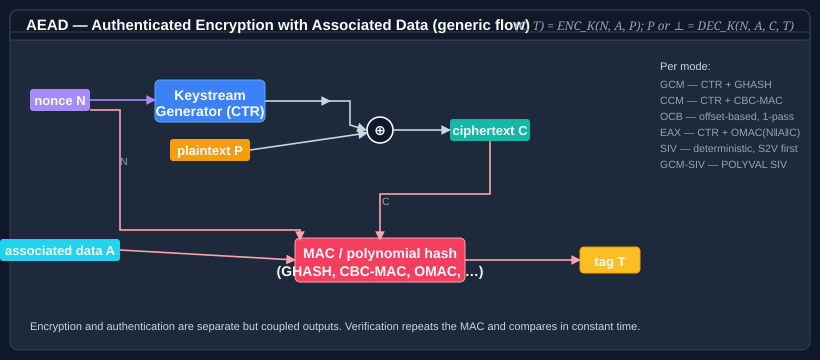

# Using AEAD modes

**Authenticated encryption with associated data (AEAD)** combines confidentiality with integrity: the ciphertext carries a tag that detects any tampering with the ciphertext *or* with the associated metadata (headers, protocol fields, etc.) that travels alongside it.

`Bodu.Security.Cryptography` ships six AEAD mode transforms, each implementing <xref:Bodu.Security.Cryptography.IAeadBlockCipherModeTransform>. All of them target a 16-byte (128-bit) block cipher — in practice, AES.

| Mode | Class | Standard | Notes |
|---|---|---|---|
| **GCM** | <xref:Bodu.Security.Cryptography.GcmModeTransform> | NIST SP 800-38D | Single-pass; fastest with CLMUL hardware. IV reuse is catastrophic. |
| **CCM** | <xref:Bodu.Security.Cryptography.CcmModeTransform> | NIST SP 800-38C | Two-pass (CTR + CBC-MAC). Fixed 12-byte nonce and 16-byte tag in this implementation. |
| **OCB3** | <xref:Bodu.Security.Cryptography.OcbModeTransform> | RFC 7253 | Single-pass with offsets; configurable tag length (8 / 12 / 16 bytes). |
| **EAX** | <xref:Bodu.Security.Cryptography.EaxModeTransform> | Bellare/Rogaway/Wagner (FSE 2004) | Two-pass (CTR + OMAC); arbitrary nonce length, no length-extension limits. |
| **SIV** | <xref:Bodu.Security.Cryptography.SivModeTransform> | RFC 5297 | Misuse-resistant — same message encrypts to the same ciphertext, but confidentiality is preserved. Needs two independent AES keys. |
| **GCM-SIV** | <xref:Bodu.Security.Cryptography.GcmSivModeTransform> | RFC 8452 | Misuse-resistant successor to GCM; POLYVAL-based. |



## Prerequisites — an AES `IBlockCipher`

Every mode transform in this family takes an <xref:Bodu.Security.Cryptography.IBlockCipher> as its primitive **and assumes a 16-byte (128-bit) block size**. That assumption is baked into the counter formats, the GHASH/POLYVAL field, and the offset schedules — so the library's other primitives (Skipjack and Blowfish at 8 bytes, Threefish-256/512/1024 at 32/64/128 bytes) are not eligible. <xref:Bodu.Security.Cryptography.AesBlockCipher>, which wraps the BCL's hardware-accelerated `Aes`, is the only primitive that fits.

```csharp
using System.Security.Cryptography;
using Bodu.Security.Cryptography;

byte[] key = RandomNumberGenerator.GetBytes(16);  // AES-128; 24 or 32 also valid
using var cipher = new AesBlockCipher(key);
```

`AesBlockCipher` implements `IBlockCipher`, exposes a 16-byte block size, and forwards single-block encrypt / decrypt calls to `Aes.EncryptEcb` / `Aes.DecryptEcb`. It is the glue that makes every mode transform below usable.

If you need authenticated encryption with one of the *non-128-bit* ciphers (Skipjack, Blowfish, or Threefish), see the [composing primitives guide](composing-primitives.md) — you can still use the classic mode transforms (CBC, CTR, etc.) directly with their primitives, and layer your own MAC (HMAC, Poly1305) over the resulting ciphertext for an encrypt-then-MAC construction.

## Prerequisites — the extension methods

Calling an `IAeadBlockCipherModeTransform` directly requires four steps:

1. Call `ProcessAssociatedData(aad)` (even if the AAD is empty).
2. Size the output buffer to `plaintext.Length + TagSize`.
3. Call `Encrypt(plaintext, output)` and inspect the returned byte count.
4. For decrypt, size the output to `ciphertextWithTag.Length - TagSize` and call `Decrypt`.

The `Bodu.Security.Cryptography.Extensions.AeadBlockCipherModeTransformExtensions` class collapses all of that into a single call that returns a correctly sized `byte[]`:

```csharp
using Bodu.Security.Cryptography.Extensions;

byte[] cipherWithTag = aead.Encrypt(plaintext, associatedData);
byte[] recovered     = aead.Decrypt(cipherWithTag, associatedData);
```

The examples below all use those extension methods.

## GCM — the workhorse

GCM is the default choice for almost any authenticated-encryption workload. It's single-pass, hardware-accelerated, and part of TLS 1.3.

```csharp
using System.Security.Cryptography;
using Bodu.Security.Cryptography;
using Bodu.Security.Cryptography.Extensions;

byte[] plaintext = System.Text.Encoding.UTF8.GetBytes("secret payload");
byte[] aad       = System.Text.Encoding.UTF8.GetBytes("correlation-id:42");

byte[] key = RandomNumberGenerator.GetBytes(32);          // AES-256
byte[] iv  = new byte[16];                                 // J0 in GCM
RandomNumberGenerator.Fill(iv.AsSpan(0, 12));              // 12-byte nonce
iv[15] = 0x01;                                             // GCM counter-start convention

// Encrypt — produces ciphertext || 16-byte tag
byte[] cipherWithTag;
using (var cipher = new AesBlockCipher(key))
    cipherWithTag = new GcmModeTransform(cipher, iv).Encrypt(plaintext, aad);

// Decrypt — throws CryptographicException if the ciphertext or AAD has been tampered with
byte[] recovered;
using (var cipher = new AesBlockCipher(key))
    recovered = new GcmModeTransform(cipher, iv).Decrypt(cipherWithTag, aad);
```

> [!WARNING]
> **Never reuse a `(key, nonce)` pair.** Doing so in GCM is catastrophic — the XOR of two ciphertexts recovers the XOR of the plaintexts, *and* an attacker can recover the hash key H and forge arbitrary messages. If you cannot guarantee nonce uniqueness, use SIV or GCM-SIV instead.

### On the 16-byte IV

This implementation takes the initial counter block J0 directly as its 16-byte IV, following NIST SP 800-38D. For the standard 96-bit-nonce mode, build J0 as `nonce || 0x00000001` (12 bytes of nonce followed by a 4-byte big-endian 1). The snippet above does this explicitly.

## CCM — a two-pass alternative

CCM is the standard AEAD in constrained and legacy environments (Bluetooth LE, older IPsec profiles, IEEE 802.11i). It pairs CTR encryption with CBC-MAC over the formatted message. The library's implementation fixes the deployment profile most commonly used: 12-byte nonce, 16-byte tag, up to 2²⁴−1 byte messages.

```csharp
byte[] key = RandomNumberGenerator.GetBytes(16);
byte[] iv  = new byte[16];
RandomNumberGenerator.Fill(iv.AsSpan(0, 12));  // first 12 bytes are the CCM nonce

byte[] cipherWithTag;
using (var cipher = new AesBlockCipher(key))
    cipherWithTag = new CcmModeTransform(cipher, iv).Encrypt(plaintext, aad);

byte[] recovered;
using (var cipher = new AesBlockCipher(key))
    recovered = new CcmModeTransform(cipher, iv).Decrypt(cipherWithTag, aad);
```

Only the first 12 bytes of the IV are consumed as the nonce; the remaining bytes are ignored.

## OCB3 — single-pass, RFC 7253

OCB3 achieves single-pass AEAD through an offset trick: the same per-block offset drives both the cipher and the MAC accumulator. It's typically the fastest software AEAD on CPUs without AES-GCM hardware, and the tag length is configurable.

```csharp
byte[] key = RandomNumberGenerator.GetBytes(16);
byte[] iv  = new byte[16];
RandomNumberGenerator.Fill(iv.AsSpan(0, 12));  // first 12 bytes are the OCB3 nonce

byte[] cipherWithTag;
using (var cipher = new AesBlockCipher(key))
    // Default tag length of 16 bytes; pass `tagLen: 12` or 8 for the smaller RFC 7253 variants.
    cipherWithTag = new OcbModeTransform(cipher, iv).Encrypt(plaintext, aad);

byte[] recovered;
using (var cipher = new AesBlockCipher(key))
    recovered = new OcbModeTransform(cipher, iv).Decrypt(cipherWithTag, aad);
```

## EAX — two-pass, FSE 2004

EAX (Bellare, Rogaway and Wagner) is a two-pass authenticated-encryption mode that pairs CTR encryption with OMAC1 authentication. Three OMAC invocations — one each over the nonce, the associated data, and the ciphertext — are XOR-combined to form the tag. EAX has no length-extension restrictions on the nonce or message and avoids GCM's polynomial-MAC pitfalls, making it a safe choice when you need an alternative to GCM without giving up performance to a misuse-resistant mode.

```csharp
byte[] key = RandomNumberGenerator.GetBytes(16);
byte[] iv  = RandomNumberGenerator.GetBytes(16);  // EAX nonce — must equal the cipher block size

byte[] cipherWithTag;
using (var cipher = new AesBlockCipher(key))
    cipherWithTag = new EaxModeTransform(cipher, iv).Encrypt(plaintext, aad);

byte[] recovered;
using (var cipher = new AesBlockCipher(key))
    recovered = new EaxModeTransform(cipher, iv).Decrypt(cipherWithTag, aad);
```

The nonce is the raw value `N`; the transform internally derives the initial CTR counter as `OMAC^0(N)` and the authentication tag as `OMAC^0(N) ⊕ OMAC^1(aad) ⊕ OMAC^2(ciphertext)`. The tag length is fixed at 16 bytes.

## SIV — misuse-resistant

SIV (RFC 5297) derives its IV from the message itself, so encrypting the same plaintext twice with the same key produces the same ciphertext — but confidentiality is preserved beyond confirming equality, and the scheme does not fail catastrophically on accidental nonce reuse. Use SIV when you cannot guarantee a unique nonce per message (for example, for deterministic key wrapping or for messages replayed across retries).

SIV uses two independent AES keys — one for the S2V / CMAC authentication pass (`K₁`), one for the CTR encryption pass (`K₂`):

```csharp
byte[] s2vKey = RandomNumberGenerator.GetBytes(16);  // K₁
byte[] ctrKey = RandomNumberGenerator.GetBytes(16);  // K₂
byte[] iv     = new byte[16];                        // accepted for interface compatibility

byte[] cipherWithTag;
using (var s2v = new AesBlockCipher(s2vKey))
using (var ctr = new AesBlockCipher(ctrKey))
    cipherWithTag = new SivModeTransform(s2v, ctr, iv).Encrypt(plaintext, aad);

byte[] recovered;
using (var s2v = new AesBlockCipher(s2vKey))
using (var ctr = new AesBlockCipher(ctrKey))
    recovered = new SivModeTransform(s2v, ctr, iv).Decrypt(cipherWithTag, aad);
```

The `iv` argument is kept for interface compatibility but is not used — SIV derives its synthetic IV from the AAD and plaintext.

## GCM-SIV — the modern replacement for GCM

GCM-SIV (RFC 8452) is a misuse-resistant AEAD with GCM-like performance. It's the preferred choice when you want GCM's speed *and* need to tolerate accidental nonce reuse. The construction uses AES internally, but with a key-derivation step — so the constructor takes a master cipher **and** a factory that produces a new cipher for the derived per-message key.

```csharp
byte[] masterKey = RandomNumberGenerator.GetBytes(16);
byte[] iv        = new byte[16];
RandomNumberGenerator.Fill(iv.AsSpan(0, 12));  // first 12 bytes are the nonce

byte[] cipherWithTag;
using (var master = new AesBlockCipher(masterKey))
    cipherWithTag = new GcmSivModeTransform(
        master,
        static k => new AesBlockCipher(k),  // factory for the derived per-message cipher
        iv).Encrypt(plaintext, aad);

byte[] recovered;
using (var master = new AesBlockCipher(masterKey))
    recovered = new GcmSivModeTransform(
        master,
        static k => new AesBlockCipher(k),
        iv).Decrypt(cipherWithTag, aad);
```

The factory expression `static k => new AesBlockCipher(k)` is the canonical form — the `static` modifier avoids a closure allocation.

## One-transform, one-message

Every AEAD transform in this library is **stateful and single-use**. A second call to `Encrypt` or `Decrypt` on the same instance — *including after a tag-mismatch failure* — throws <xref:System.InvalidOperationException>. The contract is enforced uniformly across `GcmModeTransform`, `CcmModeTransform`, `EaxModeTransform`, `OcbModeTransform`, `GcmSivModeTransform`, and `SivModeTransform`.

The pattern throughout these examples —

```csharp
using (var cipher = new AesBlockCipher(key))
    cipherWithTag = new GcmModeTransform(cipher, iv).Encrypt(plaintext, aad);
```

— constructs a fresh `AesBlockCipher` and a fresh `GcmModeTransform` inside the `using`, runs one encryption, and lets them both fall out of scope. Build a separate transform for the matching `Decrypt`:

```csharp
using (var cipher = new AesBlockCipher(key))
    recovered = new GcmModeTransform(cipher, iv).Decrypt(cipherWithTag, aad);
```

Reusing the encrypting transform to decrypt the round-tripped output, or calling `Encrypt` a second time to encrypt a follow-up message, will throw:

```csharp
using var cipher = new AesBlockCipher(key);
var aead = new GcmModeTransform(cipher, iv);

byte[] first  = aead.Encrypt(plaintextA, aad);
byte[] second = aead.Encrypt(plaintextB, aad); // throws InvalidOperationException
```

The same enforcement applies to `Decrypt`. After a `CryptographicException` from a tag-mismatch, the instance is also burned — recover by constructing a fresh transform with the same `(key, nonce)`, never by retrying on the same one.

## Tamper detection

Decrypt throws <xref:System.Security.Cryptography.CryptographicException> if **any** part of the ciphertext, the tag, or the AAD has been modified since encryption. The extension methods do not catch it — callers must decide whether to log, retry, or reject:

```csharp
try
{
    byte[] plaintext = aead.Decrypt(cipherWithTag, aad);
    // …proceed with the plaintext
}
catch (CryptographicException)
{
    // Tag did not verify — reject the message entirely.
    // Do not act on any partial plaintext (the extension method does not leak any).
}
```

On the wire, a failed tag check is indistinguishable from an attack; treat every failure as adversarial.

## Where to go next

- [Encryption basics](encryption-basics.md) — the Key / IV / Tweak / Padding lifecycle for the non-AEAD ciphers.
- [Cipher block modes](cipher-modes.md) — the five classic non-authenticated modes (ECB / CBC / CFB / OFB / CTR).
- [Stream ciphers § authenticated stream ciphers](stream-ciphers.md#authenticated-stream-ciphers--poly1305-aead) — the ready-made `XChaCha20Poly1305`, `XSalsa20Poly1305Aead`, and NaCl `secretbox` (`XSalsa20Poly1305`) constructions when you want AEAD over a stream cipher rather than AES.
- [ASCON AEAD](ascon-aead.md) — lightweight authenticated encryption.
- API reference: [<xref:Bodu.Security.Cryptography.AesBlockCipher>] · [<xref:Bodu.Security.Cryptography.IAeadBlockCipherModeTransform>] · [<xref:Bodu.Security.Cryptography.Extensions.AeadBlockCipherModeTransformExtensions>].
- **[Hashing & Cryptography guides](../topics/hashing-and-cryptography.md)** — every guide in this topic, across Bodu.IO.Hashing and Bodu.Security.Cryptography.
