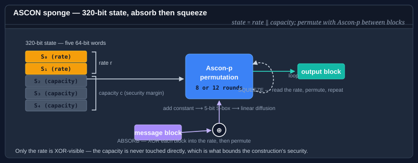

# Using ASCON

**ASCON** is a family of lightweight cryptographic algorithms standardized by NIST in
[SP 800-232](https://doi.org/10.6028/NIST.SP.800-232) (August 2025). All members of the family
share a single 320-bit sponge state — five 64-bit words — and a common permutation called
Ascon-p. The permutation is compact enough to run on the smallest microcontrollers, yet resists
all known distinguishing attacks and has a well-studied, wide peer-reviewed security margin.



**Bodu.Security.Cryptography** ships all four NIST-defined algorithm types:

| Type | Algorithm name | Category | What it does |
|---|---|---|---|
| <xref:Bodu.Security.Cryptography.AsconHash256> | `ASCON-HASH256` | Hash | Fixed-length 256-bit digest. Conservative 12-round absorption. |
| <xref:Bodu.Security.Cryptography.AsconHashA256> | `ASCON-HASHA256` | Hash | Fixed-length 256-bit digest. 8-round absorption for higher throughput. |
| <xref:Bodu.Security.Cryptography.AsconXof128> | `ASCON-XOF128` | XOF | Variable-length output — squeeze any number of bytes from a single absorbed message. |
| <xref:Bodu.Security.Cryptography.AsconCxof128> | `ASCON-CXOF128` | XOF | Variable-length output with a customization string — separates output domains from the same primitive. |
| <xref:Bodu.Security.Cryptography.AsconAead128> | `ASCON-AEAD128` | AEAD | Authenticated encryption — 128-bit key, 128-bit nonce, 128-bit authentication tag. |

## Choosing the right algorithm

| If you need… | Reach for | Why |
|---|---|---|
| A fixed-length 256-bit digest (conservative) | `AsconHash256` | 12-round absorption throughout — maximum security margin. |
| A fixed-length 256-bit digest (throughput) | `AsconHashA256` | 8-round absorption — faster on large inputs; squeeze phase is unchanged. |
| An output of arbitrary length — key derivation, stream seed | `AsconXof128` | Squeeze as many bytes as needed from one absorbed input. |
| Multiple independent output functions from one primitive | `AsconCxof128` | A customization string domain-separates the output; same primitive, different contexts. |
| Encrypt-and-authenticate a message | `AsconAead128` | Sponge-based AEAD with a 128-bit key and tag; no separate MAC step required. |

When in doubt: reach for `AsconHash256` for hashing and `AsconAead128` for authenticated encryption.

## One permutation, four roles

The defining feature of the family is that hashing, extendable output, and authenticated encryption are all built from the **same** sponge — a 320-bit state and the Ascon-p permutation — rather than from three unrelated primitives. The role is determined entirely by how the sponge is initialised and which phases (absorb, squeeze, key injection, domain separation) are applied:

| Role | Type(s) | What the sponge does |
|---|---|---|
| **Hash** | `AsconHash256`, `AsconHashA256` | Absorb the message, then squeeze a fixed 256-bit digest. |
| **XOF** | `AsconXof128`, `AsconCxof128` | Absorb the message, then squeeze an arbitrary number of output bytes. |
| **AEAD** | `AsconAead128` | Inject key and nonce, absorb AAD, encrypt by XORing the rate, then squeeze a tag. |

The practical payoff is a single, small implementation surface: one permutation to audit, one state layout, one round function. A device that already ships ASCON for authenticated encryption gets hashing and key derivation for free. NIST SP 800-232 specifies all of these under one umbrella, so they share a common security analysis.

## The shared permutation

All five types use the same Ascon-p permutation. Each call applies a configurable number of
identical rounds (up to 12) to the 320-bit state. Each round is:

1. **Constant addition** — XOR a round-dependent constant into state word S₂ to break round
   symmetry.
2. **Substitution** — a 5-bit S-box applied simultaneously in bit-sliced fashion across all 64
   bit-columns of the state, providing non-linearity.
3. **Linear diffusion** — each word is XORed with two rotated copies of itself using
   word-specific rotation constants, spreading any change across the full state.

The round count is the throughput / margin trade-off. Absorption phases use 12 rounds
(`AsconHash256`) or 8 rounds (`AsconHashA256`, `AsconXof128`, `AsconCxof128`, `AsconAead128`).
Squeeze phases and AEAD finalization always use 12 rounds, so the output step carries the full
security margin in every variant.

## Quick-start examples

### Hash

```csharp
using System.Text;
using Bodu.Security.Cryptography;

byte[] data    = Encoding.UTF8.GetBytes("the quick brown fox");
using var hash = new AsconHash256();
byte[] digest  = hash.ComputeHash(data);    // always 32 bytes
string hex     = Convert.ToHexString(digest);
```

### XOF — deriving two keys from one input

```csharp
using System.Security.Cryptography;
using Bodu.Security.Cryptography;

byte[] ikm = RandomNumberGenerator.GetBytes(32);

using var xof = new AsconXof128();
xof.Absorb(ikm);

byte[] encKey = new byte[32];
byte[] macKey = new byte[32];
xof.Squeeze(encKey);    // first 32 bytes of XOF output
xof.Squeeze(macKey);    // next 32 bytes — independent of encKey
```

### AEAD — encrypt and authenticate

```csharp
using System.Security.Cryptography;
using System.Text;
using Bodu.Security.Cryptography;

byte[] key       = RandomNumberGenerator.GetBytes(AsconAead128.KeySize / 8);    // 16 bytes
byte[] nonce     = RandomNumberGenerator.GetBytes(AsconAead128.NonceSize / 8);  // 16 bytes
byte[] plaintext = Encoding.UTF8.GetBytes("secret payload");
byte[] aad       = Encoding.UTF8.GetBytes("request-id:abc123");

// Encrypt — output is ciphertext || 16-byte tag
using var enc = new AsconAead128(key, nonce);
byte[] cipherWithTag = new byte[plaintext.Length + enc.TagSize / 8];
enc.ProcessAssociatedData(aad);
enc.Encrypt(plaintext, cipherWithTag);

// Decrypt — throws CryptographicException if tampered
using var dec = new AsconAead128(key, nonce);
byte[] recovered = new byte[plaintext.Length];
dec.ProcessAssociatedData(aad);
dec.Decrypt(cipherWithTag, recovered);
```

## When to reach for ASCON

ASCON is a good choice when:

- You need a **NIST-approved algorithm** (SP 800-232, 2025) alongside or instead of SHA-2 or AES.
- You are targeting **constrained hardware** — microcontrollers, IoT devices, FPGAs — where the
  320-bit ASCON state (40 bytes) fits in registers and the simple permutation is efficient even
  without hardware acceleration.
- You need **variable-length output** without a full key derivation framework; `AsconXof128` and
  `AsconCxof128` provide this directly with a well-understood security model.
- You want a **single primitive family** that covers hashing, XOF, and AEAD — reducing
  cryptographic surface area and simplifying key management.

On x86-64 targets with AES-NI and SHA extensions, the BCL's hardware-accelerated
`System.Security.Cryptography.SHA256` and `AesGcm` will
typically outperform software ASCON in raw throughput. Use ASCON when standards compliance,
portability, or XOF/AEAD requirements point to it — not primarily for throughput on
well-provisioned servers.

## Where to go next

- [ASCON hashing](ascon-hashing.md) — full pattern guide for `AsconHash256` and `AsconHashA256`.
- [ASCON extendable output (XOF)](ascon-xof.md) — all patterns for `AsconXof128` and `AsconCxof128`.
- [ASCON authenticated encryption (AEAD)](ascon-aead.md) — all patterns for `AsconAead128`.
- [NIST SP 800-232](https://doi.org/10.6028/NIST.SP.800-232) — the normative specification.
- API reference: <xref:Bodu.Security.Cryptography.AsconHash256> · <xref:Bodu.Security.Cryptography.AsconXof128> · <xref:Bodu.Security.Cryptography.AsconAead128>
- **[Hashing & Cryptography guides](../topics/hashing-and-cryptography.md)** — every guide in this topic, across Bodu.IO.Hashing and Bodu.Security.Cryptography.
