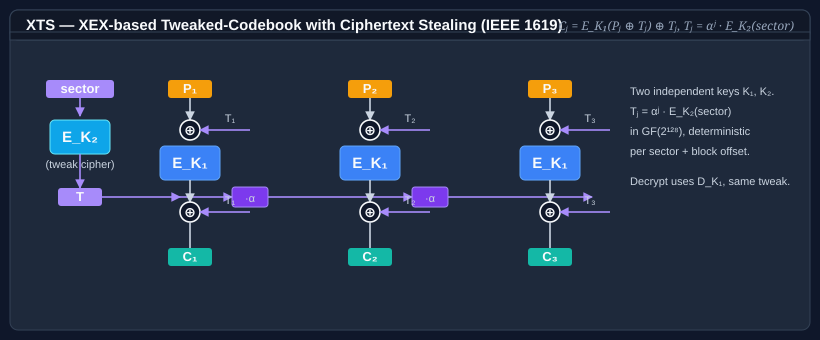

# Cipher block modes

This page walks through the classic block-cipher modes exposed via <xref:Bodu.Security.Cryptography.CipherModeKind> — CBC, CTR, CFB, OFB, ECB, the no-expansion **CTS** variant, and the specialized **XTS** disk-encryption mode — shows a complete encrypt-and-decrypt round-trip for each, and calls out the IV rules and security trade-offs. The same enum also names the authenticated modes (`OCB`, `EAX`, `SIV`, and GCM / GCM-SIV via the transforms); those are covered in [AEAD modes](aead-modes.md).

For the data-flow visualization, see the panels on the <xref:Bodu.Security.Cryptography.CipherModeKind> API page. Each panel in that diagram corresponds to one section below.


## CBC — the default

**Use for:** general-purpose encryption of a whole message where you care about confidentiality only, and the IV is generated fresh per message.

**IV:** same length as the block, **unpredictable** (not just unique).

**Padding:** required for non-block-aligned plaintext. PKCS7 is the safe default.

```csharp
using System.Security.Cryptography;
using Bodu.Security.Cryptography;
using Bodu.Security.Cryptography.Extensions;

byte[] plaintext = System.Text.Encoding.UTF8.GetBytes("confidential payload");

using var alg = new Threefish256
{
    BlockMode = CipherModeKind.CBC,
    Padding   = PaddingMode.PKCS7,
};
alg.GenerateKey();
alg.GenerateIV();
alg.GenerateTweak();

byte[] ciphertext = alg.Encrypt(plaintext);
byte[] recovered  = alg.Decrypt(ciphertext);
```

The IV must travel with the ciphertext so the receiver can decrypt. Don't put it in a predictable field (a counter, a timestamp) — that breaks CBC's security argument. `GenerateIV()` pulls from the platform CSPRNG, which is fine.

## CTR — parallel, seekable, stream-shaped

**Use for:** random-access scenarios (disk-like), high-throughput pipelines where you want to parallelize encryption per block, or when the plaintext length isn't known up front and you don't want padding.

**IV (counter):** same length as the block. **Must be unique per message under a given key.** Reuse is catastrophic.

**Padding:** not required — `PaddingMode.None` is valid, because CTR turns the block cipher into a stream cipher. The ciphertext is the same length as the plaintext.

```csharp
using var alg = new Threefish256
{
    BlockMode = CipherModeKind.CTR,
    Padding   = PaddingMode.None,   // CTR is a stream cipher
};
alg.GenerateKey();
alg.GenerateIV();                    // used as the initial counter block
alg.GenerateTweak();

byte[] ciphertext = alg.Encrypt(plaintext);
byte[] recovered  = alg.Decrypt(ciphertext);
```

**Design note.** The counter wraps after 2^(block_size) encryptions. `CtrModeTransform` detects this and throws <xref:System.Security.Cryptography.CryptographicException> rather than silently reusing keystream. In practice the block sizes on this library (64 to 1024 bits) are more than enough for any real workload, but this guard is your safety net.

## CFB — self-synchronizing stream cipher

**Use for:** byte-streamed encryption where a small transmission error should self-heal within a block or two.

**IV:** same length as the block, unique per message. Unpredictability helps but is not strictly required.

**Padding:** not required if the plaintext is block-aligned, but PKCS7 works.

```csharp
using var alg = new Threefish256
{
    BlockMode = CipherModeKind.CFB,
    Padding   = PaddingMode.None,
};
alg.GenerateKey();
alg.GenerateIV();
alg.GenerateTweak();

byte[] ciphertext = alg.Encrypt(plaintext);
byte[] recovered  = alg.Decrypt(ciphertext);
```

Both directions use the cipher's *encryption* primitive — the decryptor never calls `Decrypt` on the underlying block cipher. That's a property of all CFB/OFB/CTR modes and matters if you've only implemented the encrypt path on a custom engine.

## OFB — synchronous stream cipher

**Use for:** stream encryption where bit-level error propagation must not happen (a single flipped bit in the ciphertext produces a single flipped bit in the plaintext — no cascade).

**IV:** same length as the block, **unique per message**. IV reuse under the same key is catastrophic because the keystream becomes identical.

**Padding:** not required.

```csharp
using var alg = new Threefish256
{
    BlockMode = CipherModeKind.OFB,
    Padding   = PaddingMode.None,
};
alg.GenerateKey();
alg.GenerateIV();
alg.GenerateTweak();

byte[] ciphertext = alg.Encrypt(plaintext);
byte[] recovered  = alg.Decrypt(ciphertext);
```

OFB is rarely the best choice today — CTR gives you the same stream-cipher behavior *plus* random access. Reach for OFB only when you have a specific interoperability requirement.

## ECB — almost never

**Use for:** a primitive inside a higher-level construction (a custom AEAD, a MAC), and nothing else.

**IV:** none.

**Padding:** required for non-block-aligned plaintext; PKCS7.

```csharp
using var alg = new Threefish256
{
    BlockMode = CipherModeKind.ECB,
    Padding   = PaddingMode.PKCS7,
};
alg.GenerateKey();
alg.GenerateTweak();
// No IV is needed for ECB.

byte[] ciphertext = alg.Encrypt(plaintext);
byte[] recovered  = alg.Decrypt(ciphertext);
```

ECB encrypts every block independently. That means identical plaintext blocks encrypt to identical ciphertext blocks — an attacker can see the structure of your message without breaking the cipher. The classic *Tux the penguin* demonstration shows why this matters. Do not use ECB for real messages.

## CTS — ciphertext stealing, no expansion

**Use for:** CBC-style chaining where the ciphertext must be *exactly* as long as the plaintext even when the final block is partial — for example fixed-width on-disk records.

**IV:** same length as the block, unpredictable (it is CBC underneath).

**Padding:** none — CTS *is* the no-expansion alternative to padding. It rearranges the final two ciphertext blocks so the output length matches the input.

```csharp
using var alg = new Threefish256
{
    BlockMode = CipherModeKind.CTS,
    Padding   = PaddingMode.None,
};
alg.GenerateKey();
alg.GenerateIV();
alg.GenerateTweak();

byte[] ciphertext = alg.Encrypt(plaintext);   // same length as plaintext
byte[] recovered  = alg.Decrypt(ciphertext);
```

`CTS` mirrors the BCL <xref:System.Security.Cryptography.CipherMode>.`CTS` value, so it casts directly between the two enums. It is *not* an authenticated mode — pair it with a MAC if the ciphertext crosses a trust boundary.

> [!NOTE]
> CTS needs at least one full block of input. A plaintext shorter than the block size has nothing to steal from, so use CBC + PKCS7 (which expands) or a stream-shaped mode (CTR) for sub-block messages.

## XTS — sector-level disk encryption

**Use for:** encrypting fixed-size storage sectors — full-disk and file-container encryption. XTS is the IEEE 1619-2007 / NIST SP 800-38E standard for the random-access setting where the ciphertext cannot grow; BitLocker, FileVault, dm-crypt/LUKS, and VeraCrypt all use it.

**Keys:** two independent keys — `Key₁` for the data cipher, `Key₂` for the tweak cipher. Never share them or derive one from the other; doing so collapses XTS to a weaker single-key construction.

**IV (tweak):** one block wide, holding the sector number in little-endian order. Unlike a CBC IV it does not need to be unpredictable — it only has to identify the sector uniquely.

**Padding:** none. XTS operates on whole blocks, the on-disk sector size is fixed, and the ciphertext is exactly as long as the plaintext.



Unlike the five classic modes, XTS does not run through the `BlockMode` property of a `SymmetricAlgorithm`: it needs two keyed ciphers, so it is constructed directly as an <xref:Bodu.Security.Cryptography.XtsModeTransform> over a pair of <xref:Bodu.Security.Cryptography.IBlockCipher> instances.

```csharp
using System.Security.Cryptography;
using Bodu.Security.Cryptography;

// One 512-byte disk sector to protect.
byte[] sectorData = new byte[512];
RandomNumberGenerator.Fill(sectorData);

// XTS uses two independent keys — Key1 encrypts data, Key2 encrypts the tweak.
using IBlockCipher dataCipher  = new AesBlockCipher(RandomNumberGenerator.GetBytes(16));
using IBlockCipher tweakCipher = new AesBlockCipher(RandomNumberGenerator.GetBytes(16));

// The tweak is the sector number, little-endian, padded to the block size.
byte[] tweak = new byte[dataCipher.BlockSize / 8];
BitConverter.GetBytes(42L).CopyTo(tweak, 0);

using var xts = new XtsModeTransform(dataCipher, tweakCipher, tweak);

byte[] ciphertext = new byte[sectorData.Length];
xts.Transform(sectorData, ciphertext, encrypt: true);

byte[] recovered = new byte[sectorData.Length];
xts.Transform(ciphertext, recovered, encrypt: false);
```

Each `XtsModeTransform` is bound to a single sector number — construct a fresh transform per sector. The decrypt direction uses the data cipher's *decryption* primitive (unlike CFB, OFB, and CTR). XTS provides confidentiality only: it has **no authentication**, so an attacker who can rewrite sectors cannot read them but can still tamper block-by-block. For data crossing an untrusted channel, choose an [AEAD mode](aead-modes.md) instead.

## Choosing a mode — quick guide

| If you need… | Use | Why |
|---|---|---|
| A safe default for a single message with a random IV | **CBC** | Confidentiality with simple assumptions. |
| Seekable, parallelisable, stream-shaped encryption | **CTR** | Keystream depends only on counter; blocks are independent. |
| Byte-level streaming with self-healing on errors | **CFB** | Error propagates for one block then resynchronizes. |
| Bit-exact error isolation on an unreliable channel | **OFB** | Keystream is plaintext-independent. |
| CBC chaining with no ciphertext expansion on a partial final block | **CTS** | Steals ciphertext; output length equals input. |
| Sector-addressable disk or file-container encryption | **XTS** | Per-sector tweak; no ciphertext expansion; two keys. |
| A cipher primitive for something you're building | **ECB** | The lowest level; you must add your own chaining. |
| Authenticated encryption (confidentiality **and** integrity) | **GCM / OCB / EAX / SIV / GCM-SIV** | See [AEAD modes](aead-modes.md) — none of the modes above authenticate. |

## Which direction uses the decrypt primitive

A subtle but load-bearing property: the *stream-shaped* modes never call the underlying cipher's decrypt operation.

| Mode | Decryption calls the cipher's… |
|---|---|
| ECB, CBC, CTS, XTS | **decrypt** primitive |
| CFB, OFB, CTR | **encrypt** primitive (both directions) |

This matters if you wire a custom <xref:Bodu.Security.Cryptography.IBlockCipher> and have only implemented the encrypt path — CFB / OFB / CTR will still round-trip, but ECB / CBC / CTS / XTS will not.

> [!IMPORTANT]
> **None of the modes on this page authenticate.** CBC, CTR, CFB, OFB, CTS, and XTS all provide confidentiality only — an attacker who cannot read the plaintext can still flip ciphertext bits and corrupt the decrypted output undetected. CTR and OFB are especially malleable (a flipped ciphertext bit flips the same plaintext bit). When ciphertext crosses a trust boundary, either pair the mode with a MAC over the ciphertext (encrypt-then-MAC) or, preferably, use an [AEAD mode](aead-modes.md), which bundles both in one pass.

## Where to go next

- [Padding](padding.md) — which padding scheme to pair with which mode.
- [Encryption basics](encryption-basics.md) — Key/IV/Tweak lifecycle, disposal, and common pitfalls.
- Per-algorithm: [Threefish-256](threefish-256.md) · [Skipjack](skipjack.md) · [Blowfish](blowfish.md).
- **[Hashing & Cryptography guides](../topics/hashing-and-cryptography.md)** — every guide in this topic, across Bodu.IO.Hashing and Bodu.Security.Cryptography.
