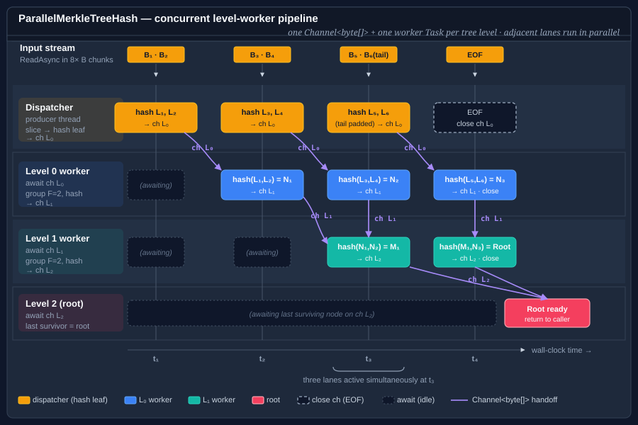

# Using Merkle trees

A Merkle tree takes a stream, chops it into fixed-size leaves, hashes each leaf, then hashes groups of child hashes together, level by level, until one root hash remains. The root changes if any byte of the input changes — but because the tree is built bottom-up, you can also prove a single chunk's integrity without rehashing the whole stream.

**Bodu.Security.Cryptography** ships two implementations:

| Type | Shape | When to reach for it |
|---|---|---|
| <xref:Bodu.Security.Cryptography.MerkleTreeHash> | Synchronous, single-threaded | Simple, deterministic. Fine for most files and everyday use. |
| <xref:Bodu.Security.Cryptography.ParallelMerkleTreeHash> | Asynchronous, level-worker pipeline | Large inputs where leaf hashing and internal-node reduction should overlap. |

Neither is itself a `HashAlgorithm` — both are composition wrappers that take a **factory** for the underlying hash (SHA-256, Tiger, anything that derives from <xref:System.Security.Cryptography.HashAlgorithm?displayProperty=nameWithType>) and orchestrate the tree on top of it.


## Pattern 1 — a simple Merkle root

```csharp
using System.Security.Cryptography;
using Bodu.Security.Cryptography;

using var merkle = new MerkleTreeHash(
    algorithmFactory: () => SHA256.Create(),
    blockSize:        4096,    // 4 KiB leaves
    fanOut:           2);      // binary tree

using var stream = File.OpenRead("archive.bin");
byte[] root = merkle.ComputeHash(stream);
```

Each leaf is a SHA-256 of a 4 KiB block of the input. Each internal node is a SHA-256 of the concatenation of its two child hashes. The root changes if any byte of the file changes — that's the property a Merkle tree gives you over a flat hash.

## Pattern 2 — wider fan-out

A larger `fanOut` reduces tree depth (fewer levels of hashing), at the cost of more bytes concatenated per internal node:

```csharp
using System.Security.Cryptography;
using Bodu.Security.Cryptography;

using var merkle = new MerkleTreeHash(
    algorithmFactory: () => SHA256.Create(),
    blockSize:        8192,
    fanOut:           4);      // quaternary tree — shallower, wider internal nodes
```

Four child hashes concatenated is 4 × 32 = 128 bytes of input per internal SHA-256, still well inside one SHA-256 block.

## Pattern 3 — a Tiger Tree Hash

The TTH construction uses Tiger at the leaves and internal nodes, with domain-separation bytes (`0x00` for leaves, `0x01` for internal nodes) prepended to each hash input. The Bodu `MerkleTreeHash` does not prepend those separator bytes for you — if you need the exact TTH wire format, wrap the factory and prefix the bytes yourself. For a plain Merkle-over-Tiger digest, this is all you need:

```csharp
using Bodu.Security.Cryptography;

using var merkle = new MerkleTreeHash(
    algorithmFactory: () => new Tiger(),
    blockSize:        1024,
    fanOut:           2);

using var stream = File.OpenRead("archive.bin");
byte[] tigerMerkleRoot = merkle.ComputeHash(stream);   // 24-byte root
```

## Pattern 4 — the parallel pipeline

<xref:Bodu.Security.Cryptography.ParallelMerkleTreeHash> overlaps leaf production (reading + hashing input chunks) with internal-node reduction (grouping child hashes and hashing them into a parent). It exposes an **async** surface because the pipeline drives itself from a producer/consumer queue:

```csharp
using System.Security.Cryptography;
using Bodu.Security.Cryptography;

using var merkle = new ParallelMerkleTreeHash(
    algorithmFactory: () => SHA256.Create(),
    blockSize:        4096,
    fanOut:           2);

using var stream = File.OpenRead("large-archive.bin");
byte[] root = await merkle.ComputeHashAsync(stream, diagnostics: null, CancellationToken.None);
```

The parallel version produces the same root as the sequential one when called with the same `(algorithmFactory, blockSize, fanOut)` — the parallelism is in *how* the tree is built, not *what* tree is built. The level-worker / dispatcher layout is drawn in the <xref:Bodu.Security.Cryptography.ParallelMerkleTreeHash> class documentation.



## Pattern 5 — capturing diagnostics

`ParallelMerkleTreeHash.ComputeHashAsync` accepts an optional <xref:Bodu.Security.Cryptography.MerkleTreeDiagnostics> that records every node the pipeline built — level, index, child hashes, and the produced hash value. Useful when you want to visualize the tree, cross-check an implementation against a known-good one, or produce a Merkle proof for a specific leaf:

```csharp
using System.Security.Cryptography;
using Bodu.Security.Cryptography;

var diagnostics = new MerkleTreeDiagnostics();

using var merkle = new ParallelMerkleTreeHash(
    algorithmFactory: () => SHA256.Create(),
    blockSize:        4096,
    fanOut:           2);

byte[] root = await merkle.ComputeHashAsync(stream, diagnostics, CancellationToken.None);

for (int level = 0; level < diagnostics.GetLevelCount(); level++)
{
    IReadOnlyList<MerkleTreeDiagnosticNode> nodes = diagnostics.GetLevel(level);
    Console.WriteLine($"level {level}: {nodes.Count} nodes");
}

// Or dump the whole tree to a writer (one line per node):
diagnostics.WriteTo(Console.Out);
```

Diagnostics are optional; pass `null` when you don't need them and the pipeline avoids the book-keeping overhead entirely. For strict equivalence checks, `diagnostics.Validate(() => SHA256.Create(), out var errors)` re-derives each internal node from its children and reports any that don't match.

## When to use a Merkle tree

- **Partial verification.** You want to prove that byte range `[N, M)` of a large file matches the original, without rehashing the whole file. The Merkle tree lets you do that with a logarithmic-size proof.
- **Content addressing.** Git, IPFS, and BitTorrent all use Merkle (or Merkle-like) trees so that identical sub-contents can be deduplicated and so that corruption is detected at the chunk level.
- **Streaming integrity.** You want to authenticate chunks of a stream as they arrive, without waiting for the whole thing to buffer.

For a single end-to-end file digest where partial verification is not a requirement, a plain <xref:Bodu.Security.Cryptography.Tiger> or `System.Security.Cryptography.SHA256` is simpler and does not need a tree.

## Where to go next

- [Hashing overview](hashing.md) — where Merkle trees sit alongside the other families.
- [Using Tiger](tiger.md) — a common leaf-hash choice for content-addressed systems.
- <xref:Bodu.Security.Cryptography.MerkleTreeHash> · <xref:Bodu.Security.Cryptography.ParallelMerkleTreeHash>.
