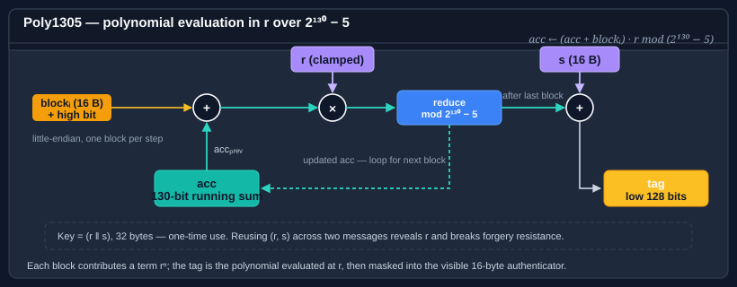

# Using Poly1305

Poly1305 is a one-time authenticator designed by Daniel J. Bernstein. Given a **fresh 32-byte key** and a message, it produces a 128-bit tag whose forgery probability — over the choice of key — is bounded by `(message_length / 16) · 2⁻¹⁰²`. That bound only holds while the key is used **exactly once**; reusing a Poly1305 key across two messages is a complete break.

In practice Poly1305 is almost always used as the MAC half of an AEAD construction — most famously **ChaCha20-Poly1305** (RFC 8439), where the per-message Poly1305 key is derived by encrypting a block of zeros with ChaCha20 under a nonce.

The type is <xref:Bodu.Security.Cryptography.Poly1305>, and it derives from <xref:System.Security.Cryptography.KeyedHashAlgorithm?displayProperty=nameWithType>.



> [!IMPORTANT]
> Poly1305 is a **one-shot authenticator**. `CanReuseTransform` is `false`, which is how the type signals at the API level that a key must not be used twice. Do not store a long-lived Poly1305 key — derive a fresh one per message.

## Fixed sizes at a glance

| Parameter | Size | Notes |
|---|---|---|
| Key | 256 bits (32 bytes — `Poly1305.KeySize`) | Must be fresh per message. Low 16 bytes are clamped per RFC 8439. |
| Tag | 128 bits (16 bytes) | Fixed. |
| Block | 16 bytes | Fixed (the 130-bit arithmetic core). |

## Pattern 1 — one-shot MAC

The constructor already generates a fresh random key; for a real system you'll typically override that with a key derived from the stream cipher you're pairing with.

```csharp
using System.Text;
using Bodu.Security.Cryptography;

byte[] message = Encoding.UTF8.GetBytes("the quick brown fox");

using var poly = new Poly1305 { Key = perMessageKey };   // 32 bytes, fresh per message
byte[] tag = poly.ComputeHash(message);                  // 16 bytes
```

`ComputeHash` may be called **once** per instance. Attempting to hash a second message will throw — deterministically, because `CanReuseTransform` is `false`. If you need to authenticate several messages, construct a new `Poly1305` for each one (or use Poly1305 only as the MAC inside an AEAD layer).

## Pattern 2 — the ChaCha20-Poly1305 construction

RFC 8439 defines the now-ubiquitous AEAD pairing: derive the per-message Poly1305 key by encrypting a 32-byte block of zeros with ChaCha20 under the same nonce, then authenticate the AEAD layout (AAD ‖ ciphertext ‖ lengths) with Poly1305.

```csharp
using System.Security.Cryptography;
using Bodu.Security.Cryptography;

// Fresh per-message inputs
byte[] chachaKey = LoadSharedKey();    // 32 bytes, long-lived
byte[] nonce     = GenerateNonce();    // 12 bytes, unique per (key, message)

// 1. Derive the Poly1305 key from the first 32 bytes of the ChaCha20 keystream.
byte[] polyKey = ChaCha20Keystream(chachaKey, nonce, counter: 0).AsSpan(0, 32).ToArray();

// 2. Encrypt the plaintext with ChaCha20 (counter = 1).
byte[] ciphertext = ChaCha20Encrypt(chachaKey, nonce, counter: 1, plaintext);

// 3. Build the Poly1305 input per RFC 8439 §2.8:
//     AAD ‖ pad16(AAD) ‖ ciphertext ‖ pad16(ciphertext) ‖ len(AAD)₆₄ ‖ len(ciphertext)₆₄
byte[] input = BuildRfc8439Input(aad, ciphertext);

using var poly = new Poly1305 { Key = polyKey };
byte[] tag = poly.ComputeHash(input);                    // 16-byte authentication tag
```

The key point: `polyKey` is fresh per message — it's a function of `(chachaKey, nonce)`. If the nonce is unique under a given long-lived key, the Poly1305 key is unique too, and the one-time property holds.

(`ChaCha20Keystream`, `ChaCha20Encrypt`, and `BuildRfc8439Input` are placeholders here — use whichever ChaCha20 implementation you already depend on; the BCL's `System.Security.Cryptography.ChaCha20Poly1305` gives you the whole AEAD in one step if you don't need to decompose the construction.)

## Pattern 3 — verifying in constant time

Compare a Poly1305 tag with `CryptographicOperations.FixedTimeEquals` or the `VerifyHash` helper from `Bodu.Security.Cryptography.Extensions`:

```csharp
using Bodu.Security.Cryptography;
using Bodu.Security.Cryptography.Extensions;

using var poly = new Poly1305 { Key = perMessageKey };
bool authentic = poly.VerifyHash(aeadInput, receivedTag);
```

A `SequenceEqual` comparison leaks timing information and is unsafe for MAC verification — an attacker who can measure verification time can recover the tag byte-by-byte.

## What Poly1305 is not

- **Not a general-purpose MAC.** A single key authenticates a single message. For a long-lived MAC key, use HMAC (`System.Security.Cryptography.HMACSHA256`) or KMAC.
- **Not a hash.** Without a key, Poly1305 is trivially collidable. It is a **keyed** authenticator by construction.
- **Not a standalone AEAD.** The authenticator alone provides integrity; pair it with a cipher (ChaCha20, or another stream-style primitive) to get confidentiality.

## Where to go next

- [Hashing overview](hashing.md) — where Poly1305 sits alongside SipHash, Tiger, and the non-cryptographic families.
- [Using SipHash](siphash.md) — the keyed short-input hash; reusable key, not a one-shot.
- [AEAD modes guide](aead-modes.md) — AES-based authenticated encryption in this package.
- [Bodu.Security.Cryptography namespace page](xref:Bodu.Security.Cryptography).
