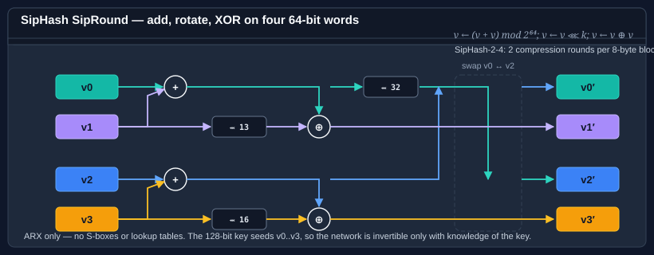

# Using SipHash

SipHash is a family of **keyed** pseudo-random functions designed by Aumasson and Bernstein for one specific job: defeating hash-flooding attacks on hash tables. It takes a 128-bit secret key and a message of any length, and produces a fixed-size digest that is prohibitively expensive to collide without knowledge of the key.



**Bodu.Security.Cryptography** ships two widths:

| Type | Output | Parameterization (default) | When to reach for it |
|---|---|---|---|
| <xref:Bodu.Security.Cryptography.SipHash64> | 64 bits | SipHash-2-4 | The standard choice — hash-table keys, sharding, short fingerprints. |
| <xref:Bodu.Security.Cryptography.SipHash128> | 128 bits | SipHash-2-4 | Longer output for content-addressing or de-duplication where 64 bits is uncomfortable. |

Both derive from a shared `SipHash<T>` base and inherit from <xref:System.Security.Cryptography.KeyedHashAlgorithm?displayProperty=nameWithType>. The key is exactly **16 bytes** (the `SipHash<T>.KeySize` constant) — shorter or longer keys are rejected at configuration time.

## Fixed sizes at a glance

| Parameter | Size | Notes |
|---|---|---|
| `Key` | 128 bits (16 bytes) | Fixed by `SipHash<T>.KeySize`. Generate once, store in your process / vault. |
| Output (`SipHash64`) | 64 bits (8 bytes) | — |
| Output (`SipHash128`) | 128 bits (16 bytes) | — |
| `CompressionRounds` | `>= 2` (default 2) | Inner rounds per 8-byte block. |
| `FinalizationRounds` | `>= 4` (default 4) | Rounds applied once at the end. |

## Pattern 1 — one-shot keyed hash

```csharp
using System.Security.Cryptography;
using System.Text;
using Bodu.Security.Cryptography;

// 128-bit key — generated once, stored in your process / vault.
byte[] key = new byte[SipHash64.KeySize];
RandomNumberGenerator.Fill(key);

byte[] message = Encoding.UTF8.GetBytes("the quick brown fox");

using var sip = new SipHash64 { Key = key };
byte[] digest = sip.ComputeHash(message);           // 8 bytes
ulong  fingerprint = BitConverter.ToUInt64(digest);
```

Swap `SipHash64` for `SipHash128` when you need 128 bits of output; everything else stays the same.

## Pattern 2 — the streaming `ComputeHash` / `TransformBlock` lifecycle

SipHash inherits the standard BCL <xref:System.Security.Cryptography.HashAlgorithm?displayProperty=nameWithType> contract, so all the usual streaming affordances apply:

```csharp
using Bodu.Security.Cryptography;

using var sip = new SipHash128 { Key = key };

using var stream = File.OpenRead("message.bin");
byte[] digest = sip.ComputeHash(stream);
```

You can also drive it block-by-block with `TransformBlock` / `TransformFinalBlock`, or — simplest of all — with `ComputeHash(ReadOnlySpan<byte>)` from the BCL span overload.

## Pattern 3 — adjusting the round count

SipHash's two round parameters are the speed / margin trade-off: more rounds, more conservative margin, slower throughput. The defaults (`CompressionRounds = 2`, `FinalizationRounds = 4`) give you the published **SipHash-2-4**, which is what every standard library and protocol uses.

```csharp
// SipHash-4-8 — extra margin at roughly half the speed.
using var sip = new SipHash64
{
    Key                 = key,
    CompressionRounds   = 4,
    FinalizationRounds  = 8,
};
```

Both rounds must be set **before** the first `TransformBlock` / `ComputeHash` — the setters throw once hashing has started, since changing the schedule mid-stream would invalidate state. The reported `AlgorithmName` includes the parameterization (e.g. `"SipHash-4-8-128"`), which is useful in logs and interop headers.

```csharp
using var sip = new SipHash128 { Key = key, CompressionRounds = 4, FinalizationRounds = 8 };
Console.WriteLine(sip.AlgorithmName);   // "SipHash-4-8-128"
```

## Pattern 4 — bucketing or sharding

A common use is to pick a bucket or shard from a user-controlled key. The key into SipHash must be **fixed process-wide** (so results are stable) and **secret** (so an attacker cannot pre-compute colliding inputs):

```csharp
using Bodu.Security.Cryptography;

byte[] ShardKey()
{
    // Load once from a vault at startup. Do NOT regenerate per request.
    return LoadSecretFromVault(name: "sharding-key-v1");
}

int ShardFor(ReadOnlySpan<byte> routeKey, int shardCount)
{
    using var sip = new SipHash64 { Key = ShardKey() };
    byte[] digest = sip.ComputeHash(routeKey.ToArray());
    ulong h = BitConverter.ToUInt64(digest);
    return (int)(h % (ulong)shardCount);
}
```

This is the canonical "use SipHash, not a non-cryptographic hash" case. An attacker who wants to overload a specific shard would have to invert SipHash without the key — which is what the algorithm is designed to prevent.

## Pattern 5 — verifying in constant time

When you compare a computed digest against a trusted one (e.g. a MAC check), **do not use `SequenceEqual`** — timing differences leak information. Use the BCL's fixed-time comparison, or the `VerifyHash` helper from `Bodu.Security.Cryptography.Extensions`:

```csharp
using Bodu.Security.Cryptography;
using Bodu.Security.Cryptography.Extensions;

using var sip = new SipHash64 { Key = key };
bool ok = sip.VerifyHash(message, expectedDigest);
```

See the [hashing overview](hashing.md#pattern-4--verifying-a-hash) for the general pattern.

## What SipHash is not

- **Not a MAC for long messages.** SipHash was built specifically for short inputs; if you need a MAC over files or network frames, reach for HMAC-SHA-256 (`System.Security.Cryptography.HMACSHA256`) or <xref:Bodu.Security.Cryptography.Poly1305>.
- **Not a cryptographic hash.** SipHash is a PRF — it resists collision and preimage only while the key stays secret. For a keyless collision-resistant digest, use SHA-256 or <xref:Bodu.Security.Cryptography.Tiger>.
- **Not deterministic across keys.** Two instances with different keys produce unrelated outputs for the same input. That is the point.

## Where to go next

- [Hashing overview](hashing.md) — how SipHash fits alongside cryptographic digests and non-cryptographic fingerprints.
- [Using Tiger](tiger.md) — a keyless cryptographic digest when you don't have a secret to carry around.
- [Using Poly1305](poly1305.md) — one-time authenticator that pairs with a stream cipher (the classic Poly1305/ChaCha20 AEAD construction).
- [Bodu.IO.Hashing — FNV, CityHash, Adler](../io-hashing/index.md) — the non-keyed, non-adversarial alternatives for trusted inputs.
- **[Hashing & Cryptography guides](../topics/hashing-and-cryptography.md)** — every guide in this topic, across Bodu.IO.Hashing and Bodu.Security.Cryptography.
