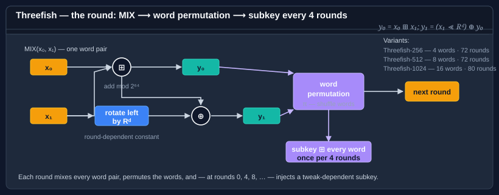

# Using Threefish-512

<xref:Bodu.Security.Cryptography.Threefish512> is the 512-bit variant of the Threefish tweakable block cipher family. It operates on **512-bit (64-byte) blocks** with a **512-bit (64-byte) key** and a **128-bit (16-byte) tweak**. Of the three Threefish variants, this is the one used as the core of the standard Skein hash function.



> [!NOTE]
> Encrypt/decrypt ships an AVX-512 fast path that engages automatically on supporting hardware. See [Hardware acceleration & SIMD opt-out](hardware-acceleration.md) for when it runs and how to force the scalar path.

## Fixed sizes at a glance

| Parameter | Size | Notes |
|---|---|---|
| Block size | 512 bits (64 bytes) | Ciphertext is a multiple of 64 bytes (except in stream modes). |
| Key size | 512 bits (64 bytes) | Fixed. |
| Tweak size | 128 bits (16 bytes) | Fixed across the Threefish family. |
| IV size | 512 bits (64 bytes) | Always matches the block size. |

## Encrypt and decrypt — CBC + PKCS7

```csharp
using System.Diagnostics;
using System.Linq;
using System.Security.Cryptography;
using System.Text;
using Bodu.Security.Cryptography;
using Bodu.Security.Cryptography.Extensions;

byte[] plaintext = Encoding.UTF8.GetBytes("a longer record payload for the 64-byte block cipher");

byte[] key, iv, tweak, ciphertext;
using (var alg = new Threefish512 { BlockMode = CipherModeKind.CBC, Padding = PaddingMode.PKCS7 })
{
    alg.GenerateKey();
    alg.GenerateIV();
    alg.GenerateTweak();

    key   = alg.Key;     // 64 bytes
    iv    = alg.IV;      // 64 bytes
    tweak = alg.Tweak;   // 16 bytes

    ciphertext = alg.Encrypt(plaintext);
}

byte[] recovered;
using (var alg = new Threefish512 { BlockMode = CipherModeKind.CBC, Padding = PaddingMode.PKCS7,
                                     Key = key, IV = iv, Tweak = tweak })
{
    recovered = alg.Decrypt(ciphertext);
}

Debug.Assert(plaintext.SequenceEqual(recovered));
```

## Encrypt and decrypt — CTR (stream mode, parallelisable)

```csharp
using var alg = new Threefish512
{
    BlockMode = CipherModeKind.CTR,
    Padding   = PaddingMode.None,
};
alg.GenerateKey();
alg.GenerateIV();
alg.GenerateTweak();

byte[] ciphertext = alg.Encrypt(plaintext);
byte[] recovered  = alg.Decrypt(ciphertext);

Debug.Assert(plaintext.SequenceEqual(recovered));
```

With a 512-bit block the counter space is astronomical; wrap-around is a theoretical concern only. CTR's usual rule still stands: never reuse an `(IV, Key)` pair across messages.

## Loading and reusing a known key

If you've stored a key in a secrets manager, load it directly rather than calling `GenerateKey()`:

```csharp
byte[] key = LoadKeyFromVault(keyId: "threefish-512/main");
Debug.Assert(key.Length == 64);

using var alg = new Threefish512 { Key = key, BlockMode = CipherModeKind.CTR, Padding = PaddingMode.None };
alg.GenerateIV();           // fresh per message
alg.GenerateTweak();        // or set a per-record tweak

byte[] ciphertext = alg.Encrypt(plaintext);
```

## Per-record tweak

Threefish's tweak is particularly useful when encrypting many small records under the same key. Using the record's stable ID as a tweak gives each record an independent encryption stream without key rotation:

```csharp
byte[] RecordTweak(long recordId)
{
    byte[] tweak = new byte[16];
    BinaryPrimitives.WriteInt64LittleEndian(tweak.AsSpan(0, 8), recordId);
    return tweak;
}

byte[] EncryptRecord(byte[] key, byte[] iv, long recordId, byte[] plaintext)
{
    using var alg = new Threefish512
    {
        Key       = key,
        IV        = iv,
        Tweak     = RecordTweak(recordId),
        BlockMode = CipherModeKind.CBC,
        Padding   = PaddingMode.PKCS7,
    };
    return alg.Encrypt(plaintext);
}
```

The 8-byte little-endian record ID fills the low half of the 16-byte tweak; the high half stays zero, leaving room to encode a second discriminator (a table ID, a tenant ID) if you need it. Because the tweak is mixed into every round's subkey, two records with different IDs are cryptographically unrelated even under the same key and IV — see [Threefish-256](threefish-256.md#what-the-tweak-is--and-why-it-is-not-an-iv) for the mechanism.

## Why 512 is the general-purpose pick

Of the three Threefish variants, Threefish-512 is the one used as the core of the standard Skein-512 hash (<xref:Bodu.Security.Cryptography.Skein512>) and is the recommended general-purpose choice:

- Its 64-byte block is wide enough to keep CBC's birthday bound irrelevant and large enough to amortise per-block overhead, yet its key schedule is far cheaper than Threefish-1024's.
- Throughput is roughly double Threefish-1024 on the same CPU for the same data.
- Padding waste rounds up to 64 bytes rather than 128 — material when records are a few hundred bytes.

Choose [Threefish-256](threefish-256.md) when ciphertext size on short messages matters most, and [Threefish-1024](threefish-1024.md) only when you specifically want the widest block.

The raw primitive is `Threefish512Cipher`, an <xref:Bodu.Security.Cryptography.IBlockCipher> taking a 64-byte key and 16-byte tweak — use it for hand-composed pipelines ([Composing primitives](composing-primitives.md)).

## Where to go next

- [Encryption basics](encryption-basics.md) — the Key/IV/Tweak lifecycle.
- [Cipher block modes](cipher-modes.md) — CFB / OFB / ECB also work with `Threefish512`.
- [Padding](padding.md) — which padding scheme pairs with which mode.
- Other variants: [Threefish-256](threefish-256.md), [Threefish-1024](threefish-1024.md).
- **[Hashing & Cryptography guides](../topics/hashing-and-cryptography.md)** — every guide in this topic, across Bodu.IO.Hashing and Bodu.Security.Cryptography.
