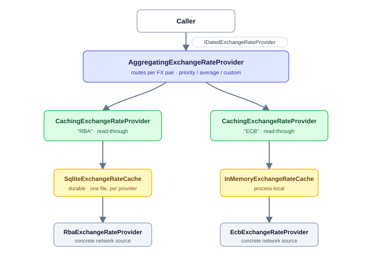
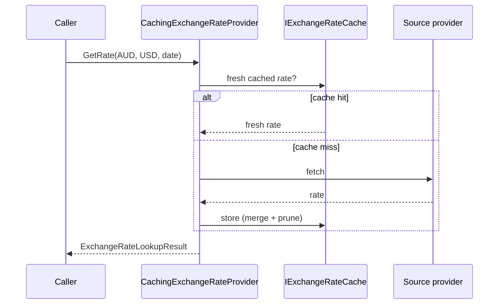
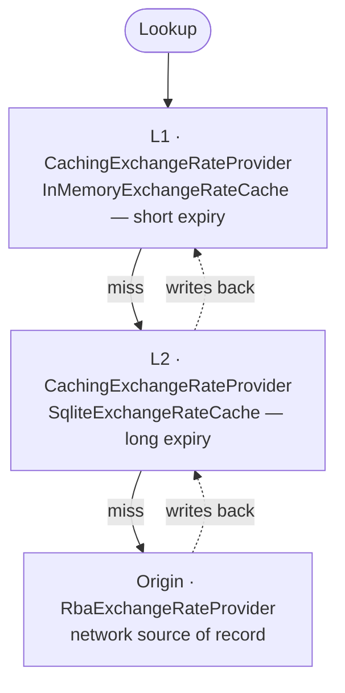
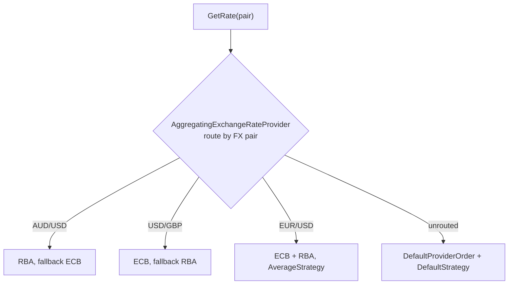

# Caching and aggregating exchange rates

`Bodu.Financial.ExchangeRates.Caching` adds two pieces **in front of** the
exchange-rate providers. The concrete providers (Yahoo, OFX, RBA, ECB, BoE) stay pure
fetchers that know nothing of caching; each piece implements the same
[`IDatedExchangeRateProvider`](xref:Bodu.Financial.IDatedExchangeRateProvider)
contract (and the timeless [`IExchangeRateProvider`](xref:Bodu.Financial.IExchangeRateProvider)),
so they drop in transparently:



The two pieces are orthogonal: use the cache alone to add read-through caching to
a single source, the aggregator alone to group already-cached (or uncached)
providers, or compose them as above.

## Concepts in one minute

- **Caching provider** — [`CachingExchangeRateProvider`](xref:Bodu.Financial.ExchangeRates.Caching.CachingExchangeRateProvider)
  wraps **one** inner source over **one** single-provider cache. It serves fresh
  cached rates and delegates to the source only on a miss, then caches what the
  source returns.
- **Cache** — a cache is **bound to one provider**.
  [`IExchangeRateCache`](xref:Bodu.Financial.ExchangeRates.Caching.IExchangeRateCache)
  owns expiry: callers pass a duration, and the cache returns only fresh rows and
  prunes stale ones on write. Shipped stores are
  [`TomlFileExchangeRateCache`](xref:Bodu.Financial.ExchangeRates.Caching.TomlFileExchangeRateCache)
  and [`JsonFileExchangeRateCache`](xref:Bodu.Financial.ExchangeRates.Caching.JsonFileExchangeRateCache)
  (on disk, with a configurable [layout and date partitioning](#file-layouts-and-date-partitioning)),
  [`InMemoryExchangeRateCache`](xref:Bodu.Financial.ExchangeRates.Caching.InMemoryExchangeRateCache),
  and the no-op [`NullExchangeRateCache`](xref:Bodu.Financial.ExchangeRates.Caching.NullExchangeRateCache).
- **Options** — [`CachingExchangeRateOptions`](xref:Bodu.Financial.ExchangeRates.Caching.CachingExchangeRateOptions)
  carries the cache **location** (`CacheDirectory`), the **default expiry**
  (`DefaultExpiry`), **per-provider overrides** (`ProviderExpiry`), the per-event
  log levels, and `DefaultLookupOptions` for the timeless surface.
- **Aggregator** — [`AggregatingExchangeRateProvider`](xref:Bodu.Financial.ExchangeRates.Caching.AggregatingExchangeRateProvider)
  groups named children behind one entry point, combining them with a pluggable
  [`IExchangeRateAggregationStrategy`](xref:Bodu.Financial.ExchangeRates.Caching.IExchangeRateAggregationStrategy)
  and optional **per-FX-pair routing**.
- **Entry** — [`CachedExchangeRate`](xref:Bodu.Financial.ExchangeRates.Caching.CachedExchangeRate)
  is one cached row: the observation `Date`, the `Rate`, and the `CachedAtUtc`
  instant that drives expiry.

## Quickstart

A durable SQLite cache in front of the RBA source, end to end. Both snippets are
self-contained — nothing is assumed to exist beforehand.

**Dependency injection** (recommended — the container owns the `HttpClient`, logger,
and disposal):

```csharp
using Bodu.Financial;
using Bodu.Financial.ExchangeRates;          // AddRbaHistoricalRates, RbaExchangeRateProvider
using Bodu.Financial.ExchangeRates.Caching;  // IExchangeRateCache
using Microsoft.Extensions.DependencyInjection;

var services = new ServiceCollection();

services.AddFinancialService()
        .AddRbaHistoricalRates()                                   // the concrete RBA source
        .AddSqliteRateCache("RBA",                                 // a durable cache bound to it
            configure: o => o.DatabaseFilePath = "/var/cache/fx.db")
        .AddCachedExchangeRateProvider<RbaExchangeRateProvider>(   // read-through over that cache
            "RBA",
            cacheFactory: (sp, name) => sp.GetRequiredKeyedService<IExchangeRateCache>(name));

using var host = services.BuildServiceProvider();
var rates = host.GetRequiredService<IDatedExchangeRateProvider>();

ExchangeRateLookupResult aud = rates.GetRate("AUD", "USD", new DateOnly(2024, 1, 3));
// aud.Rate is served from SQLite when fresh, otherwise fetched from the RBA source and cached.
```

**Manual** (new up every piece yourself — useful outside a DI container):

```csharp
using Bodu.Financial;
using Bodu.Financial.ExchangeRates;          // RbaExchangeRateProvider, RbaExchangeRateOptions
using Bodu.Financial.ExchangeRates.Caching;  // SqliteExchangeRateCache, CachingExchangeRateProvider

// The concrete source. This overload builds and owns an HttpClient, so dispose the provider.
using var source = new RbaExchangeRateProvider(new RbaExchangeRateOptions());

// A durable cache for it, wrapped in a read-through provider.
using var cache = new SqliteExchangeRateCache("RBA", "/var/cache/fx.db");
var rates = new CachingExchangeRateProvider(source, cache, new CachingExchangeRateOptions());

ExchangeRateLookupResult aud = rates.GetRate("AUD", "USD", new DateOnly(2024, 1, 3));
```

From here: add [more providers behind one file](#sqlite-concurrency-durability-and-the-shared-file),
[stack a faster tier](#stacking-providers-tiered-read-through),
[group several sources](#grouping-providers-with-the-aggregator), or wire the
[degradation logging](#observability-seeing-hits-misses-and-degradation).

## Caching one provider

`CachingExchangeRateProvider` caches exactly one source. It is **storage-agnostic**:
it never chooses or constructs a cache, so you supply the
[`IExchangeRateCache`](xref:Bodu.Financial.ExchangeRates.Caching.IExchangeRateCache)
— and therefore the storage structure (TOML or JSON files, the on-disk layout and
partitioning, in-memory, SQLite, or distributed) — at the composition root. The
provider classes never learn they are being cached.



```csharp
var options = new CachingExchangeRateOptions
{
    DefaultExpiry = TimeSpan.FromHours(12),
};
options.ProviderExpiry["RBA"] = TimeSpan.FromDays(7);   // RBA publishes daily; cache longer

// Pick the cache explicitly. Cache files land under /var/cache/fx/RBA/.
var rbaCache = new TomlFileExchangeRateCache(
    new FileExchangeRateCacheOptions { Provider = "RBA", CacheDirectory = "/var/cache/fx" });
IDatedExchangeRateProvider cachedRba = new CachingExchangeRateProvider(rba, rbaCache, options);

// Or any other IExchangeRateCache — for example the in-memory store.
IDatedExchangeRateProvider cachedEcb =
    new CachingExchangeRateProvider(ecb, new InMemoryExchangeRateCache("ECB"), options);
```

The decorator is `IDisposable`. By default it does **not** dispose the inner
provider — under dependency injection the container owns it, and a hand-composed
inner is owned by whoever created it. Pass `ownsInner: true` to make disposing the
decorator also dispose a disposable inner (for example a provider that built its
own `HttpClient`):

```csharp
using var cached = new CachingExchangeRateProvider(
    new RbaExchangeRateProvider(rbaOptions),
    new TomlFileExchangeRateCache(new FileExchangeRateCacheOptions { Provider = "RBA", CacheDirectory = "/var/cache/fx" }),
    options,
    ownsInner: true);
```

The decorator also implements the timeless surface, which resolves the current UTC
date under `CachingExchangeRateOptions.DefaultLookupOptions`:

```csharp
decimal todayRate = ((IExchangeRateProvider)cachedRba).GetRate("AUD", "USD");
```

### Per-provider expiry and the global default

`GetExpiry(name)` returns a provider's specific override when present and
`DefaultExpiry` otherwise:

```csharp
options.GetExpiry("RBA");     // 7 days   (override)
options.GetExpiry("ECB");     // 12 hours (the default)
```

### Single-date lookups

`GetRate` / `TryGetRate` flow through the cache. On a hit the cached rows are
reconstructed into a [`FixedDatedExchangeRateProvider`](xref:Bodu.Financial.FixedDatedExchangeRateProvider),
so date-resolution policy, inverse pairs, and same-currency identity all behave
exactly as the underlying stack would:

```csharp
// Miss → fetched from the source, then cached.
ExchangeRateLookupResult r1 = cachedRba.GetRate("AUD", "USD", new DateOnly(2024, 1, 3));

// Repeat within the expiry window → served from cache, no source call.
ExchangeRateLookupResult r2 = cachedRba.GetRate("AUD", "USD", new DateOnly(2024, 1, 3));

// Resolution policies are honoured against the cached rows.
cachedRba.TryGetRate("AUD", "USD", new DateOnly(2024, 1, 5),
    ExchangeRateLookupOptions.PreviousWithin(7), out ExchangeRateLookupResult r3);
```

### Range lookups

`GetRatesAsync` returns every rate whose date falls in the inclusive window. Whether
the cache can serve a range is decided by **coverage** — the date ranges the source
was actually fetched for — not by the span of the stored rows. A range is served from
the cache only when the recorded coverage **contains** the whole requested window;
otherwise the range is refetched and the rows plus the covered window are written back
together (atomically) through `StoreFetchedRange`.

When the direct pair's coverage does not contain the window but the **inverse** pair's
does — and inversion is permitted by the provider's `DefaultLookupOptions` (the default) —
the range is served from the inverse pair by reciprocating each rate. So a `USD/AUD` range
already fetched also satisfies an `AUD/USD` range request without a refetch, mirroring the
single-date surface.

```csharp
IReadOnlyList<ExchangeRate> january =
    await cachedRba.GetRatesAsync("AUD", "USD", new DateOnly(2024, 1, 1), new DateOnly(2024, 1, 31));
```

> [!NOTE]
> Coverage is recorded for the whole fetched window even on days that returned no
> observation (a weekend, a holiday, a true gap), so a later lookup of the same window
> is served from the cache rather than refetched. A sparse set of rows is therefore
> never mistaken for proof that every interior day was fetched — the distinction a
> [`DateRangeCoverage`](xref:Bodu.Financial.DateRangeCoverage) makes explicit.

### Respecting advertised history

Every shipped provider [advertises how far back it can serve rates](exchange-rate-providers.md)
through [`HistoryAvailability`](xref:Bodu.Financial.WebExchangeRateProvider.HistoryAvailability),
and the caching decorator consumes that declaration by default
([`RespectHistoryAvailability`](xref:Bodu.Financial.ExchangeRates.Caching.CachingExchangeRateOptions.RespectHistoryAvailability)):
when the inner provider implements
[`IHistoryAwareExchangeRateProvider`](xref:Bodu.Financial.IHistoryAwareExchangeRateProvider),
misses for dates the source has declared unavailable are not forwarded.

- **Single-date lookups** outside the advertised history surface as an ordinary
  miss (`TryGetRate` returns `false`; the throwing surfaces raise the usual
  `KeyNotFoundException`) without the inner provider being called. Forward-resolving
  rules are honoured: a request just before the advertised floor whose
  `NextOnOrAfter`/`Nearest` tolerance reaches back inside it is still delegated.
- **Range fetches** that start before the advertised earliest date are issued
  from that date instead, and a window lying entirely before it is not fetched at
  all. In both cases coverage is recorded over the **whole requested window**, so
  the unavailable prefix becomes the covered-with-no-rows negative cache described
  above and is not re-asked until normal expiry.

The clamp only ever removes calls the source has declared doomed — a non-aware
inner provider is treated as unbounded and never skipped, and a date inside the
advertised window can still miss for ordinary reasons (weekends, holidays,
unpublished series). Skips and clamps are logged at
[`HistoryClampLogLevel`](xref:Bodu.Financial.ExchangeRates.Caching.CachingExchangeRateOptions.HistoryClampLogLevel).
The decorator forwards the inner's declaration as its own `HistoryAvailability`,
so stacked caches and the aggregator see through it.

The [aggregator](#grouping-providers-with-the-aggregator) applies the same idea
at routing time (via its own
[`RespectHistoryAvailability`](xref:Bodu.Financial.ExchangeRates.Caching.ExchangeRateAggregationOptions.RespectHistoryAvailability)):
candidates that declared they cannot serve any part of the requested date or
window are dropped before the strategy runs, so a priority fallback does not
waste a call on a source that cannot answer — a shallow rolling-window source is
skipped for deep historical dates while an unbounded central-bank source answers
them. Its composed `HistoryAvailability` is the most generous declaration across
the children.

## The cache cascade

The cache is deliberately layered so you can plug in at whichever level fits:

| Layer | Type | Responsibility |
|---|---|---|
| Contract | [`IExchangeRateCache`](xref:Bodu.Financial.ExchangeRates.Caching.IExchangeRateCache) | Single-provider store: a bound `Provider`; rate rows via `GetRates`/`Store`, fetch coverage via `GetCoverage`/`RecordCoverage`, and the atomic `StoreFetchedRange` that writes both together. |
| Core | [`ExchangeRateCacheBase<TOptions>`](xref:Bodu.Financial.ExchangeRates.Caching.ExchangeRateCacheBase`1) | Per-pair locking + row/coverage freshness filtering, merge, and prune. **No physical layout.** |
| File seam | [`IFileExchangeRateCache`](xref:Bodu.Financial.ExchangeRates.Caching.IFileExchangeRateCache) / [`FileExchangeRateCacheBase<TOptions>`](xref:Bodu.Financial.ExchangeRates.Caching.FileExchangeRateCacheBase`1) | Layout-driven directory + file-name resolution, date partitioning, best-effort IO. |
| Leaf | [`TomlFileExchangeRateCache`](xref:Bodu.Financial.ExchangeRates.Caching.TomlFileExchangeRateCache) / [`JsonFileExchangeRateCache`](xref:Bodu.Financial.ExchangeRates.Caching.JsonFileExchangeRateCache) | The TOML or JSON serialization format only. |

### The on-disk format

A cache bound to provider `RBA` stores `AUD/USD` as `<directory>/RBA/AUDUSD.toml`
— a per-provider subdirectory with one file per pair (this default layout, and how
to change it, is covered under [File layouts and date partitioning](#file-layouts-and-date-partitioning)).
Each file opens with a **self-describing header** — the bound `Provider` and the
pair's `From`/`To` currency codes — so a file carries its own identity rather than
relying on its name and folder. Each dated rate is then a TOML table; the `decimal`
rate is written as a **quoted string** so its full precision and scale round-trip
exactly, and the dates use TOML's native RFC 3339 forms:

```toml
Provider = "RBA"
From = "AUD"
To = "USD"

[[Entries]]
Date = 2023-01-03
Rate = "0.5000"
CachedAtUtc = 2023-01-04T09:15:00+00:00

[[Entries]]
Date = 2023-01-06
Rate = "0.5100"
CachedAtUtc = 2023-01-04T09:15:00+00:00
```

The serializer is [`Bodu.Text.Toml`](xref:Bodu.Text.Toml.TomlSerializer) with
`TomlDecimalHandling.String`. A file written before the header existed simply has
no `Provider`/`From`/`To` keys and still reads. The file is **best-effort**: any
I/O or TOML error on read yields an empty result, and a failed write is swallowed,
so a cache problem never breaks rate retrieval. You can use a cache directly — note
there is no provider argument; the cache is bound to its provider at construction:

<!-- compile -->
```csharp
var cache = new TomlFileExchangeRateCache(
    new FileExchangeRateCacheOptions { Provider = "RBA", CacheDirectory = "/var/cache/fx" });

var now = DateTimeOffset.UtcNow;
cache.Store(new ExchangeRatePair(CurrencyCode.AUD, CurrencyCode.USD),
    new[] { new CachedExchangeRate(new DateOnly(2023, 1, 3), 0.5000m, now) },
    TimeSpan.FromHours(24), now);

IReadOnlyList<CachedExchangeRate> fresh =
    cache.GetRates(new ExchangeRatePair(CurrencyCode.AUD, CurrencyCode.USD), TimeSpan.FromHours(24), now);
```

### The JSON format

[`JsonFileExchangeRateCache`](xref:Bodu.Financial.ExchangeRates.Caching.JsonFileExchangeRateCache)
is the same cache with a JSON body instead of TOML — same `.json` files, same
self-describing header, same layouts and partitioning, same best-effort IO. It is
a drop-in swap when you want a format other tools read natively; decimals are
written as JSON numbers, which `System.Text.Json` round-trips losslessly to
`decimal`:

```json
{
  "Provider": "RBA",
  "From": "AUD",
  "To": "USD",
  "Entries": [
    { "Date": "2023-01-03", "Rate": 0.5000, "CachedAtUtc": "2023-01-04T09:15:00+00:00" }
  ],
  "Coverage": []
}
```

<!-- compile -->
```csharp
var cache = new JsonFileExchangeRateCache(
    new FileExchangeRateCacheOptions { Provider = "RBA", CacheDirectory = "/var/cache/fx" });
```

### File layouts and date partitioning

The [`Layout`](xref:Bodu.Financial.ExchangeRates.Caching.FileExchangeRateCacheOptions.Layout)
option decides **where** a pair's rows are stored: the folder hierarchy, the file
name, and whether the rows are **split across files by date**. It defaults to
[`ExchangeRateCacheFileLayout.SingleFile`](xref:Bodu.Financial.ExchangeRates.Caching.ExchangeRateCacheFileLayout)
— the `<directory>/<provider>/<from><to>.toml` layout shown above. The built-in
partitioned layouts isolate each pair in its own folder and write one file per
calendar period, keyed by the period:

| Layout | Files for `AUD/USD` under provider `RBA` |
|---|---|
| `SingleFile` (default) | `RBA/AUDUSD.toml` |
| `Yearly` | `RBA/AUDUSD/2023.toml`, `RBA/AUDUSD/2024.toml`, … |
| `Monthly` | `RBA/AUDUSD/2023-01.toml`, `RBA/AUDUSD/2023-02.toml`, … |
| `Daily` | `RBA/AUDUSD/2023-01-03.toml`, … |

Each rate is routed to the file for its observation date, and a recorded coverage
window that crosses a period boundary is split at the boundary so each file carries
only its own period; a read concatenates every file in the pair's folder and the
shared cache rules re-merge the halves, so the split is lossless.

<!-- compile -->
```csharp
// One file per month for each pair.
var monthly = new TomlFileExchangeRateCache(new FileExchangeRateCacheOptions
{
    Provider = "RBA",
    CacheDirectory = "/var/cache/fx",
    Layout = ExchangeRateCacheFileLayout.Monthly,
});
```

For a layout the built-ins do not cover, build one with
[`ExchangeRateCacheFileLayout.Create`](xref:Bodu.Financial.ExchangeRates.Caching.ExchangeRateCacheFileLayout.Create*):
supply a partition strategy (one of `Single`/`Yearly`/`Monthly`/`Daily`, or
[`ExchangeRateCachePartitionStrategy.Custom`](xref:Bodu.Financial.ExchangeRates.Caching.ExchangeRateCachePartitionStrategy.Custom*)
for an arbitrary period such as fiscal quarters) and optional delegates that decide
the directory and the file name:

<!-- compile -->
```csharp
var custom = new TomlFileExchangeRateCache(new FileExchangeRateCacheOptions
{
    Provider = "RBA",
    CacheDirectory = "/var/cache/fx",
    Layout = ExchangeRateCacheFileLayout.Create(
        ExchangeRateCachePartitionStrategy.Yearly,
        directory: ctx => System.IO.Path.Combine(ctx.Root, "fx", ctx.Provider, $"{ctx.Pair.From}{ctx.Pair.To}"),
        fileName: ctx => $"{ctx.PartitionKey}{ctx.FileExtension}"),
});
```

A partitioned layout has no single backing file, so `ResolveFilePath` throws for it;
use `ResolveDirectory(pair)` for the pair's folder or `ResolvePartitionPath(pair, date)`
for the file a given date lands in. `CachingExchangeRateProvider` takes whatever
`IExchangeRateCache` you hand it, so a custom layout, the JSON format, or a SQLite or
distributed cache is simply the cache you construct and pass to its
`(inner, cache, options)` constructor. Under dependency injection, pass a
`cacheFactory` to `AddCachedExchangeRateProvider` (or `AddCachedChild`) to choose the
storage; when omitted, a default single-file TOML cache under the options'
`CacheDirectory` is used.

### Custom cache stores

A cache backend is any [`IExchangeRateCache`](xref:Bodu.Financial.ExchangeRates.Caching.IExchangeRateCache)
implementation. To back the cache with a store of your own, implement that interface
directly — the shipped
[`SqliteExchangeRateCache`](xref:Bodu.Financial.ExchangeRates.Caching.SqliteExchangeRateCache)
and [`DistributedExchangeRateCache`](xref:Bodu.Financial.ExchangeRates.Caching.DistributedExchangeRateCache)
are exactly that and serve as worked references. Delegate the freshness, validity,
merge, and coverage rules to the shared, public
[`ExchangeRateCacheRules`](xref:Bodu.Financial.ExchangeRates.Caching.ExchangeRateCacheRules)
so your backend stays behaviourally identical to the in-box caches (the same
`ExchangeRateCacheContractTests` apply), and make `StoreFetchedRange` write the merged
rows and the covered window as one atomic unit so a reader never observes coverage
without its rows.

The in-box [`ExchangeRateCacheBase<TOptions>`](xref:Bodu.Financial.ExchangeRates.Caching.ExchangeRateCacheBase`1)
and [`FileExchangeRateCacheBase<TOptions>`](xref:Bodu.Financial.ExchangeRates.Caching.FileExchangeRateCacheBase`1)
are internal scaffolding for the in-memory, TOML, and JSON caches — they own the per-pair
locking and the read-modify-write sequencing over a `CachePairState` — and their
storage seam is not a public subclassing point. Implement `IExchangeRateCache`
directly, as the SQLite and distributed backends do.

### Persistent and shared backends

Two further `IExchangeRateCache` backends ship as separate packages and drop in the
same way — construct one and hand it to a `CachingExchangeRateProvider`, or register
it through the DI extension method that ships inside the backend's own package (in the
`Bodu.Financial.ExchangeRates` namespace):

- [`SqliteExchangeRateCache`](xref:Bodu.Financial.ExchangeRates.Caching.SqliteExchangeRateCache)
  (`Bodu.Financial.ExchangeRates.Caching.Sqlite`) persists rates and coverage in a
  SQLite database — durable across restarts, with per-pair transactional writes.
  Register it with `AddSqliteRateCache("RBA", …)`.
- [`DistributedExchangeRateCache`](xref:Bodu.Financial.ExchangeRates.Caching.DistributedExchangeRateCache)
  (`Bodu.Financial.ExchangeRates.Caching.Distributed`) stores each pair as a JSON blob
  in any `IDistributedCache` (Redis, SQL Server, in-memory), so several processes share
  one warm cache. Register it with `AddDistributedRateCache("RBA")` or
  `AddRedisRateCache(redis => …, "RBA")` — the Redis configurator is the first
  argument, the provider name the second.

Every backend shares the same freshness, merge, and coverage semantics — the same
`ExchangeRateCacheContractTests`.

> [!IMPORTANT]
> The distributed cache is a **best-effort shared performance hint, not an
> authoritative multi-writer store.** `IDistributedCache` offers no atomic
> read-modify-write, so same-process races are guarded by a per-pair in-process lock
> while **cross-process** writes to one pair are last-write-wins (a `StoreFetchedRange`
> blob is still all-or-nothing per write, so a reader never sees coverage without its
> rows). When correctness under concurrent writers matters, prefer the SQLite backend
> (one transaction per write) or a real database.

The choice is one of reach and durability:

| Backend | Best for | Not for | Correctness note |
|---|---|---|---|
| [`NullExchangeRateCache`](xref:Bodu.Financial.ExchangeRates.Caching.NullExchangeRateCache) | tests / disabling the cache | any reuse | stores nothing; every lookup is a miss |
| [`InMemoryExchangeRateCache`](xref:Bodu.Financial.ExchangeRates.Caching.InMemoryExchangeRateCache) | a single, long-lived process | restarts; multiple processes | process-local; lost on restart |
| [`TomlFileExchangeRateCache`](xref:Bodu.Financial.ExchangeRates.Caching.TomlFileExchangeRateCache) / [`JsonFileExchangeRateCache`](xref:Bodu.Financial.ExchangeRates.Caching.JsonFileExchangeRateCache) | simple durable local cache; inspectable files | high multi-process write concurrency | atomic temp-and-move per file; best-effort |
| [`SqliteExchangeRateCache`](xref:Bodu.Financial.ExchangeRates.Caching.SqliteExchangeRateCache) | durable single-host cache | a cache shared across hosts | strongest shipped local option; one transaction per write |
| [`DistributedExchangeRateCache`](xref:Bodu.Financial.ExchangeRates.Caching.DistributedExchangeRateCache) | a warm cache shared across processes/hosts | an authoritative multi-writer store | last-write-wins per pair across processes |

## Cache backends in depth

The earlier table picks a backend by reach and durability; this section goes
one level down into the *semantics* each one commits to, so a choice survives
the move from a single process to a fleet. Every backend implements the same
[`IExchangeRateCache`](xref:Bodu.Financial.ExchangeRates.Caching.IExchangeRateCache)
contract and delegates its freshness, validity, merge, and coverage rules to
the shared
[`ExchangeRateCacheRules`](xref:Bodu.Financial.ExchangeRates.Caching.ExchangeRateCacheRules),
so they differ only in *where the bytes live* and *how a concurrent write is
ordered* — never in what counts as a hit.

| | `Null` | `InMemory` | `TomlFile` / `JsonFile` | `Sqlite` | `Distributed` |
|---|---|---|---|---|---|
| Package | core | core | core | `.Caching.Sqlite` | `.Caching.Distributed` |
| Scope | none | one process | one host | one host | many hosts |
| Survives restart | n/a | no | yes | yes | yes (in the backing store) |
| Shared across processes | n/a | no | through the file system | through the file | yes |
| `StoreFetchedRange` atomicity | n/a | per-pair lock | temp-and-move per file | one transaction | one blob write |
| Cross-process write race | n/a | n/a | last-write-wins per file | serialized rows, OS-level | last-write-wins per pair |
| Construct | `Create(provider)` | `new(provider)` | `new(options)` | `AddSqliteRateCache` | `AddDistributedRateCache` / `AddRedisRateCache` |

**Expiry, invalidation, and refresh are uniform.** None of the backends has a
private eviction clock. A row is fresh while `asOf - CachedAtUtc < duration`
(the resolved per-provider expiry), and freshness is evaluated on every read;
stale rows are pruned on the next write. There is no explicit invalidate call —
a value "refreshes" by being re-fetched on a miss and merged in, latest
`CachedAtUtc` winning per date. This is why the same rules object is shared: an
expired row in SQLite and an expired row in Redis disappear at the same instant
relative to their own `CachedAtUtc`, with no backend-specific TTL drift. A
distributed backend may *additionally* set an absolute expiration on its blob as
a storage hint, but correctness never depends on it — the freshness filter still
runs on read.

**Atomicity is the axis that actually matters across processes.**
`StoreFetchedRange` must persist the merged rows and the covered window together
or neither, so a reader never sees coverage without its rows and reports a false
range hit. Each backend honours that differently:

- [`InMemoryExchangeRateCache`](xref:Bodu.Financial.ExchangeRates.Caching.InMemoryExchangeRateCache)
  and the file caches ([`TomlFileExchangeRateCache`](xref:Bodu.Financial.ExchangeRates.Caching.TomlFileExchangeRateCache)
  and [`JsonFileExchangeRateCache`](xref:Bodu.Financial.ExchangeRates.Caching.JsonFileExchangeRateCache))
  serialize per-pair writes under an in-process lock; the file caches additionally
  write each file through a temp-and-move so a half-written file is never observed.
  Two *processes* writing the same file (for example `AUDUSD.toml`) are
  last-write-wins; under a partitioned layout each per-period file is written that
  same atomic way.
- [`SqliteExchangeRateCache`](xref:Bodu.Financial.ExchangeRates.Caching.SqliteExchangeRateCache)
  wraps each `StoreFetchedRange` in a single transaction over its `rates` and
  `coverage` tables, so the all-or-nothing guarantee holds even when several
  processes on the host share the database file.
- [`DistributedExchangeRateCache`](xref:Bodu.Financial.ExchangeRates.Caching.DistributedExchangeRateCache)
  stores the whole per-pair state as one JSON blob, so a `StoreFetchedRange` is
  all-or-nothing *across processes* — but because `IDistributedCache` has no
  atomic read-modify-write, the read-merge-write cycle of `Store` /
  `RecordCoverage` is only same-process safe; cross-process writes to a pair are
  last-write-wins.

**When to use which.** Reach for `NullExchangeRateCache` to disable caching in a
test without changing the composition. Use `InMemoryExchangeRateCache` for a
single long-lived service that can afford a cold start after a restart. Pick
`TomlFileExchangeRateCache` for a durable, inspectable local cache where write
concurrency is low — the per-pair files are human-readable. Prefer
`SqliteExchangeRateCache` when several processes on one host must share a warm,
correct-under-concurrency cache. Choose `DistributedExchangeRateCache` only when
the cache must span hosts and you accept its best-effort, last-write-wins
nature as a performance hint rather than an authoritative store; when correctness
under concurrent writers matters across a fleet, front a real database with your
own [`IExchangeRateCache`](xref:Bodu.Financial.ExchangeRates.Caching.IExchangeRateCache).

## SQLite: concurrency, durability, and the shared file

[`SqliteExchangeRateCache`](xref:Bodu.Financial.ExchangeRates.Caching.SqliteExchangeRateCache)
is the strongest shipped *local* backend: durable across restarts, and safe when
several caches — even several processes on one host — share a single database file.

**One file, many providers.** Construct one cache per provider, all pointed at the same
`DatabaseFilePath`. Every row is keyed by `(provider, from_code, to_code, obs_date)`, so
each provider's series stays partitioned with no collisions — and one cache already
covers *all* of its provider's currency pairs, so there is never a cache per pair:

```csharp
using var rba = new SqliteExchangeRateCache("RBA", "/var/cache/fx.db");
using var ofx = new SqliteExchangeRateCache("OFX", "/var/cache/fx.db");
```

**Why it is safe under concurrency.**

- Each [`StoreFetchedRange`](xref:Bodu.Financial.ExchangeRates.Caching.IExchangeRateCache)
  writes the merged rows and the covered window in **one transaction**, so a reader
  never sees coverage without its rows.
- **Write-ahead logging** (`UseWriteAheadLogging`, on by default) lets readers run
  concurrently with a writer, lifting throughput when caches or processes share the
  file. It creates `.db-wal` and `.db-shm` sidecar files next to the database — normal,
  and managed by SQLite.
- **`BusyTimeout`** (default 5 s) is how long a connection waits for a peer's write lock
  before failing. The best-effort cache would otherwise swallow a contended write as a
  silently dropped one, so a non-zero timeout is what makes multi-writer sharing
  reliable.
- Each instance holds its own keep-alive connection and per-pair in-process locks;
  SQLite's own file locking serialises writes across processes.

**When to tune or disable.** Raise `BusyTimeout` under heavy multi-process write
contention; lower it (or `TimeSpan.Zero`) where a fast failure beats waiting. Disable
`UseWriteAheadLogging` on storage that cannot honour WAL — notably some **network file
systems** (NFS/SMB) — where the cache falls back to the default rollback journal.

## Stacking providers (tiered read-through)

A [`CachingExchangeRateProvider`](xref:Bodu.Financial.ExchangeRates.Caching.CachingExchangeRateProvider)
*is* an [`IDatedExchangeRateProvider`](xref:Bodu.Financial.IDatedExchangeRateProvider),
and its constructor takes one as its `inner` source — so caching providers
**stack**. Wrap a source in a durable cache, then wrap *that* in a faster cache, to
build a tiered read-through where each layer is consulted in turn and only a miss
falls through to the next:



On the way back, the fetched rate is written into L2 and then L1, so both tiers
warm up; a process restart loses L1 but L2 still serves without hitting the origin.

```csharp
using Bodu.Financial.ExchangeRates.Caching;

// L2 short-circuits the network; L1 short-circuits even the SQLite read.
var l2Options = new CachingExchangeRateOptions { DefaultExpiry = TimeSpan.FromDays(7) };
var l1Options = new CachingExchangeRateOptions { DefaultExpiry = TimeSpan.FromMinutes(5) };

IDatedExchangeRateProvider durable = new CachingExchangeRateProvider(
    rbaSource, new SqliteExchangeRateCache("RBA", "/var/cache/fx.db"), l2Options);

IDatedExchangeRateProvider tiered = new CachingExchangeRateProvider(
    durable, new InMemoryExchangeRateCache("RBA"), l1Options);
```

Two rules make a stack behave:

- **Bind every cache in the stack to the *same* provider name.** A served rate is
  tagged with the serving cache's [`Provider`](xref:Bodu.Financial.ExchangeRates.Caching.IExchangeRateCache),
  so mismatched names would mislabel the source.
- **Give the outer (faster) tier a *shorter* expiry than the inner (durable) tier.**
  L1 is a hot buffer; L2 is the longer-lived store of record. Each layer's
  [`CachingExchangeRateOptions.DefaultExpiry`](xref:Bodu.Financial.ExchangeRates.Caching.CachingExchangeRateOptions)
  (or per-provider override) is evaluated independently.

The L1 tier can be process-local
([`InMemoryExchangeRateCache`](xref:Bodu.Financial.ExchangeRates.Caching.InMemoryExchangeRateCache))
or cross-process
([`DistributedExchangeRateCache`](xref:Bodu.Financial.ExchangeRates.Caching.DistributedExchangeRateCache),
e.g. Redis), and an aggregator child (below) can itself be a stack — the patterns
compose freely. Each [`ExchangeRateLookupResult.Provenance`](xref:Bodu.Financial.ExchangeRateLookupResult)
reports which backend served the request, so you can see which tier answered.

## Grouping providers with the aggregator

[`AggregatingExchangeRateProvider`](xref:Bodu.Financial.ExchangeRates.Caching.AggregatingExchangeRateProvider)
groups several named children behind one entry point and resolves each request
through a strategy. Build the children (typically each wrapped in its own cache),
then group them:

```csharp
var rba = new CachingExchangeRateProvider(
    rbaSource, new TomlFileExchangeRateCache(new FileExchangeRateCacheOptions { Provider = "RBA", CacheDirectory = "/var/cache/fx" }), options);
var ecb = new CachingExchangeRateProvider(
    ecbSource, new TomlFileExchangeRateCache(new FileExchangeRateCacheOptions { Provider = "ECB", CacheDirectory = "/var/cache/fx" }), options);

IDatedExchangeRateProvider provider = new AggregatingExchangeRateProvider(
    new[]
    {
        new NamedDatedExchangeRateProvider("RBA", rba),
        new NamedDatedExchangeRateProvider("ECB", ecb),
    });
```

A child is just an `IDatedExchangeRateProvider`, so each can be a concrete source
wrapped in any cache — including a `SqliteExchangeRateCache`, or a full stack from
the previous section. Here the aggregator fronts two SQLite-cached sources sharing
one database file, with `AUD/USD` preferring RBA and falling back to ECB:

```csharp
var options = new CachingExchangeRateOptions { DefaultExpiry = TimeSpan.FromHours(24) };

IDatedExchangeRateProvider rba = new CachingExchangeRateProvider(
    rbaSource, new SqliteExchangeRateCache("RBA", "/var/cache/fx.db"), options);
IDatedExchangeRateProvider ecb = new CachingExchangeRateProvider(
    ecbSource, new SqliteExchangeRateCache("ECB", "/var/cache/fx.db"), options);

var aggregation = new ExchangeRateAggregationOptions();
aggregation.Routes[new ExchangeRatePair(CurrencyCode.AUD, CurrencyCode.USD)] = new ExchangeRatePairRoute(new[] { "RBA", "ECB" });

IDatedExchangeRateProvider provider = new AggregatingExchangeRateProvider(
    new[]
    {
        new NamedDatedExchangeRateProvider("RBA", rba),
        new NamedDatedExchangeRateProvider("ECB", ecb),
    },
    aggregation);
```

### Strategies

The combination is a pluggable
[`IExchangeRateAggregationStrategy`](xref:Bodu.Financial.ExchangeRates.Caching.IExchangeRateAggregationStrategy):

- [`PriorityFallbackStrategy`](xref:Bodu.Financial.ExchangeRates.Caching.PriorityFallbackStrategy)
  (the default) returns the first child that resolves — the successor to the
  former `CompositeDatedExchangeRateProvider`.
- [`AverageStrategy`](xref:Bodu.Financial.ExchangeRates.Caching.AverageStrategy)
  returns the arithmetic mean of every child that resolves, tagged with a
  synthetic provider label (`Average` by default). The mean is an analytical,
  composite value — it can equal a rate no source actually published — so it suits
  smoothing or cross-source comparison rather than an authoritative observation; for
  tax, accounting, or audit use prefer a single source (priority or per-pair routing).
- Implement the interface for anything else (weighted, median, first-non-stale).

```csharp
var options = new ExchangeRateAggregationOptions { DefaultStrategy = new AverageStrategy() };
```

### Per-FX-pair routing

[`ExchangeRateAggregationOptions.Routes`](xref:Bodu.Financial.ExchangeRates.Caching.ExchangeRateAggregationOptions)
maps a pair to an ordered child list and an optional pair-specific strategy, so
each pair can prefer a different source — `AUD/USD` via `[RBA, ECB]` while
`USD/GBP` prefers `[ECB, RBA]`:

```csharp
var aggregation = new ExchangeRateAggregationOptions();
aggregation.Routes[new ExchangeRatePair(CurrencyCode.AUD, CurrencyCode.USD)] = new ExchangeRatePairRoute(new[] { "RBA", "ECB" });
aggregation.Routes[new ExchangeRatePair(CurrencyCode.USD, CurrencyCode.GBP)] = new ExchangeRatePairRoute(new[] { "ECB", "RBA" });
aggregation.Routes[new ExchangeRatePair(CurrencyCode.EUR, CurrencyCode.USD)] = new ExchangeRatePairRoute(new[] { "ECB", "RBA" }, new AverageStrategy());

var provider = new AggregatingExchangeRateProvider(children, aggregation);
```



A pair without a route uses `DefaultProviderOrder` (or the supplied child order)
and `DefaultStrategy`. When inversion is allowed, an inverse-pair route is also
consulted.

### Reaching a specific source

The lookup methods always apply the configured strategy and routing. When you need
one source's answer specifically, resolve it by name — without bypassing the
contract:

```csharp
if (((AggregatingExchangeRateProvider)provider).TryGetProvider("RBA", out IDatedExchangeRateProvider rbaOnly))
{
    ExchangeRateLookupResult rbaRate = rbaOnly.GetRate("AUD", "USD", new DateOnly(2024, 1, 3));
}
```

Under dependency injection the same access is available through a keyed service
(below).

## When to use which: single cache, stacking, or aggregation

These three compositions answer different questions and combine freely — pick by
what you are trying to improve:

| Composition | Shape | Use it to | Reach for when |
|---|---|---|---|
| **Single cache** | one source → one cache | avoid re-fetching one source | a single provider and one store is enough |
| **Stacking** (tiered read-through) | one source → cache over cache | cut latency *and* survive restarts on one source | a hot in-memory (or shared) tier in front of a durable SQLite tier, both over the same source |
| **Aggregation** | many sources → one entry point | get resilience and coverage across *different* sources | fallback when a source is down, an averaged rate, or per-pair routing to the best source |

The distinction that matters: **stacking layers caches over a *single* source**
(the layers differ in speed and durability, not in where the rate comes from),
while **aggregation combines *distinct* sources** (the children differ in *who*
published the rate). They are orthogonal and nest: an aggregator child can be a
stacked, SQLite-then-memory cached source, so a fleet can route `AUD/USD` to a
fast-but-durable RBA stack and fall back to an ECB stack.

A quick decision path:

- One source, one process, restarts acceptable → **single cache** with
  [`InMemoryExchangeRateCache`](xref:Bodu.Financial.ExchangeRates.Caching.InMemoryExchangeRateCache).
- One source, restarts must stay warm → **single cache** with
  [`SqliteExchangeRateCache`](xref:Bodu.Financial.ExchangeRates.Caching.SqliteExchangeRateCache),
  or **stack** memory over SQLite to also cut the per-lookup read cost.
- Several sources, want fallback / averaging / per-pair preference →
  **aggregation**, each child cached (and optionally stacked) as above.

For *where the bytes live* within any one cache layer, see the backend decision
table under [Persistent and shared backends](#persistent-and-shared-backends).

## Dependency injection

The `Bodu.Financial.ExchangeRates.Caching` package ships its own DI registration
(there is no separate `*.DependencyInjection` package); its extension methods register
either shape on the `IFinancialServiceBuilder` and live in the
`Bodu.Financial.ExchangeRates` namespace, so one `using` brings them into
scope. Both resolve as the dated **and** timeless surfaces.

A single cached provider:

```csharp
using Bodu.Financial;
using Bodu.Financial.ExchangeRates;
using Microsoft.Extensions.DependencyInjection;

services.AddFinancialService()
        .AddRbaHistoricalRates()
        .AddCachedExchangeRateProvider<RbaExchangeRateProvider>("RBA",
            configure: o => o.DefaultExpiry = TimeSpan.FromHours(12));
```

A group of cached providers with per-pair routing. Each child is **also**
registered as a keyed `IDatedExchangeRateProvider`, so a specific source is
resolvable by name:

```csharp
services.AddFinancialService()
        .AddRbaHistoricalRates()
        .AddEcbReferenceRates()
        .AddAggregatedExchangeRateProvider(agg => agg
            .AddCachedChild<RbaExchangeRateProvider>("RBA")
            .AddCachedChild<EcbExchangeRateProvider>("ECB")
            .MapPair(new ExchangeRatePair(CurrencyCode.AUD, CurrencyCode.USD), "RBA", "ECB")
            .MapPair(new ExchangeRatePair(CurrencyCode.USD, CurrencyCode.GBP), "ECB", "RBA"));

// Later: the aggregate, or a specific source.
var aggregate = provider.GetRequiredService<IDatedExchangeRateProvider>();
var rbaOnly = provider.GetRequiredKeyedService<IDatedExchangeRateProvider>("RBA");
```

`UseDefaultStrategy(...)` overrides the default `PriorityFallbackStrategy`, and
`MapPair(pair, strategy, order)` overrides the strategy for a single pair. Bind
`CachingExchangeRateOptions` from configuration by passing an `IConfiguration`
(default section `Financial:ExchangeRateCache`).

## How staleness works

- A cached row is fresh while `asOf - CachedAtUtc < duration`, where `duration` is
  the provider's resolved expiry. Single-date serving filters per row.
- A write merges new rows with existing ones (latest `CachedAtUtc` wins per date)
  and prunes rows that are no longer fresh, so the store self-cleans over time.
- Range serving is decided by recorded **coverage**, not by the rows: a range is
  served only when the still-fresh coverage windows contain the whole request, and a
  range fetch writes its rows and covered window together through `StoreFetchedRange`.
  Coverage windows expire on the same `duration` and are pruned on write.

## Observability: seeing hits, misses, and degradation

Two log channels tell you what the cache is doing.

**Caching-decorator events.** `CachingExchangeRateProvider` logs each hit, miss,
refetch, and a served-rate provenance record, at levels you set on
[`CachingExchangeRateOptions`](xref:Bodu.Financial.ExchangeRates.Caching.CachingExchangeRateOptions):

| Event | Default level | Option |
|---|---|---|
| Single-date hit | `Trace` | `CacheHitLogLevel` |
| Single-date miss (resolved and cached) | `Trace` | `CacheMissLogLevel` |
| Range hit | `Debug` | `CacheRangeHitLogLevel` |
| Range refetch | `Debug` | `CacheRangeRefetchLogLevel` |
| Served-rate provenance | `Debug` | `RateProvenanceLogLevel` |

**SQLite degradation.** The SQLite cache is best-effort: a storage failure degrades to
an empty read or a skipped write rather than throwing. So the degradation is not silent,
[`SqliteExchangeRateCache`](xref:Bodu.Financial.ExchangeRates.Caching.SqliteExchangeRateCache)
logs each swallowed failure at **`Warning`** under **`EventId 4520`** — naming the
provider and the failing operation and attaching the exception. The first failure is
logged immediately; further failures are **rate-limited to at most one warning per
minute**, each carrying the count suppressed since the previous warning, so a sustained
outage is visible without flooding the log.

Under dependency injection the logger is wired automatically. Constructing by hand, pass
one to the constructor:

```csharp
var cache = new SqliteExchangeRateCache(
    new SqliteExchangeRateCacheOptions { Provider = "RBA", DatabaseFilePath = "/var/cache/fx.db" },
    timeProvider: null,
    logger: loggerFactory.CreateLogger<SqliteExchangeRateCache>());
```

Surface it with an ordinary logging filter — the category is the cache's full type name:

```json
{
  "Logging": {
    "LogLevel": {
      "Bodu.Financial.ExchangeRates.Caching.SqliteExchangeRateCache": "Warning"
    }
  }
}
```

If you would rather a storage failure surface as an exception than degrade, set
`ThrowOnStorageFailure` (or `ValidateStorageOnStart` to fail fast at startup) on the
options instead.

## Troubleshooting

**The cache is cold after every restart.** Only in-memory caches lose state on restart.
Use a durable backend (`SqliteExchangeRateCache` or a file cache) to survive restarts,
and **dispose the cache** so its keep-alive connection is released cleanly. A tiered
stack keeps a hot in-memory L1 *and* a durable L2 — see [Stacking
providers](#stacking-providers-tiered-read-through).

**"database is locked".** Several writers are contending for one file. Keep
`UseWriteAheadLogging` on (it lets readers run during a writer) and raise `BusyTimeout`
so a writer waits for the lock instead of failing; confirm every cache over the file
uses WAL and that the storage supports it — see [SQLite
concurrency](#sqlite-concurrency-durability-and-the-shared-file).

**I can't tell whether the cache is degrading.** Wire a logger and watch for **`EventId
4520`** at `Warning` — see [Observability](#observability-seeing-hits-misses-and-degradation).
The message names the failing operation and carries the exception, and the suppressed
count tells you the failure is sustained rather than a one-off. To make failures loud
instead, set `ThrowOnStorageFailure`.

**Stray `.db-wal` / `.db-shm` files.** These are SQLite's write-ahead-log sidecars,
created next to the database when WAL is on. They are normal; leave them for SQLite to
manage, and copy them alongside the `.db` file if you move the database.

**Which backend, and when to stack vs. aggregate?** See the [backend decision
table](#persistent-and-shared-backends) and [single cache vs. stacking vs.
aggregation](#when-to-use-which-single-cache-stacking-or-aggregation).

## See also

- [Working with exchange rates](exchange-rates.md) — the provider contracts the
  cache and aggregator wrap.
- [Exchange-rate types catalogue](exchange-types.md) — every FX type mapped to a
  scenario.
- [Dependency injection](dependency-injection.md) — the wider financial
  registration surface.
- [`CachingExchangeRateProvider` API reference](xref:Bodu.Financial.ExchangeRates.Caching.CachingExchangeRateProvider)
- [`AggregatingExchangeRateProvider` API reference](xref:Bodu.Financial.ExchangeRates.Caching.AggregatingExchangeRateProvider)
- [`TomlFileExchangeRateCache` API reference](xref:Bodu.Financial.ExchangeRates.Caching.TomlFileExchangeRateCache)
- [`JsonFileExchangeRateCache` API reference](xref:Bodu.Financial.ExchangeRates.Caching.JsonFileExchangeRateCache)
- [`ExchangeRateCacheFileLayout` API reference](xref:Bodu.Financial.ExchangeRates.Caching.ExchangeRateCacheFileLayout)
