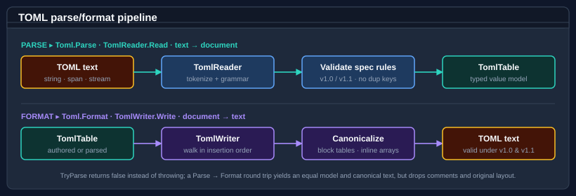
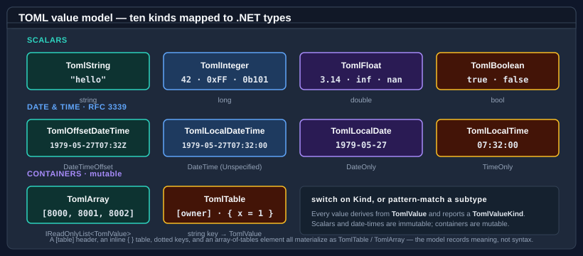

# Using TOML

`Bodu.Text.Toml` reads and writes [TOML](https://toml.io/) — Tom's Obvious, Minimal Language — the configuration
format whose strongly-typed scalars, tables, arrays, and first-class date-time values make it a popular alternative to
INI and YAML for application configuration.

TOML follows a **reader/writer** shape rather than a single static codec, mirroring the relationship between
`XmlReader` / `XmlWriter` and a document model:

- <xref:Bodu.Text.Toml.TomlReader> deserializes text into a <xref:Bodu.Text.Toml.TomlTable> document.
- <xref:Bodu.Text.Toml.TomlWriter> serializes a `TomlTable` back to canonical TOML.
- <xref:Bodu.Text.Toml.Toml> is a thin static façade over shared, stateless reader and writer singletons — reach for it for one-line `Parse` / `Format`.



For the vocabulary used below (document, value, codec, format exception) see [Core concepts](../../docs/formats/concepts.md); for the spec-version selector and diagnostics, see [Parser policies](../../docs/formats/parser-policies.md).

## Pattern 1 — parse a configuration document

```csharp
using Bodu.Text.Toml;

TomlTable config = Toml.Parse("""
    title = "Bodu sample"

    [owner]
    name = "Tom"
    dob  = 1979-05-27T07:32:00Z

    [database]
    ports   = [8000, 8001, 8002]
    enabled = true
    """);

string title = ((TomlString)config["title"]).Value;          // "Bodu sample"

var owner = (TomlTable)config["owner"];
string name = ((TomlString)owner["name"]).Value;             // "Tom"
DateTimeOffset dob = ((TomlOffsetDateTime)owner["dob"]).Value;

var database = (TomlTable)config["database"];
bool enabled = ((TomlBoolean)database["enabled"]).Value;     // true
var ports    = (TomlArray)database["ports"];
long first   = ((TomlInteger)ports[0]).Value;                // 8000
```

`Toml.Parse` returns the root <xref:Bodu.Text.Toml.TomlTable>. Standard `[table]` headers, inline `{ }` tables, dotted
keys, and arrays of tables all materialise as `TomlTable` / `TomlArray` instances — the model captures meaning, not the
original syntax.

## Pattern 2 — navigate the value model

Every value derives from <xref:Bodu.Text.Toml.TomlValue> and exposes a <xref:Bodu.Text.Toml.TomlValue.Kind> discriminator. Cast when you know the
shape, or `switch` on `Kind` for safe dispatch:

```csharp
using Bodu.Text.Toml;

foreach ((string key, TomlValue value) in config)
{
    switch (value.Kind)
    {
        case TomlValueKind.String:         Console.WriteLine($"{key} = {((TomlString)value).Value}"); break;
        case TomlValueKind.Integer:        Console.WriteLine($"{key} = {((TomlInteger)value).Value}"); break;
        case TomlValueKind.Boolean:        Console.WriteLine($"{key} = {((TomlBoolean)value).Value}"); break;
        case TomlValueKind.Table:          Console.WriteLine($"{key} = table[{((TomlTable)value).Count}]"); break;
        case TomlValueKind.Array:          Console.WriteLine($"{key} = array[{((TomlArray)value).Count}]"); break;
        case TomlValueKind.OffsetDateTime: Console.WriteLine($"{key} = {((TomlOffsetDateTime)value).Value:O}"); break;
    }
}
```

`TomlTable` enumerates as `KeyValuePair<string, TomlValue>` in **insertion order**, and exposes `Count`, `Keys`,
`ContainsKey`, `TryGetValue`, and a `this[key]` indexer. `TryGetValue` is the safe lookup for an optional key:

```csharp
if (database.TryGetValue("timeout", out TomlValue? timeout))
    Use(((TomlInteger)timeout).Value);
```

### The value kinds



| Kind | Type | `Value` backing type |
|---|---|---|
| `String` | <xref:Bodu.Text.Toml.TomlString> | `string` |
| `Integer` | <xref:Bodu.Text.Toml.TomlInteger> | `long` |
| `Float` | <xref:Bodu.Text.Toml.TomlFloat> | `double` |
| `Boolean` | <xref:Bodu.Text.Toml.TomlBoolean> | `bool` |
| `OffsetDateTime` | <xref:Bodu.Text.Toml.TomlOffsetDateTime> | `DateTimeOffset` |
| `LocalDateTime` | <xref:Bodu.Text.Toml.TomlLocalDateTime> | `DateTime` (`Unspecified`) |
| `LocalDate` | <xref:Bodu.Text.Toml.TomlLocalDate> | `DateOnly` |
| `LocalTime` | <xref:Bodu.Text.Toml.TomlLocalTime> | `TimeOnly` |
| `Array` | <xref:Bodu.Text.Toml.TomlArray> | `IReadOnlyList<TomlValue>` |
| `Table` | <xref:Bodu.Text.Toml.TomlTable> | key/value map |

The four RFC 3339 date-time kinds map onto first-class BCL types, so an offset date-time keeps its offset and a local
date-time carries no spurious time-zone relation.

## Pattern 3 — build a document programmatically

`TomlTable` and `TomlArray` are **mutable** containers. Compose a document with collection initialisers, the indexer,
or `Add`:

```csharp
using Bodu.Text.Toml;

var doc = new TomlTable
{
    ["title"] = new TomlString("Generated"),
    ["owner"] = new TomlTable
    {
        ["name"] = new TomlString("Tom"),
        ["dob"]  = new TomlOffsetDateTime(new DateTimeOffset(1979, 5, 27, 7, 32, 0, TimeSpan.Zero)),
    },
};

var ports = new TomlArray();
ports.Add(new TomlInteger(8000));
ports.Add(new TomlInteger(8001));
doc.Add("ports", ports);
```

Keys are case-sensitive and compared with ordinal semantics, matching the TOML specification. `Add` throws
`ArgumentException` on a duplicate key; the indexer setter adds or replaces.

## Pattern 4 — format to canonical text

```csharp
using Bodu.Text.Toml;

string text = Toml.Format(doc);
```

The writer emits a deterministic block-style document: scalars and ordinary arrays inline, sub-tables under
`[header]` sections, arrays of tables under `[[header]]` sections, keys in insertion order. Because the model records
semantics rather than syntax, a `Parse` → `Format` round trip yields an **equal model and canonical text** but does
not reproduce the original layout, comment placement, or whitespace. (TOML comments are not retained — when
comment-preserving round-trips matter, prefer [INI](ini.md).)

Output uses only constructs valid under **both** TOML v1.0.0 and v1.1.0, so a document parsed under v1.1.0 and written
back is still accepted by a strict v1.0.0 reader.

## Pattern 5 — non-throwing parse

```csharp
using Bodu.Text.Toml;

if (Toml.TryParse(source, out TomlTable? document))
{
    Configure(document);
}
else
{
    log.Warn("Malformed TOML input");
}
```

`TryParse` returns `false` and sets `document` to `null` on the first parse error rather than raising
<xref:Bodu.Text.Toml.TomlFormatException>. Use it for untrusted input.

## Pattern 6 — selecting the TOML version

Parsing defaults to strict **TOML v1.0.0**. Pass a <xref:Bodu.Text.Toml.TomlReaderOptions> with
<xref:Bodu.Text.Toml.TomlReaderOptions.SpecVersion> set to `V1_1` to accept the TOML v1.1.0 grammar additions —
`\e` and `\xHH` string escapes, optional seconds in time values, and multi-line / trailing-comma inline tables:

```csharp
using Bodu.Text.Toml;

var options = new TomlReaderOptions { SpecVersion = TomlSpecVersion.V1_1 };

TomlTable document = Toml.Parse(source, options);
```

Every parse entry point — `Parse`, `TryParse`, `ParseAsync` — has an overload that accepts `TomlReaderOptions`. The
version governs parsing only; the writer is unaffected.

## Pattern 7 — reuse a configured reader / writer

When you parse many documents under the same options, construct a <xref:Bodu.Text.Toml.TomlReader> once and reuse it
(readers and writers are stateless and safe to share):

```csharp
using Bodu.Text.Toml;

var reader = new TomlReader(new TomlReaderOptions { SpecVersion = TomlSpecVersion.V1_1 });

foreach (string path in paths)
{
    TomlTable doc = reader.Read(File.ReadAllText(path));
    Process(doc);
}
```

`TomlReader.Read` accepts `ReadOnlySpan<char>`, `string`, a `TextReader`, or a UTF-8 `Stream`; `TomlWriter.Write`
targets a `string`, `TextWriter`, or UTF-8 `Stream`.

## Pattern 8 — streams and async I/O

Stream input must be valid UTF-8 (a leading BOM is ignored); stream output is UTF-8 without a BOM. The codec never
closes a caller-supplied stream.

```csharp
using Bodu.Text.Toml;

await using FileStream input = File.OpenRead("config.toml");
TomlTable doc = await Toml.ParseAsync(input, cancellationToken);

await using FileStream output = File.Create("out.toml");
await Toml.FormatAsync(doc, output, cancellationToken);
```

## Diagnostics

<xref:Bodu.Text.Toml.TomlFormatException> derives from <xref:Bodu.Text.TextFormatException> (itself a
`FormatException`), so a single `catch` handles parse failures uniformly across every format in the package. The
exception pinpoints the failure with a 1-based `LineNumber` and `ColumnNumber` and a 0-based `Offset`:

```csharp
using Bodu.Text;
using Bodu.Text.Toml;

try
{
    TomlTable doc = Toml.Parse(source);
}
catch (TomlFormatException ex)
{
    Console.Error.WriteLine($"TOML error at line {ex.LineNumber}, column {ex.ColumnNumber}: {ex.Message}");
}
```

Beyond the spec version, the reader has no lenient mode — duplicate keys, table redefinition, out-of-range integers,
unterminated strings, and unpaired surrogates are always rejected.

## When to reach for TOML

| Need | Format |
|---|---|
| Typed scalars, nested tables, arrays, first-class dates | **TOML** |
| Section/comment-preserving round-trip, or `IConfiguration` layering | [INI](ini.md) / [`Bodu.Text.Configuration`](../../docs/text-configuration/index.md) |
| Flat `KEY=VALUE` environment configuration | [DotEnv](dotenv.md) |
| Tabular rows | [Delimited](delimited.md) |
| Canonical structured binary, content addressing | [Bencode](bencode.md) |

## See also

- [Bencode](bencode.md), [Delimited](delimited.md), [DotEnv](dotenv.md), [INI](ini.md) — the other formats in the package.
- [Streams and async I/O](streaming.md) — the shared stream contract across the codecs.
- [`Bodu.Text.Toml` API reference](xref:Bodu.Text.Toml)
- [Parser policies](../../docs/formats/parser-policies.md) — the `SpecVersion` selector and diagnostics.
